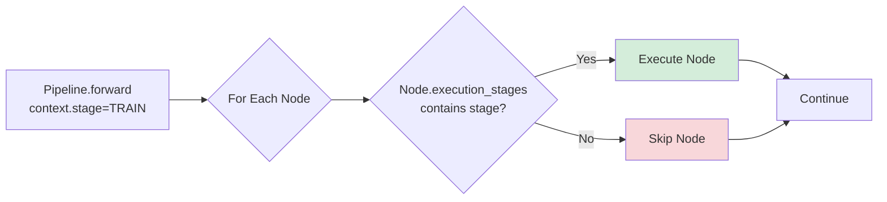
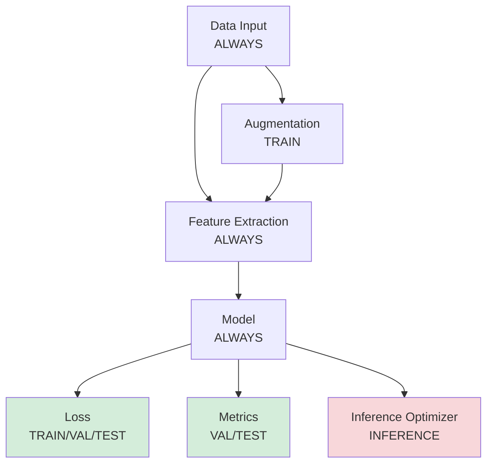

!!! warning "Status: Needs Review"
    This page has not been reviewed for accuracy and completeness. Content may be outdated or contain errors.

---

# Execution Stages

*Control when nodes execute during pipeline operation via stage-aware graph execution.*

Execution stages enable **conditional node execution** based on context (training, validation, testing, or inference). Essential for loss nodes (training only), metrics (validation/test only), and optimization-specific operations.

**Key capabilities:**

* Five execution stages: ALWAYS, TRAIN, VAL, TEST, INFERENCE
* Stage-aware filtering in pipeline executor
* Context object carries stage, epoch, batch_idx, global_step
* Default to ALWAYS for core processing nodes
* Restrict stages only when needed

---

## Stage System Overview

Every node specifies execution stages via the `execution_stages` parameter:

```python
from cuvis_ai_core.node import Node
from cuvis_ai_schemas.enums import ExecutionStage

class MyNode(Node):
    def __init__(self, **kwargs):
        super().__init__(
            execution_stages={ExecutionStage.TRAIN, ExecutionStage.VAL},
            **kwargs
        )
```

**Key Concepts:**

| Concept | Description |
|---------|-------------|
| **ExecutionStage Enum** | ALWAYS, TRAIN, VAL, TEST, INFERENCE |
| **execution_stages Parameter** | Set of stages when node should execute |
| **Context Object** | Runtime info (stage, epoch, batch_idx) passed to nodes |
| **Stage Filtering** | Pipeline skips nodes not matching current stage |
| **Default** | Nodes default to `{ExecutionStage.ALWAYS}` |

### Execution Flow



---

## The Five Execution Stages

### 1. ALWAYS (Default)

*Node executes unconditionally in all stages.*

**Use Cases:**
- Core data transformation
- Feature extraction
- Essential preprocessing

```python
class FeatureExtractor(Node):
    def __init__(self, **kwargs):
        super().__init__(execution_stages={ExecutionStage.ALWAYS}, **kwargs)

    def forward(self, data, **_):
        # Runs during TRAIN, VAL, TEST, INFERENCE
        features = self.extract_features(data)
        return {"features": features}

# Default behavior
node1 = MyNode()  # Equivalent to ExecutionStage.ALWAYS
```

---

### 2. TRAIN

*Node only executes during training.*

**Use Cases:**
- Training-specific data augmentation
- Dropout layers
- Training loss computation

```python
class TrainingAugmentation(Node):
    def __init__(self, **kwargs):
        super().__init__(execution_stages={ExecutionStage.TRAIN}, **kwargs)

    def forward(self, image, **_):
        # Only applies during training
        image = self.random_flip(image)
        image = self.color_jitter(image)
        return {"augmented": image}
```

---

### 3. VAL (Validation)

*Node only executes during validation.*

**Use Cases:**
- Validation metrics
- Validation visualizations
- Model selection criteria

```python
class ValidationMetrics(Node):
    def __init__(self, **kwargs):
        super().__init__(execution_stages={ExecutionStage.VAL}, **kwargs)

    def forward(self, predictions, targets, context, **_):
        accuracy = (predictions.argmax(dim=1) == targets).float().mean()
        return {"metrics": [
            Metric(name="val/accuracy", value=float(accuracy), stage=context.stage)
        ]}
```

---

### 4. TEST

*Node only executes during testing.*

**Use Cases:**
- Final test metrics
- Performance benchmarking
- Confusion matrices

```python
class TestEvaluator(Node):
    def __init__(self, **kwargs):
        super().__init__(execution_stages={ExecutionStage.TEST}, **kwargs)

    def forward(self, predictions, ground_truth, **_):
        test_results = self.compute_comprehensive_metrics(predictions, ground_truth)
        return {"test_results": test_results}
```

---

### 5. INFERENCE

*Node only executes during inference/prediction.*

**Use Cases:**
- Production-only post-processing
- Inference-specific output formatting
- Deployment-specific optimizations

```python
class InferencePostProcessor(Node):
    def __init__(self, **kwargs):
        super().__init__(execution_stages={ExecutionStage.INFERENCE}, **kwargs)

    def forward(self, raw_output, **_):
        probabilities = torch.softmax(raw_output, dim=-1)
        top_k_probs, top_k_indices = torch.topk(probabilities, k=5, dim=-1)

        return {"formatted_results": {
            "probabilities": top_k_probs.tolist(),
            "class_indices": top_k_indices.tolist(),
        }}
```

---

## Stage-Aware Node Patterns

### Pattern 1: Single Stage

```python
class TrainOnlyAugmentation(Node):
    def __init__(self, **kwargs):
        super().__init__(execution_stages={ExecutionStage.TRAIN}, **kwargs)
```

### Pattern 2: Multiple Stages

```python
class MetricsNode(Node):
    def __init__(self, **kwargs):
        # Execute during validation and test only
        super().__init__(
            execution_stages={ExecutionStage.VAL, ExecutionStage.TEST},
            **kwargs
        )
```

### Pattern 3: Training-Aware (Common for Loss)

```python
from cuvis_ai.node.losses import LossNode

class MyLoss(LossNode):
    # Auto-configured to {TRAIN, VAL, TEST}
    def forward(self, predictions, targets, **_):
        return {"loss": self.compute_loss(predictions, targets)}
```

### Pattern 4: Stage-Conditional Behavior

```python
class AdaptiveNormalizer(Node):
    def __init__(self, **kwargs):
        super().__init__(
            execution_stages={ExecutionStage.TRAIN, ExecutionStage.INFERENCE},
            **kwargs
        )

    def forward(self, data, context: Context, **_):
        if context.stage == ExecutionStage.TRAIN:
            self.update_running_stats(data)
        normalized = self.normalize(data)
        return {"normalized": normalized}
```

---

## Pipeline Execution with Context

### Context Object

*Runtime information passed to pipeline.*

```python
from cuvis_ai_schemas.enums import ExecutionStage
from cuvis_ai_schemas.execution import Context

context = Context(
    stage=ExecutionStage.TRAIN,  # Current stage
    epoch=5,                     # Training epoch
    batch_idx=42,                # Batch index
    global_step=1337             # Global training step
)
```

**Attributes:**

| Attribute | Type | Description |
|-----------|------|-------------|
| `stage` | `ExecutionStage` | Current stage |
| `epoch` | `int` | Training epoch (0-indexed) |
| `batch_idx` | `int` | Batch index in epoch (0-indexed) |
| `global_step` | `int` | Global step counter |

### Passing Context to Pipeline

```python
from cuvis_ai_core.pipeline.pipeline import CuvisPipeline
from cuvis_ai_schemas.enums import ExecutionStage
from cuvis_ai_schemas.execution import Context

pipeline = CuvisPipeline()

# Training
train_context = Context(stage=ExecutionStage.TRAIN, epoch=0, batch_idx=0)
train_outputs = pipeline.forward(batch=train_batch, context=train_context)

# Validation
val_context = Context(stage=ExecutionStage.VAL, epoch=0, batch_idx=0)
val_outputs = pipeline.forward(batch=val_batch, context=val_context)

# Inference
inference_context = Context(stage=ExecutionStage.INFERENCE)
inference_outputs = pipeline.forward(batch=inference_batch, context=inference_context)
```

### Using Context in Nodes

```python
class ContextAwareNode(Node):
    def forward(self, data, context: Context, **_):
        if context.stage == ExecutionStage.TRAIN:
            result = self.train_transform(data)
        else:
            result = self.eval_transform(data)

        metadata = {
            "stage": context.stage.value,
            "epoch": context.epoch,
            "batch_idx": context.batch_idx,
        }

        return {"result": result, "metadata": metadata}
```

---

## Data Flow Patterns

### Pattern 1: Loss and Metric Separation

**Losses compute during train/val/test, metrics only during val/test.**

```python
class BCELoss(LossNode):
    # Auto-configured {TRAIN, VAL, TEST}
    def forward(self, predictions, targets, **_):
        return {"loss": F.binary_cross_entropy(predictions, targets)}

class AccuracyMetric(Node):
    def __init__(self, **kwargs):
        super().__init__(
            execution_stages={ExecutionStage.VAL, ExecutionStage.TEST},
            **kwargs
        )

    def forward(self, predictions, targets, context, **_):
        accuracy = (predictions.round() == targets).float().mean()
        return {"metrics": [
            Metric(name="accuracy", value=float(accuracy), stage=context.stage)
        ]}
```

### Pattern 2: Training vs Inference Paths



---

## Best Practices

1. **Use Semantic Stage Selection**

   ```python
   # GOOD: Loss computes during training phases
   class TrainingLoss(LossNode):
       pass  # Automatically {TRAIN, VAL, TEST}

   # BAD: Loss executing during inference
   class BadLoss(Node):
       def __init__(self, **kwargs):
           super().__init__(execution_stages={ExecutionStage.ALWAYS}, **kwargs)
   ```

2. **Default to ALWAYS for Core Nodes**

   ```python
   # GOOD: Applies everywhere
   class FeatureExtractor(Node):
       pass  # Defaults to ALWAYS

   # BAD: Unnecessary restriction
   class OverRestricted(Node):
       def __init__(self, **kwargs):
           super().__init__(
               execution_stages={ExecutionStage.TRAIN, ExecutionStage.INFERENCE},
               **kwargs
           )
   ```

3. **Separate Concerns with Multiple Nodes**

   ```python
   # GOOD: Separate nodes for different behaviors
   class TrainingPostProcessor(Node):
       def __init__(self, **kwargs):
           super().__init__(execution_stages={ExecutionStage.TRAIN}, **kwargs)

   class InferencePostProcessor(Node):
       def __init__(self, **kwargs):
           super().__init__(execution_stages={ExecutionStage.INFERENCE}, **kwargs)
   ```

4. **Document Stage Decisions**

   ```python
   class ValidationOnlyMetric(Node):
       """Compute expensive metric only during validation.

       This metric requires full dataset aggregation and is too expensive
       during training. Computed during validation for model selection.

       Execution Stages: VAL, TEST
       """

       def __init__(self, **kwargs):
           super().__init__(
               execution_stages={ExecutionStage.VAL, ExecutionStage.TEST},
               **kwargs
           )
   ```

5. **Test All Stages**

   ```python
   def test_pipeline_all_stages(pipeline, sample_batch):
       """Verify pipeline behavior in all stages."""
       stages = [
           ExecutionStage.TRAIN,
           ExecutionStage.VAL,
           ExecutionStage.TEST,
           ExecutionStage.INFERENCE,
       ]

       for stage in stages:
           context = Context(stage=stage, epoch=0, batch_idx=0)
           outputs = pipeline.forward(batch=sample_batch, context=context)

           if stage == ExecutionStage.TRAIN:
               assert "loss" in outputs
           if stage in {ExecutionStage.VAL, ExecutionStage.TEST}:
               assert "metrics" in outputs
           if stage == ExecutionStage.INFERENCE:
               assert "predictions" in outputs
   ```

---

## Troubleshooting

### Node Not Executing

**Diagnosis:**
```python
logger.info(f"Node {node.name} stages: {node.execution_stages}")
logger.info(f"Current stage: {context.stage}")
```

**Solution: Verify stage match**
```python
# Node restricted to TRAIN
node = MyNode(execution_stages={ExecutionStage.TRAIN})

# But running VAL - won't execute!
context = Context(stage=ExecutionStage.VAL)

# Fix: Add VAL to stages
node = MyNode(execution_stages={ExecutionStage.TRAIN, ExecutionStage.VAL})
```

### Unexpected Node Execution

**Solution: Check parent class constructor**
```python
class MyMetric(MetricNode):  # Parent sets VAL/TEST
    def __init__(self, **kwargs):
        super().__init__(**kwargs)  # Call parent to preserve stages
        self.threshold = 0.5
```

### Loss Not Computing in Validation

**Solution: Use LossNode base class**
```python
from cuvis_ai.node.losses import LossNode

class MyLoss(LossNode):
    # Auto-configured {TRAIN, VAL, TEST}
    def forward(self, predictions, targets, **_):
        return {"loss": self.compute_loss(predictions, targets)}
```

### Context Not Available in Node

**Fix: Add context to INPUT_SPECS**
```python
class MyNode(Node):
    INPUT_SPECS = {
        "data": PortSpec(dtype=torch.float32, shape=(-1, -1)),
        "context": PortSpec(dtype=Context, shape=()),  # Add this
    }

    def forward(self, data, context: Context, **_):
        if context.stage == ExecutionStage.TRAIN:
            return {"output": self.train_process(data)}
        return {"output": self.eval_process(data)}
```

Note: Pipeline automatically injects context for nodes declaring it in INPUT_SPECS.

### Stage Enum Comparison Failing

**Solution: Compare enum to enum, not string**
```python
# BAD
if context.stage == "train":  # Never matches!
    pass

# GOOD
if context.stage == ExecutionStage.TRAIN:
    pass

# ALSO GOOD
if context.stage.value == "train":
    pass
```

---

## Optimization Tips

1. **Minimize Overhead in High-Frequency Stages**

   ```python
   # BAD: Expensive visualization in training
   class BadVisualizer(Node):
       def __init__(self, **kwargs):
           super().__init__(execution_stages={ExecutionStage.ALWAYS}, **kwargs)

       def forward(self, data, **_):
           expensive_viz = self.render_3d_plot(data)  # Runs every batch!
           return {"visualization": expensive_viz}

   # GOOD: Visualization only during validation
   class GoodVisualizer(Node):
       def __init__(self, **kwargs):
           super().__init__(
               execution_stages={ExecutionStage.VAL, ExecutionStage.TEST},
               **kwargs
           )
   ```

2. **Reduce Complexity in Inference**

   ```python
   class AdaptiveProcessor(Node):
       def forward(self, data, context: Context, **_):
           if context.stage == ExecutionStage.INFERENCE:
               return {"result": self.fast_forward(data)}
           else:
               return {"result": self.full_forward(data)}
   ```

3. **Skip Gradients in Non-Training**

   ```python
   # Automatically handled by trainer
   with torch.no_grad():
       outputs = pipeline.forward(batch=val_batch, context=val_context)
   ```

---

## Related Documentation

* → [Node System Deep Dive](node-system-deep-dive.md) - Node lifecycle and implementation
* → [Pipeline Lifecycle](pipeline-lifecycle.md) - Pipeline states and execution
* → [Two-Phase Training](two-phase-training.md) - Statistical initialization and gradient training
* → [Core Concepts Overview](overview.md) - High-level framework concepts
