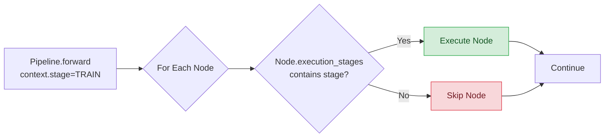
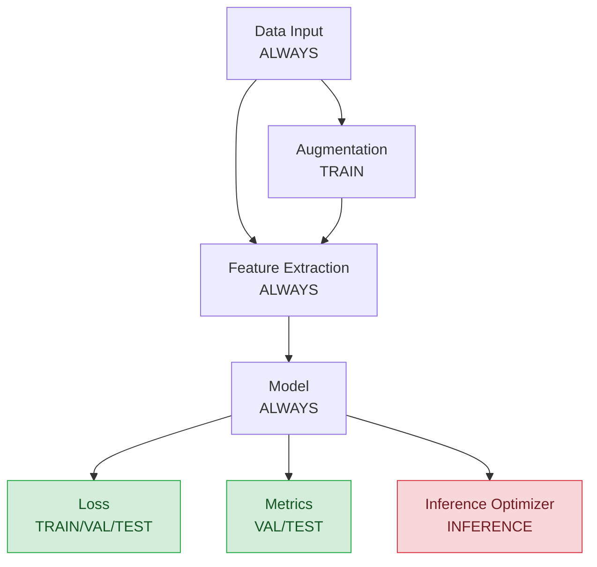

!!! warning "Status: Needs Review"
    This page has not been reviewed for accuracy and completeness. Content may be outdated or contain errors.

---

# Execution Stages

*Control when nodes execute during pipeline operation via stage-aware graph execution.*

Execution stages enable **conditional node execution** based on context (training, validation, testing, or inference). Essential for loss nodes (training only), metrics (validation/test only), and optimization-specific operations.

**Key capabilities:**

* Five execution stages: ALWAYS, TRAIN, VAL, TEST, INFERENCE
* Stage-aware filtering in pipeline executor
* Context object carries stage, epoch, batch_idx, global_step
* Default to ALWAYS for core processing nodes
* Restrict stages only when needed

---

## Stage System Overview

Every node declares the stages it runs in on the class body, next to `_category` and
`_tags`:

```python
from cuvis_ai_core.node import Node
from cuvis_ai_schemas.enums import ExecutionStage

class MyNode(Node):
    # A set literal (or stage names such as "train") is normalized to a
    # frozenset when the class is created; an unknown name fails at import.
    EXECUTION_STAGES = {ExecutionStage.TRAIN, ExecutionStage.VAL}
```

Instances read the declaration through `node.execution_stages`, which is read-only. A
pipeline can still move one instance by passing `execution_stages=` to the constructor
(see [Pattern 5](#pattern-5-per-instance-override-from-a-pipeline-yaml)); a subclass that
must reassign the stages after construction opts in with `EXECUTION_STAGES_MUTABLE = True`.

**Key Concepts:**

| Concept | Description |
|---------|-------------|
| **ExecutionStage Enum** | ALWAYS, TRAIN, VAL, TEST, INFERENCE |
| **`EXECUTION_STAGES`** | Class-level declaration, a `frozenset[ExecutionStage]` |
| **`execution_stages=` argument** | Per-instance override passed to the constructor (a pipeline yaml's `hparams` reach it) |
| **Context Object** | Runtime info (stage, epoch, batch_idx) passed to nodes |
| **Stage Filtering** | Pipeline skips nodes not matching current stage |
| **Default** | `Node.EXECUTION_STAGES` is `{ExecutionStage.ALWAYS}` |

### Execution Flow


```mermaid
graph LR
    A[Pipeline.forward<br/>context.stage=TRAIN] --> B{For Each Node}
    B --> C{Node.execution_stages<br/>contains stage?}
    C -->|Yes| D[Execute Node]
    C -->|No| E[Skip Node]
    D --> F[Continue]
    E --> F
    classDef success fill:#d4edda,stroke:#28a745,color:#155724
    classDef error fill:#f8d7da,stroke:#dc3545,color:#721c24
    class D success
    class E error
```

---

## The Five Execution Stages

### 1. ALWAYS (Default)

*Node executes unconditionally in all stages.*

**Use Cases:**

- Core data transformation
- Feature extraction
- Essential preprocessing

```python
class FeatureExtractor(Node):
    def __init__(self, **kwargs):
        super().__init__(execution_stages={ExecutionStage.ALWAYS}, **kwargs)

    def forward(self, data, **_):
        # Runs during TRAIN, VAL, TEST, INFERENCE
        features = self.extract_features(data)
        return {"features": features}

# Default behavior
node1 = MyNode()  # Equivalent to ExecutionStage.ALWAYS
```

---

### 2. TRAIN

*Node only executes during training.* Use for: data augmentation, dropout, training loss.

```python
class TrainingAugmentation(Node):
    def __init__(self, **kwargs):
        super().__init__(execution_stages={ExecutionStage.TRAIN}, **kwargs)
```

### 3. VAL (Validation)

*Node only executes during validation.* Use for: validation metrics, model selection criteria.

```python
class ValidationMetrics(Node):
    def __init__(self, **kwargs):
        super().__init__(execution_stages={ExecutionStage.VAL}, **kwargs)
```

### 4. TEST

*Node only executes during testing.* Use for: final metrics, performance benchmarking.

```python
class TestEvaluator(Node):
    def __init__(self, **kwargs):
        super().__init__(execution_stages={ExecutionStage.TEST}, **kwargs)
```

### 5. INFERENCE

*Node only executes during inference/prediction.* Use for: production post-processing, output formatting.

```python
class InferencePostProcessor(Node):
    def __init__(self, **kwargs):
        super().__init__(execution_stages={ExecutionStage.INFERENCE}, **kwargs)
```

---

## Stage-Aware Node Patterns

### Pattern 1: Single Stage

```python
class TrainOnlyAugmentation(Node):
    EXECUTION_STAGES = {ExecutionStage.TRAIN}
```

### Pattern 2: Multiple Stages

```python
class MetricsNode(Node):
    # Execute during validation and test only
    EXECUTION_STAGES = {ExecutionStage.VAL, ExecutionStage.TEST}
```

### Pattern 3: Training-Aware (Common for Loss)

```python
from cuvis_ai.node.losses import LossNode

class MyLoss(LossNode):
    # LossNode declares EXECUTION_STAGES = {TRAIN, VAL, TEST}; subclasses inherit it
    def forward(self, predictions, targets, **_):
        return {"loss": self.compute_loss(predictions, targets)}
```

### Pattern 4: Stage-Conditional Behavior

```python
class AdaptiveNormalizer(Node):
    EXECUTION_STAGES = {ExecutionStage.TRAIN, ExecutionStage.INFERENCE}

    def forward(self, data, context: Context, **_):
        if context.stage == ExecutionStage.TRAIN:
            self.update_running_stats(data)
        normalized = self.normalize(data)
        return {"normalized": normalized}
```

### Pattern 5: Per-Instance Override from a Pipeline Yaml

`PipelineFactory` passes a node's `hparams` to its constructor, so a yaml can move one
node without touching its class. The `TensorBoardMonitorNode` and the artifact visualizers
run in train/val/test by default; a CLI user who wants TensorBoard output from
`restore-pipeline` or `Predictor` opts them back in:

```yaml
- name: score_heatmap
  class_name: cuvis_ai.node.anomaly_visualization.ScoreHeatmapVisualizer
  hparams:
    up_to: 3
    execution_stages: [inference]
- name: TensorBoardMonitorNode
  class_name: cuvis_ai.node.monitor.TensorBoardMonitorNode
  hparams:
    output_dir: outputs/tensorboard
    execution_stages: [inference]
```

Stage names are coerced to the enum; a misspelled name (`Inference`, `infer`) raises a
`ValueError` naming the node when the pipeline loads, instead of silently never running it.

Two caveats:

- The override lives only in the yaml text: `Node.__init__` consumes `execution_stages` before the hparams are captured, so `serialize()` never writes it back and a pipeline re-saved from its nodes loses the opt-in.
- Plugin manifests and the gRPC `NodeInfo` expose the class defaults (category and lifecycle tags), not a yaml override.

!!! note "Trained pipelines at inference"
    A pipeline trained in CuvisNEXT is loaded for prediction at `ExecutionStage.INFERENCE`,
    which prunes its losses, metrics, visualizers and TensorBoard sink; nothing else is
    needed to run the trained graph. Runs saved before cuvis-ai 0.13.9 carry a
    `QuantileBinaryDecider`, which flags a fixed fraction of every frame and cannot be
    gated from the picker; retrain them to get the two-stage decider with its optional gate.

---

## Pipeline Execution with Context

### Context Object

*Runtime information passed to pipeline.*

```python
from cuvis_ai_schemas.enums import ExecutionStage
from cuvis_ai_schemas.execution import Context

context = Context(
    stage=ExecutionStage.TRAIN,  # Current stage
    epoch=5,                     # Training epoch
    batch_idx=42,                # Batch index
    global_step=1337             # Global training step
)
```

**Attributes:**

| Attribute | Type | Description |
|-----------|------|-------------|
| `stage` | `ExecutionStage` | Current stage |
| `epoch` | `int` | Training epoch (0-indexed) |
| `batch_idx` | `int` | Batch index in epoch (0-indexed) |
| `global_step` | `int` | Global step counter |

### Passing Context to Pipeline

```python
from cuvis_ai_core.pipeline.pipeline import CuvisPipeline
from cuvis_ai_schemas.enums import ExecutionStage
from cuvis_ai_schemas.execution import Context

pipeline = CuvisPipeline()

# Training
train_context = Context(stage=ExecutionStage.TRAIN, epoch=0, batch_idx=0)
train_outputs = pipeline.forward(batch=train_batch, context=train_context)

# Validation
val_context = Context(stage=ExecutionStage.VAL, epoch=0, batch_idx=0)
val_outputs = pipeline.forward(batch=val_batch, context=val_context)

# Inference
inference_context = Context(stage=ExecutionStage.INFERENCE)
inference_outputs = pipeline.forward(batch=inference_batch, context=inference_context)
```

---

## Data Flow Patterns

### Training vs Inference Paths


```mermaid
graph TD
    A[Data Input<br/>ALWAYS] --> B[Augmentation<br/>TRAIN]
    A --> C[Feature Extraction<br/>ALWAYS]
    B --> C
    C --> D[Model<br/>ALWAYS]
    D --> E[Loss<br/>TRAIN/VAL/TEST]
    D --> F[Metrics<br/>VAL/TEST]
    D --> G[Inference Optimizer<br/>INFERENCE]
    classDef success fill:#d4edda,stroke:#28a745,color:#155724
    classDef error fill:#f8d7da,stroke:#dc3545,color:#721c24
    class E,F success
    class G error
```

---

## Lifecycle Tags

Execution stages are invisible outside the process: they are not in the pipeline yaml, not
in plugin manifests and not on gRPC. What the manifests and `NodeInfo` do expose is the node
`_category` and its `_tags`, and three tags describe the lifecycle: `TRAINING`,
`EVALUATION`, `INFERENCE`. For the declaration and the exposed metadata to tell the same
story, `tests/test_node_lifecycle_consistency.py` enforces four rules on every builtin
class:

| Rule | Statement |
|------|-----------|
| R0 | Category `LOSS` or `REGULARIZER` never runs at inference. |
| R1 | A node that never runs at inference carries `TRAINING` or `EVALUATION`. |
| R2 | A node tagged `TRAINING` or `EVALUATION` but not `INFERENCE` never runs at inference. |
| R3 | A node tagged `INFERENCE` runs at inference. |

Category decides only for losses: `METRIC`, `SINK` and `VISUALIZER` are too coarse (video
writers are sinks that exist for inference; `DistinctLabelCount` is a metric that runs at
inference, so it carries `INFERENCE`). Nodes tagged `AUGMENTATION` are exempt from R2: the
occlusion family sits inline (`cube -> occlusion -> model`), so pruning it by stage would
leave the model's input unsatisfied; it stays `ALWAYS` until it gains a stage-aware
pass-through. The rules read class declarations, so a yaml override is a deliberate
per-pipeline deviation, not a violation.

---

## Best Practices

1. **Use Semantic Stage Selection**

   ```python
   # GOOD: Loss computes during training phases
   class TrainingLoss(LossNode):
       pass  # Inherits {TRAIN, VAL, TEST} from LossNode

   # BAD: Loss executing during inference
   class BadLoss(Node):
       _category = NodeCategory.LOSS
       EXECUTION_STAGES = {ExecutionStage.ALWAYS}  # the consistency test rejects this
   ```

2. **Default to ALWAYS for Core Nodes**

   ```python
   # GOOD: Applies everywhere
   class FeatureExtractor(Node):
       pass  # Inherits Node.EXECUTION_STAGES == {ALWAYS}

   # BAD: Unnecessary restriction
   class OverRestricted(Node):
       EXECUTION_STAGES = {ExecutionStage.TRAIN, ExecutionStage.INFERENCE}
   ```

3. **Separate Concerns with Multiple Nodes**

   ```python
   # GOOD: Separate nodes for different behaviors
   class TrainingPostProcessor(Node):
       EXECUTION_STAGES = {ExecutionStage.TRAIN}

   class InferencePostProcessor(Node):
       EXECUTION_STAGES = {ExecutionStage.INFERENCE}
   ```

4. **Document Stage Decisions** — Add docstrings explaining why a node is restricted to specific stages.

5. **Test All Stages** — Verify pipeline behavior in TRAIN, VAL, TEST, and INFERENCE stages.

---

???+ tip "Troubleshooting"

    ### Node Not Executing

    **Diagnosis:**
    ```python
    logger.info(f"Node {node.name} stages: {node.execution_stages}")
    logger.info(f"Current stage: {context.stage}")
    ```

    **Solution: Verify stage match**
    ```python
    # Node restricted to TRAIN
    node = MyNode(execution_stages={ExecutionStage.TRAIN})

    # But running VAL - won't execute!
    context = Context(stage=ExecutionStage.VAL)

    # Fix: Add VAL to stages
    node = MyNode(execution_stages={ExecutionStage.TRAIN, ExecutionStage.VAL})
    ```

    ### Unexpected Node Execution

    **Solution: Check parent class constructor**
    ```python
    class MyMetric(MetricNode):  # Parent sets VAL/TEST
        def __init__(self, **kwargs):
            super().__init__(**kwargs)  # Call parent to preserve stages
            self.threshold = 0.5
    ```

    ### Loss Not Computing in Validation

    **Solution: Use LossNode base class**
    ```python
    from cuvis_ai.node.losses import LossNode

    class MyLoss(LossNode):
        # Auto-configured {TRAIN, VAL, TEST}
        def forward(self, predictions, targets, **_):
            return {"loss": self.compute_loss(predictions, targets)}
    ```

    ### Context Not Available in Node

    **Fix: Add context to INPUT_SPECS**
    ```python
    class MyNode(Node):
        INPUT_SPECS = {
            "data": PortSpec(dtype=torch.float32, shape=(-1, -1)),
            "context": PortSpec(dtype=Context, shape=()),  # Add this
        }

        def forward(self, data, context: Context, **_):
            if context.stage == ExecutionStage.TRAIN:
                return {"output": self.train_process(data)}
            return {"output": self.eval_process(data)}
    ```

    Pipeline automatically injects context for nodes declaring it in INPUT_SPECS.

    ### Stage Enum Comparison Failing

    **Solution: Compare enum to enum, not string**
    ```python
    # BAD
    if context.stage == "train":  # Never matches!
        pass

    # GOOD
    if context.stage == ExecutionStage.TRAIN:
        pass

    # ALSO GOOD
    if context.stage.value == "train":
        pass
    ```

???+ tip "Optimization Tips"

    1. **Minimize Overhead in High-Frequency Stages**

        ```python
        # BAD: Expensive visualization in training
        class BadVisualizer(Node):
            def __init__(self, **kwargs):
                super().__init__(execution_stages={ExecutionStage.ALWAYS}, **kwargs)

            def forward(self, data, **_):
                expensive_viz = self.render_3d_plot(data)  # Runs every batch!
                return {"visualization": expensive_viz}

        # GOOD: Visualization only during validation
        class GoodVisualizer(Node):
            def __init__(self, **kwargs):
                super().__init__(
                    execution_stages={ExecutionStage.VAL, ExecutionStage.TEST},
                    **kwargs
                )
        ```

    2. **Reduce Complexity in Inference**

        ```python
        class AdaptiveProcessor(Node):
            def forward(self, data, context: Context, **_):
                if context.stage == ExecutionStage.INFERENCE:
                    return {"result": self.fast_forward(data)}
                else:
                    return {"result": self.full_forward(data)}
        ```

    3. **Skip Gradients in Non-Training**

        ```python
        # Automatically handled by trainer
        with torch.no_grad():
            outputs = pipeline.forward(batch=val_batch, context=val_context)
        ```
