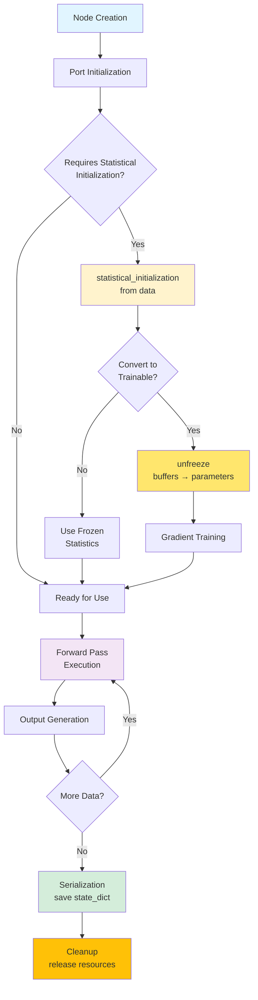

!!! warning "Status: Needs Review"
    This page has not been reviewed for accuracy and completeness. Content may be outdated or contain errors.

---

# Node System Deep Dive

*Fundamental processing units in CUVIS.AI pipelines.*

A **Node** represents a single processing unit in a pipeline. Each node performs a specific task, declares typed input/output ports, manages internal state, and supports both CPU and GPU execution.

**Key capabilities:**

* Typed I/O via port specifications
* Optional statistical initialization from data
* Freeze/unfreeze for two-phase training
* Stage-aware execution control
* Serialization and restoration

---

## Node Lifecycle

Complete lifecycle from creation to cleanup:



---

## Base Node Architecture

All nodes inherit from `Node` base class (itself inheriting from `nn.Module`, `ABC`, `Serializable`):

```python
from cuvis_ai_core.node import Node
from cuvis_ai_schemas.pipeline import PortSpec
import torch

class Node(nn.Module, ABC, Serializable):
    """Base class for all nodes."""

    # Class-level port specifications
    INPUT_SPECS: dict[str, PortSpec | list[PortSpec]] = {}
    OUTPUT_SPECS: dict[str, PortSpec | list[PortSpec]] = {}

    def __init__(self, name: str | None = None, **kwargs):
        super().__init__()
        self.name = name
        self._input_ports = {}   # Created from INPUT_SPECS
        self._output_ports = {}  # Created from OUTPUT_SPECS

    @abstractmethod
    def forward(self, **inputs) -> dict[str, Any]:
        """Process inputs and return outputs."""
        pass
```

**Key properties:**

* `requires_initial_fit`: Auto-detects if node needs statistical initialization
* `execution_stages`: Controls when node executes (TRAIN, VAL, TEST, INFERENCE, ALWAYS)
* `frozen`: Tracks frozen vs trainable state

---

## Common Node Patterns

### 1. Data Loading Pattern

*Load and validate input data*

```python
from cuvis_ai.node.data import LentilsAnomalyDataNode

data_node = LentilsAnomalyDataNode(normal_class_ids=[0, 1])

# Characteristics: Stateless, executes in all stages
```

---

### 2. Processing Pattern

*Transform and normalize data*

```python
from cuvis_ai_core.pipeline.pipeline import CuvisPipeline
from cuvis_ai_core.training import StatisticalTrainer
from cuvis_ai.node.normalization import MinMaxNormalizer
from cuvis_ai.node.data import LentilsAnomalyDataNode

# Create pipeline and add nodes
pipeline = CuvisPipeline("Normalization_Pipeline")
data_node = LentilsAnomalyDataNode(normal_class_ids=[0, 1])
normalizer = MinMaxNormalizer(eps=1e-6, use_running_stats=True)

# Connect nodes
pipeline.connect(
    (data_node.outputs.cube, normalizer.data),
)

# Statistical initialization via trainer
trainer = StatisticalTrainer(pipeline=pipeline, datamodule=datamodule)
trainer.fit()  # Automatically initializes normalizer with statistics

# Characteristics: Can be stateless or stateful
```

---

### 3. Statistical Pattern

*Anomaly detection using statistical methods*

```python
from cuvis_ai_core.pipeline.pipeline import CuvisPipeline
from cuvis_ai_core.training import StatisticalTrainer
from cuvis_ai.anomaly.rx_detector import RXGlobal
from cuvis_ai.node.normalization import MinMaxNormalizer
from cuvis_ai.node.data import LentilsAnomalyDataNode

# Create pipeline with statistical nodes
pipeline = CuvisPipeline("RX_Statistical")
data_node = LentilsAnomalyDataNode(normal_class_ids=[0, 1])
normalizer = MinMaxNormalizer(eps=1e-6, use_running_stats=True)
rx_node = RXGlobal(num_channels=61, eps=1e-6)

# Connect the pipeline
pipeline.connect(
    (data_node.outputs.cube, normalizer.data),
    (normalizer.normalized, rx_node.data),
)

# Phase 1: Statistical initialization
trainer = StatisticalTrainer(pipeline=pipeline, datamodule=datamodule)
trainer.fit()  # Initializes all statistical nodes (normalizer, rx_node)

# Phase 2 (optional): Enable gradient training
pipeline.unfreeze_nodes_by_name([rx_node.name])
```

**Statistical initialization pattern:**

```python
def statistical_initialization(self, input_stream: InputStream) -> None:
    """Compute statistics from initialization data."""
    self.reset()

    for batch_data in input_stream:
        data_tensor = batch_data["data"]
        self._update_statistics(data_tensor)  # Welford's algorithm

    # Store as buffers (frozen by default)
    self.register_buffer("mu", computed_mean)
    self.register_buffer("sigma", computed_covariance)
    self._statistically_initialized = True
```

**Characteristics:** Requires initialization, stores statistics as buffers, can be unfrozen for training

---

### 4. Deep Learning Pattern

*Neural network-based analysis*

```python
from cuvis_ai_core.pipeline.pipeline import CuvisPipeline
from cuvis_ai_core.training import StatisticalTrainer, GradientTrainer
from cuvis_ai.anomaly.deep_svdd import (
    DeepSVDDProjection,
    DeepSVDDCenterTracker,
    DeepSVDDScores,
    ZScoreNormalizerGlobal,
)
from cuvis_ai.node.losses import DeepSVDDSoftBoundaryLoss
from cuvis_ai.node.data import LentilsAnomalyDataNode

# Create pipeline with deep learning nodes
pipeline = CuvisPipeline("DeepSVDD")
data_node = LentilsAnomalyDataNode(normal_class_ids=[0, 1])
encoder = ZScoreNormalizerGlobal(num_channels=61, hidden=32, sample_n=100)
projection = DeepSVDDProjection(in_channels=61, rep_dim=16, hidden=[32, 16])
center_tracker = DeepSVDDCenterTracker(rep_dim=16)
loss_node = DeepSVDDSoftBoundaryLoss(name="deepsvdd_loss")

# Connect the pipeline
pipeline.connect(
    (data_node.outputs.cube, encoder.data),
    (encoder.normalized, projection.data),
    (projection.embeddings, center_tracker.embeddings),
    (projection.embeddings, loss_node.embeddings),
    (center_tracker.center, loss_node.center),
)

# Phase 1: Statistical initialization of encoder
stat_trainer = StatisticalTrainer(pipeline=pipeline, datamodule=datamodule)
stat_trainer.fit()

# Phase 2: Gradient training
pipeline.unfreeze_nodes_by_name([encoder.name])
grad_trainer = GradientTrainer(
    pipeline=pipeline,
    datamodule=datamodule,
    loss_nodes=[loss_node],
    trainer_config=training_config,
)
grad_trainer.fit()
```

**Characteristics:** Trainable neural networks, GPU-accelerated, require gradient optimization

---

## Creating Custom Nodes

### Basic Custom Node Template

```python
from cuvis_ai_core.node import Node
from cuvis_ai_schemas.pipeline import PortSpec
import torch
from torch import nn

class MyCustomNode(Node):
    """Custom node for specific processing."""

    INPUT_SPECS = {
        "features": PortSpec(
            dtype=torch.float32,
            shape=(-1, -1),
            description="Input feature vectors"
        )
    }

    OUTPUT_SPECS = {
        "transformed": PortSpec(
            dtype=torch.float32,
            shape=(-1, -1),
            description="Transformed features"
        )
    }

    def __init__(self, input_dim: int, output_dim: int, **kwargs):
        self.input_dim = input_dim
        self.output_dim = output_dim

        super().__init__(input_dim=input_dim, output_dim=output_dim, **kwargs)

        self.linear = nn.Linear(input_dim, output_dim)

    def forward(self, features: torch.Tensor, **_) -> dict[str, torch.Tensor]:
        """Process input features."""
        transformed = self.linear(features)
        return {"transformed": transformed}
```

### Adding Statistical Initialization (Optional)

```python
    def statistical_initialization(self, input_stream: InputStream) -> None:
        """Initialize parameters from data."""
        feature_sum = torch.zeros(self.input_dim)
        count = 0

        for batch_data in input_stream:
            features = batch_data["features"]
            feature_sum += features.sum(dim=0)
            count += features.shape[0]

        mean = feature_sum / count
        self.register_buffer("running_mean", mean)
        self._statistically_initialized = True

    def unfreeze(self) -> None:
        """Convert buffers to parameters for gradient training."""
        if hasattr(self, "running_mean"):
            self.running_mean = nn.Parameter(self.running_mean.clone())
        super().unfreeze()
```

### Node Registration

```python
from cuvis_ai_core.utils.node_registry import NodeRegistry

@NodeRegistry.register
class MyCustomNode(Node):
    """Now discoverable via NodeRegistry.get("MyCustomNode")"""
    pass
```

---

## Node Registry and Discovery

**Built-in node access:**

```python
from cuvis_ai_core.utils.node_registry import NodeRegistry

# Get node class
RXGlobal = NodeRegistry.get("RXGlobal")

# List all nodes
all_nodes = NodeRegistry.list_builtin_nodes()
```

**Plugin support:**

```python
# Create registry instance
registry = NodeRegistry()
registry.load_plugins("path/to/plugins.yaml")

# Get plugin node
AdaCLIPDetector = registry.get("AdaCLIPDetector")

# Use with PipelineBuilder
from cuvis_ai.pipeline.pipeline_builder import PipelineBuilder
builder = PipelineBuilder(node_registry=registry)
```

**Plugin configuration (`plugins.yaml`):**

```yaml
plugins:
  adaclip:
    repo: "https://github.com/cubert-hyperspectral/cuvis-ai-adaclip.git"
    tag: "v0.1.0"
    provides:
      - cuvis_ai_adaclip.node.adaclip_node.AdaCLIPDetector
```

**Resolution order:** Instance plugins → Built-in registry → Import from module path

---

## State Management

### Buffers vs Parameters

**Parameters** are trainable (receive gradients). **Buffers** are non-trainable state. Both are serialized and moved with `.to(device)`.

```python
# Buffers: statistics, running means, constants
self.register_buffer("mean", torch.zeros(num_features))
self.register_buffer("covariance", torch.eye(num_features))

# Parameters: weights, learnable transformations
self.linear = nn.Linear(in_features, out_features)
self.register_parameter("custom_weight", nn.Parameter(torch.randn(10)))

# Two-phase: buffer → parameter
self.register_buffer("scale", torch.ones(1))  # Phase 1: statistical init
self.scale = nn.Parameter(self.scale.clone())  # Phase 2: unfreeze for training
```

### Freeze/Unfreeze Pattern

```python
from cuvis_ai_core.training import StatisticalTrainer

# Phase 1: Statistical initialization (frozen by default)
trainer = StatisticalTrainer(pipeline=pipeline, datamodule=datamodule)
trainer.fit()  # Computes statistics, stores as buffers
node.frozen  # True - no gradients, values constant

# Phase 2: Unfreeze for gradient training (optional)
node.unfreeze()  # Converts buffers → parameters, enables gradient updates
node.frozen  # False - now trainable

# Benefits: Fast statistical init + optional gradient refinement
```

### TRAINABLE_BUFFERS

The `TRAINABLE_BUFFERS` class attribute declares which buffers should be promoted to `nn.Parameter` on `unfreeze()` and demoted back on `freeze()`. The base class handles the conversion automatically.

**Declaration:**

```python
class ScoreToLogit(Node):
    TRAINABLE_BUFFERS = ("scale", "bias")

    def __init__(self, init_scale: float = 1.0, init_bias: float = 0.0, **kwargs):
        super().__init__(**kwargs)
        self.register_buffer("scale", torch.tensor(init_scale, dtype=torch.float32))
        self.register_buffer("bias", torch.tensor(init_bias, dtype=torch.float32))
```

**Validation:** `__init_subclass__` checks at class definition time that `TRAINABLE_BUFFERS` is a tuple of strings. Invalid declarations raise `TypeError` on import.

**Lifecycle:**

1. After construction: tensors live in `_buffers` — not trainable
2. After `unfreeze()`: promoted to `nn.Parameter` — trainable, `requires_grad=True`
3. After `freeze()`: demoted back to buffer — not trainable

**Built-in nodes using TRAINABLE_BUFFERS:**

| Node | Buffers | Shape |
|------|---------|-------|
| `ScoreToLogit` | `scale`, `bias` | scalar, scalar |
| `SoftChannelSelector` | `channel_logits` | `(n_channels,)` |
| `TrainablePCA` | `_components` | `(n_components, n_features)` |
| `RXGlobal` | `mu`, `cov`, `cov_inv` | `(C,)`, `(C,C)`, `(C,C)` |
| `LADGlobal` | `M`, `L` | `(C,)`, `(C,C)` |

Nodes with non-buffer learnable state (e.g., `LearnableChannelMixer` with `nn.Conv2d` layers) override `freeze()`/`unfreeze()` and call `super()`.

---

## Reusable Utilities

### WelfordAccumulator

`WelfordAccumulator` is an `nn.Module` subclass providing numerically stable streaming computation of mean, variance, and optionally covariance. It uses Welford's online algorithm (batch-merge variant).

**Location:** `cuvis_ai.utils.welford`

**Why it exists:** Several nodes need running statistics during statistical initialization (mean, variance, covariance). `WelfordAccumulator` centralizes this pattern with `float64` internal precision and non-persistent buffers.

**Usage:**

```python
from cuvis_ai.utils.welford import WelfordAccumulator

# Variance-only mode
acc = WelfordAccumulator(n_features=61)

# Or with covariance tracking
acc = WelfordAccumulator(n_features=61, track_covariance=True)

# Feed batches during statistical initialization
for batch in dataloader:
    pixels = batch["cube"].reshape(-1, 61)  # (N, C)
    acc.update(pixels)

# Read results
print(acc.count)    # total samples seen
print(acc.mean)     # shape (61,), float32
print(acc.var)      # shape (61,), float32, Bessel-corrected
print(acc.std)      # shape (61,), float32

# Covariance mode only:
print(acc.cov)      # shape (61, 61), float32
print(acc.corr)     # shape (61, 61), float32, absolute correlation
```

**Key properties:**

- **nn.Module subclass**: `.to(device)` on parent nodes automatically propagates to accumulator buffers
- **Non-persistent buffers**: `_n`, `_mean`, `_M2` are excluded from `state_dict()` — they are transient training state
- **float64 internal precision**: Accumulation uses `float64` for numerical stability; properties return `float32`
- **Batch-merge algorithm**: Efficient for large batches — processes entire batches at once, not sample-by-sample

**Used by:** `ZScoreNormalizerGlobal`, `RXGlobal`, `SoftChannelSelector` (via `_compute_band_correlation_matrix`)

---

## Best Practices

### 1. Keep Nodes Focused

Single responsibility - one node, one task. Compose complex behavior from simple nodes.

```python
class NormalizationNode(Node):
    """Normalizes input data to [0, 1] range."""
    pass

class AnomalyDetectionNode(Node):
    """Detects anomalies using RX algorithm."""
    pass
```

### 2. Trust Port Validation (Don't Over-Validate)

**Port schema validation is automatic** - the pipeline validates data types and shapes. Do NOT duplicate these checks:

```python
# ❌ BAD: Duplicates automatic port validation
def forward(self, data: torch.Tensor, **_):
    if data.ndim != 4:  # Port spec already validates this
        raise ValueError(f"Expected 4D tensor (BHWC), got {data.shape}")
    if data.dtype != torch.float32:  # Port spec already validates this
        raise TypeError(f"Expected float32, got {data.dtype}")
    return {"output": self.process(data)}

# ✅ GOOD: Trust port specs, only check node-specific state
INPUT_SPECS = {
    "data": PortSpec(
        dtype=torch.float32,
        shape=(-1, -1, -1, 61),  # Framework validates this
        description="Hyperspectral cube in BHWC format"
    )
}

def forward(self, data: torch.Tensor, **_):
    # DO check node-specific initialization state (not automatic)
    if not self._statistically_initialized:
        raise RuntimeError(f"{self.__class__.__name__} requires initialization")
    return {"output": self.process(data)}
```

**What's automatic:** Port shape/dtype validation
**What's manual:** Statistical initialization checks (node responsibility)

### 3. Avoid `.to()` in Forward (Pipeline Handles Device Placement)

**The pipeline automatically moves nodes, parameters, and data to the correct device** when `pipeline.to(device)` is called. Do NOT use `.to()` calls in `forward()`:

```python
# ❌ BAD: Manual device placement breaks multi-device training
def forward(self, data: torch.Tensor, **_):
    data = data.to("cuda")  # DON'T DO THIS!
    weights = self.weights.to("cuda")  # DON'T DO THIS!
    result = torch.matmul(data, weights)
    return {"output": result}

# ✅ GOOD: Let the pipeline handle device placement
def forward(self, data: torch.Tensor, **_):
    # data and self.weights are already on the correct device
    result = torch.matmul(data, self.weights)
    return {"output": result}
```

**Why avoid `.to()` in forward:**

- Breaks multi-device training (model parallelism)
- Unnecessary overhead (data already on correct device)
- Pipeline manages device placement via `pipeline.to(device)`
- The framework ensures consistency across all nodes

### 4. Document Port Requirements

```python
INPUT_SPECS = {
    "data": PortSpec(
        dtype=torch.float32,
        shape=(-1, -1, -1, 61),  # BHWC with 61 channels
        description="Hyperspectral cube in BHWC format, normalized to [0, 1]"
    )
}
```

### 5. Use Context for Training Metadata

**Context provides training metadata** passed as a parameter to `forward()`. Contains stage, epoch, batch_idx, and global_step:

```python
from cuvis_ai_schemas.execution import Context, Metric
from cuvis_ai_schemas.enums import ExecutionStage

# ✅ GOOD: Context passed as parameter
def forward(self, predictions: torch.Tensor, targets: torch.Tensor,
            context: Context) -> dict:
    # Context fields
    stage = context.stage           # ExecutionStage enum: "train", "val", "test", "inference"
    epoch = context.epoch           # Current epoch (0-indexed)
    batch_idx = context.batch_idx   # Current batch in epoch (0-indexed)
    step = context.global_step      # Global step across all epochs (for logging)

    # Use for metrics
    loss_value = self.compute_loss(predictions, targets)
    metric = Metric(
        name="loss",
        value=loss_value,
        stage=stage,
        epoch=epoch,
        batch_idx=batch_idx,
    )

    # Conditional behavior per stage
    if context.stage == ExecutionStage.TRAIN:
        self.update_running_stats(predictions)

    return {"metrics": [metric]}

# ❌ BAD: Manual metadata parameters
def forward(self, predictions: torch.Tensor, targets: torch.Tensor,
            epoch: int, batch_idx: int, stage: str, **_):  # Don't do this
    pass
```

**Context fields:**

- `stage`: ExecutionStage enum ("train", "val", "test", "inference")
- `epoch`: Current epoch number (0-indexed)
- `batch_idx`: Batch index within epoch (0-indexed)
- `global_step`: Global step counter for monitoring (0-indexed)

**Common use cases:**

- Metric/artifact logging with training metadata
- Conditional behavior per stage (train vs inference)
- TensorBoard step tracking via `global_step`

### 6. Initialize Buffers and Parameters Properly

**All buffers and parameters MUST be fully initialized in `__init__`** with correct dimensions. Initializing them as `None` or empty and rewriting later **breaks serialization**.

Get all required arguments (like `num_channels`) upfront in the constructor:

```python
# ❌ BAD: Deferred initialization breaks serialization
class BadNode(Node):
    def __init__(self, **kwargs):
        super().__init__(**kwargs)
        self.register_buffer("mu", None)  # Breaks state_dict!
        self.register_buffer("cov", torch.zeros(0))

    def statistical_initialization(self, input_stream: InputStream) -> None:
        num_channels = next(iter(input_stream))["data"].shape[-1]
        self.mu = torch.zeros(num_channels)  # Too late - breaks serialization

# ✅ GOOD: Proper initialization with required arguments
class GoodNode(Node):
    def __init__(self, num_channels: int, **kwargs):
        super().__init__(num_channels=num_channels, **kwargs)
        # Buffers initialized with correct shapes immediately
        self.register_buffer("mu", torch.zeros(num_channels, dtype=torch.float32))
        self.register_buffer("cov", torch.eye(num_channels, dtype=torch.float32))

    def statistical_initialization(self, input_stream: InputStream) -> None:
        for batch in input_stream:
            self._update_statistics(batch["data"])
        # Update in-place (maintains buffer identity)
        self.mu.copy_(computed_mean)
        self.cov.copy_(computed_covariance)
```

**Why:** PyTorch's `state_dict()` captures buffers at `register_buffer()` time. Reassigning later breaks serialization completely.

---

## Troubleshooting

### "Node not initialized" Error

**Problem:** RuntimeError when using statistical nodes without initialization

**Solution:** Use `StatisticalTrainer` to initialize nodes before use

```python
from cuvis_ai_core.training import StatisticalTrainer

rx = RXGlobal(num_channels=61)
pipeline.add_node(rx)

# Initialize using trainer
trainer = StatisticalTrainer(pipeline=pipeline, datamodule=datamodule)
trainer.fit()  # Initializes rx node

# Now ready for inference
outputs = rx.forward(data=test_data)
```

### Port Type Mismatch

**Problem:** PortCompatibilityError with dtype mismatch

**Solution:** Ensure consistent dtypes across pipeline

```python
normalizer = MinMaxNormalizer(dtype=torch.float32)
rx = RXGlobal(num_channels=61, dtype=torch.float32)  # Match dtype
```

### Shape Mismatch

**Problem:** ValueError with unexpected input shape

**Solution:** Check channel dimension matches node expectations

```python
selector = SoftChannelSelector(
    n_select=10,
    input_channels=30  # Match actual input channels
)
```

---

## Related Documentation

* → [Port System Deep Dive](port-system-deep-dive.md) - Node I/O and data flow
* → [Pipeline Lifecycle](pipeline-lifecycle.md) - Node integration in pipelines
* → [Two-Phase Training](two-phase-training.md) - Statistical initialization and gradient training
* → [Node Catalog](../node-catalog/index.md) - Built-in node reference
* → [Creating Custom Nodes](../how-to/add-builtin-node.md) - Step-by-step tutorial
