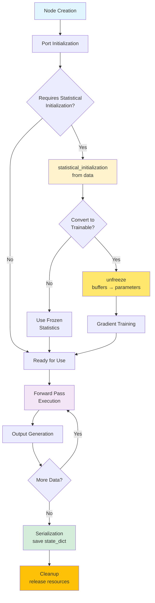

!!! warning "Status: Needs Review"
    This page has not been reviewed for accuracy and completeness. Content may be outdated or contain errors.

---

# Node System Deep Dive

*Fundamental processing units in CUVIS.AI pipelines.*

A **Node** represents a single processing unit in a pipeline. Each node performs a specific task, declares typed input/output ports, manages internal state, and supports both CPU and GPU execution.

**Key capabilities:**

* Typed I/O via port specifications
* Optional statistical initialization from data
* Freeze/unfreeze for two-phase training
* Stage-aware execution control
* Serialization and restoration

---

## Node Lifecycle

Complete lifecycle from creation to cleanup:


```mermaid
flowchart TB
    A[Node Creation] --> B[Port Initialization]
    B --> C{Requires Statistical<br/>Initialization?}
    C -->|Yes| D[statistical_initialization<br/>from data]
    C -->|No| E[Ready for Use]
    D --> F{Convert to<br/>Trainable?}
    F -->|Yes| G[unfreeze<br/>buffers → parameters]
    F -->|No| H[Use Frozen<br/>Statistics]
    G --> I[Gradient Training]
    H --> E
    I --> E
    E --> J[Forward Pass<br/>Execution]
    J --> K[Output Generation]
    K --> L{More Data?}
    L -->|Yes| J
    L -->|No| M[Serialization<br/>save state_dict]
    M --> N[Cleanup<br/>release resources]

    style A fill:#e1f5ff
    style D fill:#fff3cd
    style G fill:#ffe66d
    style J fill:#f3e5f5
    style M fill:#d4edda
    style N fill:#ffc107
```

---

## Base Node Architecture

All nodes inherit from `Node` base class (itself inheriting from `nn.Module`, `ABC`, `Serializable`):

```python
from cuvis_ai_core.node import Node
from cuvis_ai_schemas.pipeline import PortSpec
import torch

class Node(nn.Module, ABC, Serializable):
    """Base class for all nodes."""

    # Class-level port specifications
    INPUT_SPECS: dict[str, PortSpec | list[PortSpec]] = {}
    OUTPUT_SPECS: dict[str, PortSpec | list[PortSpec]] = {}

    def __init__(self, name: str | None = None, **kwargs):
        super().__init__()
        self.name = name
        self._input_ports = {}   # Created from INPUT_SPECS
        self._output_ports = {}  # Created from OUTPUT_SPECS

    @abstractmethod
    def forward(self, **inputs) -> dict[str, Any]:
        """Process inputs and return outputs."""
        pass
```

**Key properties:**

* `requires_initial_fit`: Auto-detects if node needs statistical initialization
* `execution_stages`: Controls when node executes (TRAIN, VAL, TEST, INFERENCE, ALWAYS)
* `frozen`: Tracks frozen vs trainable state

---

## Common Node Patterns

### 1. Data Loading Pattern

*Load and validate input data*

```python
from cuvis_ai.node.data import LentilsAnomalyDataNode

data_node = LentilsAnomalyDataNode(normal_class_ids=[0, 1])

# Characteristics: Stateless, executes in all stages
```

---

### 2. Processing Pattern

*Transform and normalize data*

```python
from cuvis_ai_core.pipeline.pipeline import CuvisPipeline
from cuvis_ai_core.training import StatisticalTrainer
from cuvis_ai.node.normalization import MinMaxNormalizer
from cuvis_ai.node.data import LentilsAnomalyDataNode

# Create pipeline and add nodes
pipeline = CuvisPipeline("Normalization_Pipeline")
data_node = LentilsAnomalyDataNode(normal_class_ids=[0, 1])
normalizer = MinMaxNormalizer(eps=1e-6, use_running_stats=True)

# Connect nodes
pipeline.connect(
    (data_node.outputs.cube, normalizer.data),
)

# Statistical initialization via trainer
trainer = StatisticalTrainer(pipeline=pipeline, datamodule=datamodule)
trainer.fit()  # Automatically initializes normalizer with statistics

# Characteristics: Can be stateless or stateful
```

---

### 3. Statistical Pattern

*Anomaly detection using statistical methods*

```python
from cuvis_ai_core.pipeline.pipeline import CuvisPipeline
from cuvis_ai_core.training import StatisticalTrainer
from cuvis_ai.anomaly.rx_detector import RXGlobal
from cuvis_ai.node.normalization import MinMaxNormalizer
from cuvis_ai.node.data import LentilsAnomalyDataNode

# Create pipeline with statistical nodes
pipeline = CuvisPipeline("RX_Statistical")
data_node = LentilsAnomalyDataNode(normal_class_ids=[0, 1])
normalizer = MinMaxNormalizer(eps=1e-6, use_running_stats=True)
rx_node = RXGlobal(num_channels=61, eps=1e-6)

# Connect the pipeline
pipeline.connect(
    (data_node.outputs.cube, normalizer.data),
    (normalizer.normalized, rx_node.data),
)

# Phase 1: Statistical initialization
trainer = StatisticalTrainer(pipeline=pipeline, datamodule=datamodule)
trainer.fit()  # Initializes all statistical nodes (normalizer, rx_node)

# Phase 2 (optional): Enable gradient training
pipeline.unfreeze_nodes_by_name([rx_node.name])
```

Requires initialization via `statistical_initialization()`, stores statistics as buffers, can be unfrozen for training.

---

### 4. Deep Learning Pattern

*Neural network-based analysis*

```python
from cuvis_ai_core.pipeline.pipeline import CuvisPipeline
from cuvis_ai_core.training import StatisticalTrainer, GradientTrainer
from cuvis_ai.anomaly.deep_svdd import (
    DeepSVDDProjection,
    DeepSVDDCenterTracker,
    DeepSVDDScores,
    ZScoreNormalizerGlobal,
)
from cuvis_ai.node.losses import DeepSVDDSoftBoundaryLoss
from cuvis_ai.node.data import LentilsAnomalyDataNode

# Create pipeline with deep learning nodes
pipeline = CuvisPipeline("DeepSVDD")
data_node = LentilsAnomalyDataNode(normal_class_ids=[0, 1])
encoder = ZScoreNormalizerGlobal(num_channels=61, hidden=32)
projection = DeepSVDDProjection(in_channels=61, rep_dim=16, hidden=[32, 16])
center_tracker = DeepSVDDCenterTracker(rep_dim=16)
loss_node = DeepSVDDSoftBoundaryLoss(name="deepsvdd_loss")

# Connect the pipeline
pipeline.connect(
    (data_node.outputs.cube, encoder.data),
    (encoder.normalized, projection.data),
    (projection.embeddings, center_tracker.embeddings),
    (projection.embeddings, loss_node.embeddings),
    (center_tracker.center, loss_node.center),
)

# Phase 1: Statistical initialization of encoder
stat_trainer = StatisticalTrainer(pipeline=pipeline, datamodule=datamodule)
stat_trainer.fit()

# Phase 2: Gradient training
pipeline.unfreeze_nodes_by_name([encoder.name])
grad_trainer = GradientTrainer(
    pipeline=pipeline,
    datamodule=datamodule,
    loss_nodes=[loss_node],
    trainer_config=training_config,
)
grad_trainer.fit()
```


---

## Creating Custom Nodes

### Basic Custom Node Template

```python
from cuvis_ai_core.node import Node
from cuvis_ai_schemas.pipeline import PortSpec
import torch
from torch import nn

class MyCustomNode(Node):
    """Custom node for specific processing."""

    INPUT_SPECS = {
        "features": PortSpec(
            dtype=torch.float32,
            shape=(-1, -1),
            description="Input feature vectors"
        )
    }

    OUTPUT_SPECS = {
        "transformed": PortSpec(
            dtype=torch.float32,
            shape=(-1, -1),
            description="Transformed features"
        )
    }

    def __init__(self, input_dim: int, output_dim: int, **kwargs):
        self.input_dim = input_dim
        self.output_dim = output_dim

        super().__init__(input_dim=input_dim, output_dim=output_dim, **kwargs)

        self.linear = nn.Linear(input_dim, output_dim)

    def forward(self, features: torch.Tensor, **_) -> dict[str, torch.Tensor]:
        """Process input features."""
        transformed = self.linear(features)
        return {"transformed": transformed}
```

### Adding Statistical Initialization (Optional)

```python
    def statistical_initialization(self, input_stream: InputStream) -> None:
        """Initialize parameters from data."""
        feature_sum = torch.zeros(self.input_dim)
        count = 0

        for batch_data in input_stream:
            features = batch_data["features"]
            feature_sum += features.sum(dim=0)
            count += features.shape[0]

        mean = feature_sum / count
        self.register_buffer("running_mean", mean)
        self._statistically_initialized = True

    def unfreeze(self) -> None:
        """Convert buffers to parameters for gradient training."""
        if hasattr(self, "running_mean"):
            self.running_mean = nn.Parameter(self.running_mean.clone())
        super().unfreeze()
```

### Node Registration

```python
from cuvis_ai_core.utils.node_registry import NodeRegistry

@NodeRegistry.register
class MyCustomNode(Node):
    """Now discoverable via NodeRegistry.get("MyCustomNode")"""
    pass
```

---

## Node Registry and Discovery

**Built-in node access:**

```python
from cuvis_ai_core.utils.node_registry import NodeRegistry

# Get node class
RXGlobal = NodeRegistry.get("RXGlobal")

# List all nodes
all_nodes = NodeRegistry.list_builtin_nodes()
```

**Plugin support:**

```python
# Create registry instance
registry = NodeRegistry()
registry.load_plugins("path/to/plugins.yaml")

# Get plugin node
AdaCLIPDetector = registry.get("AdaCLIPDetector")

# Use with PipelineBuilder
from cuvis_ai.pipeline.pipeline_builder import PipelineBuilder
builder = PipelineBuilder(node_registry=registry)
```

Resolution order: Instance plugins --> Built-in registry --> Import from module path

---

## State Management

### Buffers vs Parameters

**Parameters** are trainable (receive gradients). **Buffers** are non-trainable state. Both are serialized and moved with `.to(device)`.

```python
self.register_buffer("mean", torch.zeros(num_features))     # Buffer (frozen)
self.linear = nn.Linear(in_features, out_features)           # Parameter (trainable)
```

### Freeze/Unfreeze Pattern

After `StatisticalTrainer.fit()`, statistics live as frozen buffers. Call `node.unfreeze()` to promote them to trainable parameters; `node.freeze()` reverts.

### TRAINABLE_BUFFERS

Declares which buffers to promote to `nn.Parameter` on `unfreeze()` and demote back on `freeze()`. Validated at class definition time via `__init_subclass__`.

```python
class ScoreToLogit(Node):
    TRAINABLE_BUFFERS = ("scale", "bias")
```

**Built-in nodes using TRAINABLE_BUFFERS:**

| Node | Buffers | Shape |
|------|---------|-------|
| `ScoreToLogit` | `scale`, `bias` | scalar, scalar |
| `SoftChannelSelector` | `channel_logits` | `(n_channels,)` |
| `TrainablePCA` | `_components` | `(n_components, n_features)` |
| `RXGlobal` | `mu`, `cov`, `cov_inv` | `(C,)`, `(C,C)`, `(C,C)` |
| `LADGlobal` | `M`, `L` | `(C,)`, `(C,C)` |

Nodes with non-buffer learnable state (e.g., `LearnableChannelMixer` with `nn.Conv2d` layers) override `freeze()`/`unfreeze()` and call `super()`.

---

## Reusable Utilities

### WelfordAccumulator

Numerically stable streaming computation of mean, variance, and optionally covariance (`cuvis_ai.utils.welford`). Uses Welford's online algorithm (batch-merge variant) with `float64` internal precision.

```python
from cuvis_ai.utils.welford import WelfordAccumulator

acc = WelfordAccumulator(n_features=61, track_covariance=True)

for batch in dataloader:
    pixels = batch["cube"].reshape(-1, 61)  # (N, C)
    acc.update(pixels)

acc.count  # total samples seen
acc.mean   # (61,), float32
acc.var    # (61,), float32, Bessel-corrected
acc.cov    # (61, 61), float32 -- covariance mode only
```

| Property | Detail |
|----------|--------|
| `nn.Module` subclass | `.to(device)` propagates to accumulator buffers |
| Non-persistent buffers | `_n`, `_mean`, `_M2` excluded from `state_dict()` |
| Batch-merge algorithm | Processes entire batches at once, not sample-by-sample |

**Used by:** `ZScoreNormalizerGlobal`, `RXGlobal`, `SoftChannelSelector`

---

## Best Practices

### 1. Keep Nodes Focused

Single responsibility -- one node, one task. Compose complex behavior from simple nodes.

### 2. Trust Port Validation (Don't Over-Validate)

Port schema validation (dtype, shape) is automatic. Only check node-specific state like `_statistically_initialized` in `forward()`:

```python
# ✅ GOOD: Trust port specs, only check node-specific state
def forward(self, data: torch.Tensor, **_):
    if not self._statistically_initialized:
        raise RuntimeError(f"{self.__class__.__name__} requires initialization")
    return {"output": self.process(data)}
```

### 3. Avoid `.to()` in Forward (Pipeline Handles Device Placement)

The pipeline moves nodes and data to the correct device via `pipeline.to(device)`. Manual `.to()` calls in `forward()` break multi-device training and add unnecessary overhead.

```python
# ❌ BAD: Manual device placement
def forward(self, data: torch.Tensor, **_):
    data = data.to("cuda")  # DON'T DO THIS!
    result = torch.matmul(data, self.weights)
    return {"output": result}

# ✅ GOOD: data and self.weights are already on the correct device
def forward(self, data: torch.Tensor, **_):
    result = torch.matmul(data, self.weights)
    return {"output": result}
```

### 4. Document Port Requirements

Use the `description` field in `PortSpec` to document format, channel count, and normalization expectations.

### 5. Use Context for Training Metadata

Accept a `Context` parameter in `forward()` for stage, epoch, batch_idx, and global_step. Do not add these as separate parameters:

```python
def forward(self, predictions: torch.Tensor, targets: torch.Tensor,
            context: Context) -> dict:
    loss_value = self.compute_loss(predictions, targets)
    metric = Metric(name="loss", value=loss_value,
                    stage=context.stage, epoch=context.epoch)

    if context.stage == ExecutionStage.TRAIN:
        self.update_running_stats(predictions)

    return {"metrics": [metric]}
```

### 6. Initialize Buffers and Parameters Properly

**All buffers and parameters MUST be fully initialized in `__init__`** with correct dimensions. Initializing them as `None` or empty and rewriting later **breaks serialization**.

Get all required arguments (like `num_channels`) upfront in the constructor:

```python
# ❌ BAD: Deferred initialization breaks serialization
class BadNode(Node):
    def __init__(self, **kwargs):
        super().__init__(**kwargs)
        self.register_buffer("mu", None)  # Breaks state_dict!
        self.register_buffer("cov", torch.zeros(0))

    def statistical_initialization(self, input_stream: InputStream) -> None:
        num_channels = next(iter(input_stream))["data"].shape[-1]
        self.mu = torch.zeros(num_channels)  # Too late - breaks serialization

# ✅ GOOD: Proper initialization with required arguments
class GoodNode(Node):
    def __init__(self, num_channels: int, **kwargs):
        super().__init__(num_channels=num_channels, **kwargs)
        # Buffers initialized with correct shapes immediately
        self.register_buffer("mu", torch.zeros(num_channels, dtype=torch.float32))
        self.register_buffer("cov", torch.eye(num_channels, dtype=torch.float32))

    def statistical_initialization(self, input_stream: InputStream) -> None:
        for batch in input_stream:
            self._update_statistics(batch["data"])
        # Update in-place (maintains buffer identity)
        self.mu.copy_(computed_mean)
        self.cov.copy_(computed_covariance)
```

**Why:** PyTorch's `state_dict()` captures buffers at `register_buffer()` time. Reassigning later breaks serialization completely.

---

???+ tip "Troubleshooting"

    **"Node not initialized"** -- Use `StatisticalTrainer` before inference:

    ```python
    trainer = StatisticalTrainer(pipeline=pipeline, datamodule=datamodule)
    trainer.fit()  # Initializes all statistical nodes
    ```

    **Port Type Mismatch** -- Ensure consistent dtypes across the pipeline:

    ```python
    normalizer = MinMaxNormalizer(dtype=torch.float32)
    rx = RXGlobal(num_channels=61, dtype=torch.float32)
    ```

    **Shape Mismatch** -- Check that channel dimensions match node expectations:

    ```python
    selector = SoftChannelSelector(n_select=10, input_channels=30)
    ```
