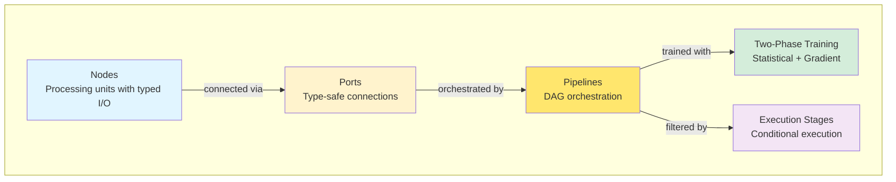

# Core Concepts Overview

CUVIS.AI is built on five interconnected concepts that work together to create flexible, type-safe ML pipelines:

Each concept below has a dedicated deep-dive page with comprehensive diagrams and examples.
