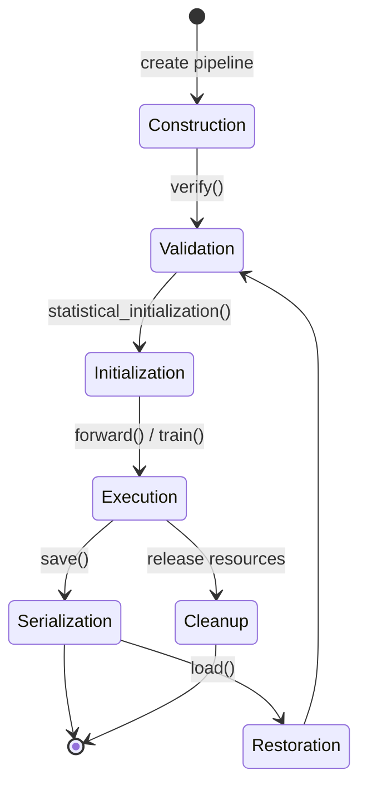
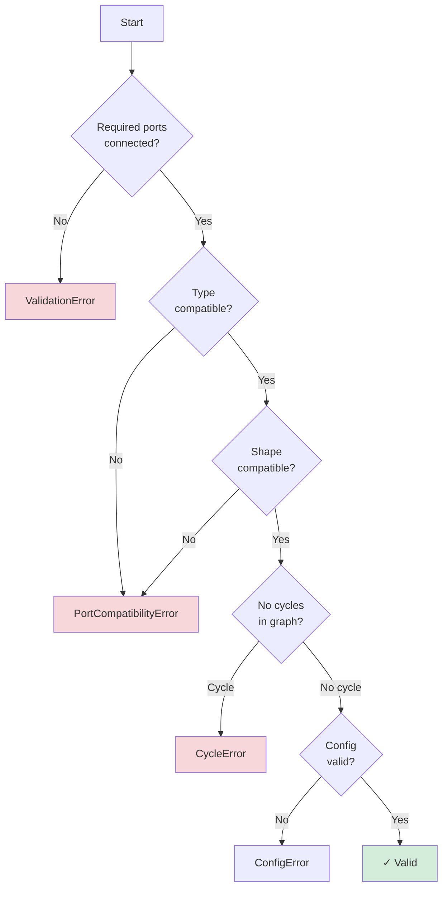
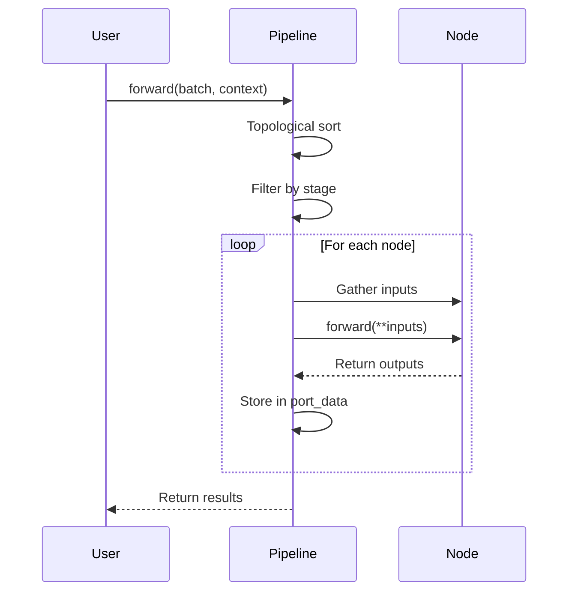

!!! warning "Status: Needs Review"
    This page has not been reviewed for accuracy and completeness. Content may be outdated or contain errors.

---

# Pipeline Lifecycle

*Central orchestrator managing node connections, data flow, and execution through distinct lifecycle phases.*

A **Pipeline** in CUVIS.AI is a directed acyclic graph (DAG) of connected nodes that processes data through transformations. It manages connections, validates ports, executes nodes in topological order, handles initialization, and serializes trained models.

**Key capabilities:**

* Port-based connections with validation
* Topological execution ordering
* Statistical initialization and gradient training
* Serialization and restoration
* Stage-aware execution filtering
* Introspection and debugging tools

---

## Pipeline States



**States:**
1. **Construction**: Add nodes and connections
2. **Validation**: Verify graph integrity and port compatibility
3. **Initialization**: Statistical init, GPU transfer
4. **Execution**: Training, validation, inference
5. **Serialization**: Save structure and weights
6. **Restoration**: Load saved pipelines
7. **Cleanup**: Release resources

---

## Construction Phase

### Creating a Pipeline

```python
from cuvis_ai.pipeline.pipeline import CuvisPipeline

pipeline = CuvisPipeline(
    name="my_anomaly_detector",
    strict_runtime_io_validation=True
)
```

### Adding Nodes

```python
# Explicit addition
pipeline.add_node(data_loader)
pipeline.add_node(normalizer)

# Or automatic during connection
pipeline.connect((data_loader.cube, normalizer.data))
```

### Connecting Nodes

```python
data_node = LentilsAnomalyDataNode(normal_class_ids=[0, 1])
normalizer = MinMaxNormalizer(eps=1e-6)
rx_node = RXGlobal(num_channels=61)

pipeline.connect(
    (data_node.cube, normalizer.data),
    (normalizer.normalized, rx_node.data)
)
```

### Pipeline Builder (YAML)

```python
from cuvis_ai.pipeline.pipeline_builder import PipelineBuilder

builder = PipelineBuilder()
pipeline = builder.build_from_config("configs/pipeline/my_pipeline.yaml")
```

**YAML Format:**
```yaml
name: RX_Anomaly_Detector

nodes:
  - name: data_loader
    class: cuvis_ai.node.data.LentilsAnomalyDataNode
    params:
      normal_class_ids: [0, 1]

  - name: rx_detector
    class: cuvis_ai.anomaly.rx_detector.RXGlobal
    params:
      num_channels: 61

connections:
  - from: data_loader.cube
    to: rx_detector.data
```

---

## Validation Phase

*Automatic during construction, manual via verify().*

```python
pipeline.verify()  # Check all constraints
```

**Validation Checks:**



**Validates:**
1. All required ports connected
2. Port dtype/shape compatibility
3. No circular dependencies
4. Valid node configuration

---

## Initialization Phase

*Prepare nodes for execution.*

### Node Initialization Order

```python
# Nodes initialized in topological order
sorted_nodes = pipeline._get_topologically_sorted_nodes()

for node in sorted_nodes:
    if node.requires_initial_fit:
        node.statistical_initialization(initialization_stream)
```

### Two-Phase Initialization

```python
from cuvis_ai.trainer.statistical_trainer import StatisticalTrainer

# Phase 1: Statistical initialization
datamodule = SingleCu3sDataModule(...)
stat_trainer = StatisticalTrainer(pipeline=pipeline, datamodule=datamodule)
stat_trainer.fit()  # Initialize statistical nodes

# Phase 2: Unfreeze for gradient training
pipeline.unfreeze_nodes_by_name(["rx_detector", "selector"])
```

See [Two-Phase Training](two-phase-training.md) for details.

### GPU Transfer

```python
pipeline = pipeline.to("cuda")
```

---

## Execution Phase

### Sequential Execution

```python
from cuvis_ai_core.pipeline.context import Context, ExecutionStage

context = Context(stage=ExecutionStage.INFERENCE)
outputs = pipeline.forward(
    batch={"cube": hyperspectral_data},
    context=context
)

anomaly_scores = outputs[("rx_detector", "scores")]
```

### Batch Processing

```python
results = []
for batch in dataloader:
    outputs = pipeline.forward(batch=batch, context=context)
    results.append(outputs[("rx_detector", "scores")])

all_scores = torch.cat(results, dim=0)
```

### Trainer-Managed Execution

```python
from cuvis_ai.trainer.gradient_trainer import GradientTrainer

trainer = GradientTrainer(
    pipeline=pipeline,
    datamodule=datamodule,
    loss_nodes=[bce_loss],
    metric_nodes=[metrics_node],
    trainer_config=training_config
)

trainer.fit()
trainer.test()
```

### Execution Flow

**High-Level Sequence:**



**Detailed Forward Pass Mechanics:**

This diagram shows the internal port-based routing and validation that occurs during `pipeline.forward()`:

```mermaid
%%{init: {'flowchart': {'nodeSpacing': 20, 'rankSpacing': 30}} }%%
flowchart TD
    A["pipeline.forward(batch=...)"] --> B[Port-Based Batch Distribution]
    B --> C[Resolve Input Ports]
    C --> D[Topological Sort by Port Connections]
    D --> E[For each node in order]
    E --> F[Collect inputs from connected output ports]
    F --> G[Execute node.forward(**inputs)]
    G --> H[Store outputs in port dictionary]
    H --> I{More nodes?}
    I -->|Yes| E
    I -->|No| J[Return port output dictionary]

    B --> K[Port Validation]
    K --> L[Type Checking]
    K --> M[Shape Compatibility]
    K --> N[Stage Filtering]

    style A fill:#e1f5ff
    style J fill:#d4edda
    style K fill:#fff3cd
```

**Step-by-Step Breakdown:**

1. **Batch Distribution:** Input batch is distributed to entry nodes based on port specifications
2. **Port Resolution:** All input ports are resolved to their connected output ports
3. **Topological Sorting:** Nodes are sorted by dependency order based on port connections
4. **Per-Node Execution:**
   - Gather all inputs from connected upstream output ports
   - Execute the node's `forward()` method with gathered inputs
   - Store outputs in port dictionary keyed by `(node_id, port_name)`
5. **Validation (Parallel):**
   - Type checking ensures dtype compatibility
   - Shape validation confirms dimension compatibility
   - Stage filtering excludes nodes not active in current execution stage
6. **Result Return:** Complete port output dictionary returned to caller

**Example Port Dictionary:**

```python
outputs = pipeline.forward(batch={"cube": data})

# Returns dictionary with port keys:
{
    ("data_node", "cube"): tensor(...),           # Raw data
    ("normalizer", "normalized"): tensor(...),    # Normalized cube
    ("rx_detector", "scores"): tensor(...),       # Anomaly scores
    ("rx_detector", "logits"): tensor(...),       # Logits output
}

# Access outputs by port:
scores = outputs[("rx_detector", "scores")]
```

### Stage-Aware Execution

```python
# Different nodes execute per stage
context = Context(stage=ExecutionStage.TRAIN)
pipeline.forward(batch=data, context=context)  # All nodes

context = Context(stage=ExecutionStage.VAL)
pipeline.forward(batch=data, context=context)  # Only VAL/ALWAYS nodes

context = Context(stage=ExecutionStage.INFERENCE)
pipeline.forward(batch=data, context=context)  # Only INFERENCE/ALWAYS nodes
```

### Partial Execution

```python
# Run only up to normalizer (debugging)
outputs = pipeline.forward(
    batch={"cube": data},
    context=context,
    upto_node=normalizer
)
```

---

## Serialization Phase

*Save pipeline structure and trained weights.*

### Saving Pipelines

```python
from cuvis_ai.pipeline.config import PipelineMetadata

pipeline.save_to_file(
    config_path="outputs/my_pipeline.yaml",
    metadata=PipelineMetadata(
        name="RX_Anomaly_Detector_v1",
        description="Trained on Lentils dataset",
        tags=["anomaly-detection", "production"]
    ),
    validate_nodes=True,
    include_optimizer=False,
    include_scheduler=False
)

# Generates: outputs/my_pipeline.yaml, outputs/my_pipeline.pt
```

**YAML Structure:**
```yaml
version: '1.0'
metadata:
  name: RX_Anomaly_Detector_v1
  description: Trained on Lentils dataset
  tags: [anomaly-detection, production]

nodes:
  - name: data_loader
    class: cuvis_ai.node.data.LentilsAnomalyDataNode
    params:
      normal_class_ids: [0, 1]

  - name: rx_detector
    class: cuvis_ai.anomaly.rx_detector.RXGlobal
    params:
      num_channels: 61

connections:
  - from: data_loader.cube
    to: rx_detector.data
```

**PyTorch Checkpoint:**
```python
{
    "state_dict": {
        "normalizer": {
            "running_min": tensor(...),
            "running_max": tensor(...)
        },
        "rx_detector": {
            "mu": tensor(...),
            "sigma": tensor(...)
        }
    },
    "metadata": {...}
}
```

**What Gets Saved:**
✅ Pipeline structure, node configs, trained weights, statistics, metadata, optimizer/scheduler (optional)
❌ Training data, intermediate activations, Python code, external plugins

---

## Restoration Phase

*Load saved pipelines and resume work.*

### Loading Pipelines

```python
pipeline = CuvisPipeline.load_from_file(
    config_path="outputs/my_pipeline.yaml",
    weights_path="outputs/my_pipeline.pt",  # Auto-detected if None
    device="cuda",
    strict_weight_loading=True
)

outputs = pipeline.forward(batch=test_data)
```

### With Plugins

```python
from cuvis_ai_core.utils.node_registry import NodeRegistry

registry = NodeRegistry()
registry.load_plugins("plugins.yaml")

builder = PipelineBuilder(node_registry=registry)
pipeline = builder.build_from_config("outputs/my_pipeline.yaml")
pipeline.load_state_dict(torch.load("outputs/my_pipeline.pt")["state_dict"])
```

### Configuration Overrides

```python
pipeline = CuvisPipeline.load_from_file(
    config_path="outputs/my_pipeline.yaml",
    config_overrides={"nodes": [{"params": {"threshold": 0.8}}]}
)

# Or list syntax
pipeline = CuvisPipeline.load_from_file(
    config_path="outputs/my_pipeline.yaml",
    config_overrides=["nodes.0.params.threshold=0.8"]
)
```

---

## Cleanup Phase

*Release resources (GPU memory, file handles, caches).*

```python
pipeline.cleanup()

# Or context manager (automatic)
with CuvisPipeline.load_from_file("pipeline.yaml") as pipeline:
    results = pipeline.forward(batch=data)
# Auto-cleanup on exit

# Manual resource release
pipeline = pipeline.to("cpu")
torch.cuda.empty_cache()
```

---

## Training Workflow

### Statistical Training Only

```python
from cuvis_ai.trainer.statistical_trainer import StatisticalTrainer

stat_trainer = StatisticalTrainer(pipeline=pipeline, datamodule=datamodule)
stat_trainer.fit()
stat_trainer.validate()
stat_trainer.test()

pipeline.save_to_file("outputs/statistical_pipeline.yaml")
```

### Gradient Training (Two-Phase)

```python
from cuvis_ai.trainer.gradient_trainer import GradientTrainer

# Phase 1: Statistical init (if needed)
if any(node.requires_initial_fit for node in pipeline.nodes):
    stat_trainer = StatisticalTrainer(pipeline, datamodule)
    stat_trainer.fit()

# Phase 2: Unfreeze and train
pipeline.unfreeze_nodes_by_name(["selector", "rx_detector"])

grad_trainer = GradientTrainer(
    pipeline=pipeline,
    datamodule=datamodule,
    loss_nodes=[bce_loss],
    metric_nodes=[metrics_node],
    trainer_config=training_config,
    optimizer_config=optimizer_config
)

grad_trainer.fit()
grad_trainer.test()

pipeline.save_to_file("outputs/gradient_trained_pipeline.yaml")
```

---

## Monitoring & Debugging

### Pipeline Introspection

```python
summary = pipeline.summary()
print(summary)

input_specs = pipeline.get_input_specs()
output_specs = pipeline.get_output_specs()
```

### Visualization

```python
pipeline.visualize(output_path="pipeline_graph.png", format="png")
dot_source = pipeline.to_dot()
```

### Execution Profiling

```python
pipeline.enable_profiling()
outputs = pipeline.forward(batch=data)

timings = pipeline.get_execution_stats()
for node_name, time_ms in timings.items():
    print(f"{node_name}: {time_ms:.2f}ms")
```

### Logging

```python
import logging
logging.basicConfig(level=logging.DEBUG)
pipeline.set_log_level(logging.DEBUG)

outputs = pipeline.forward(batch=data)
```

---

## Best Practices

1. **Validate Early**
   ```python
   pipeline = build_pipeline()
   pipeline.verify()  # Catch errors before training
   stat_trainer.fit()
   ```

2. **Check Statistical Initialization**
   ```python
   uninit_nodes = [
       node for node in pipeline.nodes
       if node.requires_initial_fit and not node._statistically_initialized
   ]
   if uninit_nodes:
       stat_trainer.fit()
   ```

3. **Save Checkpoints**
   ```python
   for epoch in range(num_epochs):
       train_one_epoch()
       if (epoch + 1) % save_interval == 0:
           pipeline.save_to_file(f"checkpoints/epoch_{epoch+1}.yaml")
   ```

4. **Use Context Managers**
   ```python
   with CuvisPipeline.load_from_file("pipeline.yaml") as pipeline:
       results = process_data(pipeline, test_data)
   # Auto-cleanup
   ```

5. **Monitor Performance**
   ```python
   pipeline.enable_profiling()
   for batch in dataloader:
       pipeline.forward(batch=batch)
   stats = pipeline.get_execution_stats()
   ```

6. **Version Pipelines**
   ```python
   pipeline.save_to_file(
       "outputs/pipeline_v2.yaml",
       metadata=PipelineMetadata(
           name="RX_Detector",
           version="2.1.0",
           tags=["v2", "production"]
       )
   )
   ```

---

## Common Pitfalls

1. **Forgetting Statistical Initialization**
   ```python
   # Missing: stat_trainer.fit()
   grad_trainer.fit()  # Error: RXGlobal not initialized!
   ```

2. **Type Mismatches**
   ```python
   normalizer = MinMaxNormalizer(dtype=torch.float32)
   rx = RXGlobal(dtype=torch.float64)  # Mismatch!
   ```

3. **Cyclic Dependencies**
   ```python
   pipeline.connect(
       (node_a.data, node_b.data),
       (node_b.result, node_c.data),
       (node_c.final, node_a.data)  # Cycle!
   )
   ```

4. **Memory Leaks**
   ```python
   # Bad: No cleanup
   for i in range(1000):
       pipeline = CuvisPipeline.load_from_file("pipeline.yaml")
       pipeline.forward(batch=data)

   # Good: Context manager
   for i in range(1000):
       with CuvisPipeline.load_from_file("pipeline.yaml") as pipeline:
           pipeline.forward(batch=data)
   ```

---

## Related Documentation

* → [Node System Deep Dive](node-system-deep-dive.md) - Pipeline components
* → [Port System Deep Dive](port-system-deep-dive.md) - Node communication
* → [Two-Phase Training](two-phase-training.md) - Training workflow
* → [Execution Stages](execution-stages.md) - Stage-aware execution
* → [Building Pipelines (Python)](../how-to/build-pipeline-python.md) - Practical guide
* → [Building Pipelines (YAML)](../how-to/build-pipeline-yaml.md) - Config-based construction
