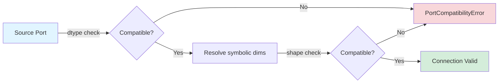
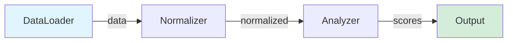
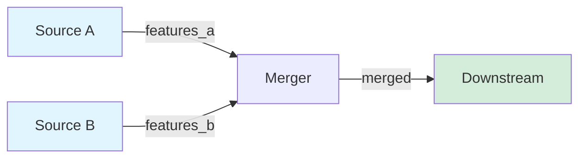
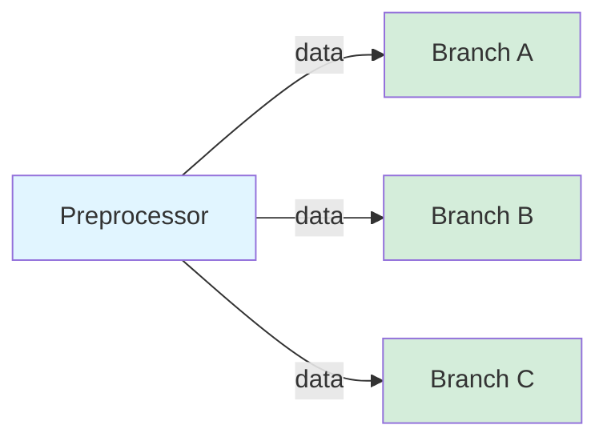
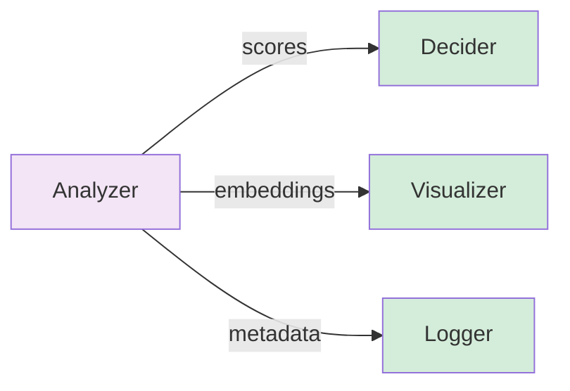
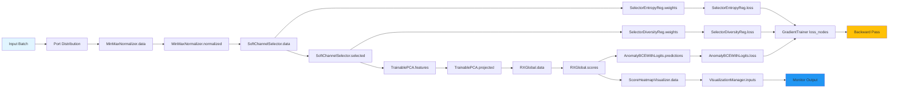

!!! warning "Status: Needs Review"
    This page has not been reviewed for accuracy and completeness. Content may be outdated or contain errors.

---

# Port System Deep Dive

*Typed, validated connections between nodes enable robust data flow in CUVIS.AI pipelines.*

Ports provide explicit communication interfaces with **type safety**, **shape validation**, **optional connections**, and **symbolic dimension resolution**.

**Key capabilities:**

* Typed I/O with dtype and shape specifications
* Automatic connection compatibility validation
* Support for optional and variadic ports
* Symbolic dimensions resolved from node attributes
* Data flow patterns (fan-in, fan-out, multi-port)

---

## Port Architecture

### PortSpec Definition

*Dataclass specifying the contract for a port.*

```python
from dataclasses import dataclass

@dataclass
class PortSpec:
    dtype: Any                          # Data type (torch.float32, etc.)
    shape: tuple[int | str, ...]        # Shape with -1 for flexible, strings for symbolic
    description: str = ""               # Documentation
    optional: bool = False              # Connection required?
```

### Port Types

**InputPort**: Receives data into a node
```python
node.inputs.data  # InputPort(node, "data", spec)
pipeline.connect(source_port, target_node.inputs.data)
```

**OutputPort**: Emits data from a node
```python
node.outputs.scores  # OutputPort(node, "scores", spec)
pipeline.connect(source_node.outputs.scores, target_port)
```

---

## Shape Specifications

Three dimension types:

**Flexible (`-1`)**: Accept any size
```python
shape=(-1, -1, -1, -1)  # Any 4D tensor
```

**Fixed (integers)**: Require exact size
```python
shape=(128, 128, 3)  # Exactly 128x128 RGB
```

**Symbolic (strings)**: Resolve from node attributes
```python
shape=(-1, "n_select")  # Second dim from self.n_select
```

---

## Connection Validation



**Compatibility Rules:**

| Source | Target | Compatible? |
|--------|--------|-------------|
| `torch.float32` | `torch.float32` | ✅ Yes |
| `torch.float32` | `torch.float64` | ❌ No |
| `torch.Tensor` | `torch.float32` | ✅ Yes |
| `(-1, -1, 61)` | `(-1, -1, 61)` | ✅ Yes |
| `(-1, -1, 61)` | `(-1, -1, -1)` | ✅ Yes (flexible target) |
| `(-1, -1, 61)` | `(-1, -1, 30)` | ❌ No (fixed mismatch) |

### Connection API

```python
# Single connection
pipeline.connect((source_node.result, target_node.data))

# Batch connections
pipeline.connect(
    (node1.data, node2.data),
    (node2.result, node3.features),
    (node3.scores, node4.predictions)
)

# Nodes auto-added if not present
pipeline.connect((new_node1.data, new_node2.data))
```

### Simplified Syntax

```python
# Explicit (always works)
pipeline.connect((normalizer.outputs.normalized, rx_node.inputs.data))

# Simplified (when unambiguous)
pipeline.connect((normalizer.normalized, rx_node.data))

# Use explicit syntax only when node has same-named input and output port
```

---

## Port Definition

### Input Ports

```python
class ProcessingNode(Node):
    INPUT_SPECS = {
        "data": PortSpec(
            dtype=torch.float32,
            shape=(-1, -1, -1, -1),
            description="Input hyperspectral cube",
            optional=False
        ),
        "mask": PortSpec(
            dtype=torch.bool,
            shape=(-1, -1, -1),
            description="Optional binary mask",
            optional=True
        ),
        "weights": PortSpec(
            dtype=torch.float32,
            shape=("n_channels",),  # Symbolic
            description="Per-channel weights"
        )
    }
```

### Output Ports

```python
class AnalysisNode(Node):
    OUTPUT_SPECS = {
        "scores": PortSpec(
            dtype=torch.float32,
            shape=(-1,),
            description="Anomaly scores per sample"
        ),
        "embeddings": PortSpec(
            dtype=torch.float32,
            shape=(-1, 128),
            description="Feature embeddings"
        ),
        "metadata": PortSpec(
            dtype=dict,
            shape=(),  # Scalar
            description="Processing metadata"
        )
    }
```

### Symbolic Dimension Resolution

```python
from cuvis_ai.pipeline.ports import DimensionResolver

class SelectorNode(Node):
    def __init__(self, n_select: int, **kwargs):
        self.n_select = n_select  # Store before super().__init__()
        super().__init__(**kwargs)

    OUTPUT_SPECS = {
        "selected": PortSpec(
            torch.float32,
            (-1, -1, -1, "n_select")  # Resolved at runtime
        )
    }

# Resolution
selector = SelectorNode(n_select=10)
resolved_shape = DimensionResolver.resolve(
    shape=(-1, -1, -1, "n_select"),
    node=selector
)
# Result: (-1, -1, -1, 10)
```

### Variadic Ports (Fan-in)

*Multiple connections to one port.*

```python
class AggregatorNode(Node):
    INPUT_SPECS = {
        "features": [PortSpec(
            dtype=torch.float32,
            shape=(-1, -1),
            description="Feature tensors to aggregate"
        )]
    }

    def forward(self, features: list[torch.Tensor], **_):
        concatenated = torch.cat(features, dim=-1)
        return {"aggregated": concatenated}

# Connect multiple sources
pipeline.connect(
    (node1.feat1, aggregator.features),
    (node2.feat2, aggregator.features),
    (node3.feat3, aggregator.features)
)
```

---

## Data Flow Patterns

### Pattern 1: Linear (Single Input/Output)



```python
pipeline.connect(
    (loader.data, normalizer.data),
    (normalizer.normalized, analyzer.data),
    (analyzer.scores, output_node.data)
)
```

### Pattern 2: Fan-in (Multiple Sources)



```python
pipeline.connect(
    (source_a.features, merger.features_a),
    (source_b.features, merger.features_b)
)
```

### Pattern 3: Fan-out (Multiple Targets)



```python
pipeline.connect(
    (preprocessor.data, branch_a.data),
    (preprocessor.data, branch_b.data),
    (preprocessor.data, branch_c.data)
)
```

### Pattern 4: Multi-Port Node



```python
pipeline.connect(
    (analyzer.scores, decider.predictions),
    (analyzer.embeddings, visualizer.features),
    (analyzer.metadata, logger.data)
)
```

### Pattern 5: Complete Pipeline Example

This diagram shows a real anomaly detection pipeline with port-based data flow, including processing nodes, loss computation, and visualization:



**Data Flow Explanation:**

1. **Main Processing Chain:** Input → MinMaxNormalizer → SoftChannelSelector → TrainablePCA → RXGlobal → Anomaly Scores
2. **Regularization Branch:** Selector weights feed into entropy and diversity regularizers
3. **Loss Aggregation:** Three loss nodes (BCE, entropy, diversity) are registered with GradientTrainer
4. **Visualization Branch:** Scores and heatmaps feed into monitoring system

**Code Example:**

```python
from cuvis_ai.node.normalization import MinMaxNormalizer
from cuvis_ai.node.channel_selector import SoftChannelSelector
from cuvis_ai.node.dimensionality_reduction import TrainablePCA
from cuvis_ai.anomaly.rx_detector import RXGlobal
from cuvis_ai.node.losses import AnomalyBCEWithLogits, SelectorEntropyRegularizer, SelectorDiversityRegularizer
from cuvis_ai.node.anomaly_visualization import ScoreHeatmapVisualizer

# Create nodes
normalizer = MinMaxNormalizer(eps=1e-6)
selector = SoftChannelSelector(n_select=15, input_channels=61)
pca = TrainablePCA(n_components=10, input_dim=15)
rx = RXGlobal(num_channels=10)
bce_loss = AnomalyBCEWithLogits(name="bce", weight=10.0)
entropy_loss = SelectorEntropyRegularizer(name="entropy", weight=0.1)
diversity_loss = SelectorDiversityRegularizer(name="diversity", weight=0.01)
heatmap = ScoreHeatmapVisualizer(name="heatmap")

# Connect pipeline
pipeline.connect(
    # Main processing chain
    (data_node.cube, normalizer.data),
    (normalizer.normalized, selector.data),
    (selector.selected, pca.features),
    (pca.projected, rx.data),
    # Loss connections
    (rx.scores, bce_loss.predictions),
    (data_node.mask, bce_loss.targets),
    (selector.weights, entropy_loss.weights),
    (selector.weights, diversity_loss.weights),
    # Visualization
    (rx.scores, heatmap.scores),
)

# Register loss nodes with trainer
grad_trainer = GradientTrainer(
    pipeline=pipeline,
    datamodule=datamodule,
    loss_nodes=[bce_loss, entropy_loss, diversity_loss],
    ...
)
```

---

## Advanced Features

### Optional Ports

```python
class FlexibleNode(Node):
    INPUT_SPECS = {
        "data": PortSpec(..., optional=False),
        "mask": PortSpec(..., optional=True),
    }

    def forward(self, data: torch.Tensor, mask: torch.Tensor | None = None, **_):
        if mask is not None:
            processed = data * mask.unsqueeze(-1)
        else:
            processed = data
        return {"processed": processed}

# mask can be left unconnected
pipeline.connect((source.data, node.data))
```

### Dynamic Port Resolution

```python
class AdaptiveNode(Node):
    def __init__(self, output_dim: int, **kwargs):
        self.output_dim = output_dim
        super().__init__(**kwargs)

    INPUT_SPECS = {
        "features": PortSpec(torch.float32, (-1, "input_dim"))
    }

    OUTPUT_SPECS = {
        "transformed": PortSpec(torch.float32, (-1, "output_dim"))
    }

    @property
    def input_dim(self):
        return self.linear.in_features
```

---

## Best Practices

1. **Descriptive Port Names**

```python
OUTPUT_SPECS = {
    "anomaly_scores": PortSpec(...),
    "feature_embeddings": PortSpec(...),
    "class_probabilities": PortSpec(...)
}
```

2. **Explicit Data Types**

```python
PortSpec(dtype=torch.float32, shape=(-1, 128))
# NOT: dtype=torch.Tensor (too generic)
```

3. **Document Port Requirements**

```python
INPUT_SPECS = {
    "hyperspectral_cube": PortSpec(
        dtype=torch.float32,
        shape=(-1, -1, -1, 61),
        description="""
        Format: BHWC (Batch, Height, Width, Channels)
        Channels: 61 spectral bands (400-1000nm)
        Normalization: Values in [0, 1]
        """
    )
}
```

4. **Validate in forward()**

```python
def forward(self, data: torch.Tensor, **_):
    if data.ndim != 4:
        raise ValueError(f"Expected 4D tensor (BHWC), got {data.ndim}D")
    if data.shape[-1] != self.expected_channels:
        raise ValueError(f"Expected {self.expected_channels} channels, got {data.shape[-1]}")
    if data.min() < 0 or data.max() > 1:
        raise ValueError("Data must be in [0, 1] range")
```

5. **Handle Optional Ports Gracefully**

```python
def forward(
    self,
    data: torch.Tensor,
    mask: torch.Tensor | None = None,
    weights: torch.Tensor | None = None,
    **_
):
    if mask is None:
        mask = torch.ones_like(data[..., 0], dtype=torch.bool)
    if weights is None:
        weights = torch.ones(data.shape[-1], device=data.device)
    return self._process(data, mask, weights)
```

---

## Troubleshooting

### Type Mismatch

```
PortCompatibilityError: Cannot connect ports: dtype mismatch
  Source: normalizer (torch.float32)
  Target: analyzer (torch.float64)
```

**Fix:** Use consistent dtypes

```python
normalizer = MinMaxNormalizer(dtype=torch.float32)
analyzer = RXGlobal(dtype=torch.float32)
```

### Shape Mismatch

```
PortCompatibilityError: Cannot connect ports: shape mismatch
  Source: selector (shape: (-1, -1, -1, 10))
  Target: rx_node (shape: (-1, -1, -1, 61))
```

**Fix:** Update node configuration

```python
selector = SoftChannelSelector(n_select=61, input_channels=61)
rx_node = RXGlobal(num_channels=61)
```

### Missing Required Port

**Fix:** Connect all required ports

```python
pipeline.connect((source.result, rx_node.data))
```

### Symbolic Dimension Not Found

```
AttributeError: 'SelectorNode' has no attribute 'n_channels'
```

**Fix:** Store attribute before super().__init__()

```python
class SelectorNode(Node):
    def __init__(self, n_channels: int, **kwargs):
        self.n_channels = n_channels  # MUST be before super()
        super().__init__(**kwargs)

    OUTPUT_SPECS = {
        "selected": PortSpec(torch.float32, (-1, -1, -1, "n_channels"))
    }
```

---

## Related Documentation

* → [Node System Deep Dive](node-system-deep-dive.md) - Node I/O and port usage
* → [Pipeline Lifecycle](pipeline-lifecycle.md) - Node integration in pipelines
* → [Two-Phase Training](two-phase-training.md) - Statistical initialization
* → [Building Pipelines (Python)](../how-to/build-pipeline-python.md) - Practical construction
* → [Building Pipelines (YAML)](../how-to/build-pipeline-yaml.md) - Configuration-based construction
