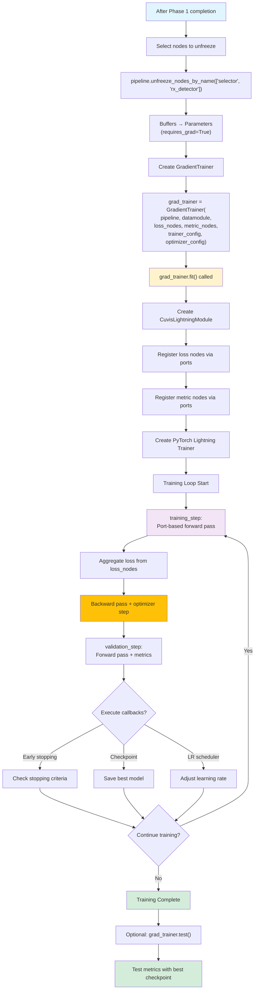

!!! warning "Status: Needs Review"
    This page has not been reviewed for accuracy and completeness. Content may be outdated or contain errors.

---

# Two-Phase Training

*Many pipelines use two phases: statistical initialization from initialization data, then optional gradient training via backpropagation.*

Two-phase training combines statistical methods and deep learning. **Phase 1** computes statistics fast and deterministically. **Phase 2** refines parameters via gradients for task-specific optimization.

**Phase 1 Benefits:**
* ⚡ Fast (seconds to minutes)
* 💾 Memory efficient
* 🎯 Strong initialization for Phase 2
* 🔒 Deterministic and reproducible

**Phase 2 Benefits:**
* 📈 Learns task-specific features
* 🎨 Flexible optimization objectives
* 🔬 Fine-grained parameter refinement

---

## Phase 1: Statistical Initialization

*Compute statistics from initialization data without gradients using [Welford's algorithm](https://www.johndcook.com/blog/standard_deviation/).*

### Statistical Training Lifecycle

This flowchart shows the complete Phase 1 training process, from trainer creation through validation:

```mermaid
flowchart TD
    A[Create StatisticalTrainer] --> B["stat_trainer = StatisticalTrainer(pipeline, datamodule)"]
    B --> C["stat_trainer.fit() called"]
    C --> D{Find nodes with<br/>requires_initial_fit?}
    D -->|Yes| E[Sort nodes by<br/>port connections]
    D -->|No| M[Skip Phase 1]
    E --> F[For each statistical node]
    F --> G[Get transformed data<br/>via port routing]
    G --> H["Call node.statistical_initialization(input_stream)"]
    H --> I[Accumulate statistics<br/>using Welford's algorithm]
    I --> J[Store as frozen buffers<br/>register_buffer()]
    J --> K["Call node.prepare_for_gradient_train()"]
    K --> L{More nodes?}
    L -->|Yes| F
    L -->|No| M[Statistical initialization complete]
    M --> N["Optional: stat_trainer.validate()"]
    N --> O[Validation metrics]

    style A fill:#e1f5ff
    style C fill:#fff3cd
    style H fill:#f3e5f5
    style M fill:#d4edda
    style O fill:#d4edda
```

**Key Steps:**

1. **Trainer Creation:** Instantiate `StatisticalTrainer` with pipeline and datamodule
2. **fit() Execution:** Calls the statistical initialization process
3. **Node Discovery:** Finds all nodes with `requires_initial_fit=True`
4. **Topological Ordering:** Sorts nodes by port connections for proper data flow
5. **Per-Node Initialization:**
   - Routes data through preceding nodes via port connections
   - Calls `statistical_initialization()` with data stream
   - Accumulates statistics using Welford's online algorithm
   - Stores statistics as PyTorch buffers (frozen, non-trainable)
   - Prepares node for potential gradient training phase
6. **Validation (Optional):** Test initialized pipeline on validation set

### Loading Initialization Data

```python
from cuvis_ai.data.datamodule import SingleCu3sDataModule

datamodule = SingleCu3sDataModule(
    cu3s_file_path="data/initialization/samples.cu3s",
    annotation_json_path="data/initialization/annotations.json",
    train_ids=[0, 1, 2],  # Use for initialization
    val_ids=[3],
    test_ids=[4],
    batch_size=4
)

datamodule.setup(stage="fit")
```

### Computing Statistics

```python
from cuvis_ai.trainer.statistical_trainer import StatisticalTrainer

stat_trainer = StatisticalTrainer(pipeline=pipeline, datamodule=datamodule)
stat_trainer.fit()  # Process all batches

# Nodes now initialized
assert pipeline.nodes["rx_detector"]._statistically_initialized
```

**What happens during fit():**
1. Iterate through training batches
2. For each node with `requires_initial_fit=True`:
   - Pass data through preceding nodes
   - Call `node.statistical_initialization(input_stream)`
   - Accumulate statistics (mean, covariance, etc.)
3. Store statistics as frozen buffers
4. Mark node as initialized

### Statistical Nodes

#### RXGlobal (Anomaly Detection)

```python
from cuvis_ai.anomaly.rx_detector import RXGlobal

from cuvis_ai_core.training import StatisticalTrainer

rx_node = RXGlobal(num_channels=61, eps=1e-6)
pipeline.add_node(rx_node)

# Use StatisticalTrainer to initialize
trainer = StatisticalTrainer(pipeline=pipeline, datamodule=datamodule)
trainer.fit()  # Automatically calls statistical_initialization on rx_node

print(rx_node.mu.shape)      # (61,) - Background mean
print(rx_node.sigma.shape)   # (61, 61) - Covariance matrix
```

**Implementation Pattern:**
```python
def statistical_initialization(self, input_stream: InputStream) -> None:
    """Compute statistics using Welford's algorithm."""
    n = 0
    mean = torch.zeros(self.num_channels, dtype=torch.float64)
    M2 = torch.zeros((self.num_channels, self.num_channels), dtype=torch.float64)

    for batch_data in input_stream:
        data = batch_data["data"]
        flattened = data.flatten(0, 2).double()

        for sample in flattened:
            n += 1
            delta = sample - mean
            mean += delta / n
            delta2 = sample - mean
            M2 += torch.outer(delta, delta2)

    covariance = M2 / (n - 1) if n > 1 else M2
    self.register_buffer("mu", mean.float())
    self.register_buffer("sigma", covariance.float())
    self._statistically_initialized = True
```

#### MinMaxNormalizer

```python
from cuvis_ai.node.normalization import MinMaxNormalizer

from cuvis_ai_core.training import StatisticalTrainer

normalizer = MinMaxNormalizer(eps=1e-6, use_running_stats=True)
pipeline.add_node(normalizer)

# Use StatisticalTrainer to initialize
trainer = StatisticalTrainer(pipeline=pipeline, datamodule=datamodule)
trainer.fit()  # Automatically calls statistical_initialization on normalizer

print(normalizer.running_min)  # Global min values
print(normalizer.running_max)  # Global max values
```

#### SoftChannelSelector

```python
from cuvis_ai.node.selector import SoftChannelSelector

from cuvis_ai_core.training import StatisticalTrainer

selector = SoftChannelSelector(
    n_select=10,
    input_channels=61,
    init_method="variance",
    temperature_init=5.0
)
pipeline.add_node(selector)

# Use StatisticalTrainer to initialize
trainer = StatisticalTrainer(pipeline=pipeline, datamodule=datamodule)
trainer.fit()  # Automatically calls statistical_initialization on selector
```

#### TrainablePCA

```python
from cuvis_ai.node.pca import TrainablePCA

from cuvis_ai_core.training import StatisticalTrainer

pca = TrainablePCA(n_components=10, input_dim=61)
pipeline.add_node(pca)

# Use StatisticalTrainer to initialize
trainer = StatisticalTrainer(pipeline=pipeline, datamodule=datamodule)
trainer.fit()  # Automatically calls statistical_initialization on pca

print(pca.components.shape)      # (10, 61)
print(pca.explained_variance)    # Variance per component
```

### Validation After Phase 1

```python
val_results = stat_trainer.validate()

for metric in val_results["metrics"]:
    print(f"{metric.name}: {metric.value:.4f}")

# Expected: Reasonable performance with just statistics
# Example: IoU > 0.5, F1 > 0.6
```

---

## Phase 2: Gradient Training

*Refine parameters via gradient descent.*

### Gradient Training Lifecycle

This flowchart shows the complete Phase 2 training process, from unfreezing nodes through test evaluation:



**Key Steps:**

1. **Node Unfreezing:** Select which nodes to train via `unfreeze_nodes_by_name()`
2. **Buffer Conversion:** Frozen buffers converted to trainable parameters
3. **Trainer Creation:** Instantiate `GradientTrainer` with:
   - Pipeline and datamodule
   - Loss nodes (compute training objective)
   - Metric nodes (track performance)
   - Training config (epochs, accelerator, callbacks)
   - Optimizer config (learning rate, weight decay)
4. **Lightning Setup:**
   - Create `CuvisLightningModule` wrapper
   - Register loss/metric nodes via port connections
   - Create PyTorch Lightning `Trainer` instance
5. **Training Loop:**
   - **training_step:** Forward pass through pipeline, aggregate losses, backward pass
   - **validation_step:** Forward pass, compute metrics
   - **Callbacks:** Early stopping, checkpointing, learning rate scheduling
6. **Test Evaluation (Optional):** Final evaluation on test set with best checkpoint

### Unfreezing Nodes

```python
# After Phase 1
stat_trainer.fit()

# Select nodes to train
unfreeze_node_names = ["rx_detector", "selector"]
pipeline.unfreeze_nodes_by_name(unfreeze_node_names)

trainable_params = sum(p.numel() for p in pipeline.parameters() if p.requires_grad)
print(f"Trainable parameters: {trainable_params:,}")
```

**What unfreeze() does:**
```python
def unfreeze(self) -> None:
    """Convert buffers to parameters for gradient training."""
    for name, buffer in list(self._buffers.items()):
        if buffer is not None and buffer.numel() > 0:
            param = nn.Parameter(buffer.clone())
            delattr(self, name)
            setattr(self, name, param)
    self.freezed = False
```

### Defining Loss Nodes

```python
from cuvis_ai.node.losses import AnomalyBCEWithLogits

bce_loss = AnomalyBCEWithLogits(name="bce", weight=10.0)

pipeline.connect(
    (logit_head.logits, bce_loss.predictions),
    (data_node.mask, bce_loss.targets)
)
```

### Gradient Training

```python
from cuvis_ai.trainer.gradient_trainer import GradientTrainer
from cuvis_ai.config.trainrun import TrainingConfig, OptimizerConfig, SchedulerConfig

training_config = TrainingConfig(
    seed=42,
    optimizer=OptimizerConfig(
        name="adamw",
        lr=0.001,
        weight_decay=1e-4
    ),
    scheduler=SchedulerConfig(
        name="reduce_on_plateau",
        monitor="metrics_anomaly/iou",
        mode="max",
        factor=0.5,
        patience=5
    ),
    trainer=TrainerConfig(
        max_epochs=50,
        accelerator="auto"
    )
)

grad_trainer = GradientTrainer(
    pipeline=pipeline,
    datamodule=datamodule,
    loss_nodes=[bce_loss],
    metric_nodes=[metrics_node],
    trainer_config=training_config.trainer,
    optimizer_config=training_config.optimizer,
    scheduler_config=training_config.scheduler
)

grad_trainer.fit()
test_results = grad_trainer.test()
```

---

## Callbacks

*Hooks into training loop for monitoring, checkpointing, and early stopping.*

### ModelCheckpoint

Automatically save best models:

```python
from cuvis_ai.config.trainrun import CallbacksConfig, ModelCheckpointConfig

callbacks_config = CallbacksConfig(
    checkpoint=ModelCheckpointConfig(
        monitor="metrics_anomaly/iou",
        mode="max",
        save_top_k=3,
        filename="best-{epoch:02d}-{val_iou:.3f}",
        dirpath="outputs/checkpoints"
    )
)
```

### EarlyStopping

Stop when metric stops improving:

```python
from cuvis_ai.config.trainrun import EarlyStoppingConfig

callbacks_config = CallbacksConfig(
    early_stopping=[
        EarlyStoppingConfig(
            monitor="val/bce",
            mode="min",
            patience=10,
            min_delta=0.001
        )
    ]
)
```

### Complete Callback Config

```python
training_config = TrainingConfig(
    trainer=TrainerConfig(
        max_epochs=50,
        accelerator="auto",
        callbacks=CallbacksConfig(
            checkpoint=ModelCheckpointConfig(
                monitor="metrics_anomaly/iou",
                mode="max",
                save_top_k=3
            ),
            early_stopping=[
                EarlyStoppingConfig(
                    monitor="val/bce",
                    mode="min",
                    patience=10,
                    min_delta=0.001
                )
            ],
            lr_monitor=LearningRateMonitorConfig(logging_interval="epoch")
        )
    )
)
```

---

## Complete Two-Phase Example

```python
from cuvis_ai.pipeline.pipeline import CuvisPipeline
from cuvis_ai.node.data import LentilsAnomalyDataNode
from cuvis_ai.node.normalization import MinMaxNormalizer
from cuvis_ai.node.selector import SoftChannelSelector
from cuvis_ai.anomaly.rx_detector import RXGlobal
from cuvis_ai.node.losses import AnomalyBCEWithLogits
from cuvis_ai.node.metrics import AnomalyDetectionMetrics
from cuvis_ai.trainer.statistical_trainer import StatisticalTrainer
from cuvis_ai.trainer.gradient_trainer import GradientTrainer

# ============ SETUP ============

pipeline = CuvisPipeline("Channel_Selector")

data_node = LentilsAnomalyDataNode(normal_class_ids=[0, 1])
normalizer = MinMaxNormalizer(eps=1e-6, use_running_stats=True)
selector = SoftChannelSelector(n_select=10, input_channels=61, init_method="variance")
rx_node = RXGlobal(num_channels=10, eps=1e-6)
logit_head = ScoreToLogit(init_scale=1.0, init_bias=0.0)
decider = BinaryDecider(threshold=0.5)

bce_loss = AnomalyBCEWithLogits(name="bce", weight=10.0)
metrics_node = AnomalyDetectionMetrics(name="metrics_anomaly")

pipeline.connect(
    (data_node.cube, normalizer.data),
    (normalizer.normalized, selector.data),
    (selector.selected, rx_node.data),
    (rx_node.scores, logit_head.scores),
    (logit_head.logits, bce_loss.predictions),
    (data_node.mask, bce_loss.targets),
    (logit_head.logits, decider.logits),
    (decider.decisions, metrics_node.decisions),
    (data_node.mask, metrics_node.targets)
)

datamodule = SingleCu3sDataModule(
    cu3s_file_path="data/Lentils/Lentils_000.cu3s",
    annotation_json_path="data/Lentils/Lentils_000.json",
    train_ids=[0, 2, 3],
    val_ids=[1],
    test_ids=[1, 5],
    batch_size=2
)

# ============ PHASE 1: STATISTICAL INITIALIZATION ============

print("Phase 1: Statistical initialization...")
stat_trainer = StatisticalTrainer(pipeline=pipeline, datamodule=datamodule)
stat_trainer.fit()

print("✓ Statistical initialization complete")
val_results = stat_trainer.validate()
print(f"  Validation IoU: {val_results['metrics_anomaly/iou']:.3f}")

# ============ PHASE 2: GRADIENT TRAINING ============

print("\nPhase 2: Gradient training...")
unfreeze_nodes = [selector.name, rx_node.name, logit_head.name]
pipeline.unfreeze_nodes_by_name(unfreeze_nodes)

trainable_params = sum(p.numel() for p in pipeline.parameters() if p.requires_grad)
print(f"✓ Unfrozen {len(unfreeze_nodes)} nodes ({trainable_params:,} parameters)")

training_config = TrainingConfig(
    seed=42,
    optimizer=OptimizerConfig(name="adamw", lr=0.001),
    scheduler=SchedulerConfig(name="reduce_on_plateau", monitor="metrics_anomaly/iou", mode="max"),
    trainer=TrainerConfig(max_epochs=20, accelerator="auto")
)

grad_trainer = GradientTrainer(
    pipeline=pipeline,
    datamodule=datamodule,
    loss_nodes=[bce_loss],
    metric_nodes=[metrics_node],
    trainer_config=training_config.trainer,
    optimizer_config=training_config.optimizer,
    scheduler_config=training_config.scheduler
)

grad_trainer.fit()
test_results = grad_trainer.test()
print(f"✓ Test IoU: {test_results['metrics_anomaly/iou']:.3f}")

# ============ SAVE ============

from cuvis_ai.pipeline.config import PipelineMetadata

pipeline.save_to_file(
    "outputs/channel_selector.yaml",
    metadata=PipelineMetadata(
        name="Channel_Selector_v1",
        description="RX + learnable channel selection",
        tags=["two-phase", "gradient-trained", "production"]
    )
)

print("✓ Saved to outputs/channel_selector.yaml")
```

---

## Saving & Loading

### Option 1: Save Full Pipeline

```python
pipeline.save_to_file(
    "outputs/trained_pipeline.yaml",
    metadata=PipelineMetadata(name="Full_Pipeline")
)
# Generates: outputs/trained_pipeline.yaml, outputs/trained_pipeline.pt
```

### Option 2: Save Initialization State

```python
initialization_state = {
    "rx_mean": pipeline.nodes["rx_detector"].mu.clone(),
    "rx_cov": pipeline.nodes["rx_detector"].sigma.clone(),
    "normalizer_min": pipeline.nodes["normalizer"].running_min.clone(),
    "normalizer_max": pipeline.nodes["normalizer"].running_max.clone(),
}
torch.save(initialization_state, "outputs/initialization.pt")
```

### Load Complete Pipeline

```python
pipeline = CuvisPipeline.load_from_file(
    config_path="outputs/trained_pipeline.yaml",
    weights_path="outputs/trained_pipeline.pt",
    device="cuda"
)

outputs = pipeline.forward(batch=test_data)
```

### Load with Separate Initialization

```python
init_state = torch.load("outputs/initialization.pt")

pipeline = build_pipeline()
pipeline.nodes["rx_detector"].mu = init_state["rx_mean"]
pipeline.nodes["rx_detector"].sigma = init_state["rx_cov"]
pipeline.nodes["rx_detector"]._statistically_initialized = True
```

---

## Best Practices

1. **Separate Initialization Data**

   Use "normal" samples for initialization, diverse data for training:
   ```python
   initialization_ids = [0, 1, 2]      # Clean, representative
   training_ids = [0, 1, 2, 3, 4, 5]  # Includes anomalies
   ```

2. **Validate Initialization Quality**

   ```python
   def validate_initialization(rx_node, validation_data):
       with torch.no_grad():
           scores = []
           for batch in validation_data:
               outputs = rx_node.forward(data=batch["data"])
               scores.append(outputs["scores"])

           all_scores = torch.cat(scores)
           mean_score = all_scores.mean().item()

           if mean_score > 1.0:
               print("⚠️ Warning: High mean score indicates poor initialization")
   ```

3. **Detect Data Drift**

   ```python
   def needs_reinitialization(node, new_data_stats, threshold=0.1):
       if not node._statistically_initialized:
           return True

       mean_drift = torch.abs(node.mu - new_data_stats["mean"]).mean()
       drift_ratio = mean_drift / torch.abs(node.mu).mean()

       return drift_ratio > threshold
   ```

4. **Version Initialization**

   ```python
   initialization_meta = {
       "version": "1.0",
       "date": "2026-01-29",
       "source": "data/initialization_v1/",
       "n_samples": len(initialization_data),
   }
   torch.save(initialization_meta, "outputs/initialization_v1_meta.pt")
   ```

---

## Troubleshooting

### "Node not initialized"

**Solution:** Use `StatisticalTrainer` for Phase 1 before Phase 2

```python
from cuvis_ai_core.training import StatisticalTrainer

stat_trainer = StatisticalTrainer(pipeline=pipeline, datamodule=datamodule)
stat_trainer.fit()  # Phase 1

grad_trainer.fit()  # Phase 2
```

### Poor Detection Performance

**Causes:** Bad initialization data, small sample size, contaminated data

**Solution:**
```python
print(f"Calibration samples: {len(calib_data)}")
print(f"Data range: [{calib_data.min():.2f}, {calib_data.max():.2f}]")

# Check for outliers
percentiles = torch.quantile(calib_data, torch.tensor([0.01, 0.99]))

# Clean or increase data
clean_data = remove_outliers(calib_data)
```

### Gradient Training Degrades Performance

**Solution:**
```python
# 1. Reduce learning rate
optimizer_config = OptimizerConfig(lr=0.0001)

# 2. Freeze some nodes
unfreeze_nodes = ["selector"]

# 3. Use early stopping
early_stopping = EarlyStoppingConfig(
    monitor="val/metrics_anomaly/iou",
    mode="max",
    patience=5
)
```

### Calibration Takes Too Long

**Solution:**
```python
# Option 1: Sample data
if len(calib_data) > 10000:
    indices = torch.randperm(len(calib_data))[:10000]
    calib_data = calib_data[indices]

# Option 2: Larger batch size
datamodule = SingleCu3sDataModule(..., batch_size=32)

# Option 3: Use GPU
pipeline = pipeline.to("cuda")
```

---

## Related Documentation

* → [Pipeline Lifecycle](pipeline-lifecycle.md) - Complete pipeline workflow
* → [Node System Deep Dive](node-system-deep-dive.md) - Statistical nodes
* → [Execution Stages](execution-stages.md) - Training vs inference
* → [RX Tutorial](../tutorials/rx-statistical.md) - Statistical training example
* → [Channel Selector Tutorial](../tutorials/channel-selector.md) - Two-phase workflow
