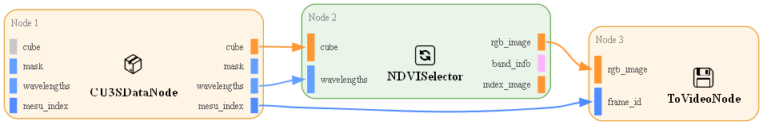

# Your First Pipeline

A five-minute end-to-end run: load a hyperspectral hand recording, compute a
per-frame NDVI projection that highlights blood perfusion, and render the
result as MP4. No Python required — the entire flow uses the
`restore-pipeline` CLI against a pre-authored YAML.

NDVI was first developed to map chlorophyll in satellite imagery, but
hemoglobin has a similar spectral footprint: it absorbs visible light strongly
(~566 nm) and transmits near-infrared (~750 nm). The same normalized-difference
formula doubles as a qualitative perfusion index:

$$\mathrm{NDVI}(x, y) = \frac{R_{\mathrm{NIR}}(x, y) - R_{\mathrm{Red}}(x, y)}{R_{\mathrm{NIR}}(x, y) + R_{\mathrm{Red}}(x, y)}$$

If you have not installed cuvis-ai yet, follow the
[Installation Guide](installation.md) first.

## 1. Get sample data

The XMR_Demo_Blood_Perfusion dataset (~11 GB) is a 568-frame hyperspectral
recording of a human hand:

```bash
uv run download-data --dataset blood_perfusion
```

This drops `.cu3s` files under `data/XMR_Demo_Blood_Perfusion/`. Other demo
datasets live in the [datasets catalog](../catalogs/datasets/index.md).

## 2. Inspect the pipeline you're about to run

The pre-authored NDVI blood-perfusion pipeline lives at
`cuvis_ai/configs/pipeline/medical/blood_perfusion/ndvi.yaml`. It is a three-node
graph that loads each cube, computes NDVI at 750 nm vs 566 nm, and writes
the colormapped frames to an MP4:



View the node graph and port wiring from the CLI:

```bash
uv run restore-pipeline --pipeline-path cuvis_ai/configs/pipeline/medical/blood_perfusion/ndvi.yaml
```

## 3. Run inference

Point the pipeline at any `.cu3s` file from the dataset — `Auto_005.cu3s` is a
good first run:

```bash
uv run restore-pipeline \
  --pipeline-path cuvis_ai/configs/pipeline/medical/blood_perfusion/ndvi.yaml \
  --cu3s-file-path data/XMR_Demo_Blood_Perfusion/Auto_005.cu3s
```

A few minutes later you have `output/blood_perfusion/ndvi_projection.mp4` —
the colormapped NDVI video at 15 fps:

<video controls muted loop playsinline width="100%" preload="metadata">
  <source src="../img/ndvi-projection.mp4" type="video/mp4">
  Your browser does not support embedded video. The clip lives at
  <a href="../img/ndvi-projection.mp4">img/ndvi-projection.mp4</a>.
</video>

## 4. Where to go next

- **[Blood Perfusion Tutorial](../tutorials/statistical/blood-perfusion.md)** — the spectral theory, plus an extension that adds a qualitative SpO₂ proxy.
- **[Notebook walkthrough](https://github.com/cubert-hyperspectral/cuvis-ai/blob/main/notebooks/use_cases/blood_perfusion.ipynb)** — the same pipeline constructed in Python, with custom-node extensions.
- **[Concepts](../concepts/index.md)** — the mental model: nodes, ports, pipelines, training.
- **[Workflows → Build Pipeline (YAML)](../workflows/build-pipeline-yaml.md)** — author a YAML pipeline from scratch.
- **[Workflows → Restore Pipeline](../workflows/restore-pipeline.md)** — full reference for the `restore-pipeline` CLI.
- **[Tutorials](../tutorials/index.md)** — the rest of the gallery: RX Anomaly, Channel Selection, Deep SVDD, AdaCLIP.
