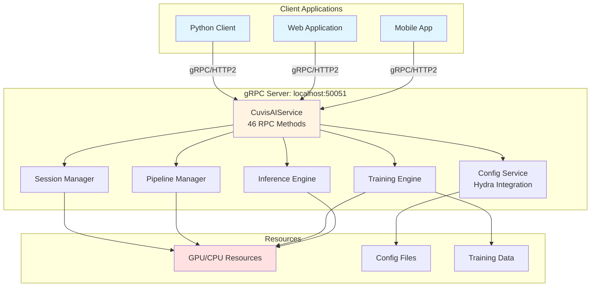
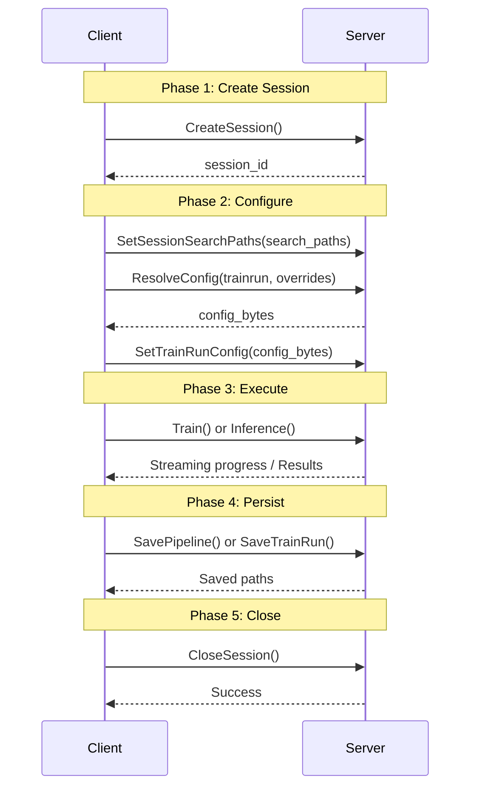

!!! warning "Status: Needs Review"
    This page has not been reviewed for accuracy and completeness. Content may be outdated or contain errors.

---

# gRPC Services Overview

Access CUVIS.AI pipelines remotely using gRPC for distributed training, inference, and production deployment.

---

## Introduction

**gRPC** (Google Remote Procedure Call) is a high-performance RPC framework that enables client-server communication for running CUVIS.AI pipelines on remote hardware. The gRPC service separates training infrastructure from client applications, allowing you to execute workflows from anywhere.

### Why gRPC for ML Pipelines?

gRPC is ideal for hyperspectral imaging ML workflows because it provides:

- **Remote Execution** - Train models on GPU servers from local machines or lightweight clients
- **Scalability** - Deploy pipelines as independent microservices that scale horizontally
- **Streaming** - Real-time progress updates during training without polling
- **Language-Agnostic** - Client libraries available for Python, C++, Java, Go, and more
- **Production-Ready** - Battle-tested technology used by Google, Netflix, Square, and other major companies
- **Efficient** - Protocol Buffers provide compact binary serialization for large hyperspectral cubes

### Use Cases

**Development & Research:**
- Train models on remote GPU servers while developing on local machines
- Share trained pipelines across teams without copying large model files
- Run experiments concurrently with isolated sessions

**Production Deployment:**
- Deploy pipelines as stateless microservices behind load balancers
- Scale inference horizontally across multiple server instances
- Integrate with existing microservice architectures
- Build web applications or mobile clients that access ML models

**Distributed Processing:**
- Process large datasets across multiple machines
- Batch inference on remote hardware
- A/B testing with concurrent sessions

---

## Architecture

The CUVIS.AI gRPC service follows a server-client architecture with session-based isolation.

### Components



**1. CuvisAIService**
- Single unified service with 46 RPC methods
- Handles all client requests via Protocol Buffers
- Listens on port 50051 by default
- Supports concurrent sessions from multiple clients

**2. Session Manager**
- Creates isolated execution contexts (sessions)
- Each session has independent pipeline, data, and training state
- Automatic cleanup after 1 hour of inactivity
- Enables concurrent users without interference

**3. Config Service**
- Integrates with Hydra configuration framework
- Resolves config groups with composition and inheritance
- Supports dynamic overrides at request time
- Validates configurations before application

**4. Pipeline Manager**
- Loads pipelines from YAML configs or Protocol Buffers
- Manages pipeline weights and checkpoints
- Provides introspection (inputs, outputs, visualization)
- Handles save/restore operations

**5. Training Engine**
- Executes statistical and gradient training
- Streams real-time progress updates to clients
- Manages optimizer state and learning rate schedules
- Supports two-phase training patterns

**6. Inference Engine**
- Runs predictions on trained pipelines
- Supports input/output filtering to reduce payload size
- Handles batched inference efficiently
- Manages GPU memory automatically

### RPC Methods (46 Total)

The CuvisAIService provides 46 RPC methods organized into 6 functional areas:

| Category | Methods | Purpose |
|----------|---------|---------|
| **Session Management** | 3 | Create, configure, and close sessions |
| **Configuration** | 4 | Resolve, validate, and apply Hydra configs |
| **Pipeline Management** | 5 | Load, save, and introspect pipelines |
| **Training Operations** | 3 | Execute statistical/gradient training |
| **Inference Operations** | 1 | Run predictions on trained models |
| **Discovery & Introspection** | 6+ | List pipelines, get capabilities, visualize graphs |

For complete method documentation, see the [gRPC API Reference](api-reference.md).

---

## Quick Start

### Step 1: Start the Server

```bash
# Start gRPC server locally (default port: 50051)
uv run python -m cuvis_ai.grpc.production_server
```

**Expected Output:**
```
Starting CUVIS.AI gRPC server on [::]:50051
Server listening...
```

### Step 2: Connect from Python Client

```python
from cuvis_ai_core.grpc import cuvis_ai_pb2, cuvis_ai_pb2_grpc
import grpc

# Connect to server with increased message size for hyperspectral data
options = [
    ("grpc.max_send_message_length", 300 * 1024 * 1024),  # 300 MB
    ("grpc.max_receive_message_length", 300 * 1024 * 1024),
]
channel = grpc.insecure_channel("localhost:50051", options=options)
stub = cuvis_ai_pb2_grpc.CuvisAIServiceStub(channel)

print("Connected to gRPC server")
```

### Step 3: Create Session

```python
# Create isolated session
response = stub.CreateSession(cuvis_ai_pb2.CreateSessionRequest())
session_id = response.session_id
print(f"Session created: {session_id}")
```

### Step 4: Run Simple Inference

```python
from cuvis_ai_core.grpc import helpers
import numpy as np

# Prepare input data
cube = np.random.rand(1, 32, 32, 61).astype(np.float32)
wavelengths = np.linspace(430, 910, 61).reshape(1, -1).astype(np.float32)

# Run inference
response = stub.Inference(
    cuvis_ai_pb2.InferenceRequest(
        session_id=session_id,
        inputs=cuvis_ai_pb2.InputBatch(
            cube=helpers.numpy_to_proto(cube),
            wavelengths=helpers.numpy_to_proto(wavelengths),
        ),
    )
)

# Process outputs
for name, tensor_proto in response.outputs.items():
    output_array = helpers.proto_to_numpy(tensor_proto)
    print(f"{name}: shape={output_array.shape}")
```

### Step 5: Clean Up

```python
# Always close sessions to free resources
stub.CloseSession(cuvis_ai_pb2.CloseSessionRequest(session_id=session_id))
print("Session closed")
```

**Time to Complete:** 5 minutes

---

## Core Concepts

### Sessions: Isolated Execution Contexts

Sessions provide isolated execution environments for each client:

- **Isolation** - Each session has independent pipeline, weights, and training state
- **Concurrency** - Multiple clients can use the server simultaneously
- **Automatic Cleanup** - Sessions expire after 1 hour of inactivity
- **Resource Management** - Closing a session immediately frees GPU memory

**Best Practice:** Always close sessions explicitly using `try`/`finally` blocks or context managers.

```python
try:
    session_id = stub.CreateSession(...).session_id
    # ... use session ...
finally:
    stub.CloseSession(cuvis_ai_pb2.CloseSessionRequest(session_id=session_id))
```

### Configuration Service: Hydra Integration

The gRPC service integrates directly with Hydra for powerful configuration composition:

- **Config Groups** - Organize configs into groups (pipeline, data, training, trainrun)
- **Composition** - Combine multiple configs using Hydra's composition system
- **Dynamic Overrides** - Change parameters at request time without editing files
- **Validation** - Pre-validate configs before applying them

**Example: Dynamic Overrides**
```python
# Resolve config with runtime overrides
response = stub.ResolveConfig(
    cuvis_ai_pb2.ResolveConfigRequest(
        session_id=session_id,
        config_type="trainrun",
        path="trainrun/deep_svdd",
        overrides=[
            "training.trainer.max_epochs=50",
            "training.optimizer.lr=0.001",
            "data.batch_size=8",
        ],
    )
)
```

See [Hydra Composition Patterns](../config/hydra-composition.md) for details.

### Streaming Updates: Real-Time Progress

Training operations use server-side streaming to provide real-time progress updates:

- **No Polling** - Server pushes updates as they occur
- **Fine-Grained** - Epoch, step, loss, and metric updates
- **Efficient** - Minimal overhead compared to REST polling
- **Standard Pattern** - Process stream with for-loop

**Example: Streaming Training Progress**
```python
for progress in stub.Train(
    cuvis_ai_pb2.TrainRequest(
        session_id=session_id,
        trainer_type=cuvis_ai_pb2.TRAINER_TYPE_GRADIENT,
    )
):
    stage = cuvis_ai_pb2.ExecutionStage.Name(progress.context.stage)
    status = cuvis_ai_pb2.TrainStatus.Name(progress.status)
    print(f"[{stage}] {status} | losses={dict(progress.losses)}")
```

---

## 5-Phase Workflow

All gRPC workflows follow a standardized 5-phase pattern:



### Phase 1: Create Session
Initialize an isolated execution context with unique session ID.

### Phase 2: Configure
Register config search paths, resolve configs with Hydra, apply to session.

### Phase 3: Execute
Run training (with streaming progress) or inference (with results).

### Phase 4: Persist
Save trained pipelines, weights, or complete trainrun configurations.

### Phase 5: Close
Release all resources and clean up GPU memory.

**Helper Utilities:**

The `examples/grpc/workflow_utils.py` module provides convenience functions:
- `build_stub()` - Create configured gRPC stub
- `create_session_with_search_paths()` - Combine phases 1-2
- `resolve_trainrun_config()` - Hydra config resolution
- `apply_trainrun_config()` - Apply resolved config
- `format_progress()` - Pretty-print training updates

See [gRPC Client Patterns](client-patterns.md) for complete usage examples.

---

## Message Size Limits

Hyperspectral imaging cubes can be very large (100s of MB). Configure message size limits appropriately:

### Default Limits
- **gRPC Default:** 4 MB (too small for hyperspectral data)
- **CUVIS.AI Default:** 300 MB (suitable for most workflows)
- **Recommended for Large Data:** 600 MB

### Configuration

**Client-Side:**
```python
options = [
    ("grpc.max_send_message_length", 600 * 1024 * 1024),  # 600 MB
    ("grpc.max_receive_message_length", 600 * 1024 * 1024),
]
channel = grpc.insecure_channel("localhost:50051", options=options)
```

**Server-Side:**
```python
server = grpc.server(
    futures.ThreadPoolExecutor(max_workers=10),
    options=[
        ("grpc.max_send_message_length", 600 * 1024 * 1024),
        ("grpc.max_receive_message_length", 600 * 1024 * 1024),
    ],
)
```

**Note:** Both client and server must have matching limits. If you see `RESOURCE_EXHAUSTED` errors, increase these limits.

---

## When to Use gRPC vs Local Execution

### Use gRPC When:

✅ **Remote GPU Access** - Your development machine lacks GPU, but you have access to GPU servers

✅ **Production Deployment** - You're deploying pipelines as microservices behind load balancers

✅ **Distributed Processing** - You're processing large datasets across multiple machines

✅ **Team Collaboration** - Multiple team members need to access shared trained models

✅ **Cross-Language Clients** - You need to call pipelines from non-Python applications (C++, Java, Go)

✅ **Scalability** - You need horizontal scaling with multiple server instances

### Use Local Execution When:

⛔ **Single-Machine Workflows** - Training and inference happen on the same machine

⛔ **Rapid Prototyping** - You're iterating quickly on pipeline designs

⛔ **Debugging** - You need direct access to pipeline internals for debugging

⛔ **Small Datasets** - Data fits in memory and doesn't require distributed processing

⛔ **Offline Environments** - No network connectivity available

### Decision Matrix

| Scenario | Recommended Approach |
|----------|---------------------|
| Local development with GPU | Local execution |
| Local development without GPU | gRPC to remote server |
| Production inference service | gRPC deployment |
| Batch processing large datasets | gRPC with multiple workers |
| Interactive Jupyter notebook | Local execution |
| Web application backend | gRPC microservice |
| Mobile application | gRPC to cloud server |
| Research experiment automation | Local or gRPC (depends on resources) |

---

## Production Deployment

For production deployment, consider:

- **TLS/SSL** - Enable encryption for secure communication
- **Authentication** - Implement token-based auth or mTLS
- **Load Balancing** - Deploy multiple servers behind a load balancer
- **Monitoring** - Integrate Prometheus metrics and health checks
- **Resource Limits** - Configure appropriate message sizes and timeouts
- **Docker/Kubernetes** - Containerize for easy deployment and scaling

See the [Deployment Guide](../deployment/grpc_deployment.md) for complete instructions.

---

## See Also

### gRPC Documentation
- [gRPC API Reference](api-reference.md) - Complete documentation of all 46 RPC methods
- [Client Patterns](client-patterns.md) - Common usage patterns and best practices
- [Sequence Diagrams](sequence-diagrams.md) - Visual workflows for all major operations

### Tutorials & How-To Guides
- [gRPC Workflow Tutorial](../tutorials/grpc-workflow.md) - Hands-on tutorial with complete examples
- [Remote gRPC Access](../how-to/remote-grpc.md) - Detailed how-to guide with 5 client examples

### Configuration
- [TrainRun Schema](../config/trainrun-schema.md) - Complete trainrun configuration reference
- [Hydra Composition](../config/hydra-composition.md) - Config composition patterns and overrides

### Deployment
- [Deployment Guide](../deployment/grpc_deployment.md) - Docker, Kubernetes, and production patterns
