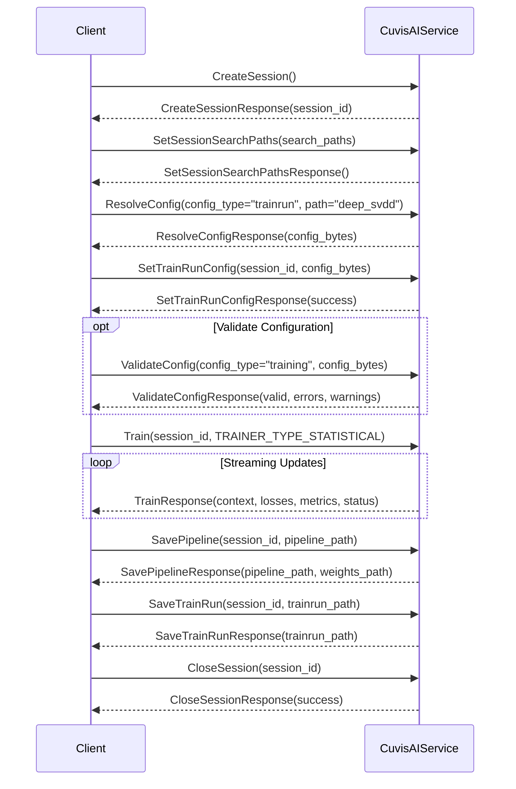
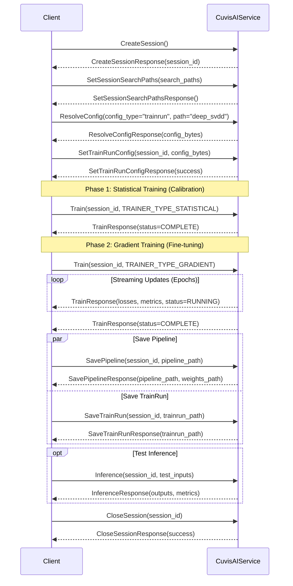
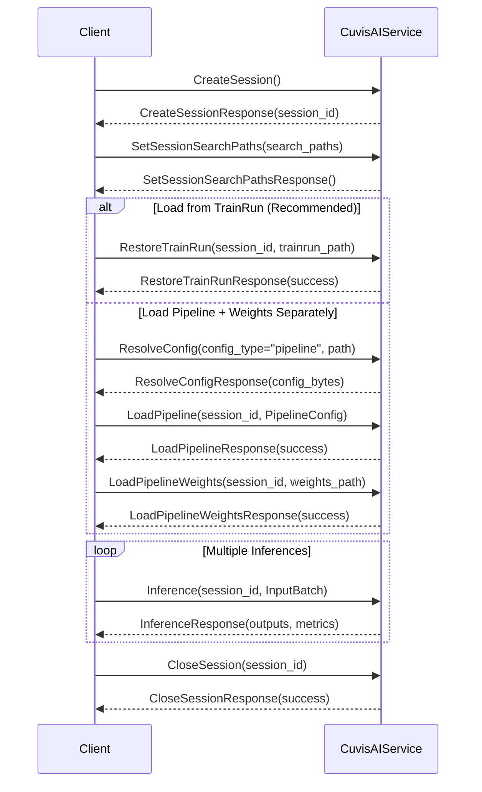
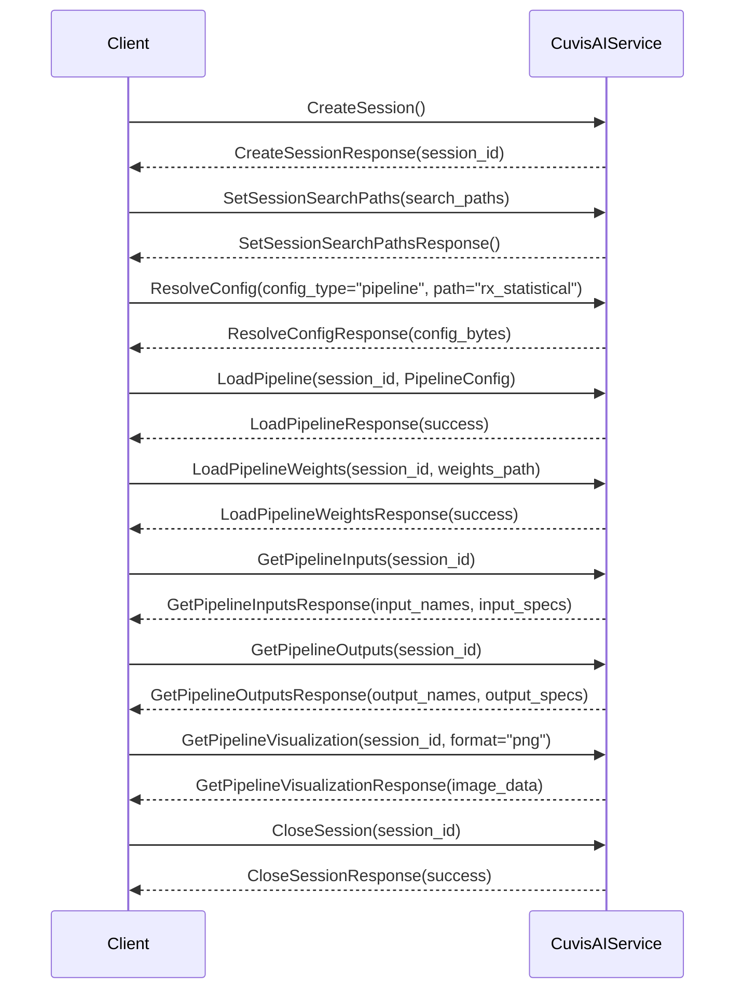
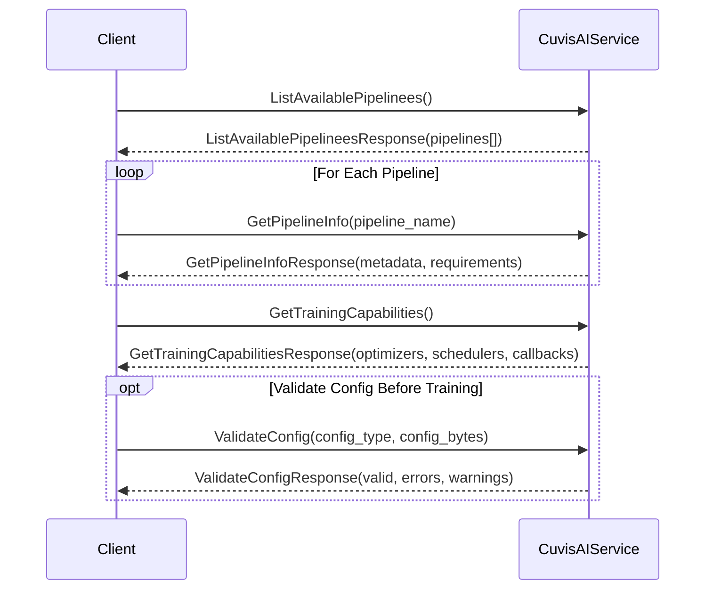
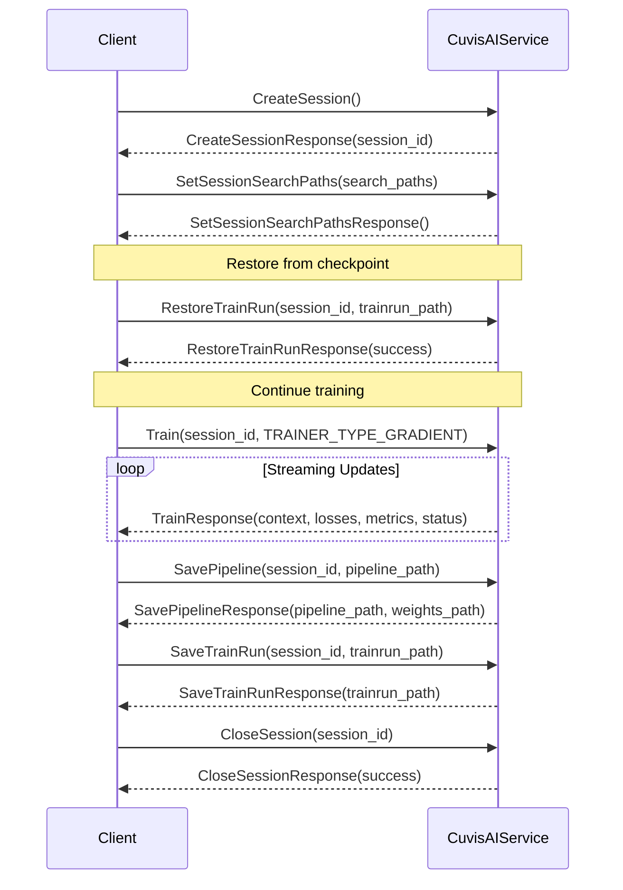
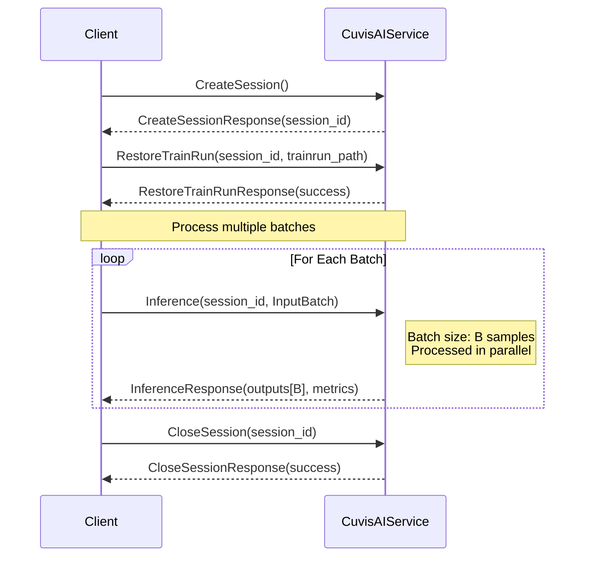

!!! warning "Status: Needs Review"
    This page has not been reviewed for accuracy and completeness. Content may be outdated or contain errors.

---

# gRPC Sequence Diagrams

This document provides visual sequence diagrams for all major cuvis-ai gRPC workflows. All diagrams are verified against the actual Protocol Buffer definitions and production client examples.

---

## Overview

The cuvis-ai gRPC service (`CuvisAIService`) provides 46 RPC methods organized into several functional areas:

- **Session Management**: Create, configure, and close sessions
- **Configuration**: Resolve, validate, and apply Hydra configs
- **Training**: Statistical and gradient training with streaming progress
- **Pipeline Management**: Load, save, and introspect pipelines
- **Inference**: Run predictions on trained pipelines
- **Discovery**: List available pipelines and capabilities

---

## 1. Complete Training Workflow

This diagram shows the full end-to-end training workflow including config resolution, two-phase training, and saving artifacts.



**Key Steps:**

1. **CreateSession**: Establish a server-side session context
2. **SetSessionSearchPaths**: Register Hydra config search paths
3. **ResolveConfig**: Resolve trainrun config with Hydra composition and overrides
4. **SetTrainRunConfig**: Apply resolved config (builds pipeline, sets data/training configs)
5. **ValidateConfig** (optional): Pre-validate training configuration
6. **Train**: Execute training with streaming progress updates
7. **SavePipeline**: Save trained pipeline YAML + weights (.pt file)
8. **SaveTrainRun**: Save composed trainrun config for reproducibility
9. **CloseSession**: Clean up session resources

**Example Client:**
- [examples/grpc/complete_workflow_client.py](../../examples/grpc/complete_workflow_client.py)

---

## 2. Two-Phase Training Workflow

Demonstrates the two-phase training pattern used by statistical anomaly detectors (Phase 1: initialization, Phase 2: fine-tuning).



**Training Phases:**

- **TRAINER_TYPE_STATISTICAL**: Single-pass initialization (computes mean, covariance, centers, etc.)
  - No streaming updates (completes immediately)
  - Initializes statistical nodes with background statistics

- **TRAINER_TYPE_GRADIENT**: Multi-epoch gradient-based training
  - Streams progress updates for each epoch
  - Reports losses, metrics, and training context

**Example Clients:**
- [examples/grpc/statistical_training_client.py](../../examples/grpc/statistical_training_client.py)
- [examples/grpc/gradient_training_client.py](../../examples/grpc/gradient_training_client.py)
- [examples/grpc/deepsvdd_client.py](../../examples/grpc/deepsvdd_client.py)

---

## 3. Inference Workflow

Shows how to load a trained pipeline and run inference. Supports two loading patterns: TrainRun restoration or manual pipeline loading.



**Loading Options:**

1. **RestoreTrainRun** (Recommended):
   - Loads pipeline config, weights, data config, and training config from saved TrainRun
   - Single call, ensures exact reproducibility
   - Example: [examples/grpc/restore_trainrun_grpc.py](../../examples/grpc/restore_trainrun_grpc.py)

2. **Manual Loading**:
   - Step 1: `ResolveConfig` or provide raw pipeline config
   - Step 2: `LoadPipeline` builds the pipeline graph
   - Step 3: `LoadPipelineWeights` loads trained weights
   - Example: [examples/grpc/inference_with_pretrained_client.py](../../examples/grpc/inference_with_pretrained_client.py)

**InputBatch Fields:**
```python
inputs=cuvis_ai_pb2.InputBatch(
    cube=...,              # Hyperspectral cube (B, H, W, C)
    wavelengths=...,       # Wavelength array (B, C)
    mask=...,              # Optional ground truth mask
    bboxes=...,            # Optional bounding boxes
    points=...,            # Optional point prompts
    text_prompt=...,       # Optional text prompt
    extra_inputs={}        # Optional custom inputs
)
```

---

## 4. Pipeline Introspection

Inspect pipeline structure, inputs, outputs, and visualize the computation graph.



**Introspection Methods:**

- **GetPipelineInputs**: Returns list of input port names and their specifications (shape, dtype, required flag)
- **GetPipelineOutputs**: Returns list of output port names and their specifications
- **GetPipelineVisualization**: Generates pipeline graph visualization (PNG or SVG format)

**TensorSpec Format:**
```python
spec = TensorSpec(
    name="cube",
    shape=[1, -1, -1, 61],  # -1 indicates dynamic dimension
    dtype=DType.FLOAT32,
    required=True
)
```

**Example Client:**
- [examples/grpc/introspection_client.py](../../examples/grpc/introspection_client.py)

---

## 5. Pipeline Discovery & Capabilities

Discover available pipelines and query training capabilities before creating a session.



**Discovery Methods:**

1. **ListAvailablePipelinees**: Returns list of all registered pipeline types
2. **GetPipelineInfo**: Returns metadata, description, and requirements for a specific pipeline
3. **GetTrainingCapabilities**: Returns supported optimizers, schedulers, and callbacks with parameter schemas
4. **ValidateConfig**: Pre-validates configuration before applying to session

**Capabilities Response Example:**
```python
GetTrainingCapabilitiesResponse(
    supported_optimizers=["Adam", "SGD", "AdamW"],
    supported_schedulers=["CosineAnnealingLR", "StepLR", "ReduceLROnPlateau"],
    supported_callbacks=[
        CallbackInfo(
            type="EarlyStopping",
            description="Stop training when metric stops improving",
            parameters=[
                ParameterInfo(name="patience", type="int", required=True),
                ParameterInfo(name="min_delta", type="float", required=False, default_value="0.0")
            ]
        )
    ]
)
```

**Example Clients:**
- [examples/grpc/pipeline_discovery_client.py](../../examples/grpc/pipeline_discovery_client.py)
- [examples/grpc/capabilities_client.py](../../examples/grpc/capabilities_client.py)

---

## 6. Resume Training from Checkpoint

Resume training from a previously saved TrainRun checkpoint.



**Resume Training Notes:**

- `RestoreTrainRun` loads:
  - Pipeline configuration and weights
  - Data configuration (datasets, dataloaders)
  - Training configuration (optimizer state, scheduler state, epoch counter)

- Training resumes from the saved epoch count
- Optimizer and scheduler states are preserved

**Example Client:**
- [examples/grpc/resume_training_client.py](../../examples/grpc/resume_training_client.py)

---

## 7. Batch Inference Pattern

Efficient batch processing for multiple samples.



**Batch Processing Tips:**

- Use appropriate batch size based on GPU memory (typically 4-32)
- InputBatch supports batched inputs: `cube.shape = (B, H, W, C)`
- All outputs are returned in batched format
- Server processes batch in parallel when possible

**Example Client:**
- [examples/grpc/run_inference.py](../../examples/grpc/run_inference.py)

---

## Common Patterns

### Error Handling

All RPC methods can raise gRPC exceptions. Handle them appropriately:

```python
import grpc

try:
    response = stub.Train(request)
except grpc.RpcError as e:
    if e.code() == grpc.StatusCode.INVALID_ARGUMENT:
        print(f"Invalid configuration: {e.details()}")
    elif e.code() == grpc.StatusCode.NOT_FOUND:
        print(f"Session not found: {e.details()}")
    elif e.code() == grpc.StatusCode.INTERNAL:
        print(f"Server error: {e.details()}")
    else:
        raise
```

### Streaming Progress Updates

The `Train` RPC uses server streaming to provide real-time progress:

```python
for progress in stub.Train(request):
    print(f"Epoch {progress.context.epoch}, "
          f"Step {progress.context.global_step}, "
          f"Loss: {progress.losses.get('total_loss', 0.0):.4f}")

    if progress.status == cuvis_ai_pb2.TRAIN_STATUS_ERROR:
        print(f"Training failed: {progress.message}")
        break
```

### Session Lifecycle Best Practices

1. **Always close sessions**: Use try/finally or context managers
2. **Set search paths early**: Call `SetSessionSearchPaths` immediately after `CreateSession`
3. **Validate configs**: Use `ValidateConfig` before applying to catch errors early
4. **Save checkpoints**: Periodically save TrainRuns during long training runs

---

## See Also

### gRPC Documentation
- [gRPC Overview](overview.md) - Architecture, quick start, and core concepts
- [API Reference](api-reference.md) - Complete RPC method documentation
- [Client Patterns](client-patterns.md) - Common usage patterns and best practices

### Tutorials & Guides
- [gRPC Tutorial](../tutorials/grpc-workflow.md) - End-to-end hands-on tutorial
- [How-To: Remote gRPC Access](../how-to/remote-grpc.md) - Detailed deployment guide
- [gRPC Client Examples](../../examples/grpc/) - All example clients

---

## Verification Status

✅ **All diagrams verified against:**
- Protocol Buffer definitions in `cuvis_ai_core.proto`
- Production client examples in `examples/grpc/`
- 46 RPC methods in `CuvisAIService`

**Last Updated:** 2026-02-04
