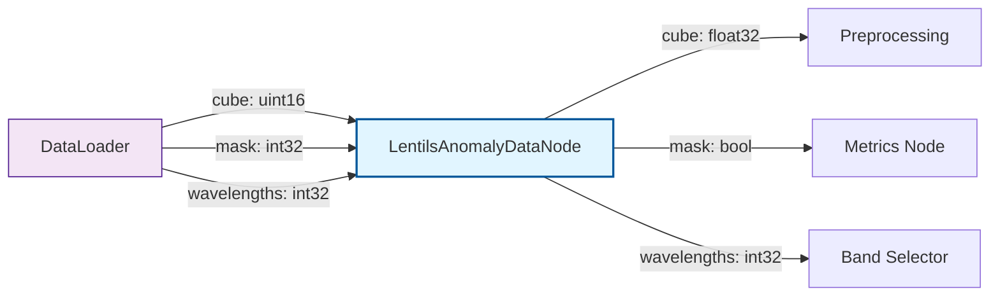

!!! warning "Status: Needs Review"
    This page has not been reviewed for accuracy and completeness. Content may be outdated or contain errors.

---

# Data Nodes

## Overview

Data nodes serve as the entry point for hyperspectral datasets into CUVIS.AI pipelines. They handle the crucial tasks of loading raw measurements, converting data types for processing, and transforming multi-class segmentation masks into binary anomaly labels suitable for anomaly detection workflows.

**When to use Data Nodes:**

- At the very beginning of your pipeline as the first node
- When loading hyperspectral cubes from datasets (CU3S files, numpy arrays, etc.)
- When you need to convert multi-class segmentation masks to binary anomaly labels
- For standardizing data formats before preprocessing and model training

Data nodes perform three critical transformations:

1. **Type conversion**: Convert raw `uint16` hyperspectral data to `float32` for numerical stability
2. **Label mapping**: Transform multi-class segmentation masks into binary anomaly targets
3. **Wavelength normalization**: Flatten batch-wise wavelength tensors to a single wavelength array

## Nodes in This Category

### LentilsAnomalyDataNode

**Description:** Loads hyperspectral data and converts multi-class segmentation masks to binary anomaly labels

**Perfect for:**

- Loading hyperspectral cubes with semantic segmentation masks
- Defining normal vs anomalous classes for anomaly detection tasks
- Preprocessing Lentils dataset or similar HSI datasets with class labels
- Converting uint16 raw measurements to float32 for downstream processing
- Standardizing wavelength information across batches

**Training Paradigm:** None (data loading and transformation only)

#### Port Specifications

**Input Ports:**

| Port | Type | Shape | Description | Optional |
|------|------|-------|-------------|----------|
| cube | uint16 | (B, H, W, C) | Raw hyperspectral cube [Batch, Height, Width, Channels] | No |
| mask | int32 | (B, H, W) | Multi-class segmentation mask with class IDs | Yes |
| wavelengths | int32 | (B, C) | Wavelength values (nm) for each spectral channel | No |

**Output Ports:**

| Port | Type | Shape | Description |
|------|------|-------|-------------|
| cube | float32 | (B, H, W, C) | Type-converted hyperspectral cube |
| mask | bool | (B, H, W, 1) | Binary anomaly mask (0=normal, 1=anomaly) |
| wavelengths | int32 | (C,) | Flattened wavelength array (assumes consistent across batch) |

#### Parameters

| Parameter | Type | Default | Description |
|-----------|------|---------|-------------|
| normal_class_ids | list[int] | Required | List of class IDs to be considered "normal" (non-anomalous) |
| anomaly_class_ids | list[int] \| None | None | Explicit anomaly class IDs. If None, all IDs not in `normal_class_ids` are treated as anomalies |

#### Label Mapping Logic

The node uses [BinaryAnomalyLabelMapper](utility.md#binaryanomalylabelmapper) internally to convert multi-class masks:

**Mode 1: Implicit Anomalies** (`anomaly_class_ids=None`)

- Classes in `normal_class_ids` → 0 (normal)
- All other classes → 1 (anomaly)

**Mode 2: Explicit Anomalies** (`anomaly_class_ids` provided)

- Classes in `normal_class_ids` → 0 (normal)
- Classes in `anomaly_class_ids` → 1 (anomaly)
- All other classes → 0 (normal, by default)

**Validation:**

- No overlap allowed between `normal_class_ids` and `anomaly_class_ids` (raises `ValueError`)
- Gaps in class ID coverage trigger a warning and are treated as normal classes

#### Example Usage (Python)

**Scenario 1: Implicit anomaly definition** (common for binary tasks)

```python
from cuvis_ai.node.data import LentilsAnomalyDataNode
from cuvis_ai_core.pipeline import Pipeline

# Define background (class 0) and lentils (class 2) as normal
# Everything else (e.g., class 1 = anomalies) becomes anomaly automatically
data_node = LentilsAnomalyDataNode(
    normal_class_ids=[0, 2],  # Background and lentils
    anomaly_class_ids=None,   # Implicit: class 1 becomes anomaly
)

# Add to pipeline as entry point
pipeline = Pipeline()
pipeline.add_node("data", data_node)
```

**Scenario 2: Explicit anomaly definition** (for multi-class datasets)

```python
# Explicitly define which classes are anomalies
data_node = LentilsAnomalyDataNode(
    normal_class_ids=[0, 2, 3],     # Background, lentils, stems
    anomaly_class_ids=[1, 4, 5],    # Diseased, broken, foreign objects
)

# Any class IDs not listed (e.g., 6, 7) default to normal
```

**Scenario 3: Integration with dataloader**

```python
from cuvis_ai.data.datasets import LentilsAnomalyDataset
from torch.utils.data import DataLoader

# Create dataset (provides cube, mask, wavelengths)
dataset = LentilsAnomalyDataset(
    root_dir="data/lentils",
    processing_mode="Reflectance",
)

dataloader = DataLoader(dataset, batch_size=4, shuffle=True)

# Data node processes batches from dataloader
for batch in dataloader:
    outputs = data_node.forward(
        cube=batch["cube"],           # uint16 [4, 256, 256, 61]
        mask=batch["mask"],           # int32 [4, 256, 256]
        wavelengths=batch["wavelengths"],  # int32 [4, 61]
    )
    # outputs["cube"]: float32 [4, 256, 256, 61]
    # outputs["mask"]: bool [4, 256, 256, 1]
    # outputs["wavelengths"]: int32 [61]
```

#### Example Configuration (YAML)

```yaml
nodes:
  data:
    type: LentilsAnomalyDataNode
    config:
      normal_class_ids: [0, 2]      # Background and lentils
      anomaly_class_ids: null       # Everything else is anomaly

  # Connect to preprocessing
  normalizer:
    type: MinMaxNormalizer
    config:
      epsilon: 1e-6

connections:
  - [data.cube, normalizer.data]
  - [data.mask, metrics.targets]  # Binary mask to metrics node
  - [data.wavelengths, band_selector.wavelengths]
```

#### Workflow Integration



**Typical Pipeline Position:**

```
DataLoader → [LentilsAnomalyDataNode] → MinMaxNormalizer → BandpassByWavelength → ...
```

#### Common Issues and Solutions

**Issue 1: Inconsistent wavelengths across batch**

```python
# Problem: Each sample has different wavelengths
batch["wavelengths"].shape  # [4, 61] with different values per sample

# Solution: LentilsAnomalyDataNode assumes consistent wavelengths
# and extracts only the first sample's wavelengths
# Ensure your dataset provides consistent wavelengths across all samples
```

**Issue 2: Class ID gaps causing unintended normal classification**

```python
# Problem: Class IDs 0, 2, 5 exist, but you only specify:
data_node = LentilsAnomalyDataNode(
    normal_class_ids=[0],
    anomaly_class_ids=[5],
)
# Class 2 defaults to normal (triggers warning)

# Solution: Be explicit about all class IDs
data_node = LentilsAnomalyDataNode(
    normal_class_ids=[0, 2],  # Include class 2 explicitly
    anomaly_class_ids=[5],
)
```

**Issue 3: Overlapping class IDs**

```python
# Problem: Class appears in both lists
data_node = LentilsAnomalyDataNode(
    normal_class_ids=[0, 1, 2],
    anomaly_class_ids=[1, 3],  # Class 1 appears in both!
)
# Raises ValueError: "Overlap detected between normal_class_ids and anomaly_class_ids: {1}"

# Solution: Ensure no overlap
data_node = LentilsAnomalyDataNode(
    normal_class_ids=[0, 2],
    anomaly_class_ids=[1, 3],
)
```

#### Performance Considerations

- **Type conversion overhead**: Minimal (uint16 → float32 is efficient on GPU)
- **Label mapping cost**: O(B × H × W) lookup per batch (negligible for typical image sizes)
- **Wavelength flattening**: Assumes all samples in batch share wavelengths (reduces memory)

**Optimization tips:**

1. Use this node only once at pipeline entry (avoid redundant conversions)
2. Pre-validate class IDs before training to avoid runtime warnings
3. Ensure wavelengths are consistent across your dataset for correct flattening

#### Relationship to Other Nodes

**Downstream nodes that typically follow:**

- [MinMaxNormalizer](preprocessing.md#minmaxnormalizer) - Normalize cube to [0, 1]
- [BandpassByWavelength](preprocessing.md#bandpassbywavelength) - Filter spectral bands
- [SoftChannelSelector](selectors.md#softchannelselector) - Learnable band selection

**Alternative approaches:**

- If you don't need label mapping, you can manually preprocess data in your dataset class
- For non-anomaly tasks, consider using raw data nodes without label transformation

#### See Also

- [Tutorial 1: RX Statistical Detection](../tutorials/rx-statistical.md#data-loading-with-lentilsanomalydatanode) - Complete usage example
- [Tutorial 2: Channel Selector](../tutorials/channel-selector.md#step-1-data-loading) - Two-phase training example
- [BinaryAnomalyLabelMapper](utility.md#binaryanomalylabelmapper) - Internal label mapper node
- [Concept: Port System](../concepts/port-system-deep-dive.md) - Understanding port connections
- API Reference: ::: cuvis_ai.node.data.LentilsAnomalyDataNode

---

## Creating Custom Data Nodes

If you need to load data from a custom source or format, you can create your own data node:

```python
from cuvis_ai_core.node import Node
from cuvis_ai_schemas.pipeline import PortSpec
import torch

class CustomDataNode(Node):
    INPUT_SPECS = {
        "file_path": PortSpec(
            dtype=str,
            shape=(),
            description="Path to data file"
        ),
    }

    OUTPUT_SPECS = {
        "cube": PortSpec(
            dtype=torch.float32,
            shape=(-1, -1, -1, -1),
            description="Loaded cube [B, H, W, C]"
        ),
    }

    def forward(self, file_path: str, **kwargs):
        # Your custom loading logic
        cube = load_from_custom_format(file_path)
        return {"cube": torch.tensor(cube, dtype=torch.float32)}
```

**Learn more:**

- [Plugin System Development](../plugin-system/development.md) - Creating installable custom nodes
- [Node System Deep Dive](../concepts/node-system-deep-dive.md) - Node implementation patterns

---

**Next Steps:**

- Explore [Preprocessing Nodes](preprocessing.md) for normalization and filtering
- Learn about [Selector Nodes](selectors.md) for band selection strategies
- Review [Tutorial 1](../tutorials/rx-statistical.md) for a complete pipeline example
