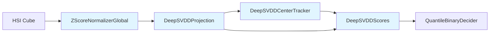

!!! warning "Status: Needs Review"
    This page has not been reviewed for accuracy and completeness. Content may be outdated or contain errors.

---

# Deep Learning Nodes

## Overview

Deep learning nodes use neural networks for feature learning, dimensionality reduction, and gradient-based optimization. These nodes typically require:

1. **Statistical initialization** (Phase 1) - Initialize network parameters from data statistics
2. **Gradient training** (Phase 2) - Fine-tune via backpropagation with trainable parameters

**Key characteristics:**
- Support two-phase training workflow
- Learnable parameters optimized via gradient descent
- Can be frozen after statistical init or unfrozen for end-to-end training
- Often used for learned representations and adaptive feature extraction

**When to use:**
- Need learnable feature extraction beyond fixed transforms
- Want end-to-end optimization with task-specific loss
- Require adaptive dimensionality reduction
- Deep learning-based anomaly detection (Deep SVDD)

---

## Nodes in This Category

## DeepSVDD Nodes

Deep Support Vector Data Description (Deep SVDD) nodes for one-class anomaly detection using learned hypersphere embeddings.

### ZScoreNormalizerGlobal

**Description:** Per-pixel z-score normalizer estimating global statistics for Deep SVDD preprocessing

**Perfect for:**
- Deep SVDD encoder initialization
- Per-pixel normalization across spectral dimension
- Statistical preprocessing before neural feature extraction

**Training Paradigm:** Statistical initialization only (frozen after init)

**Background:**

Computes per-band z-score normalization using global statistics estimated from initialization data:

$$
\text{normalized}(x) = \frac{x - \mu}{\sigma + \epsilon}
$$

where $\mu, \sigma$ are estimated per-channel means/stds from a random sample of training pixels.

#### Port Specifications

**Input Ports:**

| Port | Type | Shape | Description | Optional |
|------|------|-------|-------------|----------|
| data | float32 | (B,H,W,C) | Input hyperspectral cube BHWC | No |

**Output Ports:**

| Port | Type | Shape | Description |
|------|------|-------|-------------|
| normalized | float32 | (B,H,W,C) | Z-score normalized cube |

#### Parameters

| Parameter | Type | Default | Description |
|-----------|------|---------|-------------|
| num_channels | int | required | Number of spectral channels |
| sample_n | int | 500000 | Max pixels to sample for statistics |
| seed | int | 0 | Random seed for sampling |
| eps | float | 1e-8 | Stability constant added to std |

#### Example Usage (Python)

```python
from cuvis_ai.anomaly.deep_svdd import ZScoreNormalizerGlobal

# Create encoder
from cuvis_ai_core.training import StatisticalTrainer

encoder = ZScoreNormalizerGlobal(num_channels=61, sample_n=500_000)
pipeline.add_node(encoder)

# Statistical initialization
trainer = StatisticalTrainer(pipeline=pipeline, datamodule=datamodule)
trainer.fit()  # Automatically initializes encoder

# Use in pipeline (frozen)
pipeline.connect(
    (bandpass.output, encoder.data),
    (encoder.normalized, projection.data)
)
```

#### Example Configuration (YAML)

```yaml
nodes:
  encoder:
    type: ZScoreNormalizerGlobal
    config:
      num_channels: 61
      sample_n: 500000
      seed: 0
      eps: 1e-8

connections:
  - [preprocessor.output, encoder.data]
  - [encoder.normalized, projection.data]
```

#### Common Issues

**1. Channel mismatch error**

```python
# Problem: num_channels doesn't match data
encoder = ZScoreNormalizerGlobal(num_channels=50)
encoder.forward(data_61_channels)  # ValueError!

# Solution: Match num_channels to data
encoder = ZScoreNormalizerGlobal(num_channels=61)
```

**2. Numerical instability with small std**

```python
# Problem: Some channels have very low variance
encoder = ZScoreNormalizerGlobal(num_channels=61, eps=1e-10)  # Too small

# Solution: Increase eps for stability
encoder = ZScoreNormalizerGlobal(num_channels=61, eps=1e-6)
```

#### See Also

- [Tutorial 3: Deep SVDD Gradient](../tutorials/deep-svdd-gradient.md#encoder-initialization)
- [DeepSVDDProjection](#deepsvddprojection) - Next stage after encoding
- [Two-Phase Training](../concepts/two-phase-training.md)
- API Reference: ::: cuvis_ai.anomaly.deep_svdd.ZScoreNormalizerGlobal

---

### DeepSVDDProjection

**Description:** Neural projection head mapping per-pixel features to Deep SVDD embeddings

**Perfect for:**
- Deep SVDD feature extraction
- Learned hyperspectral feature representations
- One-class anomaly detection with deep learning

**Training Paradigm:** Two-phase (statistical init → unfreeze → gradient training)

**Architecture:**

Supports two kernel types:

1. **Linear kernel** (default):
   - 2-layer MLP: `Linear(C → hidden) → ReLU → Linear(hidden → rep_dim)`
   - Fast, suitable for linearly separable data

2. **RBF kernel**:
   - Random Fourier Features (RFF) → MLP
   - `RFF(C → n_rff) → Linear(n_rff → hidden) → ReLU → Linear(hidden → rep_dim)`
   - Better for non-linear patterns

#### Port Specifications

**Input Ports:**

| Port | Type | Shape | Description | Optional |
|------|------|-------|-------------|----------|
| data | float32 | (B,H,W,C) | Per-pixel features BHWC | No |

**Output Ports:**

| Port | Type | Shape | Description |
|------|------|-------|-------------|
| embeddings | float32 | (B,H,W,D) | Deep SVDD embeddings (D=rep_dim) |

#### Parameters

| Parameter | Type | Default | Description |
|-----------|------|---------|-------------|
| in_channels | int | required | Input feature dimension (C) |
| rep_dim | int | 32 | Output embedding dimension |
| hidden | int | 128 | Hidden layer size |
| kernel | str | "linear" | Kernel type: "linear" or "rbf" |
| n_rff | int | 2048 | RFF features (if kernel="rbf") |
| gamma | float | None | RBF bandwidth (if kernel="rbf", default=1/C) |
| mlp_forward_batch_size | int | 65536 | Batch size for MLP forward (memory control) |

#### Example Usage (Python)

```python
from cuvis_ai.anomaly.deep_svdd import DeepSVDDProjection

# Create projection head (linear kernel)
projection = DeepSVDDProjection(
    in_channels=61,
    rep_dim=32,
    hidden=128,
    kernel="linear"
)

# Enable gradient training after statistical init
projection.unfreeze()

# Use in pipeline
pipeline.add_nodes(projection=projection)
pipeline.connect(
    (encoder.normalized, projection.data),
    (projection.embeddings, center_tracker.embeddings)
)
```

#### Example Configuration (YAML)

```yaml
nodes:
  projection:
    type: DeepSVDDProjection
    config:
      in_channels: 61
      rep_dim: 32
      hidden: 128
      kernel: "linear"
      mlp_forward_batch_size: 65536

connections:
  - [encoder.normalized, projection.data]
  - [projection.embeddings, center_tracker.embeddings]
```

#### Kernel Selection Guide

| Kernel | Speed | Memory | Use Case |
|--------|-------|--------|----------|
| **linear** | Fast | Low | Linearly separable anomalies |
| **rbf** | Slower | High (n_rff) | Complex non-linear patterns |

**Recommendation:** Start with `kernel="linear"`. Switch to `kernel="rbf"` only if linear performance is insufficient.

#### See Also

- [Tutorial 3: Deep SVDD Gradient](../tutorials/deep-svdd-gradient.md#projection-head)
- [DeepSVDDCenterTracker](#deepsvddcentertracker) - Next stage
- [ZScoreNormalizerGlobal](#zscorenormalizerglobal) - Preprocessing
- API Reference: ::: cuvis_ai.anomaly.deep_svdd.DeepSVDDProjection

---

### DeepSVDDCenterTracker

**Description:** Tracks Deep SVDD hypersphere center using exponential moving average (EMA)

**Perfect for:**
- Deep SVDD center initialization and tracking
- Monitoring center stability during training
- Providing center vector for anomaly scoring

**Training Paradigm:** Statistical initialization + EMA updates during training

**Algorithm:**

1. **Phase 1 (Statistical Init):** Estimate initial center as mean of embeddings:
   $$c_0 = \frac{1}{N} \sum_{i=1}^{N} z_i$$

2. **Phase 2 (Training):** Update center via EMA:
   $$c_t = (1 - \alpha) c_{t-1} + \alpha \cdot \text{mean}(z_{\text{batch}})$$

where $\alpha$ is the EMA decay rate (default 0.1).

#### Port Specifications

**Input Ports:**

| Port | Type | Shape | Description | Optional |
|------|------|-------|-------------|----------|
| embeddings | float32 | (B,H,W,D) | Deep SVDD embeddings | No |

**Output Ports:**

| Port | Type | Shape | Description |
|------|------|-------|-------------|
| center | float32 | (D,) | Current center vector |
| metrics | list | () | Center norm metric for logging |

#### Parameters

| Parameter | Type | Default | Description |
|-----------|------|---------|-------------|
| rep_dim | int | required | Embedding dimension (D) |
| alpha | float | 0.1 | EMA decay rate (0 < alpha ≤ 1) |
| update_in_eval | bool | False | Whether to update center during val/test |

#### Example Usage (Python)

```python
from cuvis_ai.anomaly.deep_svdd import DeepSVDDCenterTracker

# Create center tracker
from cuvis_ai_core.training import StatisticalTrainer

center_tracker = DeepSVDDCenterTracker(
    rep_dim=32,
    alpha=0.1,
    update_in_eval=False
)
pipeline.add_node(center_tracker)

# Statistical initialization
trainer = StatisticalTrainer(pipeline=pipeline, datamodule=datamodule)
trainer.fit()  # Automatically initializes center_tracker

# Use in pipeline
pipeline.connect(
    (projection.embeddings, center_tracker.embeddings),
    (center_tracker.center, scores.center)
)
```

#### Example Configuration (YAML)

```yaml
nodes:
  center_tracker:
    type: DeepSVDDCenterTracker
    config:
      rep_dim: 32
      alpha: 0.1
      update_in_eval: false

connections:
  - [projection.embeddings, center_tracker.embeddings]
  - [center_tracker.center, scores.center]
```

#### Alpha Selection Guide

| Alpha | Behavior | Use Case |
|-------|----------|----------|
| 0.01 | Slow adaptation | Stable datasets, long training |
| **0.1** | **Balanced** (recommended) | **General use** |
| 0.5 | Fast adaptation | Quickly changing distributions |

#### See Also

- [Tutorial 3: Deep SVDD Gradient](../tutorials/deep-svdd-gradient.md#center-tracking)
- [DeepSVDDScores](#deepsvddscores) - Uses center for scoring
- API Reference: ::: cuvis_ai.anomaly.deep_svdd.DeepSVDDCenterTracker

---

### DeepSVDDScores

**Description:** Computes anomaly scores as squared distance from embeddings to Deep SVDD center

**Perfect for:**
- Deep SVDD anomaly scoring
- Converting embeddings to anomaly maps
- One-class classification decision scores

**Training Paradigm:** None (stateless transform)

**Formula:**

$$
\text{score}(z) = \| z - c \|^2 = \sum_{d=1}^{D} (z_d - c_d)^2
$$

Higher scores indicate points further from the center (potential anomalies).

#### Port Specifications

**Input Ports:**

| Port | Type | Shape | Description | Optional |
|------|------|-------|-------------|----------|
| embeddings | float32 | (B,H,W,D) | Deep SVDD embeddings | No |
| center | float32 | (D,) | Center vector from tracker | No |

**Output Ports:**

| Port | Type | Shape | Description |
|------|------|-------|-------------|
| scores | float32 | (B,H,W,1) | Squared distance scores |

#### Example Usage (Python)

```python
from cuvis_ai.anomaly.deep_svdd import DeepSVDDScores

# Create scorer (no parameters)
scorer = DeepSVDDScores()

# Use in pipeline
pipeline.add_nodes(scorer=scorer)
pipeline.connect(
    (projection.embeddings, scorer.embeddings),
    (center_tracker.center, scorer.center),
    (scorer.scores, decider.scores)
)
```

#### Example Configuration (YAML)

```yaml
nodes:
  scorer:
    type: DeepSVDDScores

connections:
  - [projection.embeddings, scorer.embeddings]
  - [center_tracker.center, scorer.center]
  - [scorer.scores, decider.scores]
```

#### See Also

- [Tutorial 3: Deep SVDD Gradient](../tutorials/deep-svdd-gradient.md#anomaly-scoring)
- [QuantileBinaryDecider](utility.md#quantilebinarydecider) - Threshold scores
- [DeepSVDDSoftBoundaryLoss](loss-metrics.md#deepsvddsoftboundaryloss) - Training loss
- API Reference: ::: cuvis_ai.anomaly.deep_svdd.DeepSVDDScores

---

### TrainablePCA

**Description:** Trainable PCA with SVD initialization and gradient-based fine-tuning

**Perfect for:**
- Dimensionality reduction with end-to-end training
- Baseline channel reduction (61 → 3 for AdaCLIP)
- PCA-initialized learnable projection

**Training Paradigm:** Two-phase (SVD init → unfreeze → gradient fine-tuning)

**Algorithm:**

1. **Phase 1 (Statistical Init):** Compute PCA via SVD on centered data
2. **Phase 2 (Optional):** Unfreeze components, optimize with gradient descent

#### Port Specifications

**Input Ports:**

| Port | Type | Shape | Description | Optional |
|------|------|-------|-------------|----------|
| data | float32 | (B,H,W,C) | Input hyperspectral cube BHWC | No |

**Output Ports:**

| Port | Type | Shape | Description |
|------|------|-------|-------------|
| projected | float32 | (B,H,W,K) | PCA-projected data (K components) |
| explained_variance_ratio | float32 | (K,) | Variance explained per component |
| components | float32 | (K,C) | Principal components matrix |

#### Parameters

| Parameter | Type | Default | Description |
|-----------|------|---------|-------------|
| num_channels | int | required | Input channels (C) |
| n_components | int | required | Number of components to retain (K) |
| whiten | bool | False | Scale components by explained variance |
| init_method | str | "svd" | Initialization: "svd", "random" |
| eps | float | 1e-6 | Stability constant |

#### Example Usage (Python)

```python
from cuvis_ai.node.pca import TrainablePCA

# Create PCA node: 61 → 3 channels
from cuvis_ai_core.training import StatisticalTrainer

pca = TrainablePCA(num_channels=61, n_components=3, whiten=False)
pipeline.add_node(pca)

# Phase 1: Statistical initialization via SVD
trainer = StatisticalTrainer(pipeline=pipeline, datamodule=datamodule)
trainer.fit()  # Automatically initializes pca via SVD

# Phase 2 (optional): Enable gradient training
pca.unfreeze()  # Convert components to nn.Parameter

# Use in pipeline
pipeline.connect(
    (normalizer.output, pca.data),
    (pca.projected, detector.data)
)
```

#### Example Configuration (YAML)

```yaml
nodes:
  pca:
    type: TrainablePCA
    config:
      num_channels: 61
      n_components: 3
      whiten: false
      init_method: "svd"

connections:
  - [normalizer.output, pca.data]
  - [pca.projected, detector.rgb]
```

#### Whiten Parameter

| whiten | Effect | Use Case |
|--------|--------|----------|
| False | Preserve variance scaling | **AdaCLIP** (recommended) |
| True | Equal variance per component | Statistical analysis |

#### See Also

- [Tutorial 4: AdaCLIP Workflow](../tutorials/adaclip-workflow.md#variant-1-pca-baseline)
- [OrthogonalityLoss](loss-metrics.md#orthogonalityloss) - Regularize components
- API Reference: ::: cuvis_ai.node.dimensionality_reduction.TrainablePCA

---

### LearnableChannelMixer

**Description:** DRCNN-style learnable channel mixer using 1x1 convolutions with multi-layer reduction

**Perfect for:**
- AdaCLIP channel reduction with learned linear combinations
- End-to-end trainable spectral mixing (61 → 3 channels)
- Task-driven hyperspectral data reduction

**Training Paradigm:** Gradient-only (no statistical init required, but PCA init supported)

**Architecture:**

Multi-layer reduction with 1x1 convolutions + Leaky ReLU:

```
reduction_scheme = [61, 16, 8, 3]
Layer 1: Conv1x1(61 → 16) → LeakyReLU(0.01)
Layer 2: Conv1x1(16 → 8) → LeakyReLU(0.01)
Layer 3: Conv1x1(8 → 3) → Per-channel MinMax normalization
```

Based on Zeegers et al. (2020) DRCNN approach.

#### Port Specifications

**Input Ports:**

| Port | Type | Shape | Description | Optional |
|------|------|-------|-------------|----------|
| data | float32 | (B,H,W,C) | Input hyperspectral cube BHWC | No |

**Output Ports:**

| Port | Type | Shape | Description |
|------|------|-------|-------------|
| rgb | float32 | (B,H,W,K) | Mixed output (K channels, normalized to [0,1]) |

#### Parameters

| Parameter | Type | Default | Description |
|-----------|------|---------|-------------|
| input_channels | int | required | Input channels (C) |
| output_channels | int | required | Output channels (K) |
| leaky_relu_negative_slope | float | 0.01 | Leaky ReLU slope |
| use_bias | bool | True | Use bias in convolutions |
| use_activation | bool | True | Apply Leaky ReLU |
| normalize_output | bool | True | Per-channel MinMax normalization to [0,1] |
| init_method | str | "xavier" | Init: "xavier", "kaiming", "pca", "zeros" |
| eps | float | 1e-6 | Stability constant for normalization |
| reduction_scheme | list[int] | None | Multi-layer scheme (e.g., [61,16,8,3]) |

#### Example Usage (Python)

```python
from cuvis_ai.node.channel_mixer import LearnableChannelMixer

# Create multi-layer mixer (DRCNN-style)
mixer = LearnableChannelMixer(
    input_channels=61,
    output_channels=3,
    reduction_scheme=[61, 16, 8, 3],  # 3-layer gradual reduction
    leaky_relu_negative_slope=0.01,
    normalize_output=True,
    init_method="xavier"
)

# Enable gradient training (frozen by default)
mixer.unfreeze()

# Use in pipeline
pipeline.add_nodes(mixer=mixer)
pipeline.connect(
    (normalizer.output, mixer.data),
    (mixer.rgb, adaclip.rgb)
)
```

#### Example Configuration (YAML)

```yaml
nodes:
  mixer:
    type: LearnableChannelMixer
    config:
      input_channels: 61
      output_channels: 3
      reduction_scheme: [61, 16, 8, 3]
      leaky_relu_negative_slope: 0.01
      normalize_output: true
      init_method: "xavier"

connections:
  - [normalizer.output, mixer.data]
  - [mixer.rgb, adaclip.rgb]
```

#### Reduction Scheme Strategies

| Scheme | Layers | Optimization | Use Case |
|--------|--------|--------------|----------|
| `[61, 3]` | 1 | Fast | Quick baseline |
| `[61, 16, 8, 3]` | 3 | Better | **Recommended** (DRCNN paper) |
| `[61, 32, 16, 8, 3]` | 4 | Best | Complex tasks |

**Recommendation:** Use `[61, 16, 8, 3]` for AdaCLIP (matches DRCNN paper).

#### See Also

- [Tutorial 4: AdaCLIP Workflow](../tutorials/adaclip-workflow.md#variant-2-drcnn-mixer)
- [IoULoss](loss-metrics.md#iouloss) - End-to-end loss
- API Reference: ::: cuvis_ai.node.channel_mixer.LearnableChannelMixer

---

### ConcreteBandSelector

**Description:** Gumbel-Softmax learnable band selector with temperature annealing

**Perfect for:**
- Discrete band selection with gradient optimization
- AdaCLIP learnable band selection
- Temperature-annealed differentiable sampling

**Training Paradigm:** Gradient-only (learns categorical distributions over bands)

**Algorithm:**

For each output channel $c \in \{1, \ldots, K\}$, learns logits $L_c \in \mathbb{R}^T$ and samples:

$$
w_c = \text{softmax}\left( \frac{L_c + g}{\tau} \right), \quad g \sim \text{Gumbel}(0, 1)
$$

Temperature $\tau$ is annealed: $\tau(e) = \tau_{\text{start}} \cdot \left(\frac{\tau_{\text{end}}}{\tau_{\text{start}}}\right)^{e / E}$

Output: $Y[:, :, c] = \sum_{t=1}^T w_c[t] \cdot X[:, :, t]$

#### Port Specifications

**Input Ports:**

| Port | Type | Shape | Description | Optional |
|------|------|-------|-------------|----------|
| data | float32 | (B,H,W,C) | Input hyperspectral cube BHWC | No |

**Output Ports:**

| Port | Type | Shape | Description |
|------|------|-------|-------------|
| rgb | float32 | (B,H,W,K) | Selected-band RGB-like output |
| selection_weights | float32 | (K,C) | Current selection weights (for loss) |

#### Parameters

| Parameter | Type | Default | Description |
|-----------|------|---------|-------------|
| input_channels | int | required | Number of input bands (T) |
| output_channels | int | 3 | Number of output channels (K) |
| tau_start | float | 10.0 | Initial temperature (high = soft) |
| tau_end | float | 0.1 | Final temperature (low = peaked) |
| max_epochs | int | 20 | Epochs for annealing schedule |
| use_hard_inference | bool | True | Use argmax at inference (one-hot) |
| eps | float | 1e-6 | Stability constant |

#### Example Usage (Python)

```python
from cuvis_ai.node.concrete_selector import ConcreteBandSelector

# Create Concrete selector
selector = ConcreteBandSelector(
    input_channels=61,
    output_channels=3,
    tau_start=10.0,
    tau_end=0.1,
    max_epochs=50,
    use_hard_inference=True
)

# Enable gradient training
selector.unfreeze()

# Use in pipeline
pipeline.add_nodes(selector=selector)
pipeline.connect(
    (normalizer.output, selector.data),
    (selector.rgb, adaclip.rgb),
    (selector.selection_weights, distinctness_loss.weights)
)
```

#### Example Configuration (YAML)

```yaml
nodes:
  selector:
    type: ConcreteBandSelector
    config:
      input_channels: 61
      output_channels: 3
      tau_start: 10.0
      tau_end: 0.1
      max_epochs: 50
      use_hard_inference: true

connections:
  - [normalizer.output, selector.data]
  - [selector.rgb, adaclip.rgb]
  - [selector.selection_weights, distinctness_loss.weights]
```

#### Temperature Annealing

| Epoch | Temperature | Effect |
|-------|-------------|--------|
| 0 | 10.0 | Soft, exploration |
| 25 | ~1.0 | Balanced |
| 50 | 0.1 | Peaked, near-discrete |

**Recommended:** `tau_start=10.0`, `tau_end=0.1`, `max_epochs=50` for AdaCLIP.

#### See Also

- [Tutorial 4: AdaCLIP Workflow](../tutorials/adaclip-workflow.md#variant-3-concrete-selector)
- [DistinctnessLoss](loss-metrics.md#distinctnessloss) - Encourage diverse bands
- API Reference: ::: cuvis_ai.node.channel_mixer.ConcreteChannelMixer

---

## Node Comparison

### Dimensionality Reduction Nodes

| Node | Method | Training | Output Range | Use Case |
|------|--------|----------|--------------|----------|
| **TrainablePCA** | SVD → gradient | Two-phase | Unbounded | Statistical baseline |
| **LearnableChannelMixer** | 1x1 Conv | Gradient-only | [0, 1] normalized | DRCNN-style mixing |
| **ConcreteBandSelector** | Gumbel-Softmax | Gradient-only | [0, 1] (weighted sum) | Discrete band selection |

### Deep SVDD Pipeline

Complete Deep SVDD workflow:



### AdaCLIP Variants Comparison

| Variant | Node | Trainable | Performance |
|---------|------|-----------|-------------|
| **PCA Baseline** | TrainablePCA (frozen) | No | Fast, statistical |
| **DRCNN Mixer** | LearnableChannelMixer | Yes | Better, learned |
| **Concrete Selector** | ConcreteBandSelector | Yes | Best, discrete |

---

## Training Workflow Example

Two-phase training with Deep SVDD:

```yaml
# Phase 1: Statistical Initialization
trainer:
  type: StatisticalTrainer
  max_steps: 1000

nodes:
  encoder:
    type: ZScoreNormalizerGlobal
    config:
      num_channels: 61

  projection:
    type: DeepSVDDProjection
    config:
      in_channels: 61
      rep_dim: 32

  center_tracker:
    type: DeepSVDDCenterTracker
    config:
      rep_dim: 32
      alpha: 0.1

# Phase 2: Gradient Training
# Unfreeze projection.unfreeze()
# Train with DeepSVDDSoftBoundaryLoss
```

---

## Additional Resources

- **Tutorial:** [Deep SVDD Gradient Training](../tutorials/deep-svdd-gradient.md)
- **Tutorial:** [AdaCLIP Workflow](../tutorials/adaclip-workflow.md)
- **Concepts:** [Two-Phase Training](../concepts/two-phase-training.md)
- **Concepts:** [Execution Stages](../concepts/execution-stages.md)
- **API Reference:** [cuvis_ai.anomaly.deep_svdd](../../api/anomaly/#deep_svdd)
- **API Reference:** [cuvis_ai.node.pca](../../api/node/#pca)
- **API Reference:** [cuvis_ai.node.channel_mixer](../../api/node/#channel_mixer)
- **API Reference:** [cuvis_ai.node.concrete_selector](../../api/node/#concrete_selector)
