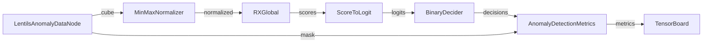
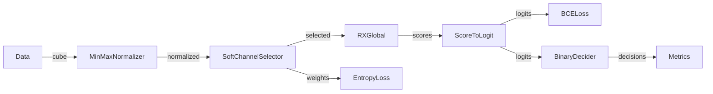
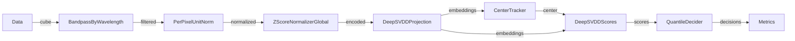
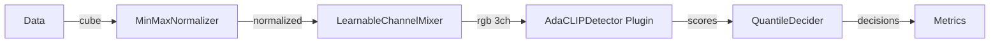

!!! warning "Status: Needs Review"
    This page has not been reviewed for accuracy and completeness. Content may be outdated or contain errors.

---

# Node Catalog

Complete reference of all 30+ built-in nodes in CUVIS.AI, organized by category for easy navigation.

## Overview

Nodes are the building blocks of CUVIS.AI pipelines. Each node performs a specific operation (data loading, preprocessing, detection, visualization) and connects to other nodes via typed ports.

**What You'll Find Here:**
- 📚 Complete catalog of all built-in nodes
- 🔍 Quick reference tables for finding the right node
- 📖 Usage examples and configuration patterns
- 🔗 Links to tutorials demonstrating each node

---

## Node Categories

-   :material-database: **[Data Nodes](data-nodes.md)**

    ---

    Data loading and dataset management nodes

    **Nodes:** LentilsAnomalyDataNode (1)

-   :material-tune: **[Preprocessing](preprocessing.md)**

    ---

    Data transformation and preprocessing nodes

    **Nodes:** MinMaxNormalizer, ZScoreNormalizer, PerPixelUnitNorm, and more (7)

-   :material-select: **[Selectors](selectors.md)**

    ---

    Channel and feature selection nodes

    **Nodes:** SoftChannelSelector, FixedWavelengthSelector, SupervisedSelectors (8)

-   :material-chart-bell-curve: **[Statistical](statistical.md)**

    ---

    Statistical analysis and anomaly detection nodes

    **Nodes:** RXGlobal, ScoreToLogit (2)

-   :material-brain: **[Deep Learning](deep-learning.md)**

    ---

    Neural network and gradient-based training nodes

    **Nodes:** DeepSVDD*, TrainablePCA, LearnableChannelMixer, ConcreteChannelMixer (8)

-   :material-chart-line: **[Loss & Metrics](loss-metrics.md)**

    ---

    Loss functions and evaluation metrics

    **Nodes:** AnomalyBCEWithLogits, DeepSVDDSoftBoundaryLoss, AnomalyDetectionMetrics (7)

-   :material-chart-box: **[Visualization](visualization.md)**

    ---

    Results visualization and monitoring nodes

    **Nodes:** AnomalyMask, CubeRGBVisualizer, ScoreHeatmapVisualizer, TensorBoardMonitor (4)

-   :material-tools: **[Utility Nodes](utility.md)**

    ---

    Helper nodes for decisions and transformations

    **Nodes:** BinaryDecider, QuantileBinaryDecider, BinaryAnomalyLabelMapper (4)

---

## Quick Reference Table

**All Built-in Nodes at a Glance:**

| Node | Category | Statistical Init | Trainable | Primary Use Case |
|------|----------|:----------------:|:---------:|------------------|
| **LentilsAnomalyDataNode** | Data | ❌ | ❌ | Load hyperspectral data with anomaly labels |
| **BandpassByWavelength** | Preprocessing | ❌ | ❌ | Filter channels by wavelength range |
| **MinMaxNormalizer** | Preprocessing | ✅ | ❌ | Min-max scaling with running statistics |
| **ZScoreNormalizer** | Preprocessing | ❌ | ❌ | Z-score normalization |
| **ZScoreNormalizerGlobal** | Preprocessing/DL | ✅ | ✅ | Learnable z-score encoder for Deep SVDD |
| **PerPixelUnitNorm** | Preprocessing | ❌ | ❌ | Per-pixel L2 normalization |
| **SigmoidNormalizer** | Preprocessing | ❌ | ❌ | Median-centered sigmoid squashing |
| **IdentityNormalizer** | Preprocessing | ❌ | ❌ | Pass-through (no-op) |
| **SoftChannelSelector** | Selectors | ✅ | ✅ | Learnable soft channel selection (Gumbel-Softmax) |
| **TopKIndices** | Selectors | ❌ | ❌ | Extract top-k channel indices from weights |
| **FixedWavelengthSelector** | Selectors | ❌ | ❌ | Fixed RGB wavelength selection |
| **CIRSelector** | Selectors | ❌ | ❌ | Color Infrared false color |
| **HighContrastSelector** | Selectors | ❌ | ❌ | Data-driven high-contrast selection |
| **SupervisedCIRSelector** | Selectors | ✅ | ❌ | Supervised NIR/Red/Green selection with mRMR |
| **SupervisedWindowedSelector** | Selectors | ✅ | ❌ | Supervised RGB selection with windowing |
| **SupervisedFullSpectrumSelector** | Selectors | ✅ | ❌ | Supervised global band selection |
| **RXGlobal** | Statistical | ✅ | ❌ | Reed-Xiaoli anomaly detector |
| **ScoreToLogit** | Utility | ❌ | ✅ | Transform RX scores to logits |
| **DeepSVDDProjection** | Deep Learning | ❌ | ✅ | Deep SVDD projection network |
| **DeepSVDDCenterTracker** | Deep Learning | ✅ | ✅ | Track hypersphere center with EMA |
| **DeepSVDDScores** | Deep Learning | ❌ | ❌ | Compute distance-based anomaly scores |
| **TrainablePCA** | Deep Learning | ✅ | ✅ | PCA with optional gradient training |
| **LearnableChannelMixer** | Deep Learning | ✅ | ✅ | DRCNN-style 1x1 convolution mixer |
| **ConcreteChannelMixer** | Deep Learning | ❌ | ✅ | Concrete/Gumbel-Softmax discrete selector |
| **AnomalyBCEWithLogits** | Loss | ❌ | ❌ | Binary cross-entropy loss |
| **DeepSVDDSoftBoundaryLoss** | Loss | ❌ | ❌ | Soft boundary loss for Deep SVDD |
| **OrthogonalityLoss** | Loss | ❌ | ❌ | Orthogonality regularization for PCA |
| **SelectorEntropyRegularizer** | Loss | ❌ | ❌ | Entropy regularization for selectors |
| **SelectorDiversityRegularizer** | Loss | ❌ | ❌ | Diversity regularization for selectors |
| **AnomalyDetectionMetrics** | Metrics | ❌ | ❌ | IoU, precision, recall, F1, AP |
| **ExplainedVarianceMetric** | Metrics | ❌ | ❌ | Track PCA explained variance |
| **AnomalyMask** | Visualization | ❌ | ❌ | Visualize anomaly masks |
| **CubeRGBVisualizer** | Visualization | ❌ | ❌ | False-color RGB from selected channels |
| **PCAVisualization** | Visualization | ❌ | ❌ | Visualize PCA projections |
| **ScoreHeatmapVisualizer** | Visualization | ❌ | ❌ | Anomaly score heatmaps |
| **TensorBoardMonitorNode** | Visualization | ❌ | ❌ | TensorBoard logging (sink node) |
| **BinaryDecider** | Utility | ❌ | ❌ | Fixed threshold binary decisions |
| **QuantileBinaryDecider** | Utility | ❌ | ❌ | Quantile-based binary decisions |
| **BinaryAnomalyLabelMapper** | Utility | ❌ | ❌ | Convert multi-class to binary anomaly labels |

---

## Finding the Right Node

### By Task

**Anomaly Detection:**
- **Statistical:** [RXGlobal](statistical.md#rxglobal) - Fast, interpretable baseline
- **Deep Learning:** [DeepSVDD*](deep-learning.md#deepsvdd-nodes) - One-class learning with neural networks

**Band/Channel Selection:**
- **Fixed Selection:** [FixedWavelengthSelector](selectors.md#fixedwavelengthselector), [CIRSelector](selectors.md#cirselector)
- **Learnable Selection:** [SoftChannelSelector](selectors.md#softchannelselector), [ConcreteChannelMixer](deep-learning.md#concretechannelmixer)
- **Supervised Selection:** [SupervisedCIRSelector](selectors.md#supervisedcirselector), [SupervisedWindowedSelector](selectors.md#supervisedwindowedselector)

**Preprocessing:**
- **Normalization:** [MinMaxNormalizer](preprocessing.md#minmaxnormalizer), [ZScoreNormalizer](preprocessing.md#zscorenormalizer)
- **Wavelength Filtering:** [BandpassByWavelength](preprocessing.md#bandpassbywavelength)
- **Per-Pixel Operations:** [PerPixelUnitNorm](preprocessing.md#perpixelunitnorm)

**Dimensionality Reduction:**
- **PCA:** [TrainablePCA](deep-learning.md#trainablepca)
- **Channel Mixing:** [LearnableChannelMixer](deep-learning.md#learnablechannelmixer)

**Visualization & Monitoring:**
- **TensorBoard:** [TensorBoardMonitorNode](visualization.md#tensorboardmonitornode)
- **Anomaly Masks:** [AnomalyMask](visualization.md#anomalymask)
- **Score Heatmaps:** [ScoreHeatmapVisualizer](visualization.md#scoreheatmapvisualizer)

### By Training Paradigm

**Statistical-Only (No Gradients):**
- [RXGlobal](statistical.md#rxglobal)
- [MinMaxNormalizer](preprocessing.md#minmaxnormalizer) (with `use_running_stats=True`)
- [SupervisedCIRSelector](selectors.md#supervisedcirselector)
- [SupervisedWindowedSelector](selectors.md#supervisedwindowedselector)

**Two-Phase (Statistical → Gradient):**
- [SoftChannelSelector](selectors.md#softchannelselector)
- [TrainablePCA](deep-learning.md#trainablepca)
- [LearnableChannelMixer](deep-learning.md#learnablechannelmixer)
- [DeepSVDD* nodes](deep-learning.md#deepsvdd-nodes)

**Gradient-Only:**
- [ConcreteChannelMixer](deep-learning.md#concretechannelmixer)
- [DeepSVDDProjection](deep-learning.md#deepsvddprojection)

**No Training Required:**
- [ZScoreNormalizer](preprocessing.md#zscorenormalizer)
- [BandpassByWavelength](preprocessing.md#bandpassbywavelength)
- [BinaryDecider](utility.md#binarydecider)
- All visualization nodes

### By Data Type

**Hyperspectral Data:**
- [LentilsAnomalyDataNode](data-nodes.md#lentilsanomalydatanode)
- [BandpassByWavelength](preprocessing.md#bandpassbywavelength)
- [SoftChannelSelector](selectors.md#softchannelselector)
- [RXGlobal](statistical.md#rxglobal)

**RGB/False-Color:**
- [FixedWavelengthSelector](selectors.md#fixedwavelengthselector)
- [CIRSelector](selectors.md#cirselector)
- [CubeRGBVisualizer](visualization.md#cubergbvisualizer)

**Feature Embeddings:**
- [DeepSVDDProjection](deep-learning.md#deepsvddprojection)
- [DeepSVDDCenterTracker](deep-learning.md#deepsvddcentertracker)
- [DeepSVDDScores](deep-learning.md#deepsvddscores)

---

## Common Pipeline Patterns

### Pattern 1: Statistical Detection Pipeline

**Use Case:** Fast baseline anomaly detection with RX

**Training:** Statistical-only (Phase 1)
**Tutorial:** [RX Statistical Detection](../tutorials/rx-statistical.md)

---

### Pattern 2: Two-Phase Training with Channel Selection

**Use Case:** Learnable channel selection with gradient optimization

**Training:** Phase 1 (Statistical) → Phase 2 (Unfreeze selector + RX) → Phase 3 (Gradient)
**Tutorial:** [Channel Selector](../tutorials/channel-selector.md)

---

### Pattern 3: Deep Learning Pipeline (Deep SVDD)

**Use Case:** Deep one-class anomaly detection

**Training:** Phase 1 (Statistical encoder init) → Phase 2 (Unfreeze encoder) → Phase 3 (Gradient)
**Tutorial:** [Deep SVDD Gradient](../tutorials/deep-svdd-gradient.md)

---

### Pattern 4: Plugin-Based Pipeline

**Use Case:** Using external plugin nodes (e.g., AdaCLIP)

**Training:** Phase 1 (Statistical) → Phase 2 (Unfreeze mixer) → Phase 3 (Gradient with IoU loss)
**Tutorial:** [AdaCLIP Workflow](../tutorials/adaclip-workflow.md)

---

## Plugin Nodes

CUVIS.AI supports **plugin nodes** loaded from external repositories. Plugin nodes extend the built-in catalog with specialized functionality.

**Key Difference:**
- **Built-in nodes:** Included in `cuvis-ai` package
- **Plugin nodes:** Loaded dynamically from Git repositories

**Example Plugin:** `cuvis-ai-adaclip`
- **AdaCLIPDetector:** CLIP-based anomaly detection for hyperspectral data
- **Repository:** https://github.com/cubert-hyperspectral/cuvis-ai-adaclip

**Learn More:**
- [Plugin System Overview](../plugin-system/overview.md) - Architecture and concepts
- [Plugin Usage](../plugin-system/usage.md) - How to use plugin nodes
- [Plugin Development](../plugin-system/development.md) - Create your own plugins

---

## Node Development

**Want to create custom nodes?**

1. **For built-in nodes:** Follow the [Add Built-in Node](../how-to/add-builtin-node.md) guide
2. **For external plugins:** See [Plugin Development](../plugin-system/development.md)

**Resources:**
- [Node System Deep Dive](../concepts/node-system-deep-dive.md) - Node architecture and lifecycle
- [Port System](../concepts/port-system-deep-dive.md) - Typed I/O connections
- [API Reference](../api/nodes.md) - Node base classes and utilities

---

## Related Pages

**Concepts:**
- [Node System Deep Dive](../concepts/node-system-deep-dive.md) - Understanding nodes and their lifecycle
- [Port System Deep Dive](../concepts/port-system-deep-dive.md) - Typed port connections
- [Two-Phase Training](../concepts/two-phase-training.md) - Training strategies for learnable nodes

**Tutorials:**
- [RX Statistical Detection](../tutorials/rx-statistical.md) - Statistical-only pipeline
- [Channel Selector](../tutorials/channel-selector.md) - Two-phase training example
- [Deep SVDD Gradient](../tutorials/deep-svdd-gradient.md) - Deep learning pipeline

**API Reference:**
- [Node API](../api/nodes.md) - Base node classes
- [Port API](../api/ports.md) - Port specifications
- [Pipeline API](../api/pipeline.md) - Pipeline construction

---

**Next Steps:**
Browse the [category pages](#node-categories) above to explore detailed documentation for each node, including port specifications, parameters, usage examples, and configuration patterns.
