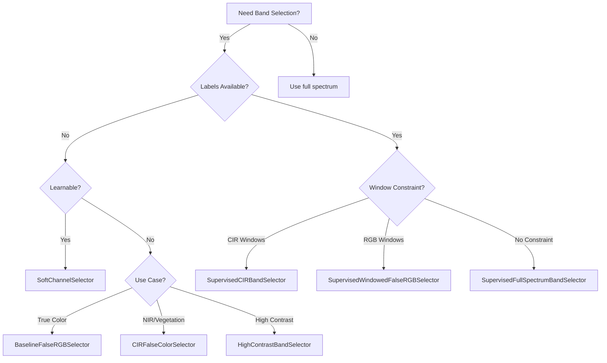

!!! warning "Status: Needs Review"
    This page has not been reviewed for accuracy and completeness. Content may be outdated or contain errors.

---

# Selector Nodes

## Overview

Selector nodes reduce hyperspectral dimensionality by selecting or weighting subsets of spectral bands. They address the "curse of dimensionality" by extracting discriminative channels for downstream processing, particularly important for models like CLIP that expect 3-channel RGB inputs.

**When to use Selector Nodes:**

- **Dimensionality reduction**: Reduce 61+ channels to manageable subsets (3-10 channels)
- **Band selection**: Learn which wavelengths are most discriminative for your task
- **HSI to RGB conversion**: Create RGB composites for pretrained vision models (AdaCLIP, CLIP)
- **Interpretability**: Understand which spectral regions matter for anomaly detection

**Key concepts:**

- **Learnable vs fixed selection**: SoftChannelSelector learns weights via gradients, while band selectors use fixed or data-driven strategies
- **Temperature annealing**: Gumbel-Softmax temperature controls soft (smooth) vs hard (discrete) selection
- **mRMR (maximum Relevance Minimum Redundancy)**: Supervised selectors balance discriminative power and band diversity
- **Two-phase training**: Statistical initialization → unfreeze → gradient training

## Category: Learnable Channel Selection

### SoftChannelSelector

**Description:** Differentiable channel selector using Gumbel-Softmax with temperature annealing

**Perfect for:**

- Learning optimal band combinations for your specific task
- Two-phase training with statistical initialization + gradient optimization
- End-to-end learnable pipelines
- Interpretable channel importance visualization

**Training Paradigm:** Two-phase (statistical initialization → gradient training)

#### Port Specifications

**Input Ports:**

| Port | Type | Shape | Description | Optional |
|------|------|-------|-------------|----------|
| data | float32 | (B, H, W, C) | Input hyperspectral cube | No |

**Output Ports:**

| Port | Type | Shape | Description |
|------|------|-------|-------------|
| selected | float32 | (B, H, W, C) | Channel-weighted output (same shape as input) |
| weights | float32 | (C,) | Current channel selection weights (for regularization) |

#### Parameters

| Parameter | Type | Default | Description |
|-----------|------|---------|-------------|
| n_select | int | Required | Number of channels to select (effective selection budget) |
| input_channels | int | Required | Total number of input channels |
| init_method | "uniform" \| "variance" | "uniform" | Initialization: uniform (zeros) or variance-based |
| temperature_init | float | 5.0 | Initial temperature for Gumbel-Softmax |
| temperature_min | float | 0.1 | Minimum temperature (annealing floor) |
| temperature_decay | float | 0.9 | Temperature decay factor per epoch |
| hard | bool | False | If True, use hard (top-k) selection at inference |
| eps | float | 1e-6 | Numerical stability constant |

#### How It Works

**Soft selection** (training):

```
weights = softmax(logits / temperature) * n_select
selected = cube * weights  # [B, H, W, C]
```

- Low temperature → more discrete (closer to hard selection)
- High temperature → more uniform (explores all channels)

**Hard selection** (inference):

```
top_k_indices = topk(logits, n_select)
weights[top_k_indices] = 1.0
weights[other_indices] = 0.0
```

**Temperature annealing schedule:**

```
temp(epoch) = max(temp_min, temp_init * (decay ** epoch))
```

#### Example Usage (Python)

**Scenario 1: Two-phase training** (statistical init → gradient optimization)

```python
from cuvis_ai.node.selector import SoftChannelSelector

# Phase 1: Statistical initialization
selector = SoftChannelSelector(
    n_select=3,  # Reduce 61 channels to 3
    input_channels=61,
    init_method="variance",  # Importance-based initialization
    temperature_init=5.0,
)

# Initialize from training data
from cuvis_ai_core.training import StatisticalTrainer

trainer = StatisticalTrainer(pipeline=pipeline, datamodule=datamodule)
trainer.fit()  # Automatically initializes selector

# Phase 2: Unfreeze and train
selector.unfreeze()  # Convert logits buffer → nn.Parameter

# During training, update temperature per epoch
for epoch in range(max_epochs):
    selector.update_temperature(epoch=epoch)
    # Train with gradient descent...
```

**Scenario 2: Inspect selected channels**

```python
# Get current selection weights
weights = selector.get_selection_weights(hard=False)  # Soft weights
print(f"Channel weights: {weights}")  # [0.05, 0.12, ..., 1.82, ...] sums to n_select

# Get hard selection (top-k)
hard_weights = selector.get_selection_weights(hard=True)
top_k_indices = torch.where(hard_weights > 0)[0]
print(f"Selected channels: {top_k_indices}")  # [15, 28, 41]
```

#### Example Configuration (YAML)

```yaml
nodes:
  selector:
    type: SoftChannelSelector
    config:
      n_select: 3
      input_channels: 61
      init_method: variance
      temperature_init: 5.0
      temperature_min: 0.1
      temperature_decay: 0.9
      hard: false  # Soft during training, hard at inference

  # Entropy regularizer (encourages diversity)
  entropy_loss:
    type: SelectorEntropyRegularizer
    config:
      weight: 0.01

  # Diversity regularizer (prevents collapse)
  diversity_loss:
    type: SelectorDiversityRegularizer
    config:
      weight: 0.05

connections:
  - [data.cube, selector.data]
  - [selector.selected, rx.data]  # To downstream node
  - [selector.weights, entropy_loss.weights]  # Regularization
  - [selector.weights, diversity_loss.weights]
```

#### Statistical Initialization

```python
# Variance-based initialization (init_method="variance")
from cuvis_ai_core.training import StatisticalTrainer

# Create trainer with pipeline and data
trainer = StatisticalTrainer(pipeline=pipeline, datamodule=datamodule)
trainer.fit()  # Automatically initializes selector

# Result: channel_logits = log(variance_per_channel)
# High-variance channels get higher initial weights
```

#### Temperature Annealing

```python
# Manual temperature control
selector.temperature = 5.0  # High temp: explore all channels
train_epoch(...)
selector.update_temperature(epoch=0)  # temp = 5.0 * (0.9 ** 0) = 5.0

selector.update_temperature(epoch=1)  # temp = 5.0 * (0.9 ** 1) = 4.5
train_epoch(...)

# ... after many epochs
selector.update_temperature(epoch=20)  # temp = max(0.1, 5.0 * 0.9^20) ≈ 0.608
selector.update_temperature(epoch=50)  # temp = 0.1 (floor reached)
```

#### Common Issues

**Issue 1: Channel collapse** (all weight on few channels)

```python
# Problem: Selector collapses to 1-2 channels
weights = selector.get_selection_weights()
# Output: [0.0, 0.0, 2.98, 0.0, ...]  # Almost all weight on channel 2

# Solution: Add diversity regularizer
from cuvis_ai.node.losses import SelectorDiversityRegularizer
diversity_loss = SelectorDiversityRegularizer(weight=0.05)
```

**Issue 2: Temperature not annealing**

```python
# Problem: Forgot to call update_temperature
for epoch in range(50):
    train_epoch(...)
    # selector.temperature still 5.0!

# Solution: Add callback or manual update
for epoch in range(50):
    selector.update_temperature(epoch=epoch)
    train_epoch(...)
```

**Issue 3: Unfreeze not called**

```python
# Problem: channel_logits not trainable
from cuvis_ai_core.training import StatisticalTrainer

selector = SoftChannelSelector(n_select=3, input_channels=61)
pipeline.add_node(selector)

trainer = StatisticalTrainer(pipeline=pipeline, datamodule=datamodule)
trainer.fit()  # Initializes selector
# selector.channel_logits is a buffer, not a parameter!

optimizer = torch.optim.Adam(selector.parameters())  # Empty!

# Solution: Unfreeze before creating optimizer
selector.unfreeze()  # Converts buffer → nn.Parameter
optimizer = torch.optim.Adam(selector.parameters())  # Now includes channel_logits
```

#### See Also

- [Tutorial 2: Channel Selector](../tutorials/channel-selector.md) - Complete two-phase training example
- [Tutorial 4: AdaCLIP Workflow](../tutorials/adaclip-workflow.md#concrete-band-selector) - Alternative selector: ConcreteBandSelector
- [SelectorEntropyRegularizer](loss-metrics.md#selectorentropyregularizer) - Entropy regularization loss
- [SelectorDiversityRegularizer](loss-metrics.md#selectordiversityregularizer) - Diversity regularization loss
- [Concept: Two-Phase Training](../concepts/two-phase-training.md)
- API Reference: ::: cuvis_ai.node.selector.SoftChannelSelector

---

### TopKIndices

**Description:** Utility node that extracts top-k channel indices from selector weights

**Perfect for:**

- Introspecting which channels were selected
- Reporting selected wavelengths
- Debugging selector behavior
- Visualization of channel importance

**Training Paradigm:** None (utility node)

#### Port Specifications

**Input Ports:**

| Port | Type | Shape | Description | Optional |
|------|------|-------|-------------|----------|
| weights | float32 | (C,) | Channel selection weights | No |

**Output Ports:**

| Port | Type | Shape | Description |
|------|------|-------|-------------|
| indices | int64 | (k,) | Top-k channel indices (sorted by weight) |

#### Parameters

| Parameter | Type | Default | Description |
|-----------|------|---------|-------------|
| k | int | Required | Number of top indices to return |

#### Example Usage (Python)

```python
from cuvis_ai.node.selector import SoftChannelSelector, TopKIndices

# Create selector and top-k extractor
selector = SoftChannelSelector(n_select=3, input_channels=61)
top_k = TopKIndices(k=3)

# Connect in pipeline
pipeline.connect(
    (selector.weights, top_k.weights),
)

# After training, get selected indices
outputs = top_k.forward(weights=selector.get_selection_weights(hard=True))
print(f"Top 3 channels: {outputs['indices']}")  # tensor([15, 28, 41])
```

#### Example Configuration (YAML)

```yaml
nodes:
  selector:
    type: SoftChannelSelector
    config:
      n_select: 3
      input_channels: 61

  top_k:
    type: TopKIndices
    config:
      k: 3

connections:
  - [selector.weights, top_k.weights]
```

#### See Also

- [SoftChannelSelector](#softchannelselector) - Produces weights for this node
- API Reference: ::: cuvis_ai.node.selector.TopKIndices

---

## Category: Fixed Band Selection (Unsupervised)

These nodes select bands using fixed wavelengths or data-driven heuristics (no labels required).

### BaselineFalseRGBSelector

**Description:** Fixed wavelength band selection (e.g., 650, 550, 450 nm for R, G, B)

**Perfect for:**

- Creating "true color-ish" RGB images for visualization
- Baseline comparison for supervised methods
- Quick HSI → RGB conversion without training
- Pretrained vision models expecting natural RGB

**Training Paradigm:** None (fixed wavelengths)

#### Port Specifications

**Input Ports:**

| Port | Type | Shape | Description | Optional |
|------|------|-------|-------------|----------|
| cube | float32 | (B, H, W, C) | Hyperspectral cube | No |
| wavelengths | int32 | (C,) | Wavelength array (nm) | No |

**Output Ports:**

| Port | Type | Shape | Description |
|------|------|-------|-------------|
| rgb_image | float32 | (B, H, W, 3) | RGB image (0-1 range, per-sample normalized) |
| band_info | dict | () | Selected band metadata |

#### Parameters

| Parameter | Type | Default | Description |
|-----------|------|---------|-------------|
| target_wavelengths | tuple[float, float, float] | (650.0, 550.0, 450.0) | Target wavelengths for R, G, B (nm) |

#### Example Usage (Python)

```python
from cuvis_ai.node.band_selection import BaselineFalseRGBSelector

# Default: Red=650nm, Green=550nm, Blue=450nm
baseline = BaselineFalseRGBSelector(
    target_wavelengths=(650.0, 550.0, 450.0)
)

# Use in pipeline
outputs = baseline.forward(cube=cube, wavelengths=wavelengths)
rgb = outputs["rgb_image"]  # [B, H, W, 3] in [0, 1]
print(outputs["band_info"])
# {'strategy': 'baseline_false_rgb',
#  'band_indices': [28, 15, 3],
#  'band_wavelengths_nm': [648.5, 551.2, 447.8],
#  'target_wavelengths_nm': [650.0, 550.0, 450.0]}
```

#### Example Configuration (YAML)

```yaml
nodes:
  baseline_rgb:
    type: BaselineFalseRGBSelector
    config:
      target_wavelengths: [650.0, 550.0, 450.0]

connections:
  - [data.cube, baseline_rgb.cube]
  - [data.wavelengths, baseline_rgb.wavelengths]
  - [baseline_rgb.rgb_image, adaclip.rgb_input]
```

#### See Also

- [Tutorial 4: AdaCLIP Workflow](../tutorials/adaclip-workflow.md#approach-1-pca-baseline) - Uses band selectors
- [HighContrastBandSelector](#highcontrastbandselector) - Data-driven alternative
- API Reference: ::: cuvis_ai.node.band_selection.BaselineFalseRGBSelector

---

### CIRFalseColorSelector

**Description:** Color Infrared (CIR) false color composition: NIR → R, Red → G, Green → B

**Perfect for:**

- Highlighting vegetation and plant health
- Detecting certain anomalies invisible in true color
- Remote sensing applications
- Creating false-color composites

**Training Paradigm:** None (fixed wavelengths)

#### Port Specifications

Same as [BaselineFalseRGBSelector](#baselinefalsergbselector)

#### Parameters

| Parameter | Type | Default | Description |
|-----------|------|---------|-------------|
| nir_nm | float | 860.0 | Near-infrared wavelength (→ Red channel) |
| red_nm | float | 670.0 | Red wavelength (→ Green channel) |
| green_nm | float | 560.0 | Green wavelength (→ Blue channel) |

#### Example Usage (Python)

```python
from cuvis_ai.node.band_selection import CIRFalseColorSelector

# CIR mapping: NIR=860nm → R, Red=670nm → G, Green=560nm → B
cir = CIRFalseColorSelector(
    nir_nm=860.0,
    red_nm=670.0,
    green_nm=560.0,
)

outputs = cir.forward(cube=cube, wavelengths=wavelengths)
print(outputs["band_info"]["channel_mapping"])
# {'R': 'NIR', 'G': 'Red', 'B': 'Green'}
```

#### See Also

- [Tutorial 4: AdaCLIP Workflow](../tutorials/adaclip-workflow.md) - CIR variants
- API Reference: ::: cuvis_ai.node.band_selection.CIRFalseColorSelector

---

### HighContrastBandSelector

**Description:** Data-driven band selection using spatial variance + Laplacian energy

**Perfect for:**

- Creating high-contrast RGB images for visual anomaly detection
- Unsupervised band selection (no labels needed)
- Emphasizing spatial features
- Alternative to fixed wavelength selection

**Training Paradigm:** None (data-driven, computed per forward pass)

#### Port Specifications

Same as [BaselineFalseRGBSelector](#baselinefalsergbselector)

#### Parameters

| Parameter | Type | Default | Description |
|-----------|------|---------|-------------|
| windows | Sequence[tuple[float, float]] | ((440, 500), (500, 580), (610, 700)) | Wavelength windows for Blue, Green, Red |
| alpha | float | 0.1 | Weight for Laplacian energy term |

#### Selection Formula

For each wavelength window, select the band with highest score:

```
score(band) = variance(band) + alpha * laplacian_energy(band)
```

Where:

- `variance(band)`: Spatial variance across pixels
- `laplacian_energy(band)`: Mean absolute Laplacian (edge strength)
- High-variance, high-edge bands are selected

#### Example Usage (Python)

```python
from cuvis_ai.node.band_selection import HighContrastBandSelector

# Select high-contrast bands in visible spectrum windows
high_contrast = HighContrastBandSelector(
    windows=((440, 500), (500, 580), (610, 700)),  # B, G, R
    alpha=0.1,  # Laplacian weight
)

outputs = high_contrast.forward(cube=cube, wavelengths=wavelengths)
# Selects bands with max(variance + 0.1 * laplacian_energy) per window
```

#### See Also

- API Reference: ::: cuvis_ai.node.band_selection.HighContrastBandSelector

---

## Category: Supervised Band Selection

These nodes require labeled training data and use mRMR (maximum Relevance Minimum Redundancy) for supervised band selection.

### mRMR Algorithm Overview

**mRMR (maximum Relevance, Minimum Redundancy)** balances two objectives:

1. **Relevance**: Select bands discriminative for the task (Fisher score + AUC + MI)
2. **Redundancy**: Avoid highly correlated bands

**Scoring formula:**

```
combined_score = w_fisher * Fisher + w_auc * AUC + w_mi * MI
adjusted_score(band) = combined_score - lambda * max_correlation_with_selected
```

**Metrics:**

- **Fisher score**: (μ₁ - μ₀)² / (σ₁² + σ₀²) — class separation
- **AUC**: ROC AUC using band intensity as classifier
- **MI**: Mutual information between band and labels

---

### SupervisedCIRBandSelector

**Description:** Supervised CIR/NIR band selection with window constraints

**Perfect for:**

- Supervised band selection in NIR, Red, Green windows
- Maximizing class separation for anomaly detection
- CIR-like composites optimized for your specific task
- Interpretable band selection with mRMR

**Training Paradigm:** Statistical initialization (requires labels)

#### Port Specifications

Same as [BaselineFalseRGBSelector](#baselinefalsergbselector), plus:

**Input Ports (additional):**

| Port | Type | Shape | Description | Optional |
|------|------|-------|-------------|----------|
| mask | bool | (B, H, W, 1) | Binary mask (1=positive, 0=negative) | Yes (required for initialization) |

#### Parameters

| Parameter | Type | Default | Description |
|-----------|------|---------|-------------|
| num_spectral_bands | int | Required | Total number of spectral bands |
| windows | Sequence[tuple[float, float]] | ((840.0, 910.0), (650.0, 720.0), (500.0, 570.0)) | NIR, Red, Green windows |
| score_weights | tuple[float, float, float] | (1.0, 1.0, 1.0) | Weights for (Fisher, AUC, MI) |
| lambda_penalty | float | 0.5 | Redundancy penalty for mRMR |

#### Example Usage (Python)

```python
from cuvis_ai.node.band_selection import SupervisedCIRBandSelector

# Create supervised CIR selector
supervised_cir = SupervisedCIRBandSelector(
    num_spectral_bands=61,
    windows=((840.0, 910.0), (650.0, 720.0), (500.0, 570.0)),  # NIR, R, G
    score_weights=(1.0, 1.0, 1.0),  # Equal weight to Fisher, AUC, MI
    lambda_penalty=0.5,  # Balance relevance and redundancy
)

# Statistical initialization with labeled data
from cuvis_ai_core.training import StatisticalTrainer

# Create trainer with pipeline and data
trainer = StatisticalTrainer(pipeline=pipeline, datamodule=datamodule)
trainer.fit()  # Automatically initializes supervised_cir

# Check selected bands
print(f"Selected indices: {supervised_cir.selected_indices}")  # e.g., [52, 28, 10]
print(f"Fisher scores: {supervised_cir.fisher_scores}")  # [0.12, 0.08, ...]
print(f"AUC scores: {supervised_cir.auc_scores}")  # [0.73, 0.68, ...]
```

#### Example Configuration (YAML)

```yaml
nodes:
  supervised_cir:
    type: SupervisedCIRBandSelector
    config:
      num_spectral_bands: 61
      windows: [[840.0, 910.0], [650.0, 720.0], [500.0, 570.0]]
      score_weights: [1.0, 1.0, 1.0]
      lambda_penalty: 0.5

connections:
  - [data.cube, supervised_cir.cube]
  - [data.mask, supervised_cir.mask]
  - [data.wavelengths, supervised_cir.wavelengths]
```

#### See Also

- [Tutorial 4: AdaCLIP Workflow](../tutorials/adaclip-workflow.md) - Supervised band selectors
- API Reference: ::: cuvis_ai.node.band_selection.SupervisedCIRBandSelector

---

### SupervisedWindowedFalseRGBSelector

**Description:** Supervised band selection constrained to visible RGB windows

**Perfect for:**

- True-color-like composites optimized for your task
- Supervised selection in Blue, Green, Red windows
- Maximizing discriminative power while maintaining interpretability

**Training Paradigm:** Statistical initialization (requires labels)

#### Port Specifications

Same as [SupervisedCIRBandSelector](#supervisedcirbandselector)

#### Parameters

| Parameter | Type | Default | Description |
|-----------|------|---------|-------------|
| num_spectral_bands | int | Required | Total number of spectral bands |
| windows | Sequence[tuple[float, float]] | ((440.0, 500.0), (500.0, 580.0), (610.0, 700.0)) | Blue, Green, Red windows |
| score_weights | tuple[float, float, float] | (1.0, 1.0, 1.0) | Weights for (Fisher, AUC, MI) |
| lambda_penalty | float | 0.5 | Redundancy penalty |

#### See Also

- [Tutorial 4: AdaCLIP Workflow](../tutorials/adaclip-workflow.md) - Complete example
- API Reference: ::: cuvis_ai.node.band_selection.SupervisedWindowedFalseRGBSelector

---

### SupervisedFullSpectrumBandSelector

**Description:** Supervised selection without window constraints (top-k globally)

**Perfect for:**

- Discovering discriminative bands anywhere in the spectrum
- Unconstrained band selection
- Exploring unexpected spectral regions for anomaly detection

**Training Paradigm:** Statistical initialization (requires labels)

#### Port Specifications

Same as [SupervisedCIRBandSelector](#supervisedcirbandselector)

#### Parameters

| Parameter | Type | Default | Description |
|-----------|------|---------|-------------|
| num_spectral_bands | int | Required | Total number of spectral bands |
| score_weights | tuple[float, float, float] | (1.0, 1.0, 1.0) | Weights for (Fisher, AUC, MI) |
| lambda_penalty | float | 0.5 | Redundancy penalty |

#### Example Usage (Python)

```python
from cuvis_ai.node.band_selection import SupervisedFullSpectrumBandSelector

# Select top-3 bands globally (no window constraints)
full_spectrum = SupervisedFullSpectrumBandSelector(
    num_spectral_bands=61,
    score_weights=(1.0, 1.0, 1.0),
    lambda_penalty=0.5,
)

from cuvis_ai_core.training import StatisticalTrainer

trainer = StatisticalTrainer(pipeline=pipeline, datamodule=datamodule)
trainer.fit()  # Automatically initializes full_spectrum

# May select bands anywhere: e.g., [7, 28, 52] (440nm, 650nm, 860nm)
print(full_spectrum.selected_indices)
```

#### See Also

- [Tutorial 4: AdaCLIP Workflow](../tutorials/adaclip-workflow.md) - Comparison of selectors
- API Reference: ::: cuvis_ai.node.band_selection.SupervisedFullSpectrumBandSelector

---

## Comparison Tables

### Learnable vs Fixed Selection

| Selector | Learnable | Requires Labels | Training Paradigm | Best For |
|----------|-----------|-----------------|-------------------|----------|
| **SoftChannelSelector** | **Yes** | **No** | **Two-phase** | **End-to-end learning, interpretability** |
| BaselineFalseRGBSelector | No | No | None | Quick RGB conversion |
| CIRFalseColorSelector | No | No | None | Vegetation/NIR analysis |
| HighContrastBandSelector | No | No | None | High-contrast visualization |
| SupervisedCIRBandSelector | No | Yes | Statistical init | CIR windows, supervised |
| SupervisedWindowedFalseRGBSelector | No | Yes | Statistical init | RGB windows, supervised |
| SupervisedFullSpectrumBandSelector | No | Yes | Statistical init | Unconstrained, supervised |

### Supervised Selector Comparison

| Selector | Windows | Selection Constraint | Best For |
|----------|---------|----------------------|----------|
| SupervisedCIRBandSelector | NIR + Red + Green | 3 windows (CIR) | Vegetation, NIR-focused tasks |
| SupervisedWindowedFalseRGBSelector | Blue + Green + Red | 3 windows (RGB) | Natural color, interpretable |
| SupervisedFullSpectrumBandSelector | None | Top-k globally | Discovering unexpected spectral regions |

---

## Choosing the Right Selector

### Decision Tree



### Recommendation by Use Case

| Use Case | Recommended Selector | Reason |
|----------|---------------------|--------|
| Two-phase learnable pipeline | SoftChannelSelector | End-to-end gradient optimization |
| Quick RGB for CLIP/AdaCLIP | BaselineFalseRGBSelector | Fast, no training needed |
| Vegetation anomaly detection | CIRFalseColorSelector or SupervisedCIRBandSelector | NIR emphasis |
| Supervised with labels | SupervisedWindowedFalseRGBSelector | Optimal discriminative bands |
| Exploration/discovery | SupervisedFullSpectrumBandSelector | Finds unexpected bands |

---

## Performance Considerations

**Computational Cost:**

| Selector | Forward Pass | Initialization | Notes |
|----------|-------------|----------------|-------|
| SoftChannelSelector | O(B×H×W×C) | O(N×H×W×C) | N = initialization batches |
| Fixed selectors (Baseline, CIR) | O(C) lookup | None | Nearest wavelength search |
| HighContrastBandSelector | O(C×H×W) | None | Variance + Laplacian per band |
| Supervised selectors | O(C) indexing | O(N×H×W×C) | mRMR scoring across dataset |

**Optimization Tips:**

1. **Use supervised selectors for small datasets**: mRMR initialization is efficient
2. **Use SoftChannelSelector for large datasets**: Gradient-based learning scales better
3. **Cache band_info**: Fixed selectors compute same indices per sample (can cache)
4. **GPU-accelerate statistical init**: Move data to GPU for faster initialization

---

## Creating Custom Selectors

```python
from cuvis_ai.node.band_selection import BandSelectorBase

class CustomBandSelector(BandSelectorBase):
    def __init__(self, custom_param: float = 1.0, **kwargs):
        super().__init__(custom_param=custom_param, **kwargs)
        self.custom_param = custom_param

    def forward(self, cube, wavelengths, **kwargs):
        # Your custom selection logic
        indices = your_selection_algorithm(cube, wavelengths)

        # Compose RGB using base class helper
        rgb = self._compose_rgb(cube, indices)

        band_info = {
            "strategy": "custom",
            "band_indices": indices,
            # ... additional metadata
        }

        return {"rgb_image": rgb, "band_info": band_info}
```

**Learn more:**

- [Plugin System Development](../plugin-system/development.md)
- [Node System Deep Dive](../concepts/node-system-deep-dive.md)

---

**Next Steps:**

- Explore [Tutorial 2: Channel Selector](../tutorials/channel-selector.md) for SoftChannelSelector
- Review [Tutorial 4: AdaCLIP Workflow](../tutorials/adaclip-workflow.md) for supervised band selectors
- Learn about [Loss & Metrics Nodes](loss-metrics.md) for selector regularization
- Understand [Two-Phase Training](../concepts/two-phase-training.md) for learnable selectors
