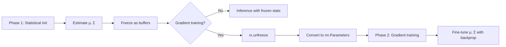
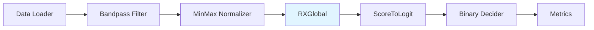

!!! warning "Status: Needs Review"
    This page has not been reviewed for accuracy and completeness. Content may be outdated or contain errors.

---

# Statistical Nodes

## Overview

Statistical nodes perform anomaly detection using classical statistical methods without neural networks. These nodes estimate background statistics (mean, covariance) and compute anomaly scores based on statistical distance metrics.

**Key characteristics:**
- No gradient-based training required (statistical initialization only)
- Fast inference with closed-form solutions
- Interpretable outputs based on statistical theory
- Can optionally be unfrozen for gradient-based fine-tuning (two-phase training)

**When to use:**
- Baseline anomaly detection without deep learning
- Limited training data scenarios
- Real-time inference requirements
- Interpretable statistical methods preferred

---

## Nodes in This Category

### RXGlobal

**Description:** Global RX (Reed-Xiaoli) anomaly detector using Mahalanobis distance with global background statistics

**Perfect for:**
- Classical anomaly detection baseline
- Hyperspectral anomaly detection without deep learning
- Two-phase training (statistical init → gradient fine-tuning)
- Real-time inference with precomputed covariance inverse

**Training Paradigm:** Statistical initialization (optionally two-phase with `unfreeze()`)

**Background Theory:**

RX detection computes the Mahalanobis distance between each pixel and the background distribution:

$$
\text{score}(x) = (x - \mu)^T \Sigma^{-1} (x - \mu)
$$

where:
- $\mu$ is the global mean vector (estimated from training data)
- $\Sigma$ is the global covariance matrix (estimated from training data)
- Higher scores indicate pixels further from the background distribution (potential anomalies)

**Statistical Estimation:**

Uses [Welford's online algorithm](https://www.johndcook.com/blog/standard_deviation/) for numerically stable streaming statistics:

```python
# Parallel batched updates with Welford's algorithm
delta = mean_batch - mean_global
mean_global = mean_global + delta * (n_batch / n_total)
M2_global = M2_global + M2_batch + outer(delta, delta) * (n_global * n_batch / n_total)
cov = M2 / (n - 1)
```

This allows processing large datasets that don't fit in memory.

#### Port Specifications

**Input Ports:**

| Port | Type | Shape | Description | Optional |
|------|------|-------|-------------|----------|
| data | float32 | (B,H,W,C) | Input hyperspectral cube BHWC | No |

**Output Ports:**

| Port | Type | Shape | Description |
|------|------|-------|-------------|
| scores | float32 | (B,H,W,1) | Anomaly scores (Mahalanobis distances) |

#### Parameters

| Parameter | Type | Default | Description |
|-----------|------|---------|-------------|
| num_channels | int | required | Number of spectral channels (C dimension) |
| eps | float | 1e-6 | Regularization for covariance matrix (added to diagonal) |
| cache_inverse | bool | True | Whether to cache covariance inverse for faster inference |

#### Example Usage (Python)

```python
from cuvis_ai.anomaly.rx_detector import RXGlobal
from cuvis_ai_schemas.execution import InputStream

# Create RX detector
rx = RXGlobal(num_channels=61, eps=1e-6, cache_inverse=True)

# Statistical initialization from initialization data
def initialization_stream() -> InputStream:
    for batch in initialization_loader:
        yield {"data": batch["cube"]}  # BHWC format

rx.statistical_initialization(initialization_stream())

# Use in pipeline
pipeline.add_nodes(rx=rx)
pipeline.connect(
    (normalizer.output, rx.data),
    (rx.scores, logit_head.scores)
)

# Optional: Enable gradient-based fine-tuning (two-phase training)
rx.unfreeze()  # Convert buffers to nn.Parameters
# Now rx.mu and rx.cov can be optimized with gradient descent
```

#### Example Configuration (YAML)

```yaml
nodes:
  rx_detector:
    type: RXGlobal
    config:
      num_channels: 61
      eps: 1e-6
      cache_inverse: true
    # Statistical init handled by StatisticalTrainer

connections:
  - [normalizer.output, rx_detector.data]
  - [rx_detector.scores, logit_head.scores]
```

#### Two-Phase Training Workflow



**Phase 1 (Statistical):**
- `statistical_initialization()` estimates μ and Σ from data stream
- Statistics stored as **buffers** (frozen, not trainable)
- Typical use: Baseline RX detection

**Phase 2 (Optional Gradient):**
- Call `unfreeze()` to convert buffers to `nn.Parameters`
- Enables gradient-based optimization of μ and Σ
- Use case: Fine-tune statistics with end-to-end loss

#### Performance Considerations

| Mode | Inference Speed | Memory | Accuracy |
|------|----------------|---------|----------|
| `cache_inverse=True` | **Fast** (einsum) | O(C²) | Standard |
| `cache_inverse=False` | Slower (solve) | O(C²) | Numerically stable |

**Recommendation:** Use `cache_inverse=True` for production inference unless numerical stability issues arise.

#### Common Issues

**1. "RXGlobal not initialized" error**

```python
# Problem: Forgot statistical initialization
rx = RXGlobal(num_channels=61)
pipeline.run(data)  # RuntimeError!

# Solution: Always call statistical_initialization() before inference
rx.statistical_initialization(initialization_stream())
```

**2. Singular covariance matrix**

```python
# Problem: Not enough samples or low-rank data
rx = RXGlobal(num_channels=61, eps=1e-10)  # eps too small

# Solution: Increase regularization
rx = RXGlobal(num_channels=61, eps=1e-4)  # Larger eps stabilizes
```

**3. High scores for normal pixels**

```python
# Problem: Training data not representative of normal background
# Solution: Ensure initialization data contains only normal pixels
def initialization_stream():
    for batch in loader:
        # Filter to normal pixels only
        if batch["mask"].sum() == 0:  # No anomalies
            yield {"data": batch["cube"]}
```

#### Workflow Integration

Typical RX detection pipeline:



#### See Also

- [Tutorial 1: RX Statistical Detection](../tutorials/rx-statistical.md) - Complete workflow
- [ScoreToLogit](utility.md#scoretologit) - Convert scores to logits
- [Two-Phase Training Concept](../concepts/two-phase-training.md)
- [BinaryDecider](utility.md#binarydecider) - Threshold RX scores
- API Reference: ::: cuvis_ai.anomaly.rx_detector.RXGlobal

---

### RXPerBatch

**Description:** Per-batch RX detector computing statistics independently for each image (no training required)

**Perfect for:**
- Stateless anomaly detection
- Each image has different background characteristics
- No initialization data available
- Quick prototyping without training

**Training Paradigm:** None (no initialization required)

**Key Difference from RXGlobal:**

| Aspect | RXGlobal | RXPerBatch |
|--------|----------|------------|
| Statistics | Global (from training) | Per-image (computed on-the-fly) |
| Requires training | Yes (statistical init) | **No** |
| Assumes | Consistent background | **Varying background per image** |
| Speed | Faster (precomputed Σ⁻¹) | Slower (computes Σ⁻¹ each forward) |
| Memory | Stores μ, Σ | No stored statistics |

#### Port Specifications

**Input Ports:**

| Port | Type | Shape | Description | Optional |
|------|------|-------|-------------|----------|
| data | float32 | (B,H,W,C) | Input hyperspectral cube BHWC | No |

**Output Ports:**

| Port | Type | Shape | Description |
|------|------|-------|-------------|
| scores | float32 | (B,H,W,1) | Per-batch anomaly scores |

#### Parameters

| Parameter | Type | Default | Description |
|-----------|------|---------|-------------|
| eps | float | 1e-6 | Regularization for covariance matrix |

#### Example Usage (Python)

```python
from cuvis_ai.anomaly.rx_detector import RXPerBatch

# Create per-batch RX detector (no initialization needed!)
rx = RXPerBatch(eps=1e-6)

# Use directly in pipeline (stateless)
pipeline.add_nodes(rx_per_batch=rx)
pipeline.connect(
    (normalizer.output, rx_per_batch.data),
    (rx_per_batch.scores, visualizer.scores)
)

# No statistical_initialization() required - works immediately
results = pipeline.run(test_data)
```

#### Example Configuration (YAML)

```yaml
nodes:
  rx_per_batch:
    type: RXPerBatch
    config:
      eps: 1e-6

connections:
  - [preprocessor.output, rx_per_batch.data]
  - [rx_per_batch.scores, heatmap.scores]
```

#### When to Use

**Use RXPerBatch when:**
- Each image has a unique background distribution
- No initialization/training data available
- Need quick anomaly detection without setup
- Inference speed is not critical

**Use RXGlobal when:**
- Background is consistent across images
- Calibration data available
- Need faster inference (precomputed inverse)
- Better anomaly detection accuracy with learned statistics

#### Common Issues

**1. Poor detection when background varies**

```python
# Problem: Using RXGlobal with varying backgrounds
rx_global = RXGlobal(num_channels=61)
rx_global.statistical_initialization(mixed_background_data)
# May perform poorly on images with different backgrounds

# Solution: Use RXPerBatch for adaptive detection
rx_per_batch = RXPerBatch(eps=1e-6)
# Automatically adapts to each image's background
```

**2. Anomalies affect per-batch statistics**

```python
# Problem: Large anomalies skew the per-image mean/covariance
# This is inherent to per-batch RX and reduces detection sensitivity

# Solution: Use RXGlobal with clean training data
from cuvis_ai_core.training import StatisticalTrainer

trainer = StatisticalTrainer(pipeline=pipeline, datamodule=datamodule)
trainer.fit()  # Initializes rx_global with clean training data
# Global statistics not affected by test-time anomalies
```

#### See Also

- [RXGlobal](#rxglobal) - Global statistics variant
- [Tutorial 1: RX Statistical Detection](../tutorials/rx-statistical.md)
- API Reference: ::: cuvis_ai.anomaly.rx_detector.RXPerBatch

---

## Comparison: RXGlobal vs RXPerBatch

| Feature | RXGlobal | RXPerBatch |
|---------|----------|------------|
| **Training Required** | Yes (statistical init) | **No** |
| **Background Assumption** | Consistent across dataset | **Varies per image** |
| **Inference Speed** | Fast (cached Σ⁻¹) | Slower (compute per batch) |
| **Memory Footprint** | O(C²) stored | O(C²) temporary |
| **Detection Quality** | Better with good initialization | Adaptive but less sensitive |
| **Two-Phase Training** | Supported (unfreeze) | Not applicable |
| **Use Case** | Production with training data | Quick prototyping, no training |

---

## Statistical Anomaly Detection Workflow

Complete example pipeline with statistical initialization:

```yaml
# Phase 1: Statistical Initialization
trainer:
  type: StatisticalTrainer
  max_steps: 1000  # Process initialization data

nodes:
  data:
    type: LentilsAnomalyDataNode
    config:
      normal_ids: [0]
      anomaly_ids: [1, 2, 3]

  normalizer:
    type: MinMaxNormalizer
    config:
      feature_range: [0.0, 1.0]
      dims: [1, 2]  # Normalize spatially

  rx:
    type: RXGlobal
    config:
      num_channels: 61
      eps: 1e-6
      cache_inverse: true

  logit_head:
    type: ScoreToLogit  # See Utility Nodes
    config:
      init_scale: 1.0
      init_bias: 0.0

  decider:
    type: BinaryDecider
    config:
      threshold: 0.5

connections:
  - [data.cube, normalizer.data]
  - [normalizer.output, rx.data]
  - [rx.scores, logit_head.scores]
  - [logit_head.logits, decider.scores]
```

**Training workflow:**

```python
# 1. Build pipeline from config
pipeline = build_pipeline_from_config(config)

# 2. Statistical initialization (Phase 1)
statistical_trainer = StatisticalTrainer(max_steps=1000)
statistical_trainer.fit(pipeline, train_datamodule)

# 3. Inference
test_results = pipeline.run(test_data)
```

---

## Additional Resources

- **Tutorial:** [RX Statistical Detection Tutorial](../tutorials/rx-statistical.md)
- **Concepts:** [Two-Phase Training](../concepts/two-phase-training.md)
- **Concepts:** [Statistical Initialization](../concepts/two-phase-training.md#phase-1-statistical-initialization)
- **Related Nodes:** [ScoreToLogit](utility.md#scoretologit), [BinaryDecider](utility.md#binarydecider)
- **API Reference:** [cuvis_ai.anomaly.rx_detector](../../api/anomaly/#rx_detector)
