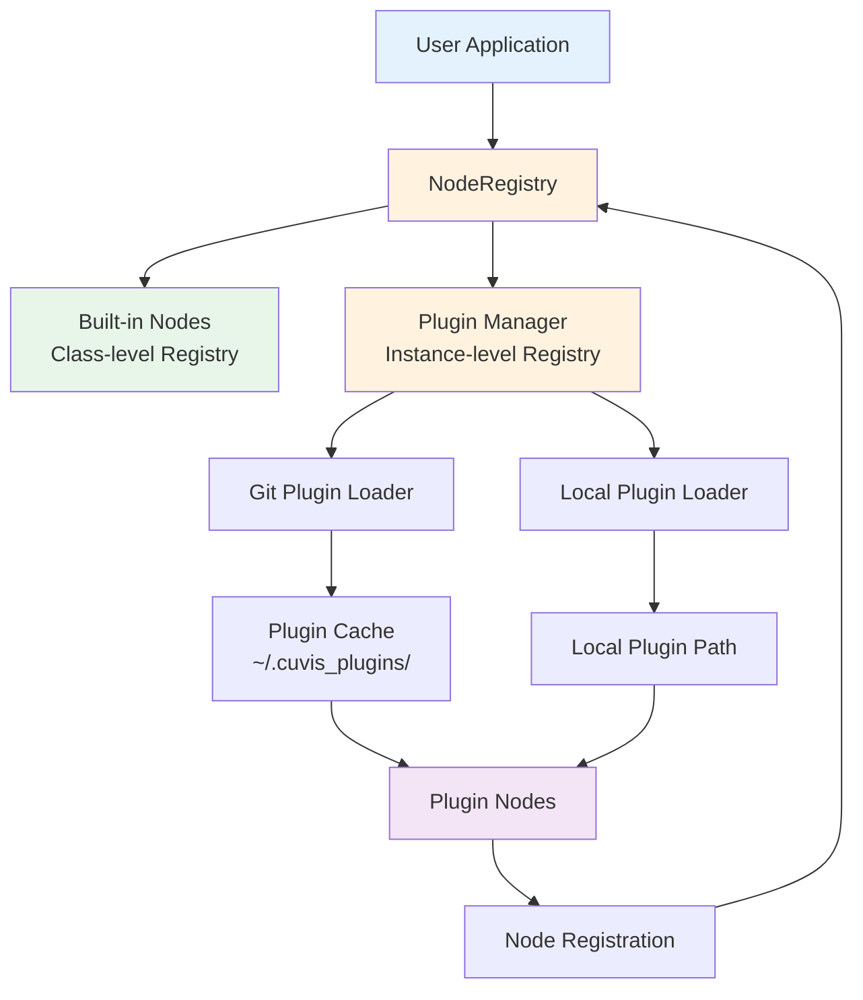
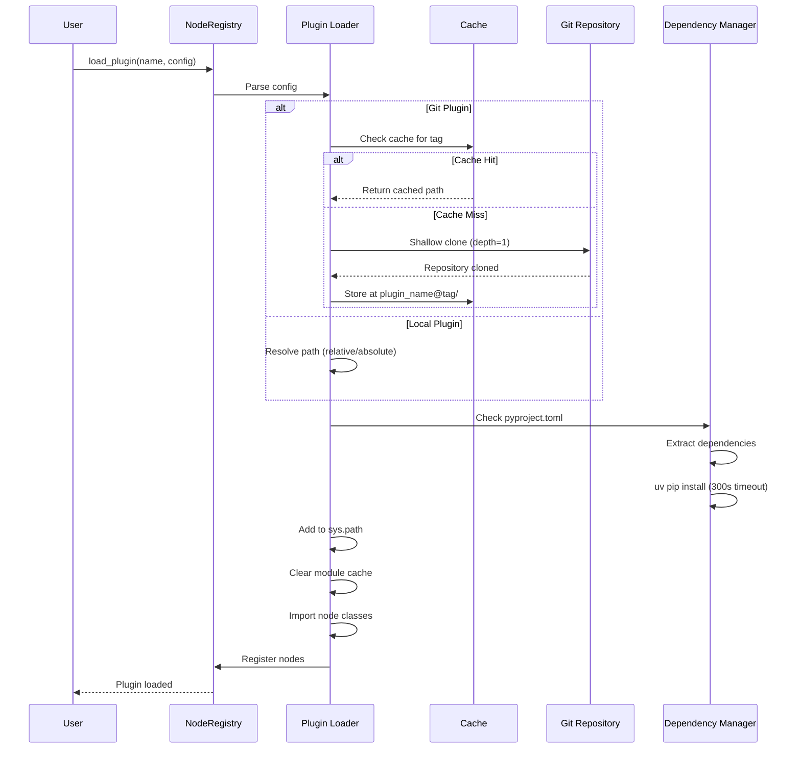

!!! warning "Status: Needs Review"
    This page has not been reviewed for accuracy and completeness. Content may be outdated or contain errors.

---

# Plugin Architecture

The cuvis-ai plugin system enables extensibility by allowing external packages to contribute nodes, configurations, and functionality to the core framework. This architecture keeps the core framework lean while enabling unlimited extensibility for domain-specific use cases.

## Why Plugins?

### Benefits

1. **Modularity** - Keep core framework lean and focused
2. **Extensibility** - Add custom nodes without modifying core
3. **Distribution** - Share implementations via Git or local paths
4. **Isolation** - Plugin failures don't crash core, session-based isolation
5. **Versioning** - Independent plugin versioning using Git tags
6. **Reproducibility** - Git tag-based distribution ensures deterministic builds

### Use Cases

- Custom anomaly detection algorithms (e.g., AdaCLIP)
- Domain-specific preprocessing nodes
- Proprietary model integrations
- Third-party tool connectors
- Research experiments without polluting core

## Plugin Architecture

### System Overview



### Core Components

#### 1. NodeRegistry

The central registry managing both built-in and plugin nodes.

**Hybrid Architecture:**

- **Class-level registry**: O(1) lookup for built-in nodes via `@register` decorator
- **Instance-level registry**: Per-session plugin loading for isolation
- **Benefits**: No overhead for built-ins, flexible plugin management

```python
from cuvis_ai_core.utils.node_registry import NodeRegistry

# Class-level access (built-in nodes)
BuiltinNode = NodeRegistry.get("MinMaxNormalizer")

# Instance-level access (plugin support)
registry = NodeRegistry()
registry.load_plugin(name="adaclip", config={...})
AdaCLIPNode = NodeRegistry.get("AdaCLIPDetector", instance=registry)
```

#### 2. Plugin Loaders

Two plugin loading mechanisms:

**Git Plugin Loader:**

- Clones repositories using shallow clone (`depth=1`)
- Checks out specific Git tags (no branches/commits for reproducibility)
- Caches plugins in `~/.cuvis_plugins/plugin_name@tag/`
- Verifies tag matches on subsequent loads

**Local Plugin Loader:**

- Loads plugins from local filesystem paths
- Supports both absolute and relative paths
- Ideal for development and private plugins

#### 3. Plugin Cache

**Location:** `~/.cuvis_plugins/` (Unix/Linux/macOS) or `C:\Users\{username}\.cuvis_plugins\` (Windows)

**Structure:**
```
~/.cuvis_plugins/
├── adaclip@v0.1.0/
│   ├── .git/
│   ├── cuvis_ai_adaclip/
│   └── pyproject.toml
├── adaclip@v0.1.1/
│   └── ...
└── custom-detector@v2.0.0/
    └── ...
```

**Features:**

- Automatic cache reuse if tag matches
- Tag verification prevents cache corruption
- Multiple versions can coexist
- Manual cache clearing via API

#### 4. Dependency Management

Automatic dependency installation from `pyproject.toml`:

```toml
[project]
name = "cuvis-ai-adaclip"
version = "0.1.1"
dependencies = [
    "cuvis-ai-core>=0.1.0",
    "torch>=2.9.1",
    "transformers>=4.36.0",
    "pillow>=10.0.0"
]
```

**Installation Process:**

- Extracts dependencies using `tomllib` (PEP 621 compliant)
- Installs via `uv pip install` for speed
- 300-second timeout with clear error messages
- Validates `pyproject.toml` presence

## Plugin Structure

### Required Files

```
my-cuvis-plugin/
├── pyproject.toml          # PEP 621 compliant project file (REQUIRED)
├── cuvis_ai_plugin/
│   ├── __init__.py
│   ├── nodes/
│   │   ├── __init__.py
│   │   └── custom_node.py  # Your node implementations
│   └── configs/
│       └── default.yaml     # Optional configurations
├── tests/
│   └── test_nodes.py
├── README.md
└── .gitignore
```

### Plugin Manifest (`plugins.yaml`)

The manifest defines plugin sources and provided nodes:

```yaml
plugins:
  # Git-based plugin with tagged release
  adaclip:
    repo: "https://github.com/cubert-hyperspectral/cuvis-ai-adaclip.git"
    tag: "v0.1.1"
    provides:
      - cuvis_ai_adaclip.node.adaclip_node.AdaCLIPDetector

  # Pre-release tag support
  experimental:
    repo: "git@github.com:company/experimental-features.git"
    tag: "v2.0.0-beta.1"
    provides:
      - experimental.features.NewFeatureNode
      - experimental.features.HelperNode

  # Local development plugin (relative path)
  local_dev:
    path: "../my-custom-plugin"
    provides:
      - my_plugin.custom.CustomNode

  # Local plugin (absolute path)
  production_local:
    path: "/absolute/path/to/plugin"
    provides:
      - production_plugin.MainNode
```

### Manifest Schema

**Git Plugin Configuration:**
```python
{
    "repo": str,           # SSH or HTTPS URL
    "tag": str,            # Git tag (e.g., v1.2.3, v0.1.0-alpha)
    "provides": List[str]  # Fully-qualified class paths
}
```

**Local Plugin Configuration:**
```python
{
    "path": str,           # Absolute or relative path
    "provides": List[str]  # Fully-qualified class paths
}
```

### Validation Rules

- **Plugin Names**: Must be valid Python identifiers
- **Class Paths**: Must be fully-qualified (package.module.ClassName)
- **Git URLs**: Must start with `git@`, `https://`, or `http://`
- **Tags**: Git tags only (no branches or commit hashes)
- **Provides**: At least one class path required
- **Dependencies**: Must have `pyproject.toml` for Git plugins

## Plugin Loading

### Loading Flow



### Single Plugin Load

```python
from cuvis_ai_core.utils.node_registry import NodeRegistry

registry = NodeRegistry()

# Load from Git repository
registry.load_plugin(
    name="adaclip",
    config={
        "repo": "https://github.com/cubert-hyperspectral/cuvis-ai-adaclip.git",
        "tag": "v0.1.1",
        "provides": ["cuvis_ai_adaclip.node.adaclip_node.AdaCLIPDetector"]
    }
)

# Load from local path
registry.load_plugin(
    name="custom",
    config={
        "path": "../my-custom-plugin",
        "provides": ["my_plugin.nodes.CustomNode"]
    }
)
```

### Manifest-Based Load

Load multiple plugins from a YAML manifest:

```python
registry = NodeRegistry()
registry.load_plugins("path/to/plugins.yaml")

# All plugins from manifest are now loaded
AdaCLIPDetector = NodeRegistry.get("AdaCLIPDetector", instance=registry)
CustomNode = NodeRegistry.get("CustomNode", instance=registry)
```

### CLI Integration

#### restore-pipeline

Restore and run pipelines with plugin support:

```bash
# Display pipeline information
uv run restore-pipeline --pipeline-path configs/pipeline/anomaly/adaclip/adaclip_baseline.yaml

# Load plugins from manifest
uv run restore-pipeline \
    --pipeline-path configs/pipeline/anomaly/adaclip/adaclip_baseline.yaml \
    --plugins-path configs/plugins/registry.yaml

# Run inference with plugins
uv run restore-pipeline \
    --pipeline-path configs/pipeline/anomaly/adaclip/adaclip_baseline.yaml \
    --plugins-path configs/plugins/registry.yaml \
    --cu3s-file-path data/test_sample.cu3s

# Export pipeline visualization
uv run restore-pipeline \
    --pipeline-path configs/pipeline/anomaly/adaclip/adaclip_baseline.yaml \
    --plugins-path configs/plugins/registry.yaml \
    --pipeline-vis-ext png
```

#### restore-trainrun

Restore training runs with plugin support:

```bash
# Display trainrun information
uv run restore-trainrun \
    --trainrun-path outputs/trained_models/trainrun.yaml

# Re-run training with plugins
uv run restore-trainrun \
    --trainrun-path outputs/trained_models/trainrun.yaml \
    --mode train \
    --override training.optimizer.lr=0.001

# Validation mode
uv run restore-trainrun \
    --trainrun-path outputs/trained_models/trainrun.yaml \
    --mode validate
```

## Plugin Cache Management

### Set Custom Cache Directory

```python
from cuvis_ai_core.utils.node_registry import NodeRegistry

# Change cache location
NodeRegistry.set_cache_dir("/path/to/custom/cache")
```

### Clear Plugin Cache

```python
# Clear all plugin caches
NodeRegistry.clear_plugin_cache()

# Clear specific plugin
NodeRegistry.clear_plugin_cache("adaclip")
```

**Manual Cache Cleanup:**
```bash
# Unix/Linux/macOS
rm -rf ~/.cuvis_plugins/

# Windows PowerShell
Remove-Item -Recurse -Force $env:USERPROFILE\.cuvis_plugins\
```

## See Also

- **[Plugin Internals](internals.md)** - Node registration, isolation, versioning, security, and troubleshooting
- **[Node System Deep Dive](../concepts/node-system-deep-dive.md)** - Understand node architecture
- **[Pipeline Lifecycle](../concepts/pipeline-lifecycle.md)** - Pipeline integration
- **[gRPC API Reference](../grpc/api-session.md)** - Remote plugin loading
