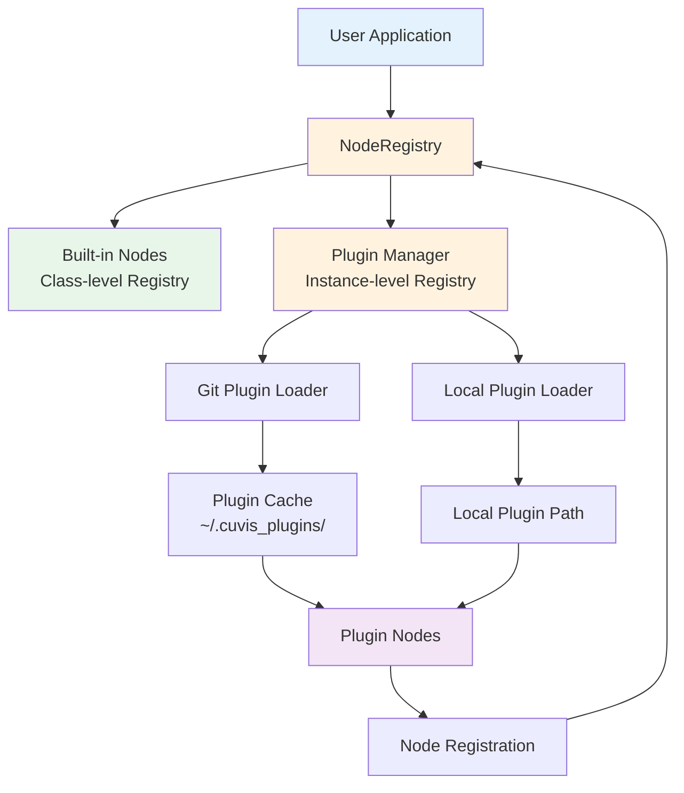
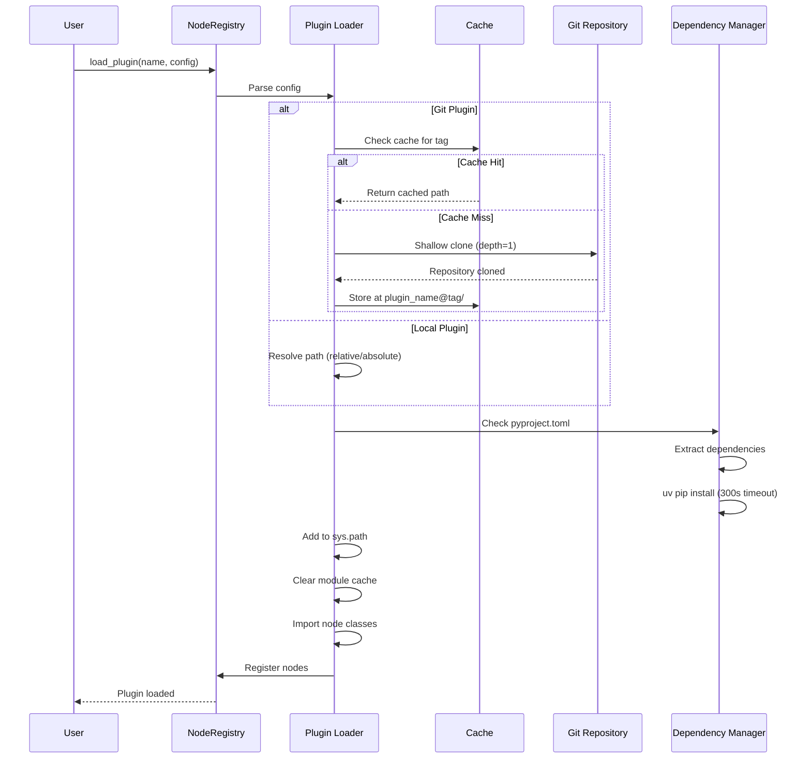
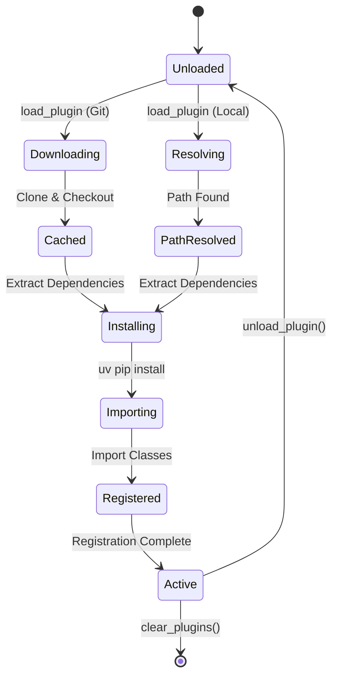

!!! warning "Status: Needs Review"
    This page has not been reviewed for accuracy and completeness. Content may be outdated or contain errors.

---

# Plugin System Overview

The cuvis-ai plugin system enables extensibility by allowing external packages to contribute nodes, configurations, and functionality to the core framework. This architecture keeps the core framework lean while enabling unlimited extensibility for domain-specific use cases.

## Why Plugins?

### Benefits

1. **Modularity** - Keep core framework lean and focused
2. **Extensibility** - Add custom nodes without modifying core
3. **Distribution** - Share implementations via Git or local paths
4. **Isolation** - Plugin failures don't crash core, session-based isolation
5. **Versioning** - Independent plugin versioning using Git tags
6. **Reproducibility** - Git tag-based distribution ensures deterministic builds

### Use Cases

- Custom anomaly detection algorithms (e.g., AdaCLIP)
- Domain-specific preprocessing nodes
- Proprietary model integrations
- Third-party tool connectors
- Research experiments without polluting core

## Plugin Architecture

### System Overview



### Core Components

#### 1. NodeRegistry

The central registry managing both built-in and plugin nodes.

**Hybrid Architecture:**
- **Class-level registry**: O(1) lookup for built-in nodes via `@register` decorator
- **Instance-level registry**: Per-session plugin loading for isolation
- **Benefits**: No overhead for built-ins, flexible plugin management

```python
from cuvis_ai_core.utils.node_registry import NodeRegistry

# Class-level access (built-in nodes)
BuiltinNode = NodeRegistry.get("MinMaxNormalizer")

# Instance-level access (plugin support)
registry = NodeRegistry()
registry.load_plugin(name="adaclip", config={...})
AdaCLIPNode = NodeRegistry.get("AdaCLIPDetector", instance=registry)
```

#### 2. Plugin Loaders

Two plugin loading mechanisms:

**Git Plugin Loader:**
- Clones repositories using shallow clone (`depth=1`)
- Checks out specific Git tags (no branches/commits for reproducibility)
- Caches plugins in `~/.cuvis_plugins/plugin_name@tag/`
- Verifies tag matches on subsequent loads

**Local Plugin Loader:**
- Loads plugins from local filesystem paths
- Supports both absolute and relative paths
- Ideal for development and private plugins

#### 3. Plugin Cache

**Location:** `~/.cuvis_plugins/` (Unix/Linux/macOS) or `C:\Users\{username}\.cuvis_plugins\` (Windows)

**Structure:**
```
~/.cuvis_plugins/
├── adaclip@v0.1.0/
│   ├── .git/
│   ├── cuvis_ai_adaclip/
│   └── pyproject.toml
├── adaclip@v0.1.1/
│   └── ...
└── custom-detector@v2.0.0/
    └── ...
```

**Features:**
- Automatic cache reuse if tag matches
- Tag verification prevents cache corruption
- Multiple versions can coexist
- Manual cache clearing via API

#### 4. Dependency Management

Automatic dependency installation from `pyproject.toml`:

```toml
[project]
name = "cuvis-ai-adaclip"
version = "0.1.1"
dependencies = [
    "cuvis-ai-core>=0.1.0",
    "torch>=2.9.1",
    "transformers>=4.36.0",
    "pillow>=10.0.0"
]
```

**Installation Process:**
- Extracts dependencies using `tomllib` (PEP 621 compliant)
- Installs via `uv pip install` for speed
- 300-second timeout with clear error messages
- Validates `pyproject.toml` presence

## Plugin Structure

### Required Files

```
my-cuvis-plugin/
├── pyproject.toml          # PEP 621 compliant project file (REQUIRED)
├── cuvis_ai_plugin/
│   ├── __init__.py
│   ├── nodes/
│   │   ├── __init__.py
│   │   └── custom_node.py  # Your node implementations
│   └── configs/
│       └── default.yaml     # Optional configurations
├── tests/
│   └── test_nodes.py
├── README.md
└── .gitignore
```

### Plugin Manifest (`plugins.yaml`)

The manifest defines plugin sources and provided nodes:

```yaml
plugins:
  # Git-based plugin with tagged release
  adaclip:
    repo: "https://github.com/cubert-hyperspectral/cuvis-ai-adaclip.git"
    tag: "v0.1.1"
    provides:
      - cuvis_ai_adaclip.node.adaclip_node.AdaCLIPDetector

  # Pre-release tag support
  experimental:
    repo: "git@github.com:company/experimental-features.git"
    tag: "v2.0.0-beta.1"
    provides:
      - experimental.features.NewFeatureNode
      - experimental.features.HelperNode

  # Local development plugin (relative path)
  local_dev:
    path: "../my-custom-plugin"
    provides:
      - my_plugin.custom.CustomNode

  # Local plugin (absolute path)
  production_local:
    path: "/absolute/path/to/plugin"
    provides:
      - production_plugin.MainNode
```

### Manifest Schema

**Git Plugin Configuration:**
```python
{
    "repo": str,           # SSH or HTTPS URL
    "tag": str,            # Git tag (e.g., v1.2.3, v0.1.0-alpha)
    "provides": List[str]  # Fully-qualified class paths
}
```

**Local Plugin Configuration:**
```python
{
    "path": str,           # Absolute or relative path
    "provides": List[str]  # Fully-qualified class paths
}
```

### Validation Rules

- **Plugin Names**: Must be valid Python identifiers
- **Class Paths**: Must be fully-qualified (package.module.ClassName)
- **Git URLs**: Must start with `git@`, `https://`, or `http://`
- **Tags**: Git tags only (no branches or commit hashes)
- **Provides**: At least one class path required
- **Dependencies**: Must have `pyproject.toml` for Git plugins

## Plugin Loading

### Loading Flow



### Single Plugin Load

```python
from cuvis_ai_core.utils.node_registry import NodeRegistry

registry = NodeRegistry()

# Load from Git repository
registry.load_plugin(
    name="adaclip",
    config={
        "repo": "https://github.com/cubert-hyperspectral/cuvis-ai-adaclip.git",
        "tag": "v0.1.1",
        "provides": ["cuvis_ai_adaclip.node.adaclip_node.AdaCLIPDetector"]
    }
)

# Load from local path
registry.load_plugin(
    name="custom",
    config={
        "path": "../my-custom-plugin",
        "provides": ["my_plugin.nodes.CustomNode"]
    }
)
```

### Manifest-Based Load

Load multiple plugins from a YAML manifest:

```python
registry = NodeRegistry()
registry.load_plugins("path/to/plugins.yaml")

# All plugins from manifest are now loaded
AdaCLIPDetector = NodeRegistry.get("AdaCLIPDetector", instance=registry)
CustomNode = NodeRegistry.get("CustomNode", instance=registry)
```

### CLI Integration

#### restore-pipeline

Restore and run pipelines with plugin support:

```bash
# Display pipeline information
uv run restore-pipeline --pipeline-path configs/pipeline/adaclip_baseline.yaml

# Load plugins from manifest
uv run restore-pipeline \
    --pipeline-path configs/pipeline/adaclip_baseline.yaml \
    --plugins-path examples/adaclip/plugins.yaml

# Run inference with plugins
uv run restore-pipeline \
    --pipeline-path configs/pipeline/adaclip_baseline.yaml \
    --plugins-path examples/adaclip/plugins.yaml \
    --cu3s-file-path data/test_sample.cu3s

# Export pipeline visualization
uv run restore-pipeline \
    --pipeline-path configs/pipeline/adaclip_baseline.yaml \
    --plugins-path examples/adaclip/plugins.yaml \
    --pipeline-vis-ext png
```

#### restore-trainrun

Restore training runs with plugin support:

```bash
# Display trainrun information
uv run restore-trainrun \
    --trainrun-path outputs/trained_models/trainrun.yaml

# Re-run training with plugins
uv run restore-trainrun \
    --trainrun-path outputs/trained_models/trainrun.yaml \
    --mode train \
    --override training.optimizer.lr=0.001

# Validation mode
uv run restore-trainrun \
    --trainrun-path outputs/trained_models/trainrun.yaml \
    --mode validate
```

## Plugin Cache Management

### Set Custom Cache Directory

```python
from cuvis_ai_core.utils.node_registry import NodeRegistry

# Change cache location
NodeRegistry.set_cache_dir("/path/to/custom/cache")
```

### Clear Plugin Cache

```python
# Clear all plugin caches
NodeRegistry.clear_plugin_cache()

# Clear specific plugin
NodeRegistry.clear_plugin_cache("adaclip")
```

**Manual Cache Cleanup:**
```bash
# Unix/Linux/macOS
rm -rf ~/.cuvis_plugins/

# Windows PowerShell
Remove-Item -Recurse -Force $env:USERPROFILE\.cuvis_plugins\
```

## Node Registration

### Automatic Registration

Nodes defined in the manifest's `provides` list are registered automatically when the plugin loads:

```python
registry = NodeRegistry()
registry.load_plugin(
    name="adaclip",
    config={
        "repo": "https://github.com/cubert-hyperspectral/cuvis-ai-adaclip.git",
        "tag": "v0.1.1",
        "provides": ["cuvis_ai_adaclip.node.adaclip_node.AdaCLIPDetector"]
    }
)

# Node automatically registered and retrievable
AdaCLIPDetector = NodeRegistry.get("AdaCLIPDetector", instance=registry)
```

### Node Retrieval Resolution Order

**Instance Mode** (when registry has plugins loaded):
1. Check instance `plugin_registry` for class name
2. Check instance `plugin_registry` for last component of full path
3. Check built-in `_builtin_registry` (O(1) lookup)
4. Try full import path via `importlib`

**Class Mode** (built-ins only):
1. Check built-in registry
2. Try importlib for full paths

```python
# Short name (class name only)
Node = NodeRegistry.get("AdaCLIPDetector", instance=registry)

# Full path
Node = NodeRegistry.get(
    "cuvis_ai_adaclip.node.adaclip_node.AdaCLIPDetector",
    instance=registry
)
```

### Using Plugin Nodes

```python
from cuvis_ai_core.utils.node_registry import NodeRegistry
from cuvis_ai_core.pipeline.pipeline import Pipeline

# Load plugins
registry = NodeRegistry()
registry.load_plugins("plugins.yaml")

# Get node class
AdaCLIPDetector = NodeRegistry.get("AdaCLIPDetector", instance=registry)

# Use in pipeline
pipeline_dict = {
    "nodes": [
        {
            "class_name": "AdaCLIPDetector",
            "name": "adaclip_detector",
            "params": {
                "prompt": "plastic wrapper",
                "threshold": 0.5
            }
        }
    ],
    "edges": [...]
}

pipeline = Pipeline.from_dict(pipeline_dict, node_registry=registry)
```

## Plugin Isolation

### Session-Based Isolation

Each `NodeRegistry` instance maintains independent plugin registries:

```python
# Session 1
registry1 = NodeRegistry()
registry1.load_plugin(name="adaclip", config={...})

# Session 2 (independent)
registry2 = NodeRegistry()
registry2.load_plugin(name="custom", config={...})

# Sessions don't interfere
assert "AdaCLIPDetector" in registry1.plugin_registry
assert "AdaCLIPDetector" not in registry2.plugin_registry
```

### Error Handling

Plugin loading errors don't crash the core:

```python
from cuvis_ai_core.utils.node_registry import NodeRegistry

registry = NodeRegistry()

try:
    registry.load_plugin(
        name="broken-plugin",
        config={"repo": "...", "tag": "v1.0.0", "provides": [...]}
    )
except Exception as e:
    print(f"Plugin failed to load: {e}")
    # Core continues running
```

### Helpful Error Messages

When a plugin node is not found, the system provides helpful diagnostics:

```
Node 'cuvis_ai_adaclip.node.adaclip_node.AdaCLIPDetector' not found in registry.

⚠️  This appears to be an external plugin node!
   Did you forget to load plugins?

   For CLI usage:
     uv run restore-pipeline --pipeline-path <path> --plugins-path plugins.yaml

   For Python usage:
     registry = NodeRegistry()
     registry.load_plugins('path/to/plugins.yaml')
```

## Plugin Versioning

### Semantic Versioning

Plugins should follow semver with Git tags: `MAJOR.MINOR.PATCH`

- **MAJOR:** Breaking API changes
- **MINOR:** New features, backwards compatible
- **PATCH:** Bug fixes

**Examples:**
- `v1.0.0` - Stable release
- `v2.1.3` - Minor version with patches
- `v0.1.0-alpha` - Pre-release (alpha)
- `v2.0.0-beta.1` - Pre-release (beta)

### Version Constraints

In your plugin's `pyproject.toml`:

```toml
[project]
name = "my-cuvis-plugin"
version = "1.0.0"
dependencies = [
    "cuvis-ai-core>=0.1.0,<2.0.0",  # SemVer range
    "numpy>=1.20.0",
    "torch>=2.0.0"
]
```

### Managing Multiple Versions

Multiple plugin versions can coexist in cache:

```
~/.cuvis_plugins/
├── adaclip@v0.1.0/
├── adaclip@v0.1.1/
└── adaclip@v0.2.0/
```

Load specific version:

```python
registry.load_plugin(
    name="adaclip",
    config={
        "repo": "https://github.com/cubert-hyperspectral/cuvis-ai-adaclip.git",
        "tag": "v0.1.0",  # Specific version
        "provides": ["cuvis_ai_adaclip.node.adaclip_node.AdaCLIPDetector"]
    }
)
```

## Security Considerations

### Trust Model

- **Official plugins:** Verified and maintained by cuvis team
- **Community plugins:** User responsibility to vet and audit
- **Private plugins:** Under your organization's control

### Best Practices

1. **Review plugin source** before installing from Git
2. **Check plugin author** and repository reputation
3. **Use specific tags** (not branches) for reproducibility
4. **Audit dependencies** in `pyproject.toml`
5. **Test plugins in isolation** before production use
6. **Pin versions** in manifests for production

### Dependency Security

```toml
# ✅ Good: Specific versions
[project]
dependencies = [
    "torch==2.9.1",
    "numpy>=1.20.0,<2.0.0"
]

# ⚠️ Avoid: Unpinned versions in production
[project]
dependencies = [
    "torch",  # Any version - risky!
    "numpy>=1.0.0"  # Too broad
]
```

## Plugin Lifecycle

### Plugin Methods

| Method | Purpose |
|--------|---------|
| `load_plugin(name, config)` | Load single plugin into instance |
| `load_plugins(manifest_path)` | Load multiple plugins from YAML |
| `unload_plugin(name)` | Remove plugin and its nodes |
| `list_plugins()` | Get loaded plugin names |
| `clear_plugins()` | Unload all plugins in instance |
| `set_cache_dir(path)` | Change plugin cache location |
| `clear_plugin_cache(name)` | Clear cached plugin files |

### Plugin Lifecycle States



## Performance Considerations

### Git Plugin Caching

- **First load:** Full clone (~5-30 seconds depending on repo size)
- **Subsequent loads:** Cache hit (~<1 second)
- **Optimization:** Shallow clone with `depth=1` reduces clone time

### Module Cache Clearing

When loading plugins, the system clears Python's module cache to prevent conflicts:

```python
# Clears all modules matching plugin package prefixes
clear_package_modules(["cuvis_ai_adaclip", "my_plugin"])
```

**Impact:**
- Prevents version conflicts
- Ensures fresh imports
- Minimal overhead (<100ms)

### Dependency Installation

- **Tool:** Uses `uv pip install` for speed (~3-10x faster than pip)
- **Timeout:** 300 seconds
- **Caching:** Python packages cached by uv/pip

## gRPC Plugin Service

For remote execution, plugins can be loaded via gRPC:

```python
from cuvis_ai_core.grpc.plugin_service import PluginService

# gRPC session maintains independent NodeRegistry
session.node_registry.load_plugins("plugins.yaml")

# Nodes available in session
nodes = session.list_available_nodes()
```

**Features:**
- Session-based isolation
- Remote plugin loading
- Port spec extraction for clients
- Plugin info queries

See [gRPC Plugin Integration](../grpc/client-patterns.md#plugin-management) for details.

## Troubleshooting

### Plugin Not Loading

**Symptom:**
```
Error: Failed to load plugin 'my-plugin'
```

**Solutions:**
1. Check Git URL is correct and accessible
2. Verify tag exists in repository: `git ls-remote --tags <repo_url>`
3. Ensure `pyproject.toml` exists in plugin root
4. Check dependencies can be installed
5. Review error logs for specific failure

### Node Not Found After Loading

**Symptom:**
```
NodeNotFoundError: Node 'CustomNode' not found
```

**Solutions:**
1. Verify `provides` list in manifest includes full class path
2. Check class name spelling matches exactly
3. Ensure plugin loaded successfully (no errors)
4. Use `registry.list_plugins()` to verify plugin is loaded
5. Try full path: `NodeRegistry.get("pkg.module.CustomNode", instance=registry)`

### Import Errors

**Symptom:**
```
ImportError: cannot import name 'CustomNode' from 'my_plugin.nodes'
```

**Solutions:**
1. Verify `__init__.py` files exist in package directories
2. Check class path in `provides` is correct
3. Ensure all dependencies installed (check `pyproject.toml`)
4. Try importing manually to diagnose: `python -c "from my_plugin.nodes import CustomNode"`

### Cache Corruption

**Symptom:**
```
Error: Tag mismatch in cache for plugin 'my-plugin'
```

**Solutions:**
1. Clear plugin cache: `NodeRegistry.clear_plugin_cache("my-plugin")`
2. Or manually delete: `rm -rf ~/.cuvis_plugins/my-plugin@*`
3. Reload plugin: `registry.load_plugin(...)`

### Dependency Conflicts

**Symptom:**
```
Error: Dependency conflict: package X requires Y>=2.0, but 1.5 is installed
```

**Solutions:**
1. Update conflicting package: `pip install --upgrade <package>`
2. Use compatible plugin version
3. Create isolated virtual environment
4. Check `pyproject.toml` for version constraints

## See Also

- **[Plugin Development Guide](development.md)** - Create your own plugins
- **[Plugin Usage Guide](usage.md)** - Use plugins in your workflows
- **[Node System Deep Dive](../concepts/node-system-deep-dive.md)** - Understand node architecture
- **[Pipeline Lifecycle](../concepts/pipeline-lifecycle.md)** - Pipeline integration
- **[gRPC API Reference](../grpc/api-reference.md)** - Remote plugin loading
