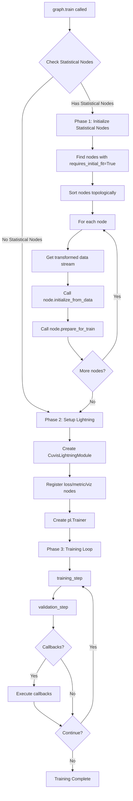
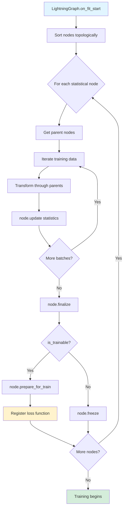
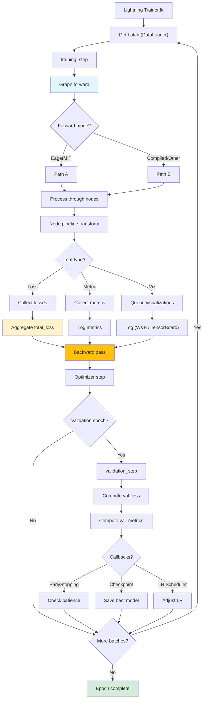
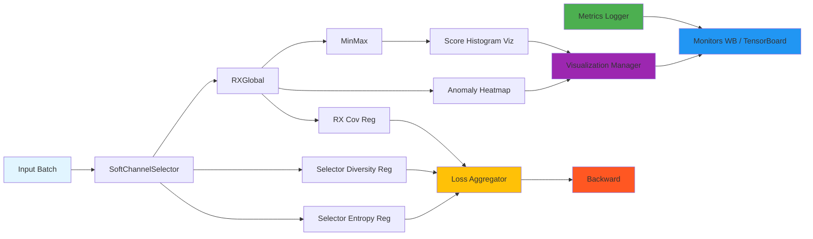

# Architecture

This page documents the CUVIS.AI architecture with detailed diagrams showing the training lifecycle, data flow, and system components.

## Complete Training Lifecycle

The training process flows through three main phases:

## Statistical Initialization Phase

Phase 1 initializes statistical nodes before gradient-based training:

## Training Loop (Detailed)

The training loop handles forward pass, loss aggregation, and optimization:

## Data Flow with Leaf Nodes

This diagram shows how data flows through nodes and how leaf nodes attach for losses, metrics, and visualizations:

## Two-Phase Training Strategy

CUVIS.AI uses a two-phase training approach:

### Phase 1: Statistical Initialization
- **Purpose**: Bootstrap models with efficient statistical methods
- **Nodes**: RX detector (mean/covariance), PCA (SVD), MinMaxNormalizer
- **Speed**: Fast, typically seconds to minutes
- **Hardware**: Can run on CPU

### Phase 2: Gradient Training
- **Purpose**: Fine-tune initialized models with backpropagation
- **Nodes**: All trainable nodes receive gradients
- **Speed**: Slower, depends on model size and data
- **Hardware**: GPU recommended

## Node Types

### Processing Nodes
- **MinMaxNormalizer**: Min-max normalization with running statistics
- **StandardNormalizer**: Z-score normalization
- **SoftChannelSelector**: Learnable channel selection

### Feature Extraction
- **TrainablePCA**: SVD-based PCA with gradient fine-tuning
- **ConvBlock**: Convolutional feature extraction

### Anomaly Detection
- **RXGlobal**: Reed-Xiaoli global anomaly detector
- **RXLogitHead**: Trainable anomaly threshold

## Leaf Node Types

### Loss Nodes
- Attach to parent nodes to provide training signals
- Examples: OrthogonalityLoss, AnomalyBCEWithLogits, SelectorEntropyRegularizer

### Metric Nodes
- Compute and track metrics during training
- Examples: ExplainedVarianceMetric, AnomalyDetectionMetrics

### Visualization Nodes
- Generate visualizations at specified intervals
- Examples: PCAVisualization, AnomalyHeatmap, ScoreHistogram

### Monitoring Nodes
- Forward metrics and artifacts to external backends
- Examples: WandBMonitor, TensorBoardMonitor

## Next Steps

- **[Features](features.md)**: Detailed feature matrix
- **[API Reference](../api/pipeline.md)**: Complete API documentation
- **[Tutorials](../tutorials/phase1_statistical.md)**: Step-by-step guides
