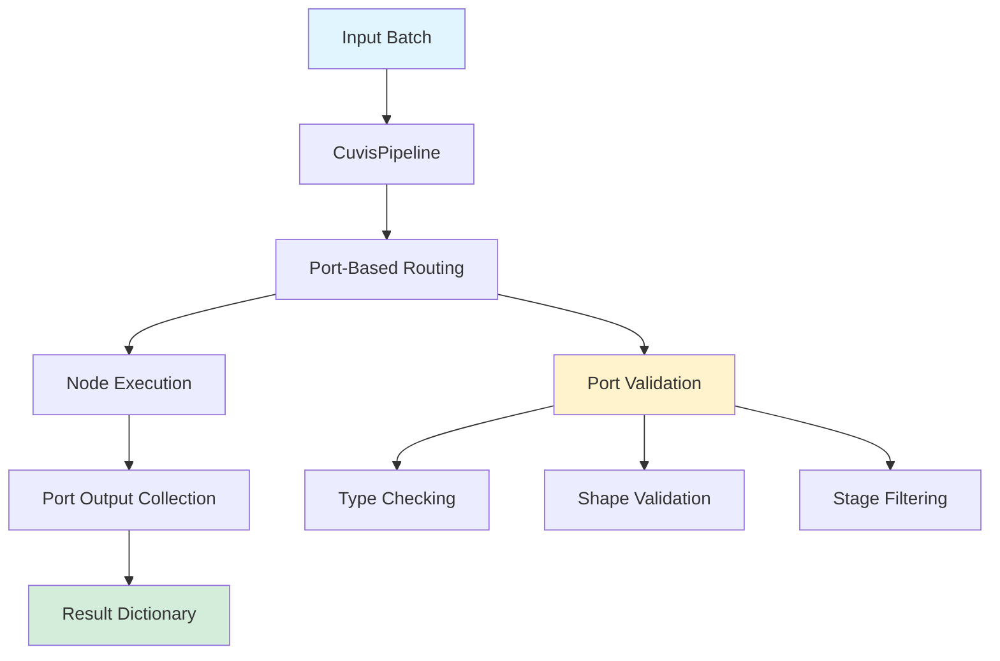
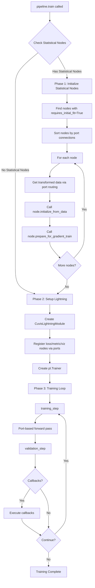
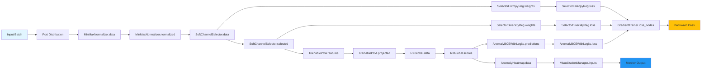

# Architecture

This page documents the CUVIS.AI architecture with detailed diagrams showing the training lifecycle, data flow, and system components, including the new **Typed I/O system**.

## Port-Based Architecture Overview

CUVIS.AI now uses a port-based architecture where nodes communicate through typed input/output ports. This provides type safety, better error messages, and more flexible pipeline construction.



## Complete Training Lifecycle

The training process flows through three main phases with port-based execution:



## Port-Based Data Flow

This diagram shows how data flows through port connections and how leaf nodes attach via ports:



## Port-Based Forward Pass

The new forward pass uses port-based routing and returns a dictionary with port keys:

```mermaid
%%{init: {'flowchart': {'nodeSpacing': 20, 'rankSpacing': 30}} }%%
flowchart TD
    A["pipeline.forward(batch=...)"] --> B[Port-Based Batch Distribution]
    B --> C[Resolve Input Ports]
    C --> D[Topological Sort by Port Connections]
    D --> E[For each node in order]
    E --> F[Collect inputs from connected output ports]
    F --> G[Execute node.forward(**inputs)]
    G --> H[Store outputs in port dictionary]
    H --> I{More nodes?}
    I -->|Yes| E
    I -->|No| J[Return port output dictionary]
    
    B --> K[Port Validation]
    K --> L[Type Checking]
    K --> M[Shape Compatibility]
    K --> N[Stage Filtering]
    
    style A fill:#e1f5ff
    style J fill:#d4edda
    style K fill:#fff3cd
```

## Typed I/O System Benefits

### Type Safety
- Runtime validation of port compatibility
- Clear error messages for type mismatches
- Prevention of invalid connections

### Flexible Pipeline Construction
- Explicit port-based connections: `pipeline.connect(source.port, target.port)`
- Variadic ports for fan-in/out (e.g., monitoring nodes that consume multiple inputs)
- Stage-aware execution filtering

### Better Debugging
- Port-specific error messages
- Connection graph visualization
- Batch distribution tracking

## Two-Phase Training Strategy with Ports

CUVIS.AI uses a two-phase training approach with port-based execution:

### Phase 1: Statistical Initialization
- **Purpose**: Bootstrap models with efficient statistical methods
- **Nodes**: RX detector (mean/covariance), PCA (SVD), MinMaxNormalizer
- **Port Flow**: Data flows through port connections for statistical computation
- **Speed**: Fast, typically seconds to minutes
- **Hardware**: Can run on CPU

### Phase 2: Gradient Training
- **Purpose**: Fine-tune initialized models with backpropagation
- **Nodes**: All trainable nodes receive gradients via port connections
- **Port Flow**: Gradients flow backward through port connections
- **Speed**: Slower, depends on model size and data
- **Hardware**: GPU recommended

## Node Types with Port Specifications

### Processing Nodes
- **MinMaxNormalizer**:
  - Input: `data` (raw cube)
  - Output: `normalized` (normalized cube)
- **StandardNormalizer**:
  - Input: `data` (raw cube)
  - Output: `normalized` (standardized cube)
- **SoftChannelSelector**:
  - Input: `data` (cube)
  - Output: `selected` (selected channels)

### Feature Extraction
- **TrainablePCA**:
  - Input: `features` (input features)
  - Output: `projected` (PCA features), `explained_variance`

### Anomaly Detection
- **RXGlobal**:
  - Input: `data` (features)
  - Output: `scores` (anomaly scores), `logits`
- **RXLogitHead**:
  - Input: `scores` (anomaly scores)
  - Output: `logits` (transformed scores)

## Port-Based Leaf Node Attachment

### Loss Nodes
- Attach via port connections: `pipeline.connect(node.output, loss.input)`
- Register each node directly with `GradientTrainer(loss_nodes=[...])`; no aggregator needed
- Examples: OrthogonalityLoss, AnomalyBCEWithLogits, SelectorEntropyRegularizer

### Metric Nodes
- Connect to output ports for metric computation
- Examples: AccuracyMetric, AUCMetric

### Visualization Nodes
- Attach to output ports for visualization generation
- Examples: AnomalyHeatmap, PCAVisualization

## Migration from Legacy API

The port-based system replaces the legacy tuple-based API:

**Before (Legacy):**
```python
graph.add_node(normalizer)
graph.add_node(selector, parent=normalizer)
output, _, _ = graph(input_data)
```

**After (Port-based):**
```python
pipeline.connect(normalizer.normalized, selector.data)
outputs = pipeline.forward(batch={f"{normalizer.id}.data": input_data})
```

## Next Steps

- **[Ports API](../api/ports.md)**: Detailed port system documentation
- **[Migration Guide](../user-guide/typed-io-migration.md)**: Transition guide from legacy API
- **[API Reference](../api/pipeline.md)**: Complete API documentation
- **[Tutorials](../tutorials/phase1_statistical.md)**: Step-by-step guides with port examples
