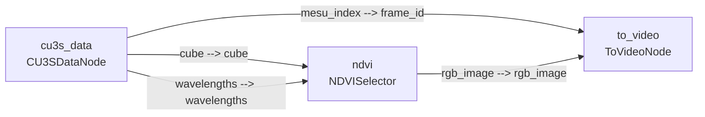
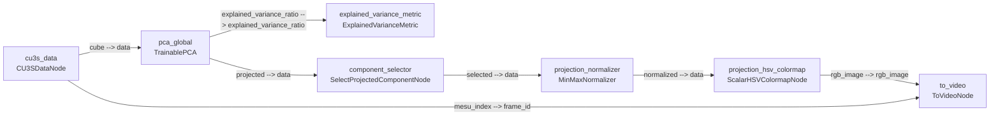

```mermaid
flowchart LR
    cu3s_data[cu3s_data<br/>CU3SDataNode]
    bandpass[bandpass<br/>BandpassByWavelength]
    per_pixel_unit_norm[per_pixel_unit_norm<br/>PerPixelUnitNorm]
    pca_global[pca_global<br/>TrainablePCA]
    explained_variance_metric[explained_variance_metric<br/>ExplainedVarianceMetric]
    component_selector[component_selector<br/>SelectProjectedComponentNode]
    projection_normalizer[projection_normalizer<br/>MinMaxNormalizer]
    projection_hsv_colormap[projection_hsv_colormap<br/>ScalarHSVColormapNode]
    to_video[to_video<br/>ToVideoNode]
    cu3s_data -->|cube --> data| bandpass
    cu3s_data -->|wavelengths --> wavelengths| bandpass
    cu3s_data -->|mesu_index --> frame_id| to_video
    bandpass -->|filtered --> data| per_pixel_unit_norm
    per_pixel_unit_norm -->|normalized --> data| pca_global
    pca_global -->|explained_variance_ratio --> explained_variance_ratio| explained_variance_metric
    pca_global -->|projected --> data| component_selector
    component_selector -->|selected --> data| projection_normalizer
    projection_normalizer -->|normalized --> data| projection_hsv_colormap
    projection_hsv_colormap -->|rgb_image --> rgb_image| to_video
```

!!! warning "Status: Needs Review"
    This page has not been reviewed for accuracy and completeness. Content may be outdated or contain errors.

---

# Tutorial: Blood Perfusion Visualization

Learn how to build hyperspectral blood perfusion visualization pipelines using three progressively advanced approaches: NDVI, PCA + HSV colormap, and band-limited PCA + HSV.

## Overview

**What You'll Learn:**

- Loading and processing hyperspectral data from CU3S files
- Computing normalized difference indices (NDVI) for blood perfusion
- Using PCA for dimensionality reduction with the train-then-predict pattern
- Applying HSV colormaps for scientific visualization
- Filtering wavelengths with bandpass preprocessing
- Connecting nodes via the port system to build complete pipelines

**Prerequisites:**

- Understanding of [Node System](../concepts/node-system-deep-dive.md) fundamentals
- Familiarity with [Pipeline Lifecycle](../concepts/pipeline-lifecycle.md)
- Download the dataset from the repo root:

```bash
uv run dataset download blood_perfusion
```

**Time:** ~30 minutes

**Perfect for:** Users who want to learn pipeline construction through a real-world hyperspectral visualization workflow.

!!! tip "Just want to run it?"
    Skip ahead to [Running the Examples](#running-the-examples) to execute the scripts directly.

---

## Introduction

Hyperspectral cameras capture 100+ wavelengths of light per pixel, far beyond what the human eye can see. This data needs processing to reveal blood flow patterns invisible to the naked eye.

!!! tip "Think of it like an assembly line"
    Raw material (light data) enters, gets processed station by station, and a finished product (video) comes out. Each station is a **node** -- a self-contained processing unit with input and output ports.

### Three Pipeline Recipes

This tutorial builds three pipelines of increasing complexity:

<div class="grid cards" markdown>

-   :material-numeric-1-circle: **NDVI**

    ---

    "Like using a color filter" -- 3 nodes, beginner level

-   :material-numeric-2-circle: **PCA + HSV**

    ---

    "Finding the most important pattern" -- 7 nodes, intermediate level

-   :material-numeric-3-circle: **Band-Limited PCA + HSV**

    ---

    "Zooming into key wavelengths first" -- 9 nodes, advanced level

</div>

---

## Background: The CU3S File Format

A `.cu3s` file is like a filing cabinet. Each drawer is a measurement (one moment in time). Inside each drawer is a stack of photographs, one for each wavelength. Together they form a **cube** of data.

When loaded by `CU3SDataNode`, each frame becomes a 4D tensor:

| Dimension | Symbol | Meaning | Example |
|-----------|--------|---------|---------|
| Batch | B | Number of frames per batch | 1 |
| Height | H | Image height in pixels | 1080 |
| Width | W | Image width in pixels | 1000 |
| Channels | C | Spectral bands (wavelengths) | 61 |

### Ports: How Nodes Talk

Every node has labeled input and output **ports** -- like labeled sockets on the back of a TV. You connect an output port from one node to an input port on another.

`CU3SDataNode` provides three output ports:

| Port | Type | Description |
|------|------|-------------|
| `cube` | `float32 [B, H, W, C]` | The hyperspectral data cube |
| `wavelengths` | `float32 [C]` | Wavelength labels in nm |
| `mesu_index` | `int64 [B]` | Frame number in the recording |

---

## Pipeline 1: NDVI (3 Nodes)

### What is NDVI?

The Normalized Difference Vegetation Index (NDVI) formula uses two wavelengths to produce a single-value index per pixel:

$$
NDVI = \frac{NIR - Red}{NIR + Red}
$$

Using wavelengths 750 nm (near-infrared) and 566 nm (red). Values range from -1 to +1.

!!! tip "Why does a vegetation index work for blood?"
    NDVI was originally designed for vegetation analysis, but it works for blood perfusion because oxygenated tissue reflects these wavelengths differently than deoxygenated tissue. The same math reveals the contrast.

### Creating the Nodes

```python
from cuvis_ai.node.data import CU3SDataNode
from cuvis_ai.node.channel_selector import NDVISelector
from cuvis_ai.node.video import ToVideoNode

pipeline = CuvisPipeline("BloodPerfusion_NDVI_Projection")

# Data loader -- reads frames from .cu3s file
cu3s_data = CU3SDataNode(name="cu3s_data")

# NDVI calculator -- specify which wavelengths and display range
ndvi = NDVISelector(
    nir_nm=750.0,
    red_nm=566.0,
    colormap_min=-0.7,
    colormap_max=0.5,
    name="ndvi",
)

# Video writer -- saves colored frames to MP4
to_video = ToVideoNode(
    output_video_path=output_video_path,
    frame_rate=resolved_frame_rate,
    name="to_video",
)
```

### Connecting the Pipeline

```python
pipeline.connect(
    (cu3s_data.outputs.cube, ndvi.cube),             # raw data -> NDVI
    (cu3s_data.outputs.wavelengths, ndvi.wavelengths),# wavelength labels
    (ndvi.rgb_image, to_video.rgb_image),             # colored image -> video
    (cu3s_data.outputs.mesu_index, to_video.frame_id),# frame numbering
)
```

!!! note "The tuple pattern"
    `(source.outputs.port, target.port)` is the fundamental building block of every cuvis-ai pipeline connection.

### Data Flow

1. `CU3SDataNode` loads frame from `.cu3s` file, outputs cube `[1, 1080, 1000, 61]`
2. `NDVISelector` receives cube + wavelengths, finds bands at 750nm and 566nm
3. `NDVISelector` computes `(band_750 - band_566) / (band_750 + band_566)` per pixel
4. `NDVISelector` maps values from [-0.7, 0.5] through HSV colormap, outputs RGB `[1, 1080, 1000, 3]`
5. `ToVideoNode` receives RGB frame + frame_id, writes to MP4
6. Repeat for all frames

### Pipeline Diagram



---

## Pipeline 2: PCA + HSV Colormap (7 Nodes)

### Why PCA?

Imagine 100 microphones recording a concert. Most capture roughly the same sounds. **Principal Component Analysis (PCA)** finds the 1--3 essential recordings that capture almost everything.

PCA projects 61 spectral channels down to 3 components ranked by how much variation they explain:

| Component | Explained Variance |
|-----------|-------------------|
| PC0 | 59.85% |
| PC1 | 39.64% |
| PC2 | 0.51% |
| **Total** | **~100%** |

Nearly all the information in 61 channels is captured by just 3 components.

### Per-Frame vs. Global PCA

| | Per-Frame (`PCA`) | Global (`TrainablePCA`) |
|---|---|---|
| **How it works** | Fits fresh on every single frame | Fits once, applies everywhere |
| **Consistency** | Potentially jumpy between frames | Consistent across the recording |
| **Training** | None required | Requires `StatisticalTrainer.fit()` |
| **Recommendation** | Simpler | **Recommended** |

### Train-Then-Predict Pattern

```python
from cuvis_ai_core.training import Predictor, StatisticalTrainer

# Step 1: Train -- analyze frames to learn PCA transformation
stat_trainer = StatisticalTrainer(pipeline=pipeline, datamodule=datamodule)
stat_trainer.fit()

# Step 2: Predict -- apply the learned transformation to all frames
predictor = Predictor(pipeline=pipeline, datamodule=datamodule)
predictor.predict(max_batches=target_frames, collect_outputs=False)
```

!!! tip "A fundamental pattern"
    Train-then-predict is one of the most important ideas in data processing. Some nodes need to learn from data before they can process it. `collect_outputs=False` means results are not stored in memory -- they flow directly to the video writer.

### Adding Color: The HSV Colormap

Meteorologists don't show temperature in grayscale -- they use rainbow colormaps. The human eye can distinguish far more colors than shades of gray.

The PCA + HSV pipeline adds four new processing steps after PCA:

1. **SelectProjectedComponentNode** -- picks one PCA component (e.g., component 1 for perfusion)
2. **MinMaxNormalizer** -- scales values to [0, 1] range
3. **ScalarHSVColormapNode** -- maps scalar values to rainbow RGB colors

!!! tip "Which component to pick?"
    For blood perfusion with full-spectrum PCA, `component_index=1` is recommended. PC1 captures the perfusion variation (39.64%), while PC0 captures overall brightness.

### Creating the Nodes

```python
from cuvis_ai.node.colormap import ScalarHSVColormapNode
from cuvis_ai.node.data import CU3SDataNode
from cuvis_ai.node.dimensionality_reduction import TrainablePCA
from cuvis_ai.node.metrics import ExplainedVarianceMetric
from cuvis_ai.node.normalization import MinMaxNormalizer
from cuvis_ai.node.video import ToVideoNode

pipeline = CuvisPipeline("PCA_Global_HSV_Projection")

cu3s_data = CU3SDataNode(name="cu3s_data")
pca_node = TrainablePCA(
    num_channels=input_channels,  # e.g. 61
    n_components=3,
    whiten=False,
    init_method="svd",
    name="pca_global",
)
explained_variance = ExplainedVarianceMetric(
    execution_stages={ExecutionStage.ALWAYS},
    name="explained_variance_metric",
)
component_selector = SelectProjectedComponentNode(
    component_index=1,  # PC1 for perfusion
    name="component_selector",
)
projection_normalizer = MinMaxNormalizer(
    eps=1.0e-6,
    use_running_stats=True,
    name="projection_normalizer",
)
hsv_colormap = ScalarHSVColormapNode(
    value_min=0.0,
    value_max=1.0,
    name="projection_hsv_colormap",
)
to_video = ToVideoNode(
    output_video_path=str(output_path),
    frame_rate=resolved_frame_rate,
    name="to_video",
)
```

`SelectProjectedComponentNode` is a simple custom node defined in the example script:

```python
class SelectProjectedComponentNode(Node):
    """Select one component from a PCA-projected BHWC tensor."""

    INPUT_SPECS = {
        "data": PortSpec(
            dtype=torch.float32,
            shape=(-1, -1, -1, -1),
            description="Projected PCA tensor [B, H, W, C].",
        )
    }
    OUTPUT_SPECS = {
        "selected": PortSpec(
            dtype=torch.float32,
            shape=(-1, -1, -1, 1),
            description="Selected PCA component [B, H, W, 1].",
        )
    }

    def __init__(self, component_index: int = 1, **kwargs):
        self.component_index = int(component_index)
        super().__init__(component_index=self.component_index, **kwargs)

    def forward(self, data: torch.Tensor, **_) -> dict[str, torch.Tensor]:
        return {"selected": data[..., self.component_index : self.component_index + 1]}
```

### Connecting the Pipeline

```python
pipeline.connect(
    (cu3s_data.outputs.cube, pca_node.data),                             # raw cube -> PCA
    (pca_node.outputs.explained_variance_ratio,
     explained_variance.explained_variance_ratio),                        # variance monitoring
    (pca_node.outputs.projected, component_selector.data),               # PCA output -> select component
    (component_selector.selected, projection_normalizer.data),           # component -> normalize
    (projection_normalizer.normalized, hsv_colormap.data),               # normalized -> colormap
    (hsv_colormap.rgb_image, to_video.rgb_image),                        # colored image -> video
    (cu3s_data.outputs.mesu_index, to_video.frame_id),                   # frame numbering
)
```

!!! note "The chain pattern"
    Notice how each connection forms a chain: `projected` -> `data` -> `selected` -> `data` -> `normalized` -> `data` -> `rgb_image`. The output port name from one node becomes the input port name on the next.

### Data Flow

1. `CU3SDataNode` outputs cube `[B, H, W, 61]`
2. `TrainablePCA` projects 61 channels down to 3 components `[B, H, W, 3]`
3. `SelectProjectedComponentNode` picks component 1 `[B, H, W, 1]`
4. `MinMaxNormalizer` scales to [0, 1]
5. `ScalarHSVColormapNode` maps scalar to rainbow RGB `[B, H, W, 3]`
6. `ToVideoNode` writes colored frame to MP4

### Pipeline Diagram



---

## Pipeline 3: Band-Limited PCA + HSV (9 Nodes)

### Not All Wavelengths Are Equal

If you want a specific radio station, you don't listen to all frequencies at once -- you tune to the right range. `BandpassByWavelength` focuses on the 540--800 nm range, where hemoglobin absorbs differently based on oxygen levels.

This pipeline adds two preprocessing nodes before PCA:

| Node | Purpose |
|------|---------|
| **BandpassByWavelength** | Keeps only channels within 540--800 nm. Reduces 61 channels to ~33. |
| **PerPixelUnitNorm** | Normalizes each pixel's spectral vector to unit length (L2 norm). Removes brightness differences so PCA focuses on spectral shape. |

### Creating the Nodes

```python
from cuvis_ai.node.colormap import ScalarHSVColormapNode
from cuvis_ai.node.data import CU3SDataNode
from cuvis_ai.node.dimensionality_reduction import TrainablePCA
from cuvis_ai.node.metrics import ExplainedVarianceMetric
from cuvis_ai.node.normalization import MinMaxNormalizer, PerPixelUnitNorm
from cuvis_ai.node.preprocessors import BandpassByWavelength
from cuvis_ai.node.video import ToVideoNode

pipeline = CuvisPipeline("PCA_Global_HSV_Bandlimited_Projection")

cu3s_data = CU3SDataNode(name="cu3s_data")
bandpass = BandpassByWavelength(
    min_wavelength_nm=540.0,
    max_wavelength_nm=800.0,
    name="bandpass",
)
per_pixel_unit_norm = PerPixelUnitNorm(name="per_pixel_unit_norm")
pca_node = TrainablePCA(
    num_channels=bandpassed_channels,  # ~33 after filtering
    n_components=3,
    whiten=False,
    init_method="svd",
    name="pca_global",
)
explained_variance = ExplainedVarianceMetric(
    execution_stages={ExecutionStage.ALWAYS},
    name="explained_variance_metric",
)
component_selector = SelectProjectedComponentNode(
    component_index=0,  # PC0 for band-limited perfusion
    name="component_selector",
)
projection_normalizer = MinMaxNormalizer(
    eps=1.0e-6,
    use_running_stats=True,
    name="projection_normalizer",
)
hsv_colormap = ScalarHSVColormapNode(
    value_min=0.0,
    value_max=1.0,
    name="projection_hsv_colormap",
)
to_video = ToVideoNode(
    output_video_path=str(output_path),
    frame_rate=resolved_frame_rate,
    name="to_video",
)
```

### Connecting the Pipeline

```python
pipeline.connect(
    (cu3s_data.outputs.cube, bandpass.data),                             # raw cube -> bandpass
    (cu3s_data.outputs.wavelengths, bandpass.wavelengths),               # wavelength labels for filtering
    (bandpass.filtered, per_pixel_unit_norm.data),                       # filtered -> per-pixel normalize
    (per_pixel_unit_norm.normalized, pca_node.data),                     # normalized -> PCA
    (pca_node.outputs.explained_variance_ratio,
     explained_variance.explained_variance_ratio),                        # variance monitoring
    (pca_node.outputs.projected, component_selector.data),               # PCA output -> select component
    (component_selector.selected, projection_normalizer.data),           # component -> normalize
    (projection_normalizer.normalized, hsv_colormap.data),               # normalized -> colormap
    (hsv_colormap.rgb_image, to_video.rgb_image),                        # colored image -> video
    (cu3s_data.outputs.mesu_index, to_video.frame_id),                   # frame numbering
)
```

### Variance Comparison

Filtering wavelengths before PCA changes the variance distribution significantly:

| Component | Full Spectrum (61 ch) | Band-Limited (33 ch) |
|-----------|----------------------|---------------------|
| PC0 | 59.85% | 80.93% |
| PC1 | 39.64% | 10.51% |
| PC2 | 0.51% | 8.56% |

!!! tip "Why does PC2 jump from 0.51% to 8.56%?"
    By removing irrelevant wavelengths, every remaining component works harder. The band-limited pipeline can extract more meaningful information from higher-order components.

!!! note "Why `component_index=0` instead of 1?"
    The preprocessing changes which component captures perfusion. By filtering wavelengths and normalizing per pixel, the data distribution changes. What was the second-most-important pattern in full spectrum becomes the dominant pattern in the band-limited view.

### Pipeline Diagram



---

## The Universal Recipe

Every cuvis-ai visualization pipeline follows the same four steps:

1. **Create a `CuvisPipeline`** -- give it a descriptive name that identifies the analysis type
2. **Instantiate your nodes** -- create each processing station with its specific parameters
3. **Connect outputs to inputs** -- use `pipeline.connect()` with tuples of `(source_port, target_port)`
4. **Train + Predict** -- if you have trainable nodes, run `StatisticalTrainer.fit()` first, then `Predictor.predict()`

---

## Node Catalog

| Node | Description | Trainable? |
|------|-------------|------------|
| `CU3SDataNode` | Loads hyperspectral data from .cu3s files | No |
| `NDVISelector` | Computes normalized difference index + HSV colormap | No |
| `PCA` | Per-frame dimensionality reduction | No |
| `TrainablePCA` | Global dimensionality reduction | Yes |
| `BandpassByWavelength` | Filters to a wavelength range | No |
| `PerPixelUnitNorm` | Normalizes each pixel's spectral profile (L2) | No |
| `MinMaxNormalizer` | Scales values to [0, 1] | Yes (running stats) |
| `ScalarHSVColormapNode` | Maps scalar values to rainbow RGB | No |
| `SelectProjectedComponentNode` | Picks one PCA component | No |
| `ToVideoNode` | Writes RGB frames to MP4 video | No |
| `ExplainedVarianceMetric` | Monitors PCA quality | No |

---

## Troubleshooting

!!! warning "Port shape mismatch"
    Connecting `[B, H, W, 61]` to an input expecting `[B, H, W, 1]` fails. Always check that the output shape matches the input shape.

!!! warning "Missing training"
    `TrainablePCA` without `fit()` raises "not initialized". Always run `StatisticalTrainer` before `Predictor` for pipelines with trainable nodes.

!!! warning "Wavelength range"
    `BandpassByWavelength` with min/max outside the camera's spectral range gives empty output. Verify your wavelength bounds match the camera's spectral range.

---

## Running the Examples

Set up the environment and download the dataset:

```bash
uv sync --all-extras
uv run dataset download Blood_Perfusion
```

Run the example scripts:

```bash
# Pipeline 1: NDVI (simplest)
uv run python examples/blood_perfusion/nd_blood_perfusion.py \
    --cu3s-path data/XMR_Blood_Perfusion/Blood_Perfusion_Refl.cu3s

# Pipeline 2: PCA + HSV colormap
uv run python examples/blood_perfusion/pca_hsv.py \
    --cu3s-path data/XMR_Blood_Perfusion/Blood_Perfusion_Refl.cu3s

# Pipeline 3: Band-limited PCA + HSV (most advanced)
uv run python examples/blood_perfusion/pca_hsv_bandlimited.py \
    --cu3s-path data/XMR_Blood_Perfusion/Blood_Perfusion_Refl.cu3s
```

Each script accepts `--help` for a full list of options including frame range, frame rate, PCA mode, component index, and colormap range.
