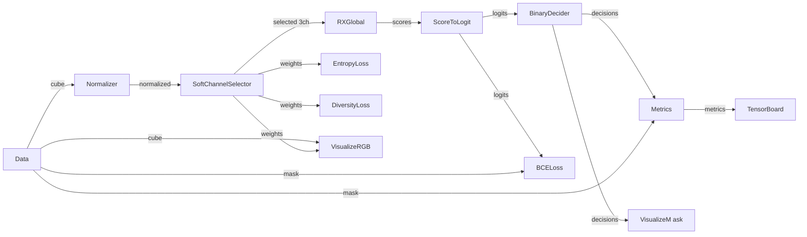

!!! warning "Status: Needs Review"
    This page has not been reviewed for accuracy and completeness. Content may be outdated or contain errors.

---

# Tutorial: Learnable Channel Selection with Two-Phase Training

Learn how to build an anomaly detection pipeline with learnable channel selection using two-phase training (statistical initialization + gradient optimization).

## Overview

**What You'll Learn:**

- Building on the RX Statistical tutorial with learnable channel selection
- Understanding Gumbel-Softmax for differentiable channel selection
- Two-phase training: statistical initialization → gradient optimization
- Loss composition with regularizers (BCE + entropy + diversity)
- Using callbacks for early stopping and model checkpointing
- Visualizing selected channels and training progress

**Prerequisites:**

- **[RX Statistical Tutorial](rx-statistical.md)** - Complete this first!
- Understanding of [Two-Phase Training](../concepts/two-phase-training.md)
- Familiarity with [Execution Stages](../concepts/execution-stages.md)
- Basic knowledge of gradient-based optimization

**Time:** ~30 minutes

**Perfect for:** Users who want to learn gradient-based training, channel selection, and advanced training strategies in CUVIS.AI.

---

## Background

### Why Channel Selection?

Hyperspectral data often contains **61+ spectral channels**, but:
- Not all channels are informative for a given task
- Redundant channels add noise and computation cost
- Channel selection can improve performance and interpretability

**Manual selection** (e.g., RGB channels at 650, 550, 450 nm) works but is suboptimal.

**Learnable selection** lets the model automatically discover the best channels for anomaly detection.

### Gumbel-Softmax for Channel Selection

The challenge: Channel selection is discrete (select channel i or not), which isn't differentiable.

**Solution:** Gumbel-Softmax relaxation allows gradient-based optimization:

```
selected_data = ∑ᵢ softmax(weights / temperature) × channelᵢ
```

- `weights`: Learnable parameters per channel
- `temperature`: Controls discreteness (high → soft, low → hard)
- `softmax`: Makes weights differentiable

**Temperature Annealing:** Start with high temperature (smooth distribution), gradually decrease to make selection sharper.

### Two-Phase Training Strategy

**Phase 1: Statistical Initialization**
- Initialize normalizer statistics (min/max)
- Initialize selector weights (variance-based or uniform)
- Initialize RX detector (background covariance)
- **All nodes frozen** (no gradients)

**Phase 2: Gradient Training**
- **Unfreeze**: Selector, RX, LogitHead
- **Keep frozen**: Normalizer (fixed statistics)
- Optimize with BCE loss + regularizers
- Use callbacks (early stopping, checkpointing)

This strategy combines the stability of statistical initialization with the power of gradient optimization.

---

## Step 1: Setup (Building on RX Tutorial)

### Step 1: Data Loading

This tutorial extends the [RX Statistical Tutorial](rx-statistical.md). We'll use the same data setup:

```python
from pathlib import Path
from cuvis_ai_core.data.datasets import SingleCu3sDataModule
from cuvis_ai_core.pipeline.pipeline import CuvisPipeline
from cuvis_ai.node.data import LentilsAnomalyDataNode

# Setup datamodule
datamodule = SingleCu3sDataModule(
    data_dir="data/lentils",
    batch_size=4,
    num_workers=0,
)
datamodule.setup(stage="fit")

# Create pipeline
pipeline = CuvisPipeline("Channel_Selector")

# Data node (same as RX tutorial)
data_node = LentilsAnomalyDataNode(normal_class_ids=[0, 1])
```

---

## Step 2: Build Pipeline with Selector

### Preprocessing

### Normalization

```python
from cuvis_ai.node.normalization import MinMaxNormalizer

normalizer = MinMaxNormalizer(
    eps=1.0e-6,
    use_running_stats=True,  # Will be initialized in Phase 1
)
```

### Add Soft Channel Selector (NEW!)

```python
from cuvis_ai.node.channel_selector import SoftChannelSelector

selector = SoftChannelSelector(
    n_select=3,               # Select 3 channels (for RGB-like output)
    input_channels=61,        # Input hyperspectral channels
    init_method="variance",   # Initialize by channel variance
    temperature_init=5.0,     # Start with soft selection
    temperature_min=0.1,      # End with sharp selection
    temperature_decay=0.9,    # Decay rate per epoch
    hard=False,               # Soft selection during training
    eps=1.0e-6,
)
```

**Key Parameters:**
- `n_select=3`: Number of output channels (like RGB)
- `init_method="variance"`: Initialize weights by channel variance
- Temperature schedule: 5.0 → 0.1 with decay 0.9
  - Epoch 0: temperature = 5.0 (soft selection)
  - Epoch 10: temperature ≈ 1.94 (medium)
  - Epoch 20: temperature ≈ 0.76 (sharper)
  - Epoch 30: temperature = 0.1 (nearly discrete)

### Add RX Detector

**Important:** RX now operates on **3 selected channels** instead of 61!

```python
from cuvis_ai.anomaly.rx_detector import RXGlobal
from cuvis_ai.node.conversion import ScoreToLogit

rx = RXGlobal(
    num_channels=15,  # Actually selector outputs 3*n_select channels
    eps=1.0e-6,
)

logit_head = ScoreToLogit(init_scale=1.0, init_bias=0.0)
```

### Add Decision Node

```python
from cuvis_ai.deciders.binary_decider import BinaryDecider

decider = BinaryDecider(threshold=0.5)
```

---

## Step 3: Add Loss Functions and Regularizers

## Loss Composition

### Main Loss: BCE with Logits

```python
from cuvis_ai.node.losses import AnomalyBCEWithLogits

bce_loss = AnomalyBCEWithLogits(
    name="bce",
    weight=10.0,      # High weight for main task
    pos_weight=None,  # No class imbalance weighting
)
```

### Entropy Regularization

### Regularizer 1: Entropy Loss

Encourages uniform channel selection distribution (prevents mode collapse):

```python
from cuvis_ai.node.losses import SelectorEntropyRegularizer

entropy_loss = SelectorEntropyRegularizer(
    name="entropy",
    weight=0.1,          # Regularization strength
    target_entropy=None,  # Use maximum entropy as target
)
```

**Why?** Without entropy loss, selector might focus on only 1-2 channels.

### Diversity Regularization

### Regularizer 2: Diversity Loss

Encourages selected channels to be diverse (not redundant):

```python
from cuvis_ai.node.losses import SelectorDiversityRegularizer

diversity_loss = SelectorDiversityRegularizer(
    name="diversity",
    weight=0.01,  # Weak regularization
)
```

**Total Loss:**
```
Loss = 10.0 × BCE + 0.1 × Entropy + 0.01 × Diversity
```

---

## Step 4: Add Metrics and Visualization

## Monitoring

### Metrics

```python
from cuvis_ai.node.metrics import AnomalyDetectionMetrics

metrics_anomaly = AnomalyDetectionMetrics(name="metrics_anomaly")
```

### Visualization Nodes

```python
from cuvis_ai.node.anomaly_visualization import AnomalyMask
from cuvis_ai.node.pipeline_visualization import CubeRGBVisualizer

# Anomaly mask visualization (same as RX tutorial)
viz_mask = AnomalyMask(name="mask", channel=30, up_to=5)

# NEW: RGB visualization of selected channels
viz_rgb = CubeRGBVisualizer(
    name="rgb",
    up_to=5,  # Visualize first 5 samples
)
```

### TensorBoard Monitoring

```python
from cuvis_ai.node.monitor import TensorBoardMonitorNode

tensorboard_node = TensorBoardMonitorNode(
    output_dir="runs/tensorboard",
    run_name=pipeline.name,
)
```

---

## Step 5: Connect the Pipeline

```python
pipeline.connect(
    # Processing flow: data → normalize → selector → RX → logits → decisions
    (data_node.outputs.cube, normalizer.data),
    (normalizer.normalized, selector.data),
    (selector.selected, rx.data),
    (rx.scores, logit_head.scores),
    (logit_head.logits, decider.logits),

    # Loss flow
    (logit_head.logits, bce_loss.predictions),
    (data_node.outputs.mask, bce_loss.targets),
    (selector.weights, entropy_loss.weights),
    (selector.weights, diversity_loss.weights),

    # Metric flow
    (decider.decisions, metrics_anomaly.decisions),
    (data_node.outputs.mask, metrics_anomaly.targets),
    (metrics_anomaly.metrics, tensorboard_node.metrics),

    # Visualization flow
    (decider.decisions, viz_mask.decisions),
    (data_node.outputs.mask, viz_mask.mask),
    (data_node.outputs.cube, viz_mask.cube),
    (data_node.outputs.cube, viz_rgb.cube),
    (selector.weights, viz_rgb.weights),  # Visualize channel selection
    (data_node.outputs.wavelengths, viz_rgb.wavelengths),
    (viz_mask.artifacts, tensorboard_node.artifacts),
    (viz_rgb.artifacts, tensorboard_node.artifacts),
)
```

**Pipeline Flow:**



---

## Step 6: Phase 1 - Statistical Initialization

Initialize nodes **without gradients**:

```python
from cuvis_ai_core.training import StatisticalTrainer
from loguru import logger

logger.info("Phase 1: Statistical initialization...")
stat_trainer = StatisticalTrainer(
    pipeline=pipeline,
    datamodule=datamodule,
)
stat_trainer.fit()
```

**What Gets Initialized:**
1. **MinMaxNormalizer**: Collects global min/max
2. **SoftChannelSelector**: Initializes weights by channel variance
3. **RXGlobal**: Computes covariance on selected 3 channels

**Console Output:**
```
[INFO] Phase 1: Statistical initialization...
[INFO] MinMaxNormalizer: min=-0.123, max=1.987
[INFO] SoftChannelSelector: Initialized weights by variance
[INFO] RXGlobal: Computed background statistics (3 selected channels)
[INFO] Statistical initialization complete
```

---

## Step 7: Phase 2 - Unfreeze Nodes for Gradient Training

Selectively unfreeze nodes for optimization:

```python
logger.info("Phase 2: Unfreezing selector and RX for gradient training...")

unfreeze_node_names = [selector.name, rx.name, logit_head.name]
pipeline.unfreeze_nodes_by_name(unfreeze_node_names)

logger.info(f"Unfrozen nodes: {unfreeze_node_names}")
```

**Freeze Status After Unfreezing:**
- ✅ **Unfrozen** (trainable): SoftChannelSelector, RXGlobal, ScoreToLogit
- 🔒 **Frozen** (fixed): MinMaxNormalizer, Data Node
- Loss and metric nodes don't have weights

---

## Step 8: Configure Training with Callbacks

### Setup Training Configuration

```python
from cuvis_ai_core.training.config import (
    TrainingConfig,
    CallbacksConfig,
    EarlyStoppingConfig,
    ModelCheckpointConfig,
    SchedulerConfig,
)
from omegaconf import OmegaConf

# Load training config from Hydra
training_cfg = TrainingConfig.from_dict(
    OmegaConf.to_container(cfg.training, resolve=True)
)
```

### Add Early Stopping

Stop training if BCE loss doesn't improve:

```python
if training_cfg.trainer.callbacks is None:
    training_cfg.trainer.callbacks = CallbacksConfig()

training_cfg.trainer.callbacks.early_stopping.append(
    EarlyStoppingConfig(
        monitor="train/bce",   # Monitor training BCE loss
        mode="min",             # Lower is better
        patience=20,            # Stop after 20 epochs without improvement
    )
)
```

### Add Learning Rate Scheduler

Reduce LR when validation IoU plateaus:

```python
training_cfg.scheduler = SchedulerConfig(
    name="reduce_on_plateau",
    monitor="metrics_anomaly/iou",  # Monitor validation IoU
    mode="max",                      # Higher is better
    factor=0.5,                      # Reduce LR by 50%
    patience=5,                      # Wait 5 epochs before reducing
)
```

### Add Model Checkpointing

Save top-3 models by validation IoU:

```python
training_cfg.trainer.callbacks.checkpoint = ModelCheckpointConfig(
    dirpath="outputs/checkpoints",
    monitor="metrics_anomaly/iou",  # Track validation IoU
    mode="max",                      # Save highest IoU models
    save_top_k=3,                    # Keep top 3 checkpoints
    save_last=True,                  # Also save last checkpoint
    filename="{epoch:02d}",          # Filename pattern
    verbose=True,
)
```

---

## Step 9: Phase 3 - Gradient Training

Run gradient-based optimization:

```python
from cuvis_ai_core.training import GradientTrainer

logger.info("Phase 3: Gradient-based channel selection optimization...")

grad_trainer = GradientTrainer(
    pipeline=pipeline,
    datamodule=datamodule,
    loss_nodes=[bce_loss],  # Can add entropy_loss, diversity_loss here
    metric_nodes=[metrics_anomaly],
    trainer_config=training_cfg.trainer,
    optimizer_config=training_cfg.optimizer,
    monitors=[tensorboard_node],
)

grad_trainer.fit()
```

**Training Loop:**
1. Forward pass through unfrozen nodes
2. Compute losses: BCE + entropy + diversity
3. Backpropagation and weight updates
4. Temperature decay for selector
5. Validation every N epochs
6. Checkpointing and early stopping

**Console Output:**
```
[INFO] Phase 3: Gradient training...
Epoch 0: train/bce=0.623, metrics_anomaly/iou=0.671, lr=0.001
Epoch 1: train/bce=0.512, metrics_anomaly/iou=0.709, lr=0.001
Epoch 5: train/bce=0.387, metrics_anomaly/iou=0.784, lr=0.001
[INFO] Reducing learning rate to 0.0005
Epoch 10: train/bce=0.298, metrics_anomaly/iou=0.812, lr=0.0005
[INFO] Saved checkpoint: epoch=10, iou=0.812
...
[INFO] Early stopping triggered (patience=20)
[INFO] Best checkpoint: epoch=23, iou=0.847
```

---

## Step 10: Evaluation

### Validation on Best Checkpoint

```python
logger.info("Running validation with best checkpoint...")
val_results = grad_trainer.validate()
logger.info(f"Validation results: {val_results}")
```

### Test Evaluation

```python
logger.info("Running test evaluation with best checkpoint...")
test_results = grad_trainer.test()
logger.info(f"Test results: {test_results}")
```

**Expected Results:**
- IoU: 0.80-0.85 (improved from RX baseline ~0.72)
- Precision: 0.85-0.90
- Recall: 0.80-0.87

---

## Step 11: Analyze Selected Channels

## Monitoring Channel Weights

### Inspect Selector Weights

```python
# Get final channel weights
selector_weights = selector.get_selection_weights()
print(f"Selector weights shape: {selector_weights.shape}")  # [61]
print(f"Top 3 channels: {selector_weights.topk(3).indices}")

# Example output:
# Top 3 channels: tensor([18, 42, 55])
# These correspond to specific wavelengths
```

### Visualize Channel Selection

TensorBoard will show:
- **RGB visualization**: False-color image from selected channels
- **Weight plot**: Bar chart of channel weights
- **Weight evolution**: How weights changed during training

---

## Step 12: Save Pipeline and TrainRun Config

### Save Trained Pipeline

```python
from cuvis_ai_core.training.config import PipelineMetadata

results_dir = Path("outputs/trained_models")
pipeline_output_path = results_dir / "Channel_Selector.yaml"

pipeline.save_to_file(
    str(pipeline_output_path),
    metadata=PipelineMetadata(
        name=pipeline.name,
        description="Channel Selector with two-phase training",
        tags=["gradient", "statistical", "channel_selector", "rx"],
        author="cuvis.ai",
    ),
)
```

### Save TrainRun Config

```python
from cuvis_ai_core.training.config import TrainRunConfig

trainrun_config = TrainRunConfig(
    name="channel_selector",
    pipeline=pipeline.serialize(),
    data=datamodule_config,
    training=training_cfg,
    output_dir="outputs",
    loss_nodes=["bce"],
    metric_nodes=["metrics_anomaly"],
    freeze_nodes=[],
    unfreeze_nodes=unfreeze_node_names,  # Track which nodes were trained
)

trainrun_config.save_to_file("outputs/trained_models/channel_selector_trainrun.yaml")
```

---

## Complete Example Script

Full runnable script (`examples/channel_selector.py`):

```python
from pathlib import Path
import hydra
from cuvis_ai_core.data.datasets import SingleCu3sDataModule
from cuvis_ai_core.pipeline.pipeline import CuvisPipeline
from cuvis_ai_core.training import GradientTrainer, StatisticalTrainer
from cuvis_ai_core.training.config import (
    CallbacksConfig,
    EarlyStoppingConfig,
    ModelCheckpointConfig,
    PipelineMetadata,
    SchedulerConfig,
    TrainingConfig,
    TrainRunConfig,
)
from loguru import logger
from omegaconf import DictConfig, OmegaConf

from cuvis_ai.anomaly.rx_detector import RXGlobal
from cuvis_ai.node.conversion import ScoreToLogit
from cuvis_ai.deciders.binary_decider import BinaryDecider
from cuvis_ai.node.data import LentilsAnomalyDataNode
from cuvis_ai.node.losses import (
    AnomalyBCEWithLogits,
    SelectorDiversityRegularizer,
    SelectorEntropyRegularizer,
)
from cuvis_ai.node.metrics import AnomalyDetectionMetrics
from cuvis_ai.node.monitor import TensorBoardMonitorNode
from cuvis_ai.node.normalization import MinMaxNormalizer
from cuvis_ai.node.channel_selector import SoftChannelSelector
from cuvis_ai.node.anomaly_visualization import AnomalyMask
from cuvis_ai.node.pipeline_visualization import CubeRGBVisualizer


@hydra.main(config_path="../configs/", config_name="trainrun/channel_selector", version_base=None)
def main(cfg: DictConfig) -> None:
    """Channel Selector with Two-Phase Training."""

    logger.info("=== Channel Selector for Anomaly Detection ===")
    output_dir = Path(cfg.output_dir)

    # Stage 1: Setup datamodule
    datamodule = SingleCu3sDataModule(**cfg.data)
    datamodule.setup(stage="fit")

    # Stage 2: Build pipeline with selector
    pipeline = CuvisPipeline("Channel_Selector")

    data_node = LentilsAnomalyDataNode(normal_class_ids=[0, 1])
    normalizer = MinMaxNormalizer(eps=1.0e-6, use_running_stats=True)
    selector = SoftChannelSelector(
        n_select=3,
        input_channels=61,
        init_method="variance",
        temperature_init=5.0,
        temperature_min=0.1,
        temperature_decay=0.9,
    )
    rx = RXGlobal(num_channels=15, eps=1.0e-6)
    logit_head = ScoreToLogit(init_scale=1.0, init_bias=0.0)
    decider = BinaryDecider(threshold=0.5)

    bce_loss = AnomalyBCEWithLogits(name="bce", weight=10.0)
    entropy_loss = SelectorEntropyRegularizer(name="entropy", weight=0.1)
    diversity_loss = SelectorDiversityRegularizer(name="diversity", weight=0.01)

    metrics_anomaly = AnomalyDetectionMetrics(name="metrics_anomaly")
    viz_mask = AnomalyMask(name="mask", channel=30, up_to=5)
    viz_rgb = CubeRGBVisualizer(name="rgb", up_to=5)
    tensorboard_node = TensorBoardMonitorNode(
        output_dir=str(output_dir / ".." / "tensorboard"),
        run_name=pipeline.name,
    )

    # Stage 3: Connect pipeline
    pipeline.connect(
        (data_node.outputs.cube, normalizer.data),
        (normalizer.normalized, selector.data),
        (selector.selected, rx.data),
        (rx.scores, logit_head.scores),
        (logit_head.logits, bce_loss.predictions),
        (data_node.outputs.mask, bce_loss.targets),
        (selector.weights, entropy_loss.weights),
        (selector.weights, diversity_loss.weights),
        (logit_head.logits, decider.logits),
        (decider.decisions, metrics_anomaly.decisions),
        (data_node.outputs.mask, metrics_anomaly.targets),
        (metrics_anomaly.metrics, tensorboard_node.metrics),
        (decider.decisions, viz_mask.decisions),
        (data_node.outputs.mask, viz_mask.mask),
        (data_node.outputs.cube, viz_mask.cube),
        (data_node.outputs.cube, viz_rgb.cube),
        (selector.weights, viz_rgb.weights),
        (data_node.outputs.wavelengths, viz_rgb.wavelengths),
        (viz_mask.artifacts, tensorboard_node.artifacts),
        (viz_rgb.artifacts, tensorboard_node.artifacts),
    )

    # Configure training
    training_cfg = TrainingConfig.from_dict(OmegaConf.to_container(cfg.training, resolve=True))
    if training_cfg.trainer.callbacks is None:
        training_cfg.trainer.callbacks = CallbacksConfig()

    training_cfg.trainer.callbacks.early_stopping.append(
        EarlyStoppingConfig(monitor="train/bce", mode="min", patience=20)
    )
    training_cfg.scheduler = SchedulerConfig(
        name="reduce_on_plateau",
        monitor="metrics_anomaly/iou",
        mode="max",
        factor=0.5,
        patience=5,
    )
    training_cfg.trainer.callbacks.checkpoint = ModelCheckpointConfig(
        dirpath=str(output_dir / "checkpoints"),
        monitor="metrics_anomaly/iou",
        mode="max",
        save_top_k=3,
        save_last=True,
    )

    # Phase 1: Statistical initialization
    logger.info("Phase 1: Statistical initialization...")
    stat_trainer = StatisticalTrainer(pipeline=pipeline, datamodule=datamodule)
    stat_trainer.fit()

    # Phase 2: Unfreeze nodes
    logger.info("Phase 2: Unfreezing selector and RX...")
    unfreeze_node_names = [selector.name, rx.name, logit_head.name]
    pipeline.unfreeze_nodes_by_name(unfreeze_node_names)

    # Phase 3: Gradient training
    logger.info("Phase 3: Gradient training...")
    grad_trainer = GradientTrainer(
        pipeline=pipeline,
        datamodule=datamodule,
        loss_nodes=[bce_loss],
        metric_nodes=[metrics_anomaly],
        trainer_config=training_cfg.trainer,
        optimizer_config=training_cfg.optimizer,
        monitors=[tensorboard_node],
    )
    grad_trainer.fit()

    # Evaluation
    grad_trainer.validate()
    grad_trainer.test()

    # Save pipeline
    pipeline.save_to_file(
        str(output_dir / "trained_models" / "Channel_Selector.yaml"),
        metadata=PipelineMetadata(
            name=pipeline.name,
            description="Channel Selector with two-phase training",
            tags=["gradient", "channel_selector"],
            author="cuvis.ai",
        ),
    )


if __name__ == "__main__":
    main()
```

**Run the example:**
```bash
python examples/channel_selector.py
```

---

## Troubleshooting

### Issue: Channel Collapse (All Weight on 1-2 Channels)

**Symptoms:** Selector weights like [0.95, 0.03, 0.02, ...]

**Solution:** Increase entropy regularization:
```python
entropy_loss = SelectorEntropyRegularizer(
    weight=0.5,  # Increase from 0.1
)
```

### Issue: Training Unstable (Loss Oscillates)

**Solution 1:** Lower learning rate:
```python
training_cfg.optimizer.lr = 0.0001  # From 0.001
```

**Solution 2:** Slower temperature decay:
```python
selector = SoftChannelSelector(
    temperature_init=10.0,  # Higher init
    temperature_decay=0.95,  # Slower decay
)
```

### Issue: No Improvement Over RX Baseline

**Possible Causes:**
1. Insufficient training epochs
2. Regularization too strong
3. Temperature decays too quickly

**Solutions:**
```python
# Increase training budget
training_cfg.trainer.max_epochs = 50

# Reduce regularization
entropy_loss.weight = 0.05
diversity_loss.weight = 0.005

# Slower temperature schedule
selector.temperature_decay = 0.92
```

### Issue: Checkpoints Not Saving

**Cause:** Checkpoint directory doesn't exist or validation not running

**Solution:**
```python
# Ensure directory exists
output_dir.mkdir(parents=True, exist_ok=True)

# Verify validation runs
training_cfg.trainer.check_val_every_n_epoch = 1  # Validate every epoch
```

---

## Next Steps

**Build on this tutorial:**

1. **[Deep SVDD Tutorial](deep-svdd-gradient.md)** - Replace RX with deep learning detector
2. **[AdaCLIP Workflow](adaclip-workflow.md)** - Try other channel selectors (DRCNN, Concrete)
3. **[gRPC Workflow](grpc-workflow.md)** - Deploy trained pipeline as a service

**Explore related concepts:**

- [Two-Phase Training Deep Dive](../concepts/two-phase-training.md) - Detailed training strategy
- [Execution Stages](../concepts/execution-stages.md) - Control node execution timing
- [Gradient Trainer](../concepts/two-phase-training.md#gradient-training) - Optimizer configuration

**Explore related nodes:**

- [SoftChannelSelector](../node-catalog/selectors.md#softchannelselector) - Selector details
- [Loss Nodes](../node-catalog/loss-metrics.md) - All available loss functions
- [Callbacks](../concepts/two-phase-training.md#callbacks) - Advanced training control

---

## Summary

In this tutorial, you learned:

✅ How to add learnable channel selection to an anomaly detection pipeline
✅ Two-phase training strategy: statistical init → gradient optimization
✅ Loss composition with regularizers
✅ Using callbacks for early stopping and checkpointing
✅ Temperature annealing for discrete selection
✅ Analyzing and visualizing selected channels

**Key Takeaways:**
- Channel selection improves both performance and interpretability
- Gumbel-Softmax enables gradient-based discrete optimization
- Two-phase training combines stability (statistical) with power (gradient)
- Regularizers (entropy, diversity) prevent mode collapse
- Callbacks automate training management (early stopping, LR scheduling)

Now you're ready to explore deep learning-based anomaly detection!
