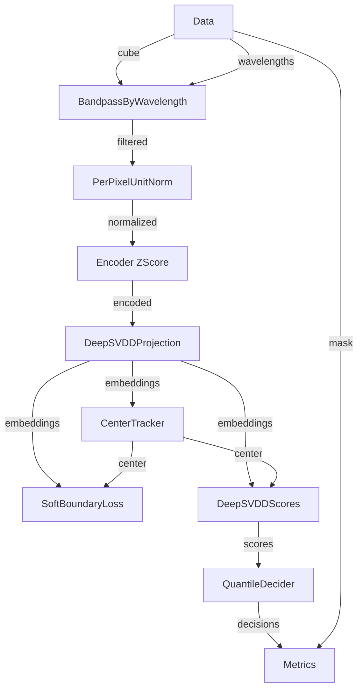

!!! warning "Status: Needs Review"
    This page has not been reviewed for accuracy and completeness. Content may be outdated or contain errors.

---

# Tutorial: Deep SVDD for One-Class Anomaly Detection

Learn how to build a deep learning-based anomaly detection pipeline using Deep Support Vector Data Description (Deep SVDD) with two-phase training.

## Overview

**What You'll Learn:**

- Understanding Deep SVDD for one-class anomaly detection
- Building deep learning pipelines with encoder and projection networks
- Advanced preprocessing: bandpass filtering and per-pixel normalization
- Center tracking with exponential moving average (EMA)
- Soft boundary loss for handling outliers
- Two-phase training for deep learning: statistical encoder init → gradient optimization
- Quantile-based decision thresholds

**Prerequisites:**

- **[RX Statistical Tutorial](rx-statistical.md)** - Understand statistical training
- **[Channel Selector Tutorial](channel-selector.md)** - Understand two-phase training
- Familiarity with [Two-Phase Training](../concepts/two-phase-training.md)
- Basic understanding of neural networks

**Time:** ~35 minutes

**Perfect for:** Users ready to leverage deep learning for anomaly detection, with focus on one-class learning and hypersphere boundaries.

---

## Background

### What is Deep SVDD?

Deep SVDD extends classical SVDD to deep learning:

**Classical SVDD:** Learns a hypersphere boundary in feature space that encloses normal data:
- Center: $c$ (learned from data)
- Radius: Minimized to fit normal data tightly
- Anomaly score: Distance from center

**Deep SVDD:** Adds a neural network encoder:
1. **Encoder** $\phi(x)$: Maps raw data to representation space
2. **Hypersphere**: Encloses $\phi(x)$ for normal data
3. **Anomaly score**: $||\\phi(x) - c||^2$

**Key Advantage:** Deep SVDD learns **both** the feature representation and the decision boundary, enabling more expressive anomaly detection than classical methods.

### Soft Boundary vs Hard Boundary

**Hard Boundary:** All normal data must lie inside the hypersphere
- Problem: Sensitive to outliers in training data

**Soft Boundary (ν-SVDD):** Allow a fraction ν of data to lie outside
- **ν parameter**: Controls expected outlier fraction (e.g., ν=0.1 allows 10% outliers)
- More robust to noisy training data

### Center Tracking

Instead of pre-computing a fixed center, track it online:

```
center_t = α × current_batch_mean + (1 - α) × center_{t-1}
```

- **α**: EMA coefficient (e.g., 0.1)
- Adapts to data distribution during training
- More stable than fixed center

---

## Step 1: Setup and Data

Same datamodule setup as previous tutorials:

```python
from pathlib import Path
from cuvis_ai_core.data.datasets import SingleCu3sDataModule
from cuvis_ai_core.pipeline.pipeline import CuvisPipeline
from cuvis_ai.node.data import LentilsAnomalyDataNode

# Setup datamodule
datamodule = SingleCu3sDataModule(
    data_dir="data/lentils",
    batch_size=4,
    num_workers=0,
)
datamodule.setup(stage="fit")

# Create pipeline
pipeline = CuvisPipeline("DeepSVDD_Gradient")

# Data node
data_node = LentilsAnomalyDataNode(normal_class_ids=[0, 1])
```

---

## Step 2: Advanced Preprocessing Chain {#step-2-preprocessing-chain}

### Bandpass Filtering by Wavelength

Filter hyperspectral data to a specific wavelength range:

```python
from cuvis_ai.node.preprocessors import BandpassByWavelength

bandpass_node = BandpassByWavelength(
    min_wavelength_nm=450.0,  # Minimum wavelength (nm)
    max_wavelength_nm=900.0,  # Maximum wavelength (nm)
)
```

**Why Bandpass?**
- Removes noisy edge channels
- Focuses on informative spectral range
- Reduces dimensionality (61 → ~35 channels)

### Per-Pixel Unit Normalization

Normalize each pixel spectrum to unit length:

```python
from cuvis_ai.node.normalization import PerPixelUnitNorm

unit_norm_node = PerPixelUnitNorm(eps=1e-8)
```

**Formula:**
```
normalized_pixel = (pixel - mean(pixel)) / ||pixel - mean(pixel)||₂
```

**Why Per-Pixel?**
- Makes each pixel comparable in magnitude
- Removes intensity variation
- Focuses on spectral shape (not absolute values)

---

## Step 3: Build Deep SVDD Architecture

## Encoder Initialization {#encoder-initialization}

### Encoder: Z-Score Normalizer (Global Statistics)

The encoder is a **learnable** z-score normalizer with global statistics:

```python
from cuvis_ai.anomaly.deep_svdd import ZScoreNormalizerGlobal

encoder = ZScoreNormalizerGlobal(
    num_channels=35,     # Channels after bandpass (inferred automatically)
    hidden=64,           # Hidden layer size
    sample_n=1024,       # Samples for statistical init
    seed=42,             # Random seed for reproducibility
)
```

**What it does:**
- **Statistical Init**: Computes global mean and std from training data
- **Gradient Training**: Fine-tunes mean/std as learnable parameters
- Acts as first encoding layer

## Projection Head {#projection-head}

### Projection Network

Maps encoder output to low-dimensional representation:

```python
from cuvis_ai.anomaly.deep_svdd import DeepSVDDProjection

projection = DeepSVDDProjection(
    in_channels=35,   # Input channels (after encoder)
    rep_dim=32,       # Representation dimension (output)
    hidden=128,       # Hidden layer size
)
```

**Architecture:**
```
Input (B, H, W, 35) → Linear(35 → 128) → ReLU → Linear(128 → 32) → Output (B, H, W, 32)
```

**Why low-dimensional?**
- Easier to learn tight hypersphere
- Reduces overfitting
- rep_dim=32 is typical for hyperspectral data

---

## Step 4: Center Tracking and Scoring

### Center Tracker with EMA

Track hypersphere center online:

```python
from cuvis_ai.anomaly.deep_svdd import DeepSVDDCenterTracker

center_tracker = DeepSVDDCenterTracker(
    rep_dim=32,     # Representation dimension (matches projection output)
    alpha=0.1,      # EMA coefficient (10% current, 90% history)
)
```

**Outputs:**
- `center`: Current hypersphere center [rep_dim]
- `metrics`: Sphere radius, number of outliers

## Training Loss {#training-loss}

### Soft Boundary Loss

```python
from cuvis_ai.node.losses import DeepSVDDSoftBoundaryLoss

loss_node = DeepSVDDSoftBoundaryLoss(
    name="deepsvdd_loss",
    nu=0.1,  # Allow 10% of data to be outliers
)
```

**Loss Formula:**
```
Loss = (1/n) ∑ max(0, ||φ(x) - c||² - R²) + (1/νn) × R²
```

Where:
- R²: Radius term (penalized by ν)
- max(0, ...): Hinge loss (only penalize if outside radius)

## Anomaly Scoring {#anomaly-scoring}

### Anomaly Scores

Compute distance-based scores:

```python
from cuvis_ai.anomaly.deep_svdd import DeepSVDDScores

score_node = DeepSVDDScores()
```

**Score:** $||\\phi(x) - c||^2$ (squared Euclidean distance)

---

## Step 5: Decision and Metrics

## Quantile Thresholding {#quantile-thresholding}

### Quantile-Based Decision

Instead of fixed threshold, use quantile:

```python
from cuvis_ai.deciders.binary_decider import QuantileBinaryDecider

decider_node = QuantileBinaryDecider(
    quantile=0.995,  # Top 0.5% of scores are anomalies
)
```

**Advantage:** Adapts to score distribution automatically.

## Score Visualization {#score-visualization}

### Metrics and Visualization

```python
from cuvis_ai.node.metrics import AnomalyDetectionMetrics
from cuvis_ai.node.visualizations import AnomalyMask, ScoreHeatmapVisualizer
from cuvis_ai.node.monitor import TensorBoardMonitorNode

metrics_node = AnomalyDetectionMetrics(name="metrics_anomaly")

# Visualize anomaly masks
viz_mask = AnomalyMask(name="mask", channel=30, up_to=5)

# Visualize score heatmaps
score_viz = ScoreHeatmapVisualizer(
    name="score_heatmap",
    normalize_scores=True,  # Normalize to [0, 1] for visualization
    up_to=5,
)

tensorboard_node = TensorBoardMonitorNode(
    output_dir="runs/tensorboard",
    run_name=pipeline.name,
)
```

---

## Step 6: Connect the Pipeline

```python
pipeline.connect(
    # Preprocessing chain: data → bandpass → unit_norm → encoder
    (data_node.outputs.cube, bandpass_node.data),
    (data_node.outputs.wavelengths, bandpass_node.wavelengths),
    (bandpass_node.filtered, unit_norm_node.data),
    (unit_norm_node.normalized, encoder.data),

    # Deep SVDD: encoder → projection → center_tracker
    (encoder.normalized, projection.data),
    (projection.embeddings, center_tracker.embeddings),

    # Loss computation
    (projection.embeddings, loss_node.embeddings),
    (center_tracker.center, loss_node.center),

    # Scoring: embeddings + center → scores
    (projection.embeddings, score_node.embeddings),
    (center_tracker.center, score_node.center),

    # Decision: scores → quantile threshold → binary decisions
    (score_node.scores, decider_node.logits),

    # Metrics: scores + decisions + ground truth
    (score_node.scores, metrics_node.logits),
    (decider_node.decisions, metrics_node.decisions),
    (data_node.outputs.mask, metrics_node.targets),

    # Visualization
    (score_node.scores, score_viz.scores),
    (score_node.scores, viz_mask.scores),
    (decider_node.decisions, viz_mask.decisions),
    (data_node.outputs.mask, viz_mask.mask),
    (data_node.outputs.cube, viz_mask.cube),

    # Monitoring
    (metrics_node.metrics, tensorboard_node.metrics),
    (center_tracker.metrics, tensorboard_node.metrics),
    (score_viz.artifacts, tensorboard_node.artifacts),
    (viz_mask.artifacts, tensorboard_node.artifacts),
)
```

**Pipeline Flow:**



---

## Step 7: Phase 1 - Statistical Encoder Initialization

Initialize the encoder with statistical training:

```python
from cuvis_ai_core.training import StatisticalTrainer
from loguru import logger

logger.info("Phase 1: Statistical fit of DeepSVDD encoder...")
stat_trainer = StatisticalTrainer(
    pipeline=pipeline,
    datamodule=datamodule,
)
stat_trainer.fit()
```

**What Gets Initialized:**
- **Encoder (ZScoreNormalizerGlobal)**: Computes global mean and std
- **Center Tracker**: Initializes center from projection embeddings

**Console Output:**
```
[INFO] Phase 1: Statistical encoder initialization...
[INFO] ZScoreNormalizerGlobal: Computing global statistics...
[INFO] Global mean shape: (35,), Global std shape: (35,)
[INFO] DeepSVDDCenterTracker: Initial center computed
[INFO] Statistical initialization complete
```

---

## Step 8: Phase 2 - Unfreeze Encoder

Unfreeze the encoder for gradient training:

```python
logger.info("Phase 2: Unfreezing encoder for gradient training...")

unfreeze_node_names = [encoder.name]
pipeline.unfreeze_nodes_by_name(unfreeze_node_names)

logger.info(f"Unfrozen nodes: {unfreeze_node_names}")
```

**Trainable After Unfreezing:**
- ✅ **Encoder** (ZScoreNormalizerGlobal): Mean and std become learnable
- ✅ **Projection**: Network weights
- ✅ **Center Tracker**: Center updates via EMA
- 🔒 **Frozen**: Preprocessing nodes (bandpass, unit_norm)

---

## Step 9: Configure Training

### Setup Training Configuration

```python
from cuvis_ai_core.training.config import (
    TrainingConfig,
    CallbacksConfig,
    EarlyStoppingConfig,
    ModelCheckpointConfig,
    SchedulerConfig,
)

training_cfg = TrainingConfig.from_dict(cfg.training)  # Load from config
if training_cfg.trainer.callbacks is None:
    training_cfg.trainer.callbacks = CallbacksConfig()
```

### Early Stopping on Deep SVDD Loss

```python
training_cfg.trainer.callbacks.early_stopping.append(
    EarlyStoppingConfig(
        monitor="train/deepsvdd_loss",
        mode="min",
        patience=15,  # Stop after 15 epochs without improvement
    )
)
```

### Checkpointing on Validation IoU

```python
training_cfg.trainer.callbacks.checkpoint = ModelCheckpointConfig(
    dirpath="outputs/checkpoints",
    monitor="metrics_anomaly/iou",
    mode="max",
    save_top_k=3,
    save_last=True,
    filename="{epoch:02d}",
    verbose=True,
)
```

### Learning Rate Scheduler

```python
training_cfg.scheduler = SchedulerConfig(
    name="reduce_on_plateau",
    monitor="metrics_anomaly/iou",
    mode="max",
    factor=0.5,
    patience=5,
)
```

---

## Step 10: Phase 3 - Gradient Training

Run gradient optimization:

```python
from cuvis_ai_core.training import GradientTrainer

logger.info("Phase 3: Gradient training with DeepSVDDSoftBoundaryLoss...")

grad_trainer = GradientTrainer(
    pipeline=pipeline,
    datamodule=datamodule,
    loss_nodes=[loss_node],
    metric_nodes=[metrics_node],
    trainer_config=training_cfg.trainer,
    optimizer_config=training_cfg.optimizer,
    monitors=[tensorboard_node],
)

grad_trainer.fit()
```

**Training Loop:**
1. Forward pass: data → preprocessing → encoder → projection → embeddings
2. Update center with EMA
3. Compute soft boundary loss
4. Backpropagate gradients
5. Update encoder and projection weights
6. Validate and checkpoint

**Console Output:**
```
[INFO] Phase 3: Gradient training...
Epoch 0: train/deepsvdd_loss=2.134, metrics_anomaly/iou=0.687
Epoch 1: train/deepsvdd_loss=1.892, metrics_anomaly/iou=0.723
Epoch 5: train/deepsvdd_loss=1.456, metrics_anomaly/iou=0.789
[INFO] Checkpoint saved: epoch=5, iou=0.789
Epoch 10: train/deepsvdd_loss=1.123, metrics_anomaly/iou=0.831
[INFO] Reducing learning rate to 0.0005
...
Epoch 25: train/deepsvdd_loss=0.876, metrics_anomaly/iou=0.865
[INFO] Early stopping triggered
[INFO] Best model: epoch=23, iou=0.868
```

---

## Step 11: Evaluation

### Validation

```python
logger.info("Running validation with best checkpoint...")
val_results = grad_trainer.validate(ckpt_path="last")
logger.info(f"Validation results: {val_results}")
```

### Test Evaluation

```python
logger.info("Running test evaluation with best checkpoint...")
test_results = grad_trainer.test(ckpt_path="last")
logger.info(f"Test results: {test_results}")
```

**Expected Performance:**
- IoU: 0.85-0.90 (significantly better than RX ~0.72)
- Precision: 0.88-0.93
- Recall: 0.85-0.91

---

## Step 12: Analyze Results

### Center Tracker Metrics

TensorBoard logs center tracker metrics:
- `center_tracker/sphere_radius`: Hypersphere radius
- `center_tracker/num_outliers`: Count of outliers per batch

**Interpretation:**
- **Small radius**: Tight fit around normal data
- **Few outliers**: Training data is clean
- **Many outliers**: May need to adjust ν parameter

### Score Heatmaps

Visualize anomaly scores as heatmaps:
- **Blue**: Low scores (normal)
- **Yellow/Red**: High scores (anomalous)
- Shows spatial distribution of anomalies

---

## Step 13: Save Pipeline

```python
from cuvis_ai_core.training.config import PipelineMetadata, TrainRunConfig

results_dir = Path("outputs/trained_models")
pipeline_output_path = results_dir / "DeepSVDD_Gradient.yaml"

# Save trained pipeline
pipeline.save_to_file(
    str(pipeline_output_path),
    metadata=PipelineMetadata(
        name=pipeline.name,
        description="Deep SVDD with two-phase training",
        tags=["gradient", "statistical", "deep_svdd", "anomaly_detection"],
        author="cuvis.ai",
    ),
)

# Save trainrun config
trainrun_config = TrainRunConfig(
    name="deep_svdd_gradient",
    pipeline=pipeline.serialize(),
    data=datamodule_config,
    training=training_cfg,
    output_dir="outputs",
    loss_nodes=["deepsvdd_loss"],
    metric_nodes=["metrics_anomaly"],
    freeze_nodes=[],
    unfreeze_nodes=unfreeze_node_names,
)
trainrun_config.save_to_file("outputs/trained_models/deep_svdd_trainrun.yaml")
```

---

## Complete Example Script

Full runnable script (`examples/advanced/deep_svdd_gradient_training.py`):

```python
from pathlib import Path
import hydra
from cuvis_ai_core.data.datasets import SingleCu3sDataModule
from cuvis_ai_core.pipeline.pipeline import CuvisPipeline
from cuvis_ai_core.training import GradientTrainer, StatisticalTrainer
from cuvis_ai_core.training.config import (
    CallbacksConfig,
    EarlyStoppingConfig,
    ModelCheckpointConfig,
    PipelineMetadata,
    SchedulerConfig,
    TrainingConfig,
)
from loguru import logger
from omegaconf import DictConfig, OmegaConf

from cuvis_ai.anomaly.deep_svdd import (
    DeepSVDDCenterTracker,
    DeepSVDDProjection,
    DeepSVDDScores,
    ZScoreNormalizerGlobal,
)
from cuvis_ai.deciders.binary_decider import QuantileBinaryDecider
from cuvis_ai.node.data import LentilsAnomalyDataNode
from cuvis_ai.node.losses import DeepSVDDSoftBoundaryLoss
from cuvis_ai.node.metrics import AnomalyDetectionMetrics
from cuvis_ai.node.monitor import TensorBoardMonitorNode
from cuvis_ai.node.normalization import PerPixelUnitNorm
from cuvis_ai.node.preprocessors import BandpassByWavelength
from cuvis_ai.node.visualizations import AnomalyMask, ScoreHeatmapVisualizer


@hydra.main(config_path="../../configs/", config_name="trainrun/deep_svdd", version_base=None)
def main(cfg: DictConfig) -> None:
    """Deep SVDD Anomaly Detection with Two-Phase Training."""

    logger.info("=== Deep SVDD Gradient Training ===")
    output_dir = Path(cfg.output_dir)

    # Stage 1: Setup datamodule
    datamodule = SingleCu3sDataModule(**cfg.data)
    datamodule.setup(stage="fit")

    # Stage 2: Build Deep SVDD pipeline
    pipeline = CuvisPipeline("DeepSVDD_Gradient")

    data_node = LentilsAnomalyDataNode(normal_class_ids=[0, 1])
    bandpass_node = BandpassByWavelength(min_wavelength_nm=450.0, max_wavelength_nm=900.0)
    unit_norm_node = PerPixelUnitNorm(eps=1e-8)
    encoder = ZScoreNormalizerGlobal(num_channels=35, hidden=64, sample_n=1024, seed=42)
    projection = DeepSVDDProjection(in_channels=35, rep_dim=32, hidden=128)
    center_tracker = DeepSVDDCenterTracker(rep_dim=32, alpha=0.1)
    loss_node = DeepSVDDSoftBoundaryLoss(name="deepsvdd_loss", nu=0.1)
    score_node = DeepSVDDScores()
    decider_node = QuantileBinaryDecider(quantile=0.995)
    metrics_node = AnomalyDetectionMetrics(name="metrics_anomaly")
    viz_mask = AnomalyMask(name="mask", channel=30, up_to=5)
    score_viz = ScoreHeatmapVisualizer(name="score_heatmap", normalize_scores=True, up_to=5)
    tensorboard_node = TensorBoardMonitorNode(
        output_dir=str(output_dir / ".." / "tensorboard"),
        run_name=pipeline.name,
    )

    # Stage 3: Connect pipeline
    pipeline.connect(
        (data_node.outputs.cube, bandpass_node.data),
        (data_node.outputs.wavelengths, bandpass_node.wavelengths),
        (bandpass_node.filtered, unit_norm_node.data),
        (unit_norm_node.normalized, encoder.data),
        (encoder.normalized, projection.data),
        (projection.embeddings, center_tracker.embeddings),
        (projection.embeddings, loss_node.embeddings),
        (center_tracker.center, loss_node.center),
        (projection.embeddings, score_node.embeddings),
        (center_tracker.center, score_node.center),
        (score_node.scores, decider_node.logits),
        (score_node.scores, metrics_node.logits),
        (decider_node.decisions, metrics_node.decisions),
        (data_node.outputs.mask, metrics_node.targets),
        (score_node.scores, score_viz.scores),
        (metrics_node.metrics, tensorboard_node.metrics),
        (center_tracker.metrics, tensorboard_node.metrics),
        (score_viz.artifacts, tensorboard_node.artifacts),
    )

    # Configure training
    training_cfg = TrainingConfig.from_dict(OmegaConf.to_container(cfg.training, resolve=True))
    if training_cfg.trainer.callbacks is None:
        training_cfg.trainer.callbacks = CallbacksConfig()

    training_cfg.trainer.callbacks.early_stopping.append(
        EarlyStoppingConfig(monitor="train/deepsvdd_loss", mode="min", patience=15)
    )
    training_cfg.trainer.callbacks.checkpoint = ModelCheckpointConfig(
        dirpath=str(output_dir / "checkpoints"),
        monitor="metrics_anomaly/iou",
        mode="max",
        save_top_k=3,
        save_last=True,
    )

    # Phase 1: Statistical initialization
    logger.info("Phase 1: Statistical encoder initialization...")
    stat_trainer = StatisticalTrainer(pipeline=pipeline, datamodule=datamodule)
    stat_trainer.fit()

    # Phase 2: Unfreeze encoder
    logger.info("Phase 2: Unfreezing encoder...")
    pipeline.unfreeze_nodes_by_name([encoder.name])

    # Phase 3: Gradient training
    logger.info("Phase 3: Gradient training...")
    grad_trainer = GradientTrainer(
        pipeline=pipeline,
        datamodule=datamodule,
        loss_nodes=[loss_node],
        metric_nodes=[metrics_node],
        trainer_config=training_cfg.trainer,
        optimizer_config=training_cfg.optimizer,
        monitors=[tensorboard_node],
    )
    grad_trainer.fit()

    # Evaluation
    grad_trainer.validate()
    grad_trainer.test()

    # Save pipeline
    pipeline.save_to_file(
        str(output_dir / "trained_models" / "DeepSVDD_Gradient.yaml"),
        metadata=PipelineMetadata(
            name=pipeline.name,
            description="Deep SVDD with two-phase training",
            tags=["deep_learning", "deep_svdd"],
            author="cuvis.ai",
        ),
    )


if __name__ == "__main__":
    main()
```

**Run the example:**
```bash
python examples/advanced/deep_svdd_gradient_training.py
```

---

## Troubleshooting

### Issue: Center Moves Too Much During Training

**Symptoms:** center_tracker metrics show large center displacement

**Solution:** Reduce EMA alpha:
```python
center_tracker = DeepSVDDCenterTracker(
    rep_dim=32,
    alpha=0.05,  # Reduce from 0.1 for more stability
)
```

### Issue: Loss Doesn't Decrease

**Possible Causes:**
1. Learning rate too low
2. ν parameter too restrictive
3. Encoder not unfrozen

**Solutions:**
```python
# 1. Increase learning rate
training_cfg.optimizer.lr = 0.001  # From 0.0001

# 2. Relax soft boundary
loss_node = DeepSVDDSoftBoundaryLoss(nu=0.2)  # Allow more outliers

# 3. Verify unfreeze
print(f"Encoder frozen: {encoder.is_frozen()}")  # Should be False
```

### Issue: Memory Error (OOM)

**Solution:** Reduce batch size or model size:
```python
# Reduce batch size
datamodule = SingleCu3sDataModule(batch_size=2)  # From 4

# Reduce hidden layer size
encoder = ZScoreNormalizerGlobal(hidden=32)  # From 64
projection = DeepSVDDProjection(hidden=64)  # From 128
```

### Issue: Overfitting (Train IoU >> Val IoU)

**Solutions:**
1. Add dropout (requires modifying projection network)
2. Early stopping with patience
3. Reduce model capacity

```python
# Smaller representation dimension
projection = DeepSVDDProjection(rep_dim=16)  # From 32

# Stricter early stopping
EarlyStoppingConfig(patience=10)  # From 15
```

---

## Next Steps

**Build on this tutorial:**

1. **[AdaCLIP Workflow](adaclip-workflow.md)** - Combine deep learning with plugin-based models
2. **[gRPC Workflow](grpc-workflow.md)** - Deploy Deep SVDD pipeline as a service

**Explore related concepts:**

- [Two-Phase Training](../concepts/two-phase-training.md) - Deep dive into training strategies
- [Execution Stages](../concepts/execution-stages.md) - Control when nodes execute
- [GPU Acceleration](../reference/gpu_acceleration_guide.md) - Speed up training

**Explore related nodes:**

- [DeepSVDDProjection](../node-catalog/deep-learning.md#deepsvddprojection) - Projection network details
- [DeepSVDDCenterTracker](../node-catalog/deep-learning.md#deepsvddcentertracker) - Center tracking mechanics
- [ZScoreNormalizerGlobal](../node-catalog/preprocessing.md#zscorenormalizerglobal) - Encoder details

---

## Summary

In this tutorial, you learned:

✅ How to build a deep learning pipeline for one-class anomaly detection
✅ Deep SVDD architecture: encoder + projection + hypersphere
✅ Center tracking with exponential moving average
✅ Soft boundary loss for handling outliers
✅ Advanced preprocessing: bandpass filtering and per-pixel normalization
✅ Two-phase training for deep learning models

**Key Takeaways:**
- Deep SVDD learns both feature representation and decision boundary
- Soft boundary (ν-SVDD) is more robust than hard boundary
- Center tracking adapts to data distribution during training
- Two-phase training (statistical encoder init → gradient optimization) is crucial
- Quantile-based decisions adapt to score distribution

Now you're ready to explore advanced plugin-based models and deployment strategies!
