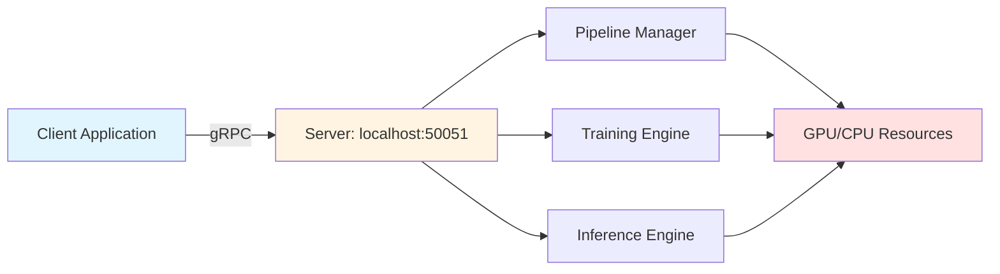

!!! warning "Status: Needs Review"
    This page has not been reviewed for accuracy and completeness. Content may be outdated or contain errors.

---

# gRPC Workflow: Distributed Training & Inference

Learn how to use CUVIS.AI's gRPC API for distributed training, remote inference, and production deployment.

---

## Overview

This tutorial demonstrates **distributed training and inference** using CUVIS.AI's gRPC (Google Remote Procedure Call) service. gRPC enables client-server communication for running pipelines on remote hardware, separating training infrastructure from client applications.

**What You'll Learn:**
- Starting and connecting to gRPC servers
- Remote training with streaming progress updates
- Distributed inference on trained pipelines
- Configuration management with Hydra overrides
- Session management and resource cleanup
- Production deployment patterns

**Time to Complete:** 25-30 minutes

**Prerequisites:**
- Completion of [Channel Selector Tutorial](channel-selector.md) - Understanding training workflows
- Basic networking knowledge (client-server, localhost, ports)
- Python 3.10+, PyTorch 2.0+, gRPC library installed

---

## Background

### Why gRPC for ML Pipelines?

**gRPC** is a high-performance RPC framework developed by Google, ideal for:
- **Remote Execution** - Train models on GPU servers from local machines
- **Microservices** - Deploy pipelines as independent services
- **Streaming** - Real-time progress updates during training
- **Language-Agnostic** - Client libraries for Python, C++, Java, etc.
- **Production-Ready** - Used by Google, Netflix, Square

**CUVIS.AI gRPC Service:**
- **Server:** Manages pipelines, training, and inference
- **Clients:** Connect from anywhere to execute workflows
- **Sessions:** Isolated contexts for concurrent users
- **Config Service:** Hydra composition and dynamic overrides

### Server-Client Architecture



**Workflow:**
1. **Server:** Launch on GPU machine (`uv run python -m cuvis_ai.grpc.production_server`)
2. **Client:** Connect, create session, configure pipeline
3. **Training:** Stream progress updates back to client
4. **Inference:** Send data, receive predictions
5. **Cleanup:** Close session, release resources

---

## Starting the gRPC Server

### Step 1: Launch Server Locally

```bash
# Terminal 1: Start gRPC server
uv run python -m cuvis_ai.grpc.production_server
```

**Expected Output:**
```
[INFO] Starting CUVIS.AI gRPC server on 0.0.0.0:50051
[INFO] Server started successfully
[INFO] Waiting for incoming connections...
```

**Server Configuration:**
- **Host:** `0.0.0.0` (all network interfaces)
- **Port:** `50051` (default gRPC port)
- **Max Message Size:** 300MB (for hyperspectral data)
- **Concurrency:** Supports multiple sessions

### Step 2: Verify Server Connection

```python
import grpc
from cuvis_ai_core.grpc import cuvis_ai_pb2, cuvis_ai_pb2_grpc

# Create channel with insecure connection (local development)
channel = grpc.insecure_channel("localhost:50051")
stub = cuvis_ai_pb2_grpc.CuvisAIServiceStub(channel)

# Test connection with health check
response = stub.CreateSession(cuvis_ai_pb2.CreateSessionRequest())
print(f"Connected! Session ID: {response.session_id}")
```

**Output:**
```
Connected! Session ID: d4e1a8c7-9b2f-4e3a-a5d6-7f8e9c0b1a2d
```

---

## Workflow 1: Remote Training

### The Phase 5 Workflow

CUVIS.AI follows an **explicit configuration workflow:**

1. **CreateSession** - Initialize isolated session
2. **SetSessionSearchPaths** - Register config directories
3. **ResolveConfig** - Hydra composition + overrides
4. **SetTrainRunConfig** - Apply resolved config
5. **Train** - Execute statistical/gradient training
6. **SavePipeline/SaveTrainRun** - Persist results

### Complete Training Example

```python
"""End-to-end gRPC training workflow."""

from pathlib import Path
import numpy as np
from cuvis_ai_core.grpc import cuvis_ai_pb2, helpers
from workflow_utils import (
    build_stub,
    config_search_paths,
    create_session_with_search_paths,
    resolve_trainrun_config,
    apply_trainrun_config,
    format_progress,
)

# 1. Connect to server
stub = build_stub("localhost:50051")

# 2. Create session + register config paths
session_id = create_session_with_search_paths(stub, config_search_paths())
print(f"Session created: {session_id}")

# 3. Resolve trainrun config (Hydra composition)
resolved, config_dict = resolve_trainrun_config(
    stub,
    session_id,
    "deep_svdd",  # Trainrun name from configs/trainrun/
    overrides=[
        "training.trainer.max_epochs=50",
        "training.optimizer.lr=0.0005",
        "data.batch_size=8",
    ],
)
print(f"Resolved trainrun: {config_dict['name']}")
print(f"Pipeline: {config_dict['pipeline']['metadata']['name']}")

# 4. Apply trainrun config to session
apply_trainrun_config(stub, session_id, resolved.config_bytes)

# 5. Statistical training (initialization)
print("Starting statistical training...")
for progress in stub.Train(
    cuvis_ai_pb2.TrainRequest(
        session_id=session_id,
        trainer_type=cuvis_ai_pb2.TRAINER_TYPE_STATISTICAL,
    )
):
    print(f"[statistical] {format_progress(progress)}")

# 6. Gradient training (optimization)
print("Starting gradient training...")
for progress in stub.Train(
    cuvis_ai_pb2.TrainRequest(
        session_id=session_id,
        trainer_type=cuvis_ai_pb2.TRAINER_TYPE_GRADIENT,
    )
):
    print(f"[gradient] {format_progress(progress)}")

# 7. Save trained pipeline
pipeline_path = str(Path("outputs") / "trained_pipeline.yaml")
trainrun_path = str(Path("outputs") / "trainrun_config.yaml")

save_pipeline = stub.SavePipeline(
    cuvis_ai_pb2.SavePipelineRequest(
        session_id=session_id,
        pipeline_path=pipeline_path,
    )
)
print(f"Pipeline saved: {save_pipeline.pipeline_path}")
print(f"Weights saved: {save_pipeline.weights_path}")

save_trainrun = stub.SaveTrainRun(
    cuvis_ai_pb2.SaveTrainRunRequest(
        session_id=session_id,
        trainrun_path=trainrun_path,
    )
)
print(f"Trainrun config saved: {save_trainrun.trainrun_path}")

# 8. Close session
stub.CloseSession(cuvis_ai_pb2.CloseSessionRequest(session_id=session_id))
print("Session closed.")
```

### Training Progress Output

**Statistical Training:**
```
[statistical] [TRAIN] IN_PROGRESS | message=Initializing RXGlobal detector
[statistical] [TRAIN] IN_PROGRESS | message=Processing batch 1/50
[statistical] [TRAIN] IN_PROGRESS | message=Processing batch 50/50
[statistical] [TRAIN] COMPLETED | message=Statistical training complete
```

**Gradient Training:**
```
[gradient] [TRAIN] IN_PROGRESS | losses={'deep_svdd_loss': 0.4523} | metrics={'iou': 0.6823}
[gradient] [TRAIN] IN_PROGRESS | losses={'deep_svdd_loss': 0.3891} | metrics={'iou': 0.7234}
[gradient] [VALIDATE] IN_PROGRESS | metrics={'val_iou': 0.7456, 'val_precision': 0.8123}
[gradient] [TRAIN] COMPLETED | message=Training complete (50 epochs)
```

### Streaming Progress Updates

The `Train` RPC returns a **stream** of progress messages:

```python
for progress in stub.Train(train_request):
    stage = cuvis_ai_pb2.ExecutionStage.Name(progress.context.stage)
    status = cuvis_ai_pb2.TrainStatus.Name(progress.status)

    if progress.losses:
        losses = dict(progress.losses)
        print(f"[{stage}] Losses: {losses}")

    if progress.metrics:
        metrics = dict(progress.metrics)
        print(f"[{stage}] Metrics: {metrics}")

    if progress.status == cuvis_ai_pb2.TRAIN_STATUS_COMPLETED:
        print("Training finished!")
        break
```

---

## Workflow 2: Remote Inference

### Inference-Only Client

For production deployment, you typically **train once** and **infer many times**. Here's an inference-only client:

```python
"""Restore trained pipeline for inference using gRPC."""

from pathlib import Path
from cuvis_ai.data.datasets import SingleCu3sDataset
from cuvis_ai_core.grpc import cuvis_ai_pb2, helpers
from torch.utils.data import DataLoader
from workflow_utils import (
    build_stub,
    config_search_paths,
    create_session_with_search_paths,
)

def run_inference(
    pipeline_path: str | Path,
    weights_path: str | Path,
    cu3s_file_path: str | Path,
    server_address: str = "localhost:50051",
):
    """Restore pipeline and run inference on CU3S data."""

    # 1. Connect with larger message size for HSI data
    stub = build_stub(server_address, max_msg_size=600 * 1024 * 1024)

    # 2. Create session
    session_id = create_session_with_search_paths(stub, config_search_paths())
    print(f"Session created: {session_id}")

    # 3. Resolve pipeline config
    pipeline_config = stub.ResolveConfig(
        cuvis_ai_pb2.ResolveConfigRequest(
            session_id=session_id,
            config_type="pipeline",
            path=str(pipeline_path),
            overrides=[],  # Optional config overrides
        )
    )

    # 4. Load pipeline structure
    stub.LoadPipeline(
        cuvis_ai_pb2.LoadPipelineRequest(
            session_id=session_id,
            pipeline=cuvis_ai_pb2.PipelineConfig(
                config_bytes=pipeline_config.config_bytes
            ),
        )
    )

    # 5. Load trained weights
    stub.LoadPipelineWeights(
        cuvis_ai_pb2.LoadPipelineWeightsRequest(
            session_id=session_id,
            weights_path=str(weights_path),
            strict=True,  # Require all weights to match
        )
    )

    # 6. Get pipeline input/output specs
    inputs_response = stub.GetPipelineInputs(
        cuvis_ai_pb2.GetPipelineInputsRequest(session_id=session_id)
    )
    outputs_response = stub.GetPipelineOutputs(
        cuvis_ai_pb2.GetPipelineOutputsRequest(session_id=session_id)
    )

    print("\nPipeline Input Specs:")
    for name, spec in inputs_response.input_specs.items():
        shape_str = "x".join(str(dim) for dim in spec.shape)
        print(f"  {name}: [{shape_str}], dtype={cuvis_ai_pb2.DType.Name(spec.dtype)}")

    print("\nPipeline Output Specs:")
    for name, spec in outputs_response.output_specs.items():
        shape_str = "x".join(str(dim) for dim in spec.shape)
        print(f"  {name}: [{shape_str}], dtype={cuvis_ai_pb2.DType.Name(spec.dtype)}")

    # 7. Load CU3S data
    print(f"\nLoading data from {cu3s_file_path}")
    dataset = SingleCu3sDataset(
        cu3s_file_path=str(cu3s_file_path),
        processing_mode="Reflectance",
    )
    dataloader = DataLoader(dataset, batch_size=1, shuffle=False)

    # 8. Run inference on each batch
    results = []
    for batch_idx, batch in enumerate(dataloader):
        print(f"Processing batch {batch_idx + 1}/{len(dataloader)}")

        # Execute inference
        inference_response = stub.Inference(
            cuvis_ai_pb2.InferenceRequest(
                session_id=session_id,
                inputs=cuvis_ai_pb2.InputBatch(
                    cube=helpers.tensor_to_proto(batch["cube"]),
                    wavelengths=helpers.tensor_to_proto(batch["wavelengths"]),
                ),
            )
        )

        # Convert outputs back to numpy
        output_dict = {}
        for name, tensor_proto in inference_response.outputs.items():
            output_dict[name] = helpers.proto_to_numpy(tensor_proto)

        results.append(output_dict)

        # Print output shapes
        if batch_idx == 0:
            print("\nInference Outputs:")
            for name, array in output_dict.items():
                print(f"  {name}: shape={array.shape}, dtype={array.dtype}")

    print(f"\nProcessed {len(results)} measurements")

    # 9. Close session
    stub.CloseSession(cuvis_ai_pb2.CloseSessionRequest(session_id=session_id))
    print("Session closed.")

    return results


# Example usage
if __name__ == "__main__":
    run_inference(
        pipeline_path="outputs/trained_models/channel_selector.yaml",
        weights_path="outputs/trained_models/channel_selector.pt",
        cu3s_file_path="data/lentils/Demo_000.cu3s",
        server_address="localhost:50051",
    )
```

### CLI Inference Script

For production, use the provided CLI script:

```bash
# Run inference on CU3S file
uv run python examples/grpc/run_inference.py \
  --pipeline-path outputs/trained_models/channel_selector.yaml \
  --weights-path outputs/trained_models/channel_selector.pt \
  --cu3s-file-path data/lentils/Demo_000.cu3s

# With custom processing mode
uv run python examples/grpc/run_inference.py \
  --pipeline-path outputs/trained_models/channel_selector.yaml \
  --weights-path outputs/trained_models/channel_selector.pt \
  --cu3s-file-path data/lentils/Demo_000.cu3s \
  --processing-mode Raw

# With config overrides
uv run python examples/grpc/run_inference.py \
  --pipeline-path outputs/trained_models/channel_selector.yaml \
  --weights-path outputs/trained_models/channel_selector.pt \
  --cu3s-file-path data/lentils/Demo_000.cu3s \
  --override nodes.10.params.output_dir=outputs/custom_tb
```

---

## Configuration Management with Hydra

### Dynamic Overrides

CUVIS.AI uses **Hydra** for configuration composition. Override any config value via dot notation:

```python
# Override training parameters
resolve_trainrun_config(
    stub,
    session_id,
    "channel_selector",
    overrides=[
        "training.trainer.max_epochs=100",          # More epochs
        "training.optimizer.lr=0.001",              # Higher learning rate
        "training.optimizer.weight_decay=0.01",     # More regularization
        "data.batch_size=16",                       # Larger batch size
        "data.num_workers=4",                       # More data loading threads
    ],
)
```

### Pipeline Node Overrides

Override specific node parameters:

```python
# Override channel selector temperature
resolve_trainrun_config(
    stub,
    session_id,
    "channel_selector",
    overrides=[
        "pipeline.nodes.channel_selector.params.tau_start=8.0",
        "pipeline.nodes.channel_selector.params.tau_end=0.05",
    ],
)
```

### Config Search Paths

The server resolves configs from multiple directories:

```python
from workflow_utils import config_search_paths

paths = config_search_paths()
# Returns:
# [
#   "/path/to/cuvis-ai/configs",
#   "/path/to/cuvis-ai/configs/trainrun",
#   "/path/to/cuvis-ai/configs/pipeline",
#   "/path/to/cuvis-ai/configs/data",
#   "/path/to/cuvis-ai/configs/training",
# ]
```

**Register custom paths:**
```python
paths = config_search_paths(extra_paths=["/path/to/my/configs"])
stub.SetSessionSearchPaths(
    cuvis_ai_pb2.SetSessionSearchPathsRequest(
        session_id=session_id,
        search_paths=paths,
        append=False,  # Replace (True to append)
    )
)
```

---

## Session Management

### Concurrent Sessions

Each session is **isolated** - multiple clients can train different pipelines simultaneously:

```python
# Client 1: Train channel selector
session1 = create_session_with_search_paths(stub, config_search_paths())
resolve_trainrun_config(stub, session1, "channel_selector")
stub.Train(cuvis_ai_pb2.TrainRequest(session_id=session1, ...))

# Client 2: Train Deep SVDD (concurrent)
session2 = create_session_with_search_paths(stub, config_search_paths())
resolve_trainrun_config(stub, session2, "deep_svdd")
stub.Train(cuvis_ai_pb2.TrainRequest(session_id=session2, ...))
```

**Use Cases:**
- Multiple users on shared GPU server
- A/B testing different hyperparameters
- Production inference while training new models

### Session Cleanup

**Always close sessions** to release resources:

```python
try:
    # ... training or inference ...
finally:
    stub.CloseSession(cuvis_ai_pb2.CloseSessionRequest(session_id=session_id))
    print("Session closed.")
```

**Automatic Cleanup:**
The server automatically cleans up inactive sessions after a timeout (default: 1 hour).

---

## Workflow Utilities (workflow_utils.py)

### Helper Functions

The `examples/grpc/workflow_utils.py` module centralizes common operations:

**1. Build Stub**
```python
def build_stub(
    server_address: str = "localhost:50051",
    max_msg_size: int = 300 * 1024 * 1024,
) -> cuvis_ai_pb2_grpc.CuvisAIServiceStub:
    """Create gRPC stub with custom message size."""
    options = [
        ("grpc.max_send_message_length", max_msg_size),
        ("grpc.max_receive_message_length", max_msg_size),
    ]
    channel = grpc.insecure_channel(server_address, options=options)
    return cuvis_ai_pb2_grpc.CuvisAIServiceStub(channel)
```

**2. Create Session**
```python
def create_session_with_search_paths(
    stub: cuvis_ai_pb2_grpc.CuvisAIServiceStub,
    search_paths: list[str] | None = None,
) -> str:
    """Create session and register config search paths."""
    session_id = stub.CreateSession(cuvis_ai_pb2.CreateSessionRequest()).session_id
    paths = search_paths or config_search_paths()
    stub.SetSessionSearchPaths(
        cuvis_ai_pb2.SetSessionSearchPathsRequest(
            session_id=session_id,
            search_paths=paths,
            append=False,
        )
    )
    return session_id
```

**3. Resolve & Apply Config**
```python
def resolve_trainrun_config(
    stub: cuvis_ai_pb2_grpc.CuvisAIServiceStub,
    session_id: str,
    name: str,
    overrides: list[str] | None = None,
) -> tuple[cuvis_ai_pb2.ResolveConfigResponse, dict]:
    """Resolve trainrun config via ConfigService."""
    response = stub.ResolveConfig(
        cuvis_ai_pb2.ResolveConfigRequest(
            session_id=session_id,
            config_type="trainrun",
            path=f"trainrun/{name}",
            overrides=overrides or [],
        )
    )
    config_dict = json.loads(response.config_bytes.decode("utf-8"))
    return response, config_dict

def apply_trainrun_config(
    stub: cuvis_ai_pb2_grpc.CuvisAIServiceStub,
    session_id: str,
    config_bytes: bytes,
) -> cuvis_ai_pb2.SetTrainRunConfigResponse:
    """Apply resolved trainrun config to session."""
    return stub.SetTrainRunConfig(
        cuvis_ai_pb2.SetTrainRunConfigRequest(
            session_id=session_id,
            config=cuvis_ai_pb2.TrainRunConfig(config_bytes=config_bytes),
        )
    )
```

**4. Format Progress**
```python
def format_progress(progress: cuvis_ai_pb2.TrainResponse) -> str:
    """Pretty-print training progress."""
    stage = cuvis_ai_pb2.ExecutionStage.Name(progress.context.stage)
    status = cuvis_ai_pb2.TrainStatus.Name(progress.status)

    parts = [f"[{stage}] {status}"]
    if progress.losses:
        parts.append(f"losses={dict(progress.losses)}")
    if progress.metrics:
        parts.append(f"metrics={dict(progress.metrics)}")
    if progress.message:
        parts.append(progress.message)

    return " | ".join(parts)
```

---

## Production Deployment

### Docker Deployment

**Dockerfile:**
```dockerfile
FROM python:3.10-slim

WORKDIR /app

# Install dependencies
COPY pyproject.toml uv.lock ./
RUN pip install uv && uv sync --frozen

# Copy code
COPY cuvis_ai/ ./cuvis_ai/
COPY configs/ ./configs/

# Expose gRPC port
EXPOSE 50051

# Run server
CMD ["uv", "run", "python", "-m", "cuvis_ai.grpc.production_server"]
```

**Build & Run:**
```bash
# Build image
docker build -t cuvis-ai-server .

# Run container
docker run -p 50051:50051 --gpus all cuvis-ai-server
```

### Kubernetes Deployment

**k8s/deployment.yaml:**
```yaml
apiVersion: apps/v1
kind: Deployment
metadata:
  name: cuvis-ai-server
spec:
  replicas: 3
  selector:
    matchLabels:
      app: cuvis-ai-server
  template:
    metadata:
      labels:
        app: cuvis-ai-server
    spec:
      containers:
      - name: cuvis-ai-server
        image: cuvis-ai-server:latest
        ports:
        - containerPort: 50051
        resources:
          limits:
            nvidia.com/gpu: 1
---
apiVersion: v1
kind: Service
metadata:
  name: cuvis-ai-service
spec:
  selector:
    app: cuvis-ai-server
  ports:
  - protocol: TCP
    port: 50051
    targetPort: 50051
  type: LoadBalancer
```

**Deploy:**
```bash
kubectl apply -f k8s/deployment.yaml
kubectl get service cuvis-ai-service  # Get external IP
```

### Production Best Practices

**1. Security:**
```python
# Use TLS for production
channel = grpc.secure_channel(
    "production-server:50051",
    grpc.ssl_channel_credentials(),
)
```

**2. Retry Logic:**
```python
import time

def train_with_retry(stub, session_id, max_retries=3):
    for attempt in range(max_retries):
        try:
            for progress in stub.Train(...):
                yield progress
            break
        except grpc.RpcError as e:
            if attempt < max_retries - 1:
                print(f"Retry {attempt + 1}/{max_retries} after error: {e}")
                time.sleep(2 ** attempt)  # Exponential backoff
            else:
                raise
```

**3. Health Checks:**
```python
def check_server_health(stub):
    try:
        response = stub.CreateSession(cuvis_ai_pb2.CreateSessionRequest())
        stub.CloseSession(cuvis_ai_pb2.CloseSessionRequest(
            session_id=response.session_id
        ))
        return True
    except grpc.RpcError:
        return False
```

---

## Troubleshooting

### Connection Refused

**Error:** `grpc._channel._InactiveRpcError: failed to connect to all addresses`

**Solutions:**
1. Verify server is running:
   ```bash
   ps aux | grep production_server
   ```

2. Check port availability:
   ```bash
   netstat -an | grep 50051
   ```

3. Test with telnet:
   ```bash
   telnet localhost 50051
   ```

4. Firewall rules (if remote):
   ```bash
   # Allow incoming on port 50051
   sudo ufw allow 50051
   ```

### Message Size Exceeded

**Error:** `grpc._channel._MultiThreadedRendezvous: Received message larger than max`

**Solution:** Increase message size limits:
```python
stub = build_stub(
    "localhost:50051",
    max_msg_size=1024 * 1024 * 1024,  # 1GB
)
```

### Session Not Found

**Error:** `Session ID not found: d4e1a8c7-9b2f-4e3a-a5d6-7f8e9c0b1a2d`

**Solutions:**
1. Session expired (1-hour timeout) - create new session
2. Server restarted - sessions are not persisted
3. Typo in session ID - verify ID is correct

### Config Resolution Failed

**Error:** `ConfigResolutionError: trainrun/channel_selector not found`

**Solutions:**
1. Verify search paths are registered:
   ```python
   paths = config_search_paths()
   print(f"Search paths: {paths}")
   ```

2. Check config file exists:
   ```bash
   ls configs/trainrun/channel_selector.yaml
   ```

3. Use absolute paths:
   ```python
   resolve_trainrun_config(
       stub,
       session_id,
       "/absolute/path/to/configs/trainrun/channel_selector.yaml",
   )
   ```

### CUDA Out of Memory (Server-Side)

**Error:** Server logs show `RuntimeError: CUDA out of memory`

**Solutions:**
1. Reduce batch size in config overrides:
   ```python
   overrides=["data.batch_size=2"]
   ```

2. Close inactive sessions:
   ```python
   stub.CloseSession(cuvis_ai_pb2.CloseSessionRequest(session_id=old_session))
   ```

3. Restart server to clear GPU memory:
   ```bash
   # Kill server
   pkill -f production_server

   # Restart
   uv run python -m cuvis_ai.grpc.production_server
   ```

---

## Summary

You've learned how to use CUVIS.AI's gRPC service for distributed training and inference:

**Key Concepts:**
- **Server-Client Architecture** - Train remotely, infer anywhere
- **Phase 5 Workflow** - CreateSession → ResolveConfig → Train → Save
- **Streaming Progress** - Real-time updates during training
- **Session Management** - Isolated contexts for concurrent users
- **Hydra Overrides** - Dynamic configuration without editing files

**Typical Workflows:**
1. **Development:** Train locally (localhost:50051), iterate quickly
2. **Production:** Deploy server on GPU cluster, clients connect remotely
3. **Inference:** Load trained pipeline once, run inference millions of times

**Performance Benefits:**
- **GPU Sharing:** Multiple clients use same GPU server
- **Network Efficiency:** gRPC uses Protocol Buffers (smaller than JSON)
- **Streaming:** Progress updates without polling
- **Fault Tolerance:** Retry logic and health checks

---

## Next Steps

**Explore gRPC Documentation:**
- [gRPC Overview](../grpc/overview.md) - Architecture and quick start
- [gRPC API Reference](../grpc/api-reference.md) - Complete documentation of all 46 RPC methods
- [Client Patterns](../grpc/client-patterns.md) - Best practices and common patterns
- [Sequence Diagrams](../grpc/sequence-diagrams.md) - Visual workflows

**Deployment & Production:**
- [gRPC Deployment Guide](../deployment/grpc_deployment.md) - Production deployment patterns
- [Docker & Kubernetes](../deployment/docker-kubernetes.md) - Container orchestration

**Production Checklist:**
- [ ] Enable TLS encryption
- [ ] Add authentication (API keys, OAuth)
- [ ] Implement retry logic with exponential backoff
- [ ] Set up monitoring (Prometheus, Grafana)
- [ ] Configure health checks for load balancers
- [ ] Plan GPU resource allocation
- [ ] Set up CI/CD for automated deployment

---

## Complete Example Scripts

**End-to-End Training:**
```bash
uv run python examples/grpc/complete_workflow_client.py \
  --trainrun deep_svdd \
  --pipeline-out outputs/trained_pipeline.yaml \
  --trainrun-out outputs/trainrun_config.yaml
```
[View full source: examples/grpc/complete_workflow_client.py](../../examples/grpc/complete_workflow_client.py)

**Gradient Training:**
```bash
uv run python examples/grpc/gradient_training_client.py
```
[View full source: examples/grpc/gradient_training_client.py](../../examples/grpc/gradient_training_client.py)

**Statistical Training:**
```bash
uv run python examples/grpc/statistical_training_client.py
```
[View full source: examples/grpc/statistical_training_client.py](../../examples/grpc/statistical_training_client.py)

**Inference:**
```bash
uv run python examples/grpc/run_inference.py \
  --pipeline-path outputs/trained_models/channel_selector.yaml \
  --weights-path outputs/trained_models/channel_selector.pt \
  --cu3s-file-path data/lentils/Demo_000.cu3s
```
[View full source: examples/grpc/run_inference.py](../../examples/grpc/run_inference.py)

**Restore TrainRun:**
```bash
uv run python examples/grpc/restore_trainrun_grpc.py \
  --trainrun-path outputs/channel_selector/trained_models/trainrun.yaml \
  --mode validate
```
[View full source: examples/grpc/restore_trainrun_grpc.py](../../examples/grpc/restore_trainrun_grpc.py)

---

**Need Help?**
- Check [gRPC Client Patterns](../grpc/client-patterns.md) for common use cases
- Review [Remote gRPC Guide](../how-to/remote-grpc.md) for deployment
- See [API Documentation](../grpc/api-reference.md) for full RPC specifications
