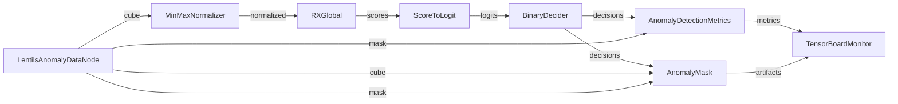

!!! warning "Status: Needs Review"
    This page has not been reviewed for accuracy and completeness. Content may be outdated or contain errors.

---

# Tutorial: RX Statistical Anomaly Detection

Learn how to build a complete anomaly detection pipeline using the RX (Reed-Xiaoli) detector with statistical initialization.

## Overview

**What You'll Learn:**

- Loading and preprocessing hyperspectral data with CUVIS.AI nodes
- Building a statistical anomaly detection pipeline
- Initializing detectors with statistical training
- Evaluating results with metrics and visualization
- Saving and exporting trained pipelines

**Prerequisites:**

- cuvis-ai installed (`pip install cuvis-ai`)
- Basic Python knowledge
- Understanding of [Node System](../concepts/node-system-deep-dive.md) fundamentals
- Familiarity with [Pipeline Lifecycle](../concepts/pipeline-lifecycle.md)

**Time:** ~25 minutes

**Perfect for:** Users new to CUVIS.AI who want to understand statistical-only training workflows and anomaly detection fundamentals.

---

## Background

### What is RX Detection?

The RX (Reed-Xiaoli) detector is a classical anomaly detection algorithm for hyperspectral imaging. It identifies anomalies by measuring how unusual each pixel's spectrum is compared to the background distribution.

**Key Concept:** RX uses the Mahalanobis distance to compute anomaly scores:

$$
RX(x) = (x - \mu)^T \Sigma^{-1} (x - \mu)
$$

Where:
- $x$ is the pixel spectrum
- $\mu$ is the background mean spectrum
- $\Sigma$ is the covariance matrix

Higher scores indicate pixels that are spectrally different from the background.

### When to Use RX Detection

✅ **Use RX when:**
- You need unsupervised anomaly detection
- Background follows a Gaussian distribution
- You have hyperspectral or multispectral data
- You want a fast, interpretable baseline

❌ **Don't use RX when:**
- Background is highly non-Gaussian
- You need deep contextual reasoning
- You have limited initialization data

### RX in CUVIS.AI

CUVIS.AI implements RX as a **statistical node** that:
1. Collects background statistics during initialization
2. Computes covariance and mean from initialization data
3. Calculates Mahalanobis distance for new data
4. Outputs anomaly scores (higher = more anomalous)

---

## Step 1: Setup and Data Loading

### Environment Setup

First, ensure cuvis-ai is installed:

```bash
pip install cuvis-ai
```

### Understanding the Data

This tutorial uses the Lentils Anomaly Dataset, which contains hyperspectral cubes with 5 classes:

| Class ID | Name | Normal/Anomaly |
|----------|------|----------------|
| 0 | Unlabeled | Normal |
| 1 | Lentils_black | Normal |
| 2 | Lentils_brown | Anomaly |
| 3 | Stone | Anomaly |
| 4 | Background | Anomaly |

We'll treat classes 0 and 1 as "normal" and detect brown lentils, stones, and background as anomalies.

## Data Loading with LentilsAnomalyDataNode

```python
from pathlib import Path
from cuvis_ai.node.data import LentilsAnomalyDataNode
from cuvis_ai_core.data.datasets import SingleCu3sDataModule
from cuvis_ai_core.pipeline.pipeline import CuvisPipeline

# Initialize datamodule
datamodule = SingleCu3sDataModule(
    data_dir="data/lentils",
    batch_size=4,
    num_workers=0,
)
datamodule.setup(stage="fit")

# Create data node with normal class specification
data_node = LentilsAnomalyDataNode(
    normal_class_ids=[0, 1],  # Unlabeled and black lentils are normal
)
```

**What's Happening:**
- `SingleCu3sDataModule`: Loads CU3S hyperspectral data format
- `LentilsAnomalyDataNode`: Converts multi-class segmentation to binary anomaly labels
- `normal_class_ids=[0, 1]`: Classes 0 and 1 are background; others are anomalies

**Data Node Outputs:**
- `cube`: Hyperspectral cube [B, H, W, 61] (61 spectral channels)
- `mask`: Binary anomaly mask [B, H, W, 1]
- `wavelengths`: Wavelength array [61]

---

## Step 2: Build the Pipeline

### Create Pipeline

```python
# Initialize pipeline
pipeline = CuvisPipeline("RX_Statistical")
```

## Step 2: Preprocessing

### Add Preprocessing Node

Normalization is critical for stable RX detection:

```python
from cuvis_ai.node.normalization import MinMaxNormalizer

normalizer_node = MinMaxNormalizer(
    eps=1.0e-6,              # Numerical stability
    use_running_stats=True,  # Compute global min/max during training
)
```

**Why MinMaxNormalizer?**
- Scales data to [0, 1] range
- Uses running statistics computed during statistical initialization
- Ensures stable covariance computation for RX

### Add RX Detector

```python
from cuvis_ai.anomaly.rx_detector import RXGlobal

rx_node = RXGlobal(
    num_channels=61,  # Number of spectral channels
    eps=1.0e-6,       # Small constant for numerical stability
)
```

**RXGlobal** computes global background statistics from all spatial pixels.

## RX Logit Head

### Transform Scores to Logits

```python
from cuvis_ai.node.conversion import ScoreToLogit

logit_head = ScoreToLogit(
    init_scale=1.0,  # Scale factor for scores
    init_bias=0.0,   # Bias term
)
```

**Why ScoreToLogit?**
- Converts raw RX scores to logit space
- Enables integration with binary cross-entropy losses
- Makes scores more interpretable for thresholding

## Decision Thresholding

### Add Decision Node

```python
from cuvis_ai.deciders.binary_decider import BinaryDecider

decider_node = BinaryDecider(threshold=0.5)
```

Applies a fixed threshold (0.5) to convert logits to binary decisions.

## Metrics Tracking

### Add Metrics and Monitoring

```python
from cuvis_ai.node.metrics import AnomalyDetectionMetrics
from cuvis_ai.node.monitor import TensorBoardMonitorNode
from cuvis_ai.node.visualizations import AnomalyMask

# Anomaly detection metrics (IoU, precision, recall, F1)
metrics_anomaly = AnomalyDetectionMetrics(name="metrics_anomaly")

# Visualization node
viz_mask = AnomalyMask(name="mask", channel=30, up_to=5)

# TensorBoard monitoring
tensorboard_node = TensorBoardMonitorNode(
    output_dir="runs/tensorboard",
    run_name=pipeline.name,
)
```

### Connect the Pipeline

```python
pipeline.connect(
    # Processing flow: data → normalize → RX → logits → decisions
    (data_node.outputs.cube, normalizer_node.data),
    (normalizer_node.normalized, rx_node.data),
    (rx_node.scores, logit_head.scores),
    (logit_head.logits, decider_node.logits),

    # Metric flow: decisions + ground truth → metrics → TensorBoard
    (decider_node.decisions, metrics_anomaly.decisions),
    (data_node.outputs.mask, metrics_anomaly.targets),
    (metrics_anomaly.metrics, tensorboard_node.metrics),

    # Visualization flow: decisions + mask + cube → visualizer → TensorBoard
    (decider_node.decisions, viz_mask.decisions),
    (data_node.outputs.mask, viz_mask.mask),
    (data_node.outputs.cube, viz_mask.cube),
    (viz_mask.artifacts, tensorboard_node.artifacts),
)
```

### Visualize Pipeline Structure

```python
# Generate pipeline visualization
pipeline.visualize(
    format="render_graphviz",
    output_path="outputs/pipeline/RX_Statistical.png",
    show_execution_stage=True,
)
```

**Pipeline Flow:**



---

## Step 3: Statistical Initialization

Statistical initialization computes background statistics from training data.

### Create Statistical Trainer

```python
from cuvis_ai_core.training import StatisticalTrainer

stat_trainer = StatisticalTrainer(
    pipeline=pipeline,
    datamodule=datamodule,
)
```

### Run Statistical Training

```python
stat_trainer.fit()
```

**What Happens During Statistical Training:**

1. **MinMaxNormalizer** collects min/max values across training data
2. **RXGlobal** computes:
   - Background mean spectrum $\mu$
   - Covariance matrix $\Sigma$
   - Inverse covariance $\Sigma^{-1}$ for Mahalanobis distance

**Console Output:**
```
[INFO] Statistical initialization starting...
[INFO] Collecting statistics from training data...
[INFO] MinMaxNormalizer: min=-0.123, max=1.987
[INFO] RXGlobal: Computed background statistics (61 channels)
[INFO] Statistical initialization complete
```

**Key Points:**
- Only nodes with `statistical_initialization()` method are initialized
- Normalizer and RX detector are initialized; other nodes remain frozen
- No gradient computation occurs

---

## Step 4: Evaluation

### Validation Evaluation

```python
logger.info("Running validation evaluation...")
stat_trainer.validate()
```

**Validation Output:**
```
[INFO] Validation metrics (epoch 0):
  metrics_anomaly/iou: 0.723
  metrics_anomaly/precision: 0.812
  metrics_anomaly/recall: 0.801
  metrics_anomaly/f1: 0.806
```

### Test Evaluation

```python
logger.info("Running test evaluation...")
stat_trainer.test()
```

**Test metrics** are computed on held-out test data to measure generalization.

---

## Step 5: Results Visualization

## Visualization with TensorBoard

```bash
tensorboard --logdir=runs/tensorboard
```

Navigate to http://localhost:6006 to see:

- **Metrics**: IoU, precision, recall, F1 over batches
- **Images**:
  - Input hyperspectral cube (false-color RGB)
  - Ground truth anomaly mask
  - Predicted anomaly mask
  - Anomaly score heatmap

## Visualization

**Anomaly Detection Metrics:**

| Metric | Description | Good Range |
|--------|-------------|------------|
| IoU | Intersection over Union | > 0.7 |
| Precision | True Positives / Predicted Positives | > 0.8 |
| Recall | True Positives / Actual Positives | > 0.7 |
| F1 | Harmonic mean of precision and recall | > 0.75 |

## Visualization with Sigmoid

**Example Visualization:**
- **Green pixels**: Correct detections (true positives)
- **Red pixels**: False alarms (false positives)
- **Blue pixels**: Missed anomalies (false negatives)

---

## Step 6: Save Pipeline and TrainRun Config

### Save Trained Pipeline

```python
from cuvis_ai_core.training.config import PipelineMetadata

output_path = Path("outputs/trained_models/RX_Statistical.yaml")

pipeline.save_to_file(
    str(output_path),
    metadata=PipelineMetadata(
        name=pipeline.name,
        description="RX detector with statistical training",
        tags=["statistical", "rx", "anomaly-detection"],
        author="cuvis.ai",
    ),
)
```

**Created Files:**
- `RX_Statistical.yaml`: Pipeline structure and configuration
- `RX_Statistical.pt`: Trained weights (normalizer stats, RX covariance)

### Save TrainRun Config for Reproducibility

```python
from cuvis_ai_core.training.config import TrainRunConfig, TrainingConfig

trainrun_config = TrainRunConfig(
    name="rx_statistical",
    pipeline=pipeline.serialize(),
    data=datamodule_config,
    training=TrainingConfig(seed=42),
    output_dir="outputs",
    loss_nodes=[],  # No loss nodes in statistical-only training
    metric_nodes=["metrics_anomaly"],
    freeze_nodes=[],
    unfreeze_nodes=[],
)

trainrun_config.save_to_file("outputs/trained_models/rx_statistical_trainrun.yaml")
```

**TrainRun Config** captures:
- Complete pipeline structure
- Data configuration
- Training parameters
- Metric and loss nodes
- Freeze/unfreeze strategy

### Restore Pipeline Later

```python
# Restore from saved files
from cuvis_ai_core.pipeline.pipeline import CuvisPipeline

restored_pipeline = CuvisPipeline.load_from_file(
    "outputs/trained_models/RX_Statistical.yaml"
)
```

---

## Complete Example Script

Here's the full runnable script (`examples/rx_statistical.py`):

```python
from pathlib import Path
import hydra
from cuvis_ai_core.data.datasets import SingleCu3sDataModule
from cuvis_ai_core.pipeline.pipeline import CuvisPipeline
from cuvis_ai_core.training import StatisticalTrainer
from cuvis_ai_core.training.config import PipelineMetadata
from loguru import logger
from omegaconf import DictConfig

from cuvis_ai.anomaly.rx_detector import RXGlobal
from cuvis_ai.node.conversion import ScoreToLogit
from cuvis_ai.deciders.binary_decider import BinaryDecider
from cuvis_ai.node.data import LentilsAnomalyDataNode
from cuvis_ai.node.metrics import AnomalyDetectionMetrics
from cuvis_ai.node.monitor import TensorBoardMonitorNode
from cuvis_ai.node.normalization import MinMaxNormalizer
from cuvis_ai.node.visualizations import AnomalyMask


@hydra.main(config_path="../configs/", config_name="trainrun/default_statistical", version_base=None)
def main(cfg: DictConfig) -> None:
    """Statistical RX Anomaly Detection Tutorial."""

    logger.info("=== RX Statistical Anomaly Detection ===")
    output_dir = Path(cfg.output_dir)

    # Stage 1: Setup datamodule
    datamodule = SingleCu3sDataModule(**cfg.data)
    datamodule.setup(stage="fit")

    # Stage 2: Build pipeline
    pipeline = CuvisPipeline("RX_Statistical")

    data_node = LentilsAnomalyDataNode(normal_class_ids=[0, 1])
    normalizer_node = MinMaxNormalizer(eps=1.0e-6, use_running_stats=True)
    rx_node = RXGlobal(num_channels=61, eps=1.0e-6)
    logit_head = ScoreToLogit(init_scale=1.0, init_bias=0.0)
    decider_node = BinaryDecider(threshold=0.5)
    metrics_anomaly = AnomalyDetectionMetrics(name="metrics_anomaly")
    viz_mask = AnomalyMask(name="mask", channel=30, up_to=5)
    tensorboard_node = TensorBoardMonitorNode(
        output_dir=str(output_dir / ".." / "tensorboard"),
        run_name=pipeline.name,
    )

    # Stage 3: Connect graph
    pipeline.connect(
        (data_node.outputs.cube, normalizer_node.data),
        (normalizer_node.normalized, rx_node.data),
        (rx_node.scores, logit_head.scores),
        (logit_head.logits, decider_node.logits),
        (decider_node.decisions, metrics_anomaly.decisions),
        (data_node.outputs.mask, metrics_anomaly.targets),
        (metrics_anomaly.metrics, tensorboard_node.metrics),
        (decider_node.decisions, viz_mask.decisions),
        (data_node.outputs.mask, viz_mask.mask),
        (data_node.outputs.cube, viz_mask.cube),
        (viz_mask.artifacts, tensorboard_node.artifacts),
    )

    # Stage 4: Statistical initialization
    stat_trainer = StatisticalTrainer(pipeline=pipeline, datamodule=datamodule)
    stat_trainer.fit()

    # Stage 5: Evaluation
    logger.info("Running validation...")
    stat_trainer.validate()

    logger.info("Running test...")
    stat_trainer.test()

    # Stage 6: Save pipeline
    results_dir = output_dir / "trained_models"
    pipeline_output_path = results_dir / f"{pipeline.name}.yaml"

    pipeline.save_to_file(
        str(pipeline_output_path),
        metadata=PipelineMetadata(
            name=pipeline.name,
            description="RX Statistical Detector",
            tags=["statistical", "rx"],
            author="cuvis.ai",
        ),
    )

    logger.info(f"Pipeline saved: {pipeline_output_path}")
    logger.info(f"TensorBoard logs: {tensorboard_node.output_dir}")


if __name__ == "__main__":
    main()
```

**Run the example:**
```bash
python examples/rx_statistical.py
```

---

## Troubleshooting

### Issue: Low IoU (<0.5)

**Symptoms:** Poor anomaly detection performance

**Possible Causes:**
1. Insufficient initialization data
2. Normal classes incorrectly specified
3. Threshold too high/low

**Solutions:**
```python
# 1. Increase initialization data
datamodule = SingleCu3sDataModule(batch_size=8)  # Larger batches

# 2. Verify normal class IDs
data_node = LentilsAnomalyDataNode(
    normal_class_ids=[0, 1],  # Double-check which classes are normal
)

# 3. Adjust threshold
decider_node = BinaryDecider(threshold=0.3)  # Lower threshold for more detections
```

### Issue: Memory Error During Training

**Solution:** Reduce batch size:
```python
datamodule = SingleCu3sDataModule(
    batch_size=2,  # Reduce from 4
    num_workers=0,
)
```

### Issue: NaN in RX Scores

**Cause:** Singular covariance matrix (insufficient diversity in training data)

**Solution:**
```python
# Increase epsilon for numerical stability
rx_node = RXGlobal(num_channels=61, eps=1.0e-4)  # Larger epsilon
```

### Issue: TensorBoard Not Showing Visualizations

**Cause:** Visualization node execution stage mismatch

**Solution:**
```python
from cuvis_ai_schemas.enums import ExecutionStage

# Ensure visualization runs during validation/test
viz_mask = AnomalyMask(
    name="mask",
    channel=30,
    up_to=5,
    execution_stages={ExecutionStage.VAL, ExecutionStage.TEST},
)
```

---

## Next Steps

**Build on this tutorial:**

1. **[Channel Selector Tutorial](channel-selector.md)** - Add learnable channel selection with gradient training
2. **[Deep SVDD Tutorial](deep-svdd-gradient.md)** - Replace RX with deep learning one-class detector
3. **[gRPC Workflow](grpc-workflow.md)** - Deploy this pipeline as a remote service

**Explore related concepts:**

- [Two-Phase Training](../concepts/two-phase-training.md) - Combine statistical initialization with gradient optimization
- [Execution Stages](../concepts/execution-stages.md) - Control when nodes execute (train/val/test)
- [Node System Deep Dive](../concepts/node-system-deep-dive.md) - Learn to create custom nodes

**Explore related nodes:**

- [RXGlobal Node](../node-catalog/statistical.md#rxglobal) - Detailed RX implementation
- [MinMaxNormalizer](../node-catalog/preprocessing.md#minmaxnormalizer) - Normalization strategies
- [AnomalyDetectionMetrics](../node-catalog/loss-metrics.md#anomalydetectionmetrics) - Metrics reference

---

## Summary

In this tutorial, you learned:

✅ How to build a statistical anomaly detection pipeline
✅ How to initialize nodes with statistical training
✅ How to evaluate and visualize results
✅ How to save and restore trained pipelines

**Key Takeaways:**
- RX detection is a fast, interpretable baseline for hyperspectral anomaly detection
- Statistical initialization computes background statistics without gradients
- Pipeline serialization enables reproducibility and deployment
- TensorBoard provides comprehensive monitoring and visualization

Now you're ready to explore more advanced training strategies with gradient-based optimization!
