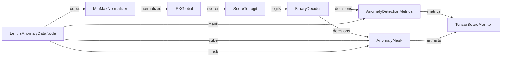

!!! warning "Status: Needs Review"
    This page has not been reviewed for accuracy and completeness. Content may be outdated or contain errors.

---

# Tutorial: RX Statistical Anomaly Detection

Learn how to build a complete anomaly detection pipeline using the RX (Reed-Xiaoli) detector with statistical initialization.

## Overview

**What You'll Learn:**

- Loading and preprocessing hyperspectral data with CUVIS.AI nodes
- Building a statistical anomaly detection pipeline
- Initializing detectors with statistical training
- Evaluating results with metrics and visualization
- Saving and exporting trained pipelines

**Prerequisites:**

- Understanding of [Node System](../concepts/node-system-deep-dive.md) fundamentals
- Familiarity with [Pipeline Lifecycle](../concepts/pipeline-lifecycle.md)

**Time:** ~25 minutes

**Perfect for:** Users new to CUVIS.AI who want to understand statistical-only training workflows and anomaly detection fundamentals.

---

## Background

### What is RX Detection?

The RX (Reed-Xiaoli) detector is a classical anomaly detection algorithm for hyperspectral imaging. It identifies anomalies by measuring how unusual each pixel's spectrum is compared to the background distribution.

**Key Concept:** RX uses the Mahalanobis distance to compute anomaly scores:

$$
RX(x) = (x - \mu)^T \Sigma^{-1} (x - \mu)
$$

Where:

- $x$ is the pixel spectrum
- $\mu$ is the background mean spectrum
- $\Sigma$ is the covariance matrix

Higher scores indicate pixels that are spectrally different from the background.

### When to Use RX Detection

✅ **Use RX when:**

- You need unsupervised anomaly detection
- Background follows a Gaussian distribution
- You have hyperspectral or multispectral data
- You want a fast, interpretable baseline

❌ **Don't use RX when:**

- Background is highly non-Gaussian
- You need deep contextual reasoning
- You have limited initialization data

### RX in CUVIS.AI

CUVIS.AI implements RX as a **statistical node** that:

1. Collects background statistics during initialization
2. Computes covariance and mean from initialization data
3. Calculates Mahalanobis distance for new data
4. Outputs anomaly scores (higher = more anomalous)

---

## Step 1: Setup and Data Loading

### Environment Setup

First, ensure cuvis-ai is installed:

```bash
pip install cuvis-ai
```

### Understanding the Data

This tutorial uses the Lentils Anomaly Dataset, which contains hyperspectral cubes with 5 classes:

| Class ID | Name | Normal/Anomaly |
|----------|------|----------------|
| 0 | Unlabeled | Normal |
| 1 | Lentils_black | Normal |
| 2 | Lentils_brown | Anomaly |
| 3 | Stone | Anomaly |
| 4 | Background | Anomaly |

We'll treat classes 0 and 1 as "normal" and detect brown lentils, stones, and background as anomalies.

## Data Loading with LentilsAnomalyDataNode

```python
from pathlib import Path
from cuvis_ai.node.data import LentilsAnomalyDataNode
from cuvis_ai_core.data.datasets import SingleCu3sDataModule
from cuvis_ai_core.pipeline.pipeline import CuvisPipeline

# Initialize datamodule
datamodule = SingleCu3sDataModule(
    data_dir="data/lentils",
    batch_size=4,
    num_workers=0,
)
datamodule.setup(stage="fit")

# Create data node with normal class specification
data_node = LentilsAnomalyDataNode(
    normal_class_ids=[0, 1],  # Unlabeled and black lentils are normal
)
```

**Data Node Outputs:** `cube` [B, H, W, 61], `mask` [B, H, W, 1], `wavelengths` [61].

---

## Step 2: Build the Pipeline

### Create Pipeline

```python
# Initialize pipeline
pipeline = CuvisPipeline("RX_Statistical")
```

### Add Preprocessing Node

```python
from cuvis_ai.node.normalization import MinMaxNormalizer

normalizer_node = MinMaxNormalizer(
    eps=1.0e-6,              # Numerical stability
    use_running_stats=True,  # Compute global min/max during training
)
```

### Add RX Detector

```python
from cuvis_ai.anomaly.rx_detector import RXGlobal

rx_node = RXGlobal(
    num_channels=61,  # Number of spectral channels
    eps=1.0e-6,       # Small constant for numerical stability
)
```

### Add Logit Head

```python
from cuvis_ai.node.conversion import ScoreToLogit

logit_head = ScoreToLogit(
    init_scale=1.0,  # Scale factor for scores
    init_bias=0.0,   # Bias term
)
```

### Add Decision Node

```python
from cuvis_ai.deciders.binary_decider import BinaryDecider

decider_node = BinaryDecider(threshold=0.5)
```

### Add Metrics and Monitoring

```python
from cuvis_ai.node.metrics import AnomalyDetectionMetrics
from cuvis_ai.node.monitor import TensorBoardMonitorNode
from cuvis_ai.node.anomaly_visualization import AnomalyMask

# Anomaly detection metrics (IoU, precision, recall, F1)
metrics_anomaly = AnomalyDetectionMetrics(name="metrics_anomaly")

# Visualization node
viz_mask = AnomalyMask(name="mask", channel=30, up_to=5)

# TensorBoard monitoring
tensorboard_node = TensorBoardMonitorNode(
    output_dir="runs/tensorboard",
    run_name=pipeline.name,
)
```

### Connect the Pipeline

```python
pipeline.connect(
    # Processing flow: data → normalize → RX → logits → decisions
    (data_node.outputs.cube, normalizer_node.data),
    (normalizer_node.normalized, rx_node.data),
    (rx_node.scores, logit_head.scores),
    (logit_head.logits, decider_node.logits),

    # Metric flow: decisions + ground truth → metrics → TensorBoard
    (decider_node.decisions, metrics_anomaly.decisions),
    (data_node.outputs.mask, metrics_anomaly.targets),
    (metrics_anomaly.metrics, tensorboard_node.metrics),

    # Visualization flow: decisions + mask + cube → visualizer → TensorBoard
    (decider_node.decisions, viz_mask.decisions),
    (data_node.outputs.mask, viz_mask.mask),
    (data_node.outputs.cube, viz_mask.cube),
    (viz_mask.artifacts, tensorboard_node.artifacts),
)
```

### Visualize Pipeline Structure

```python
# Generate pipeline visualization
pipeline.visualize(
    format="render_graphviz",
    output_path="outputs/pipeline/RX_Statistical.png",
    show_execution_stage=True,
)
```

**Pipeline Flow:**


```mermaid
graph LR
    A[LentilsAnomalyDataNode] -->|cube| B[MinMaxNormalizer]
    B -->|normalized| C[RXGlobal]
    C -->|scores| D[ScoreToLogit]
    D -->|logits| E[BinaryDecider]
    E -->|decisions| F[AnomalyDetectionMetrics]
    A -->|mask| F
    F -->|metrics| G[TensorBoardMonitor]
    E -->|decisions| H[AnomalyMask]
    A -->|cube| H
    A -->|mask| H
    H -->|artifacts| G
```

---

## Step 3: Statistical Initialization

Statistical initialization computes background statistics from training data.

### Create Statistical Trainer

```python
from cuvis_ai_core.training import StatisticalTrainer

stat_trainer = StatisticalTrainer(
    pipeline=pipeline,
    datamodule=datamodule,
)
```

### Run Statistical Training

```python
stat_trainer.fit()
```

**What Happens During Statistical Training:**

1. **MinMaxNormalizer** collects min/max values across training data
2. **RXGlobal** computes:
   - Background mean spectrum $\mu$
   - Covariance matrix $\Sigma$
   - Inverse covariance $\Sigma^{-1}$ for Mahalanobis distance

Only nodes with a `statistical_initialization()` method are initialized (normalizer and RX detector). No gradient computation occurs.

---

## Step 4: Evaluation

### Validation Evaluation

```python
logger.info("Running validation evaluation...")
stat_trainer.validate()
```

### Test Evaluation

```python
stat_trainer.test()
```

---

## Step 5: Results Visualization

```bash
tensorboard --logdir=runs/tensorboard
```

Navigate to http://localhost:6006 to see:

- **Metrics**: IoU, precision, recall, F1 over batches
- **Images**:
  - Input hyperspectral cube (false-color RGB)
  - Ground truth anomaly mask
  - Predicted anomaly mask
  - Anomaly score heatmap

**Anomaly Detection Metrics:**

| Metric | Description | Good Range |
|--------|-------------|------------|
| IoU | Intersection over Union | > 0.7 |
| Precision | True Positives / Predicted Positives | > 0.8 |
| Recall | True Positives / Actual Positives | > 0.7 |
| F1 | Harmonic mean of precision and recall | > 0.75 |

**Visualization color coding:** Green = true positives, Red = false positives, Blue = false negatives.

---

## Step 6: Save Pipeline and TrainRun Config

### Save Trained Pipeline

```python
from cuvis_ai_core.training.config import PipelineMetadata

output_path = Path("outputs/trained_models/RX_Statistical.yaml")

pipeline.save_to_file(
    str(output_path),
    metadata=PipelineMetadata(
        name=pipeline.name,
        description="RX detector with statistical training",
        tags=["statistical", "rx", "anomaly-detection"],
        author="cuvis.ai",
    ),
)
```

**Created Files:**

- `RX_Statistical.yaml`: Pipeline structure and configuration
- `RX_Statistical.pt`: Trained weights (normalizer stats, RX covariance)

### Save TrainRun Config for Reproducibility

```python
from cuvis_ai_core.training.config import TrainRunConfig, TrainingConfig

trainrun_config = TrainRunConfig(
    name="rx_statistical",
    pipeline=pipeline.serialize(),
    data=datamodule_config,
    training=TrainingConfig(seed=42),
    output_dir="outputs",
    loss_nodes=[],  # No loss nodes in statistical-only training
    metric_nodes=["metrics_anomaly"],
    freeze_nodes=[],
    unfreeze_nodes=[],
)

trainrun_config.save_to_file("outputs/trained_models/rx_statistical_trainrun.yaml")
```

### Restore Pipeline Later

```python
# Restore from saved files
from cuvis_ai_core.pipeline.pipeline import CuvisPipeline

restored_pipeline = CuvisPipeline.load_from_file(
    "outputs/trained_models/RX_Statistical.yaml"
)
```

---

## Complete Example

The full runnable script is at `examples/rx_statistical.py`. Run it with:

```bash
python examples/rx_statistical.py
```

---

???+ tip "Troubleshooting"

    ### Issue: Low IoU (<0.5)

    **Possible Causes:** Insufficient initialization data, normal classes incorrectly specified, threshold too high/low.

    ```python
    # 1. Increase initialization data
    datamodule = SingleCu3sDataModule(batch_size=8)  # Larger batches

    # 2. Verify normal class IDs
    data_node = LentilsAnomalyDataNode(
        normal_class_ids=[0, 1],  # Double-check which classes are normal
    )

    # 3. Adjust threshold
    decider_node = BinaryDecider(threshold=0.3)  # Lower threshold for more detections
    ```

    ### Issue: Memory Error During Training

    Reduce batch size:
    ```python
    datamodule = SingleCu3sDataModule(batch_size=2, num_workers=0)
    ```

    ### Issue: NaN in RX Scores

    Singular covariance matrix — increase epsilon:
    ```python
    rx_node = RXGlobal(num_channels=61, eps=1.0e-4)
    ```

    ### Issue: TensorBoard Not Showing Visualizations

    Visualization node execution stage mismatch:
    ```python
    from cuvis_ai_schemas.enums import ExecutionStage

    viz_mask = AnomalyMask(
        name="mask",
        channel=30,
        up_to=5,
        execution_stages={ExecutionStage.VAL, ExecutionStage.TEST},
    )
    ```
