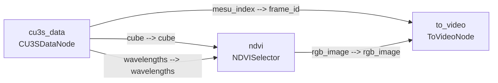
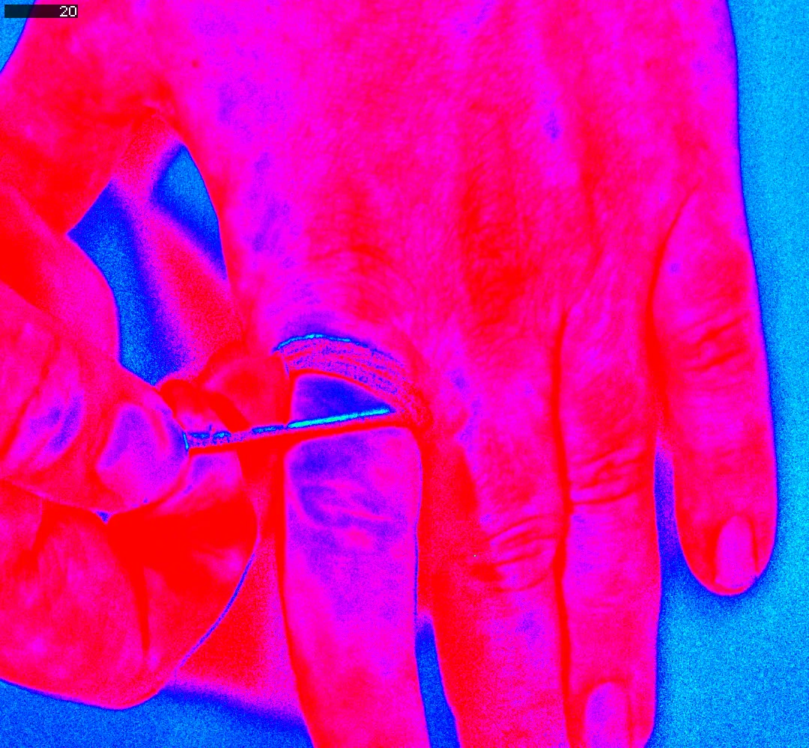

!!! warning "Status: Needs Review"
    This page has not been reviewed for accuracy and completeness. Content may be outdated or contain errors.

---

!!! info "Runnable scripts live in cuvis-ai-cookbook"
    The Python scripts referenced below are in the [cuvis-ai-cookbook](https://github.com/cubert-hyperspectral/cuvis-ai-cookbook) repo. Clone it alongside this repo and run the commands from there.

# Tutorial: Blood Perfusion Visualization with NDVI

This tutorial takes a hyperspectral CU3S session of a hand and builds a **blood-perfusion video** by applying a Normalized Difference Vegetation Index (NDVI) projection between a near-infrared (NIR) band and a visible "red" band. The same NDVI idea that flags chlorophyll in plants flags **haemoglobin** in tissue — high NDVI means more blood in the optical path (perfusion), *not* necessarily oxygenated blood.

We build a three-node cuvis-ai pipeline:

```
CU3SDataNode  ──►  NDVISelector  ──►  ToVideoNode
```

A final advanced section (§8) extends the pipeline with custom nodes to add a qualitative SpO2 proxy on top of the perfusion result.

!!! tip "Run this as a notebook"
    This page mirrors the live notebook at [`notebooks/use_cases/blood_perfusion.ipynb`](https://github.com/cubert-hyperspectral/cuvis-ai/blob/main/notebooks/use_cases/blood_perfusion.ipynb). Open it in JupyterLab or VS Code to follow along section-for-section with editable cells.

## Overview

**What You'll Learn:**

- Loading hyperspectral data from `.cu3s` files with `CU3SDataNode`
- Computing the normalized difference index for blood perfusion with `NDVISelector`
- Wiring nodes together with `pipeline.connect((source, target), …)`
- Sanity-checking a single frame before a full sweep with `Predictor.predict(collect_outputs=True)`
- Writing the result to MP4 with `ToVideoNode`
- Extending the framework with **custom nodes** (`SpO2RatioSelector`, `BloodHealthMaskNode`)

**Time:** ~30 minutes (most of which is the dataset download and the full-frame sweep).

**Perfect for:** Users who want to learn pipeline construction through a real-world hyperspectral visualization workflow, and who want a worked example of dropping custom `Node` subclasses into a graph alongside the built-ins.

!!! tip "Just want to run it?"
    Skip ahead to [Running the example](#running-the-example) to execute the script directly.

---

## Prerequisites

**Install cuvis-ai.** See the [Installation Guide](../user-guide/installation.md) for the full setup — supported on **Linux**, **macOS**, and **Windows**.

**Concepts to be familiar with:**

- [Node System](../concepts/node-system-deep-dive.md) — what a `Node` is and how `INPUT_SPECS` / `OUTPUT_SPECS` define ports.
- [Pipeline Lifecycle](../concepts/pipeline-lifecycle.md) — train-then-predict, execution stages.

**Dataset:** the XMR Blood Perfusion session is downloaded automatically by §1 below, but you can also pre-fetch it from the repo root:

```bash
uv run dataset download blood_perfusion
```

---

## 1. Fetch the dataset

The XMR Blood Perfusion session (~11 GB) lives on Hugging Face Hub. The notebook checks for the file and downloads via `PublicDatasets.download_dataset` if missing — equivalent to running `uv run dataset download blood_perfusion` from a terminal.

```python
from pathlib import Path

from loguru import logger

from cuvis_ai_core.data.public_datasets import PublicDatasets

dataset_dir = Path("../../data")
cu3s_file_path = dataset_dir / "XMR_Blood_Perfusion" / "Auto_005.cu3s"

if not cu3s_file_path.exists():
    logger.info("CU3S not found at {}. Downloading…", cu3s_file_path)
    dataset_dir.mkdir(parents=True, exist_ok=True)
    ok = PublicDatasets.download_dataset(
        "blood_perfusion",
        download_path=str(dataset_dir),
        force=False,
    )
    if not ok or not cu3s_file_path.exists():
        raise FileNotFoundError(
            f"Dataset download failed. Expected {cu3s_file_path}. "
            "Try running `uv run dataset download blood_perfusion` manually."
        )

logger.success("CU3S ready: {}", cu3s_file_path)
```

---

## 2. What is NDVI?

**NDVI — Normalized Difference Vegetation Index** — was invented in the 1970s to map healthy vegetation from satellite imagery. It is a pixel-wise contrast between two wavelength bands, chosen to exploit how *chlorophyll* behaves with light:

- **Red** ($\approx 620$–$680$ nm): the red end of the visible spectrum. Chlorophyll absorbs heavily here, so green leaves reflect very little red light.
- **Near-infrared (NIR)** ($\approx 760$–$900$ nm): just past the red end of visible — the eye can't see it. Internal leaf scattering makes vegetation a strong NIR *reflector*.

(For orientation: visible light covers $\approx 380$–$740$ nm; NIR runs from there out to $\approx 1400$ nm. Both are easily within reach of a Cubert hyperspectral camera.)

A pixel of healthy vegetation therefore has a big gap between $R_{\mathrm{NIR}}$ and $R_{\mathrm{Red}}$. The contrast is normalized so the index does not depend on overall brightness:

$$
\mathrm{NDVI}(x, y) =
  \frac{R_{\mathrm{NIR}}(x, y) - R_{\mathrm{Red}}(x, y)}
       {R_{\mathrm{NIR}}(x, y) + R_{\mathrm{Red}}(x, y)}
$$

where $R_{\mathrm{NIR}}(x, y)$ and $R_{\mathrm{Red}}(x, y)$ are the per-pixel **reflectance** values — the fraction of incident light returned by the surface, in $[0, 1]$ — sampled from the hyperspectral cube by nearest-wavelength match to `NIR_NM` and `RED_NM`.

NDVI itself is bounded in $[-1, +1]$, with rough rules of thumb on satellite imagery:

- $+0.6$ to $+0.9$ — dense, healthy vegetation
- $\approx 0$ — bare soil, rocks, dead plants
- $< 0$ — water, snow, clouds

**Why we use it for blood perfusion.** Same idea, different chromophore. Swap *chlorophyll* for *haemoglobin* and re-pick the bands: at NIR $\approx 750$ nm tissue is fairly transparent, while at the visible band $\approx 566$ nm both oxy- and deoxy-haemoglobin absorb strongly. The index is then dominated by **how much haemoglobin sits in the optical path** — i.e. blood volume — so pixels with more blood drive NDVI up. That is a **perfusion** signal.

This is *not* a clean oxygenation (SpO2) measurement. An **isosbestic point** is a wavelength where oxy-haemoglobin and deoxy-haemoglobin absorb *equally*; the signal there reflects total haemoglobin and is blind to its oxygenation state. Visible-light isosbestics for haemoglobin sit at $\approx 545$, $570$, and $584$ nm, with another in the NIR around $800$ nm. 566 nm sits *near* the $\sim 570$ nm one but not exactly on it, so the index couples only weakly to oxygenation; isolating SpO2 requires a different wavelength choice and a multi-band model (we sketch that in [§8](#8-advanced-extending-the-framework-with-custom-nodes)).

`NDVISelector` resolves each of `nir_nm` / `red_nm` to the nearest sensor wavelength, computes NDVI for every pixel of every frame, and maps the result to an RGB frame via an HSV-style colormap. `colormap_min` / `colormap_max` clip the ends of the scale.

---

## 3. Tutorial configuration

Each knob below is safe to edit.

- **`NIR_NM` / `RED_NM`** — the two wavelengths NDVI differences over. The 750 / 566 nm pair is tuned for haemoglobin contrast (see [§2](#2-what-is-ndvi)).
- **`COLORMAP_MIN` / `COLORMAP_MAX`** — NDVI values below/above these saturate to the colormap's endpoints. Tighten the range to exaggerate small contrasts.
- **`TOTAL_FRAMES`** — known length of the XMR Blood Perfusion session (568 frames).
- **`N_FRAMES`** — how many frames to process. Drop to 20 for a fast first run.
- **`FRAME_RATE`** — output video FPS.
- **`FRAME_ROTATION`** — degrees to rotate each frame (e.g. 90, 180) or `None`.

```python
NIR_NM = 750.0
RED_NM = 566.0
COLORMAP_MIN = -0.7
COLORMAP_MAX = 0.5

TOTAL_FRAMES = 568
N_FRAMES = TOTAL_FRAMES
FRAME_RATE = 15.0
FRAME_ROTATION: int | None = None

output_dir = Path("./output/blood_perfusion")
output_video_path = output_dir / "ndvi_projection.mp4"
output_dir.mkdir(parents=True, exist_ok=True)
```

---

## 4. Build the pipeline

Three nodes, four connections:

- `CU3SDataNode` unpacks each batch of CU3S measurements into a `[B, H, W, C]` float cube plus the 1-D wavelength vector.
- `NDVISelector` consumes the cube and wavelengths, emits a colour-mapped `rgb_image` plus the raw `index_image`.
- `ToVideoNode` writes the RGB frames to an MP4, using `frame_id` (the measurement index) as an on-screen overlay.

```python
from cuvis_ai.node.channel_selector import NDVISelector
from cuvis_ai.node.data import CU3SDataNode
from cuvis_ai.node.video import ToVideoNode
from cuvis_ai_core.pipeline.pipeline import CuvisPipeline

pipeline = CuvisPipeline("BloodPerfusion_NDVI_Projection")
cu3s_data = CU3SDataNode(name="cu3s_data")
ndvi = NDVISelector(
    nir_nm=NIR_NM,
    red_nm=RED_NM,
    colormap_min=COLORMAP_MIN,
    colormap_max=COLORMAP_MAX,
    name="ndvi",
)
to_video = ToVideoNode(
    output_video_path=str(output_video_path),
    frame_rate=FRAME_RATE,
    frame_rotation=FRAME_ROTATION,
    name="to_video",
)

pipeline.connect(
    (cu3s_data.outputs.cube, ndvi.cube),
    (cu3s_data.outputs.wavelengths, ndvi.wavelengths),
    (ndvi.rgb_image, to_video.rgb_image),
    (cu3s_data.outputs.mesu_index, to_video.frame_id),
)
```

!!! note "The tuple pattern"
    `(source.outputs.port, target.port)` is the fundamental building block of every cuvis-ai pipeline connection.



---

## 5. Sanity-check on a single frame

Before committing to the full 568-frame sweep, render exactly one frame end-to-end so we can verify wavelengths, colormap, orientation, and overall sanity in seconds. Set `PREVIEW_FRAME_ID` to whichever frame you want to inspect, then point a fresh `SingleCu3sDataModule` at just that index. With `collect_outputs=True`, `Predictor.predict` captures the rendered RGB tensor in a list of dicts keyed by `(node_name, port_name)`, which we plot inline.

!!! note
    The main pipeline still includes `ToVideoNode`, so this run writes a one-frame `.mp4` to `output_video_path`. [§6](#6-run-the-pipeline) overwrites it on the full sweep.

```python
import matplotlib.pyplot as plt
import torch

from cuvis_ai_core.data.datasets import SingleCu3sDataModule
from cuvis_ai_core.training import Predictor

PREVIEW_FRAME_ID = 200

preview_datamodule = SingleCu3sDataModule(
    cu3s_file_path=str(cu3s_file_path),
    processing_mode="Reflectance",
    batch_size=1,
    predict_ids=[PREVIEW_FRAME_ID],
)

pipeline.to(torch.device("cpu"))
preview_predictor = Predictor(pipeline=pipeline, datamodule=preview_datamodule)
preview_outputs = preview_predictor.predict(collect_outputs=True)

# Pull frame's RGB out of the (node_name, port_name) keyed dict
preview_rgb = preview_outputs[0][("ndvi", "rgb_image")][0].cpu().numpy()

plt.figure(figsize=(8, 6))
plt.imshow(preview_rgb)
plt.title(f"NDVI — frame {PREVIEW_FRAME_ID}")
plt.axis("off")
plt.show()
```



---

## 6. Run the pipeline

`Predictor.predict` iterates batches from the `SingleCu3sDataModule` and pushes each one through the connected pipeline. `max_batches=N_FRAMES` caps the run; `collect_outputs=False` tells the predictor to discard per-batch tensors after `ToVideoNode` has written them — important for memory on the full 568-frame sweep.

```python
datamodule = SingleCu3sDataModule(
    cu3s_file_path=str(cu3s_file_path),
    processing_mode="Reflectance",
    batch_size=1,
    predict_ids=None,
)

pipeline.to(torch.device("cpu"))

predictor = Predictor(pipeline=pipeline, datamodule=datamodule)
predictor.predict(max_batches=N_FRAMES, collect_outputs=False)

if not output_video_path.exists():
    raise RuntimeError(f"Expected output video was not created: {output_video_path}")

logger.success("NDVI export complete: {}", output_video_path)
```

---

## 7. Watch the result

When the sweep finishes, `output_video_path` (e.g. `./output/blood_perfusion/ndvi_projection.mp4`) holds the final video. In the notebook this is embedded inline:

```python
from IPython.display import Video, display

display(Video(str(output_video_path), embed=False, width=640))
```

Outside the notebook, open the MP4 with any video player. A still frame from the result looks like:


---

## 8. Advanced: extending the framework with custom nodes

*Advanced section.* Everything above used only stock cuvis-ai nodes. The framework is designed to be extended — any class that follows the `Node` contract (port `INPUT_SPECS` / `OUTPUT_SPECS` plus a `forward()` method) drops straight into a `CuvisPipeline.connect(...)` graph alongside the built-ins. We demonstrate by adding a *qualitative* SpO2 proxy on top of the perfusion pipeline.

The cleanest answer to "is this blood oxygenated?" is Beer-Lambert linear unmixing across ≥3 wavelengths. The simpler 2-band version mirrors the NDVI trick on a wavelength pair chosen for oxy/deoxy contrast:

- **`deoxy_nm` ≈ 760 nm** — strong deoxy-Hb peak; oxy-Hb barely absorbs.
- **`oxy_nm` ≈ 577 nm** — β peak of oxy-Hb.

Computing $(R_\mathrm{deoxy} - R_\mathrm{oxy}) / (R_\mathrm{deoxy} + R_\mathrm{oxy})$ produces an index that moves up with oxygenation. Honest caveat: it still couples to blood volume and pigmentation — *not* a calibrated SpO2.

Two custom nodes do the work:

- **`SpO2RatioSelector`** — extends `NDVISelector` and reuses its normalized-difference machinery; only the parameter names and defaults change.
- **`BloodHealthMaskNode`** — fresh `Node` that multiplies a colormapped RGB by a soft mask derived from the perfusion index, so SpO2 colour only shows up inside vessels.

The full pipeline forks the cube into both selectors, feeds the perfusion *index* (raw scalar, before colormap) as a mask, and gates the SpO2 colormap with it before writing a second video:

```
                   ┌─► NDVISelector ─── index_image ──┐
CU3SDataNode ──────┤                                  │
                   └─► SpO2RatioSelector ─ rgb_image ─┴─► BloodHealthMaskNode ──► ToVideoNode
```

### Custom node definitions

```python
from typing import Any

import torch
from cuvis_ai_schemas.pipeline import PortSpec

from cuvis_ai.node.channel_selector import NDVISelector
from cuvis_ai_core.node import Node


class SpO2RatioSelector(NDVISelector):
    """Two-band SpO2 proxy: NDVI applied on a (deoxy, oxy) wavelength pair."""

    def __init__(
        self,
        deoxy_nm: float = 760.0,
        oxy_nm: float = 577.0,
        **kwargs: Any,
    ) -> None:
        kwargs.setdefault("colormap_min", -0.3)
        kwargs.setdefault("colormap_max", 0.3)
        super().__init__(nir_nm=deoxy_nm, red_nm=oxy_nm, **kwargs)


class BloodHealthMaskNode(Node):
    """Multiply an RGB image by a soft mask derived from a scalar perfusion index."""

    INPUT_SPECS = {
        "rgb_image": PortSpec(dtype=torch.float32, shape=(-1, -1, -1, 3)),
        "perfusion_index": PortSpec(dtype=torch.float32, shape=(-1, -1, -1, 1)),
    }
    OUTPUT_SPECS = {
        "rgb_image": PortSpec(dtype=torch.float32, shape=(-1, -1, -1, 3)),
    }

    def __init__(self, mask_low: float = -0.1, mask_high: float = 0.2, **kwargs: Any) -> None:
        super().__init__(mask_low=float(mask_low), mask_high=float(mask_high), **kwargs)
        self.mask_low = float(mask_low)
        self.mask_high = float(mask_high)

    def forward(
        self,
        rgb_image: torch.Tensor,
        perfusion_index: torch.Tensor,
        **_: Any,
    ) -> dict[str, torch.Tensor]:
        """Soft-mask an RGB image by a scalar perfusion index in [mask_low, mask_high]."""
        span = self.mask_high - self.mask_low
        mask = ((perfusion_index - self.mask_low) / span).clamp(0.0, 1.0)
        return {"rgb_image": rgb_image * mask}
```

### Building the advanced pipeline

```python
advanced_output_path = output_dir / "spo2_proxy_masked.mp4"

advanced_pipeline = CuvisPipeline("BloodPerfusion_SpO2_Masked")
adv_cu3s = CU3SDataNode(name="cu3s_data")
adv_perfusion = NDVISelector(
    nir_nm=NIR_NM,
    red_nm=RED_NM,
    colormap_min=COLORMAP_MIN,
    colormap_max=COLORMAP_MAX,
    name="perfusion",
)
adv_spo2 = SpO2RatioSelector(deoxy_nm=760.0, oxy_nm=577.0, name="spo2_proxy")
adv_mask = BloodHealthMaskNode(mask_low=-0.1, mask_high=0.2, name="health_mask")
adv_video = ToVideoNode(
    output_video_path=str(advanced_output_path),
    frame_rate=FRAME_RATE,
    frame_rotation=FRAME_ROTATION,
    name="to_video",
)

advanced_pipeline.connect(
    (adv_cu3s.outputs.cube, adv_perfusion.cube),
    (adv_cu3s.outputs.wavelengths, adv_perfusion.wavelengths),
    (adv_cu3s.outputs.cube, adv_spo2.cube),
    (adv_cu3s.outputs.wavelengths, adv_spo2.wavelengths),
    (adv_perfusion.index_image, adv_mask.perfusion_index),
    (adv_spo2.outputs.rgb_image, adv_mask.inputs.rgb_image),
    (adv_mask.outputs.rgb_image, adv_video.rgb_image),
    (adv_cu3s.outputs.mesu_index, adv_video.frame_id),
)
```

Preview a single frame and run the full sweep with the same `Predictor.predict(...)` pattern from [§5](#5-sanity-check-on-a-single-frame) and [§6](#6-run-the-pipeline) — only the `pipeline=` argument changes.

!!! warning "Pipeline persistence"
    These classes live only in the notebook. `restore_pipeline` and `restore_trainrun` deserialize nodes by class name through the cuvis-ai-core node registry, so a saved pipeline that references `SpO2RatioSelector` cannot be rehydrated elsewhere. To make custom nodes restoreable, package them as a plugin (loadable via `NodeRegistry().load_plugin(...)`) or contribute them to the cuvis-ai built-ins.

---

## Troubleshooting

!!! warning "Port shape mismatch"
    Connecting `[B, H, W, 61]` to an input expecting `[B, H, W, 1]` fails. Always check that the output shape matches the input shape — the [Port System](../concepts/port-system-deep-dive.md) page explains how shape inference works.

!!! warning "Wavelength out of range"
    `NDVISelector` resolves `nir_nm` and `red_nm` to the *nearest* sensor wavelength. If your camera doesn't cover the requested band, you'll silently get the closest available channel — verify your wavelength range matches the camera's spectral coverage before trusting the result.

---

## Running the example

Set up the environment, download the dataset, and run the script:

```bash
uv sync --all-extras
uv run dataset download blood_perfusion

uv run python examples/blood_perfusion/nd_blood_perfusion.py \
    --cu3s-path data/XMR_Blood_Perfusion/Auto_005.cu3s
```

The script accepts `--help` for a full list of options including frame range, frame rate, and colormap range.

To run the tutorial interactively instead, open the notebook at [`notebooks/use_cases/blood_perfusion.ipynb`](https://github.com/cubert-hyperspectral/cuvis-ai/blob/main/notebooks/use_cases/blood_perfusion.ipynb) in JupyterLab or VS Code.
