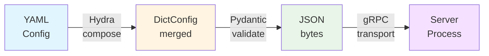

# Configuration

CUVIS.AI uses [Hydra](https://hydra.cc/) for flexible, reproducible configuration management. This guide covers configuration patterns and best practices.

## Configuration Structure

Configuration files are located in `configs/` at the project root and use YAML format with Hydra's composition system. The most common pattern is to create **trainrun configs** that compose sample pipeline, data, training, and plugin configurations together.

### Configuration Directory Structure

```
configs/
├── pipeline/       # Sample pipeline configurations
├── data/           # Sample data configurations
├── training/       # Sample training configurations
├── trainrun/       # Sample full trainruns (compose data + pipeline + training + plugins)
└── plugins/        # Plugin registry
```

> **Note**: The most common pattern is to use **trainrun configs** (`configs/trainrun/`) which compose data, pipeline, training, and plugin configs together using Hydra's composition system. You can also override any composed values directly in the trainrun config.

## Understanding Configuration Types

CUVIS.AI uses 4 distinct configuration types that work together:

| Config Type | Location | Purpose | Used For |
|-------------|----------|---------|----------|
| **Pipeline** | `configs/pipeline/` | Graph structure - nodes & connections | Defining processing flow |
| **Data** | `configs/data/` | Data loading parameters | Dataset configuration |
| **Training** | `configs/training/` | Training hyperparameters | Optimizer, trainer settings |
| **Trainrun** | `configs/trainrun/` | Orchestration - composes all configs | Running experiments |

**Typical workflow**: Create a trainrun config that composes pipeline, data, and training configs together using Hydra's composition system.

### Configuration Hierarchy

Trainrun configs sit at the top level and compose the other three:

```
Trainrun Config (Orchestrator)
├── Composes Pipeline Config → Graph structure (nodes, connections)
├── Composes Data Config → Data loading (paths, splits, batch size)
└── Composes Training Config → Training params (optimizer, epochs)
```

### Pipeline Configurations

Pipeline configs define the computational graph structure: nodes and their connections.

**Location**: `configs/pipeline/*.yaml`

**Complete example** (`configs/pipeline/rx_statistical.yaml` - simplified):

```yaml
# Pipeline metadata
metadata:
  name: RX_Statistical
  description: "RX anomaly detection pipeline"
  tags: [statistical, rx]
  author: cuvis.ai

# Node definitions (THIS IS A LIST)
nodes:
  - name: LentilsAnomalyDataNode
    class: cuvis_ai.node.data.LentilsAnomalyDataNode
    params:
      normal_class_ids: [0, 1]

  - name: MinMaxNormalizer
    class: cuvis_ai.node.normalization.MinMaxNormalizer
    params:
      eps: 1.0e-06
      use_running_stats: true

  - name: RXGlobal
    class: cuvis_ai.anomaly.rx_detector.RXGlobal
    params:
      eps: 1.0e-06
      num_channels: 61

# Connection definitions (REQUIRED)
connections:
  - from: LentilsAnomalyDataNode.outputs.cube
    to: MinMaxNormalizer.inputs.data
  - from: MinMaxNormalizer.outputs.normalized
    to: RXGlobal.inputs.data
```

**Key structure elements**:

- `metadata`: Pipeline identification and documentation
- `nodes`: **LIST** of node definitions (each with `name`, `class`, `params`)
- `connections`: Data flow between nodes (port-to-port connections)

!!! important "Critical Syntax"
    - Nodes use `class` (NOT `_target_`)
    - Nodes are a **list** (with `-` prefix), NOT a dictionary
    - Must include `connections` section

### Data Configurations

Data configs define data loading, dataset paths, and preprocessing parameters.

**Location**: `configs/data/*.yaml`

**Complete example** (`configs/data/lentils.yaml`):

```yaml
# Data paths
cu3s_file_path: data/Lentils/Lentils_000.cu3s
annotation_json_path: data/Lentils/Lentils_000.json

# Train/val/test splits
train_ids: [0, 2, 3]
val_ids: [1, 5]
test_ids: [1, 5]

# Data loading parameters
batch_size: 2
processing_mode: Reflectance
```

**Key fields**:

- `cu3s_file_path`: Path to hyperspectral data file
- `annotation_json_path`: Path to annotation file
- `train_ids`, `val_ids`, `test_ids`: Sample split assignments
- `batch_size`: Batch size for data loading
- `processing_mode`: Data processing mode (e.g., Reflectance, Radiance)

!!! note
    Data configs use simple key-value structure with no `_target_` directives. Values are passed directly to `SingleCu3sDataModule(**cfg.data)`.

### Training Configurations

Training configs define training hyperparameters: trainer settings, optimizer, scheduler, and callbacks.

**Location**: `configs/training/*.yaml`

**Complete example** (`configs/training/default.yaml`):

```yaml
# Random seed for reproducibility
seed: 42

# PyTorch Lightning trainer configuration
trainer:
  max_epochs: 5
  accelerator: "auto"
  devices: 1
  precision: "32-true"
  log_every_n_steps: 10
  val_check_interval: 1.0
  enable_checkpointing: true
  gradient_clip_val: 1.0

# Optimizer configuration
optimizer:
  name: "adamw"
  lr: 0.001
  weight_decay: 0.01
  betas: [0.9, 0.999]
```

**Key sections**:

- `seed`: Random seed for reproducibility
- `trainer`: PyTorch Lightning Trainer parameters (epochs, accelerator, precision, etc.)
- `optimizer`: Optimizer type and hyperparameters
- `scheduler`: Optional learning rate scheduler configuration (see full examples)

### Trainrun Configurations

Trainrun configs compose pipeline, data, and training configs together and add orchestration settings.

**Location**: `configs/trainrun/*.yaml`

**Complete example** (`configs/trainrun/rx_statistical.yaml`):

```yaml
# Hydra package directive - merge into global namespace
# @package _global_

# Compose other configs using Hydra defaults
defaults:
  - /pipeline@pipeline: rx_statistical  # Inject configs/pipeline/rx_statistical.yaml into .pipeline
  - /data@data: lentils                 # Inject configs/data/lentils.yaml into .data
  - /training@training: default         # Inject configs/training/default.yaml into .training
  - _self_                              # Allow overrides from this file

# Experiment identification
name: rx_statistical
output_dir: outputs\rx_statistical

# Override composed values
training:
  trainer:
    max_epochs: 10  # Override default.yaml's max_epochs: 5

# Orchestration settings (trainrun-specific)
unfreeze_nodes: []        # Nodes to unfreeze for gradient training
freeze_nodes: []          # Nodes to freeze during training
loss_nodes: []            # Nodes that compute loss
metric_nodes:             # Nodes that compute metrics
  - metrics_anomaly
```

**Key elements**:

- `@package _global_`: Hydra directive to merge into global namespace
- `defaults`: Compose other configs with package directive syntax (`/config_type@target_key: config_name`)
- Overrides: Any section from composed configs can be overridden
- Orchestration fields:
    - `unfreeze_nodes`: Nodes to enable gradients for in phase 2
    - `freeze_nodes`: Nodes to freeze during training
    - `loss_nodes`: Nodes that compute training loss
    - `metric_nodes`: Nodes that compute metrics

!!! tip "Package Directive Syntax"
    The syntax `/source@destination: config_name` tells Hydra to load `configs/source/config_name.yaml` and inject it at the `destination` key in the merged config. For example, `/pipeline@pipeline: rx_statistical` loads `configs/pipeline/rx_statistical.yaml` and places it at `cfg.pipeline`.

## How Configuration Composition Works

### Hydra Composition with Package Directives

When you run a trainrun config, Hydra merges all composed configs:

**Step 1: Load trainrun config**

```yaml
# trainrun/my_experiment.yaml
defaults:
  - /pipeline@pipeline: rx_statistical
  - /data@data: lentils
  - /training@training: default
  - _self_
```

**Step 2: Hydra loads and injects configs**

The resulting merged config structure:

```python
cfg = {
    "pipeline": {  # From /pipeline@pipeline: rx_statistical
        "metadata": {...},
        "nodes": [...],
        "connections": [...]
    },
    "data": {      # From /data@data: lentils
        "cu3s_file_path": "...",
        "batch_size": 2,
        ...
    },
    "training": {  # From /training@training: default
        "seed": 42,
        "trainer": {...},
        "optimizer": {...}
    },
    # Plus trainrun-specific fields
    "name": "my_experiment",
    "unfreeze_nodes": [],
    "metric_nodes": [...]
}
```

**Step 3: Apply overrides**

Trainrun config can override any composed value:

```yaml
# In trainrun config
training:
  trainer:
    max_epochs: 20  # Overrides training/default.yaml's max_epochs: 5

data:
  batch_size: 8  # Overrides data/lentils.yaml's batch_size: 2
```

### Override Precedence

Overrides are applied in this order (later overrides earlier):

1. Base composed configs (pipeline, data, training)
2. Trainrun config overrides (because `_self_` comes after defaults)
3. CLI overrides (highest priority)

**Example**:

```bash
# CLI overrides beat everything
uv run python examples/channel_selector.py training.trainer.max_epochs=50
```

!!! tip "Overrides for non-existing fields"
    If you try to override a field that doesn't exist in the composed config, you'll get an error:

    ```bash
    uv run python examples/rx_statistical.py training.trainer.max_epochs=50
    # Error: Key 'training' is not in struct
    #        full_key: training
    #        object_type=dict
    ```

    This happens because `rx_statistical.py` uses `trainrun/default_statistical`, which has no `training` section (it only uses statistical training, not gradient-based training). To override training parameters, use a trainrun config that includes training defaults, such as `trainrun/rx_statistical.yaml`.

### Accessing Composed Configs in Python

```python
@hydra.main(config_path="../configs/", config_name="trainrun/my_experiment")
def main(cfg: DictConfig):
    # Access composed configs
    datamodule = SingleCu3sDataModule(**cfg.data)      # From data config
    pipeline = Pipeline.from_config(cfg.pipeline)       # From pipeline config
    trainer = Trainer(**cfg.training.trainer)           # From training config

    # Access trainrun-specific fields
    metric_nodes = cfg.metric_nodes
```

## Relationship to Protobuf Schemas

CUVIS.AI configurations are validated and transported using protocol buffers defined in the `cuvis-ai-schemas` repository.

**Schema location**: `cuvis-ai-schemas/proto/cuvis_ai/grpc/v1/cuvis_ai.proto`

### Configuration Message Types

The protobuf schemas define 6 gRPC message types for config transport:

- `PipelineConfig` - Pipeline structure (nodes + connections)
- `DataConfig` - Data loading configuration
- `TrainingConfig` - Training hyperparameters
- `TrainRunConfig` - Composed experiment configuration
- `OptimizerConfig` - Optimizer parameters
- `SchedulerConfig` - Learning rate scheduler

### Configuration Flow: YAML → Protobuf → gRPC

All config messages use a single `bytes config_bytes` field that contains **JSON-serialized** data (not protobuf serialization):



### Protobuf ↔ YAML Mapping

| Protobuf Message | YAML Config Files | Validation |
|---|---|---|
| `PipelineConfig` | `configs/pipeline/*.yaml` | Node classes must be importable |
| `DataConfig` | `configs/data/*.yaml` | Paths must exist, splits valid |
| `TrainingConfig` | `configs/training/*.yaml` | Optimizer/scheduler names supported |
| `TrainRunConfig` | `configs/trainrun/*.yaml` | All nested configs must validate |

### Validation Stages

Configuration validation happens at multiple stages:

1. **YAML Syntax**: YAML parser validates syntax
2. **Hydra Composition**: Checks for missing defaults, circular references
3. **Pydantic Validation**: Type checking, field constraints, nested model validation
4. **Application Domain**: Node existence, valid class paths, port compatibility

!!! info "JSON Transport Design"
    While protobuf is used for the gRPC message structure, the actual configuration data is JSON-serialized, not protobuf-serialized. This provides flexibility to work with dynamic configuration structures while maintaining type safety through Pydantic validation.

## Configuration Files

### Available Configs

| Directory | Purpose | Examples |
|-----------|---------|----------|
| `configs/pipeline/` | Sample pipeline configurations (node definitions & connections) | `rx_statistical.yaml`, `adaclip_baseline.yaml`, `deep_svdd.yaml` |
| `configs/data/` | Sample data configurations (data loading, splitting, paths) | `lentils.yaml` |
| `configs/training/` | Sample training configurations (trainer, optimizer, scheduler settings) | `default.yaml` |
| `configs/trainrun/` | Sample full trainruns (compose data + pipeline + training + plugins) | `rx_statistical.yaml`, `concrete_adaclip.yaml` |
| `configs/plugins/` | Plugin registry and manifests | `registry.yaml` |

!!! tip "See Also"
    For detailed examples of each config type, see the sections above on [Pipeline Configurations](#pipeline-configurations), [Data Configurations](#data-configurations), [Training Configurations](#training-configurations), and [Trainrun Configurations](#trainrun-configurations).

## Using Hydra in Scripts

Scripts use the `@hydra.main` decorator to load trainrun configs:

```python
from omegaconf import DictConfig
import hydra

@hydra.main(config_path="../configs/", config_name="trainrun/default_gradient", version_base=None)
def main(cfg: DictConfig) -> None:
    """Access composed configs via cfg.data, cfg.pipeline, cfg.training."""
    # Access data config (from configs/data/lentils.yaml)
    datamodule = SingleCu3sDataModule(**cfg.data)

    # Access training config (from configs/training/default.yaml)
    trainer_config = cfg.training.trainer

    # Access pipeline config if defined
    # pipeline_config = cfg.pipeline

if __name__ == "__main__":
    main()
```

**Example from `examples/rx_statistical.py`:**

```python
@hydra.main(config_path="../configs/", config_name="trainrun/default_statistical", version_base=None)
def main(cfg: DictConfig) -> None:
    # cfg.data comes from the composed data config
    datamodule = SingleCu3sDataModule(**cfg.data)  # Line 107

    # cfg.output_dir comes from the trainrun config
    output_dir = Path(cfg.output_dir)  # Line 104
```

## CLI Overrides

Override any configuration parameter from the command line using Hydra's override syntax:

```bash
# Override data parameters (works with statistical-only configs)
uv run python examples/rx_statistical.py data.batch_size=8

# Override training parameters (requires gradient training config)
uv run python examples/channel_selector.py training.trainer.max_epochs=20

# Override multiple parameters
uv run python examples/channel_selector.py \
    training.trainer.max_epochs=20 \
    training.optimizer.lr=0.0001 \
    data.batch_size=8
```

!!! note "Pattern applies to any Hydra script"
    Replace `examples/rx_statistical.py` with your actual script path. Any Python script using `@hydra.main` supports CLI overrides.

## Environment Variables

Use environment variables in configs:

```yaml
# Data configuration
data:
  cu3s_file_path: ${oc.env:DATA_ROOT,./data/Lentils}/Lentils_000.cu3s  # $DATA_ROOT or default

# Training configuration (if using WandB logger)
training:
  wandb_api_key: ${oc.env:WANDB_API_KEY}  # Required env var
```

## TrainingConfig

The `TrainingConfig` dataclass wraps all training parameters:

```python
from cuvis_ai_core.training.config import TrainingConfig, TrainerConfig, OptimizerConfig

config = TrainingConfig(
    seed=42,
    trainer=TrainerConfig(
        max_epochs=10,
        accelerator="gpu",
        devices=1,
        precision="16-mixed",
        log_every_n_steps=10,
    ),
    optimizer=OptimizerConfig(
        name="adam",
        lr=0.001,
        weight_decay=0.0,
        betas=(0.9, 0.999),
    ))
```

### Trainer Parameters

Based on `TrainerConfig` schema from [cuvis-ai-schemas](https://github.com/cuvis-ai/cuvis-ai-schemas):

| Parameter | Type | Default | Description |
|-----------|------|---------|-------------|
| `max_epochs` | int | 100 | Maximum number of epochs (1-10000) |
| `accelerator` | str | "auto" | Accelerator type: "auto", "cpu", "gpu", "cuda" |
| `devices` | int\|str\|None | None | Number of devices or device IDs |
| `precision` | str\|int | "32-true" | Precision: "32-true", "16-mixed", "bf16-mixed" |
| `log_every_n_steps` | int | 50 | Logging frequency (steps) |
| `val_check_interval` | float\|int | 1.0 | Validation check interval |
| `check_val_every_n_epoch` | int | 1 | Validate every n epochs |
| `gradient_clip_val` | float\|None | None | Gradient clipping threshold |
| `accumulate_grad_batches` | int | 1 | Accumulate gradients over n batches |
| `enable_progress_bar` | bool | True | Show progress bar |
| `enable_checkpointing` | bool | False | Enable model checkpointing |
| `deterministic` | bool | False | Deterministic mode |
| `benchmark` | bool | False | Enable cudnn benchmark |

### Optimizer Parameters

Based on `OptimizerConfig` schema from [cuvis-ai-schemas](https://github.com/cuvis-ai/cuvis-ai-schemas):

| Parameter | Type | Default | Description |
|-----------|------|---------|-------------|
| `name` | str | "adamw" | Optimizer: "adamw", "adam", "sgd" |
| `lr` | float | 0.001 | Learning rate (1e-6 to 1.0) |
| `weight_decay` | float | 0.0 | L2 regularization (0.0 to 1.0) |
| `momentum` | float\|None | 0.9 | Momentum for SGD (0.0 to 1.0) |
| `betas` | tuple\|None | None | Adam betas (beta1, beta2), e.g., [0.9, 0.999] |

### Scheduler Parameters

Based on `SchedulerConfig` schema from [cuvis-ai-schemas](https://github.com/cuvis-ai/cuvis-ai-schemas):

| Parameter | Type | Default | Description |
|-----------|------|---------|-------------|
| `name` | str\|None | None | Scheduler: "cosine", "step", "exponential", "reduce_on_plateau" |
| `warmup_epochs` | int | 0 | Warmup epochs |
| `min_lr` | float | 1e-6 | Minimum learning rate |
| `monitor` | str\|None | None | Metric to monitor (for plateau scheduler) |
| `mode` | str | "min" | Monitor mode: "min" or "max" |
| `factor` | float | 0.1 | LR reduction factor |
| `patience` | int | 10 | Patience epochs for plateau |
| `step_size` | int\|None | None | LR decay period (for step scheduler) |
| `gamma` | float\|None | None | LR decay multiplier |

### Training Config Parameters

Based on `TrainingConfig` schema from [cuvis-ai-schemas](https://github.com/cuvis-ai/cuvis-ai-schemas):

| Parameter | Type | Default | Description |
|-----------|------|---------|-------------|
| `seed` | int | 42 | Random seed (≥0) |
| `max_epochs` | int | 100 | Maximum epochs (1-10000) |
| `batch_size` | int | 32 | Batch size (≥1) |
| `num_workers` | int | 4 | Data loading workers (≥0) |
| `gradient_clip_val` | float\|None | None | Gradient clipping (≥0.0) |
| `accumulate_grad_batches` | int | 1 | Gradient accumulation batches |

## Configuration Recipes

### Development (Fast Iteration)

```yaml
# Training configuration
training:
  seed: 42
  batch_size: 2
  num_workers: 0
  trainer:
    max_epochs: 2
    accelerator: cpu
    devices: 1
    enable_progress_bar: true

# Data configuration
data:
  batch_size: 2
  cu3s_file_path: data/Lentils/Lentils_000.cu3s
  annotation_json_path: data/Lentils/Lentils_000.json
  train_ids: [0]
  val_ids: [1]
  test_ids: [1]
```

### Production (Full Training)

```yaml
# Training configuration
training:
  seed: 42
  batch_size: 16
  num_workers: 4
  trainer:
    max_epochs: 50
    accelerator: gpu
    devices: 1
    precision: "16-mixed"
    log_every_n_steps: 10
  optimizer:
    name: adamw
    lr: 0.001
    weight_decay: 0.01

# Data configuration
data:
  batch_size: 16
  cu3s_file_path: data/Lentils/Lentils_000.cu3s
  annotation_json_path: data/Lentils/Lentils_000.json
  train_ids: [0, 2, 3]
  val_ids: [1, 5]
  test_ids: [1, 5]
```

### Multi-GPU Training

```yaml
training:
  trainer:
    accelerator: gpu
    devices: 4
    strategy: ddp
    precision: "16-mixed"
```

## Configuration Validation

Hydra validates configurations at runtime:

```python
from omegaconf import OmegaConf
from cuvis_ai_core.training.config import TrainingConfig

# Load and validate
cfg = OmegaConf.load("config.yaml")
training_cfg = TrainingConfig.from_dict_config(cfg.training)
```

## Best Practices

### 1. Use Composition

Break large configs into reusable pieces:

```yaml
# base.yaml
defaults:
  - general
  - monitoring/wandb

# experiment.yaml  
defaults:
  - base
  - _self_
  
training:
  trainer:
    max_epochs: 100
```

### 2. Version Control Configs

Commit configuration files for reproducibility:

```bash
git add configs/
git commit -m "Add experiment config"
```

### 3. Use Structured Configs

Define configs as dataclasses for type safety:

```python
from dataclasses import dataclass
from hydra.core.config_store import ConfigStore

@dataclass
class ModelConfig:
    hidden_size: int = 128
    num_layers: int = 3

cs = ConfigStore.instance()
cs.store(name="model_config", node=ModelConfig)
```

### 4. Document Custom Configs

Add comments explaining parameters:

```yaml
nodes:
  pca:
    n_components: 3  # Number of principal components to retain
    trainable: true  # Enable gradient-based fine-tuning
```

## Troubleshooting

### Config Not Found

```
ConfigFileNotFoundError: Cannot find 'my_config.yaml'
```

**Solution**: Ensure config file is in correct directory and path is specified correctly.

### Override Parse Error

```
OverrideParseException: Expected '=' in override 'training.trainer.max_epochs:10'
```

**Solution**: Use `=` not `:` for overrides: `training.trainer.max_epochs=10`

### Type Mismatch

```
ValidationError: Field 'max_epochs' expected type 'int', got 'str'
```

**Solution**: Ensure correct type in override: `max_epochs=10` not `max_epochs="10"`

## Next Steps

- **[Quickstart](quickstart.md)**: See configuration in action
- **[Tutorials](../tutorials/index.md)**: Phase-specific configurations
- **[API Reference](../api/training.md)**: TrainingConfig API details
